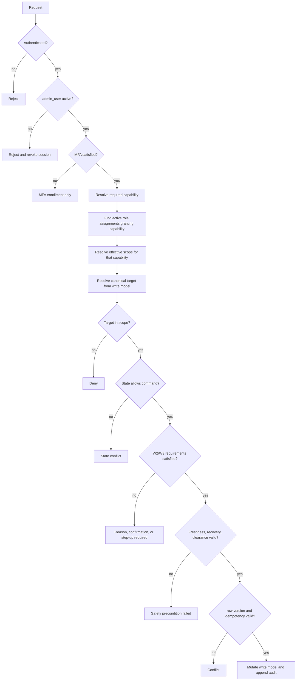

# レコラ管理画面 P0 権限・監査仕様書

- 文書ID: `RECORA-ADMIN-P0-AUTHZ-AUDIT`
- 版: `2.0`
- 基準日: `2026-08-01`
- 状態: 正式採用
- 前提仕様:
  - `RECORA-ADMIN-P0-STATE-MODEL v2.1`
  - `RECORA-ADMIN-P0-READ-MODEL v2.0`
- 対象: レコラ管理画面P0
- 優先順位: 本仕様は、画面単位の暫定的な表示制御、クライアント側だけの権限制御、個別API内の独自権限判定より優先する

---


## 0. v2.0 最終横断統合変更点

全route・管理者command・system-only command・capability・audit actionを横断照合し、次を最終統一する。

1. `/admin/customers/[customerId]/projects/new` の最低capabilityとscope guardをroute matrixへ追加する。
2. MFA・step-up utility routeは業務capabilityではなく、identity・MFA・署名済みreturn stateで認可する。
3. 管理者の復旧batch要求を `RequestRecoveryBatch`、systemによる実体作成を `CreateRecoveryBatch` とする。
4. `StartDailyTargetEvaluationRun`、`CreateActivationDayTargetDecision`、`CreateRecoveryBatch`、`BlockDailyAutomationBySystem`をsystem-only registryへ追加する。
5. 重複していた`ApplyPublicationSystemBlock`を廃止し、`BlockPublicationBySystem`へ統一する。
6. customer、project、publication、daily automationのsystem block commandを管理者停止commandから分離する。
7. 旧command aliasを受理せず、`available_commands`、endpoint、audit action codeで同じ正式名を使用する。
8. capability catalogは64件を維持し、今回の修正でP0権限範囲を拡張しない。

v1.8までに確定したMFA、step-up、scope、redaction、append-only audit、system actor分離の原則は変更しない。

---

## 0. v1.8変更点

管理設定画面、状態モデルv2.0、read model v1.9に合わせ、管理者、通知、日次設定、AIモデル、plan、scheduled change、rule/pricingの権限・監査境界を次のように修正する。

1. 管理者directory・role assignment・scope assignmentのread/writeをglobal resourceとして固定する。
2. `InviteAdmin`で初期role・scopeを同一transactionへ必須化し、role/scopeなしadminを作れないようにする。
3. 管理者停止・再開・無効化、role・scope付与・取消をW3へ固定する。
4. 最後の有効なplatform adminを失う操作と自己権限昇格を拒否する。
5. MFA状態は認証基盤を正とし、MFA未設定adminへ通常read/writeを許可しない。
6. 通知先の作成・変更・停止・再開・無効化を`notification.manage`へ統一し、test deliveryをW1とする。
7. 通知address変更を禁止し、新destination＋旧destination revokeで扱う。
8. 日次設定のdraft作成・ready化をW2、適用予約・停止・再開をW3へ固定する。
9. `blocked_by_system`の日次control解除をrecovery clearance経由のsystem-only commandへ限定する。
10. AIモデルplanned control変更をW3とし、incident safety解除を通常commandから除外する。
11. plan draft作成をW2、draft編集をW1、ready化をW2、適用予約をW3へ分離する。
12. plan code作成、active plan直接編集、既存契約一括移行commandを作らない。
13. scheduled change取消をW2、適用をsystem-onlyへ固定する。
14. quality・publication ruleとpricingの管理設定pageをread-onlyにする。
15. global settings writeでglobal scope、admin active、MFA、step-up、row version、idempotencyを再検査する。
16. `settings_change_applier`、`notification_dispatcher`、`identity_projection_sync`をsystem actor allowlistへ追加する。
17. 設定変更要求をaudit log、配送・適用・active化の結果をsystem eventへ分離する。
18. admin directory、role/scope、pricing detailなどのsensitive readを必要に応じて監査する。
19. settings historyの閲覧で、閲覧者が読めないdomainのtarget・before/afterをredactする。
20. stale・unknown・partial failure時に管理設定のW2/W3 commandをfail-closedにする。

v1.7で確定した利用量・コストの権限・監査原則は変更しない。

---

## 0. v1.7変更点

利用量・コスト画面仕様、状態モデルv1.9、read model v1.8に合わせ、内部変動原価、pricing detail、CSV exportの権限・監査境界を次のように修正する。

1. `usage_cost.read`を、許可scope内の利用量・内部変動原価を読むcapabilityとして固定する。
2. `usage_cost.export`を、同じscope・filter・snapshotの明細CSVを要求・取得するcapabilityとして維持する。
3. `pricing.read`を、適用済み単価definitionの機密詳細を読むcapabilityとして固定する。
4. `cost_analyst`だけが標準で内部原価金額・pricing rate・CSVを閲覧できる。
5. `auditor`は標準では内部原価金額と単価を閲覧できず、必要なら`cost_analyst`を追加付与する。
6. customer/project scopeのcost analystへscope外の金額、未算定件数、AIモデル、facet、未使用pricing catalogを返さない。
7. pricing detailはglobal referenceであっても、customer/project scopeでは実際に対象scopeへ適用されたdefinitionだけを返す。
8. `RequestUsageCostCsvExport`をW1管理者commandとして追加する。
9. export要求時にeffective scope、filter、date axis、read snapshot、source watermarkをserver側で固定する。
10. export download時に管理者状態、capability、scope、job owner、期限を再検査する。
11. role・scopeを失った管理者の未取得export URLを無効化する。
12. CSV生成要求とdownload、pricing rate詳細readを監査対象とする。
13. audit logへCSV本体、全usage/cost明細、prompt、AI回答、provider raw payloadを保存しない。
14. usage、cost、pricing definitionの記録・訂正・算定・有効化、CSV artifact生成をsystem-only commandへ固定する。
15. platform adminを含む人間actorによるusage/cost/pricingの直接編集・原価調整を禁止する。
16. 原価未算定の担当者・解決status・承認workflowをP0 capabilityへ追加しない。
17. 顧客請求、売上、粗利、予算、為替換算、請求照合のcapabilityをP0へ追加しない。

v1.6で確定したincident、recovery、clearance、system health、audit detailの原則は変更しない。

---

## 0. v1.6変更点

障害・監査画面仕様、状態モデルv1.8、read model v1.7に合わせ、incident、recovery、system health、system event、audit detailの権限・監査境界を次のように修正する。

1. incidentの閲覧を`incident.read.scoped / incident.read.global`、機密evidence閲覧を`incident.sensitive.read`へ分離する。
2. incidentの通常管理を`incident.manage`、recovery plan・step・batch操作を`incident.recovery.manage`、解決を`incident.resolve`へ分離する。
3. system health check要求を`system_health_check.run`へ分離し、管理者がcomponent healthの結果を直接指定できないようにする。
4. incident write、global recovery、AIモデル制御、system health checkはglobal scopeを必須とする。
5. scoped roleには許可scope内の影響要約だけを返し、全体件数、fingerprint、global recovery detail、clearance detail、機密evidenceを返さない。
6. `ChangeIncidentSeverity`、recovery plan作成・ready化・開始・取消・step retry、recovery batch要求をW2へ固定する。
7. `ResolveIncident`は、Medium・Lowかつsystem blockなしではW2、Criticalまたはsystem block・incident-linked AI model control・global controlありではW3へ動的に昇格する。
8. Criticalまたはsystem blockを伴うincidentは、完了済みrecovery plan、回復evidence、未回復scopeなし、未処理clearanceなしで解決できない。
9. recovery planはdraftだけを編集可能とし、ready以降の変更では新plan versionを作る。
10. failed recovery stepを直接再openせず、新attempt rowを作るcommand境界を追加する。
11. `incident_recovery_clearance`の発行、取消、期限判定、消費をsystem-onlyへ固定する。
12. `blocked_by_system`またはincident-linked AI model controlの解除は、target限定clearanceの検査・消費とcontrol変更を同一transactionで行うsystem commandだけに許可する。
13. platform adminであってもclearanceなしのsystem block解除、clearanceの手動作成・延長・再有効化を禁止する。
14. AIモデルのhealth閲覧とcontrol操作を分離し、control変更はW3、health結果更新はsystem-onlyとする。
15. `system_event`はappend-onlyな処理事実としてread-onlyにし、既読・解決・担当変更commandを作らない。
16. audit detailとincident sensitive evidenceの閲覧自体を監査対象に追加する。
17. audit correctionは過去row更新ではなく、新rowと`corrects_audit_log_id`で行う。
18. incident、system event、auditのbefore/after・payloadへraw provider response、prompt、AI回答、HTML、cookie、token、Authorization headerを保存しない。
19. incident command endpointで最新のincident row version、scope、action、plan、step、clearance、component freshness、control row versionを再検査する。
20. incidentの解決・復旧操作によってquality case、measurement cycle、publication operationを暗黙変更しない。
21. 管理者要求を`audit_log`、後続の検知・health check・recovery step・control解除を`system_event`へ分離し、correlation IDで接続する。
22. system operatorとauditorのcapabilityを更新し、auditorにはwriteを一切付与しない。
23. incident sidebar badge・facet・一覧件数は、capabilityとeffective scopeを適用した後に集計する。
24. stale・unknown・部分取得失敗時はincident・control・recoveryのW2/W3 commandをfail-closedで除外する。

v1.5で確定したpublication candidate、version、operation、verification、停止・復元の原則は変更しない。

---

## 0. v1.5変更点

公開管理画面仕様、状態モデルv1.7、read model v1.6に合わせ、candidate、version、operation、verification、停止・復元の権限・監査境界を次のように修正する。

1. publication candidate操作を`hold / release hold / invalidate / regenerate / publish`として明示し、品質decisionのsystem side effectとpublication operator操作を分離する。
2. publication operatorが解除できるのはmanual publication holdだけとし、quality-owned・system-owned holdを直接解除できないようにする。
3. `RetryPublicationOperation`をW2に固定し、failedまたはrolled_back operationを更新せず、`retry_of_operation_id`を持つ新operationを作る。
4. `PublishReadyCandidate`は通常の承認ではなく、自動開始SLA超過またはpublication engine recovery後のpublication-owned attention時だけ返すW2 fallback commandとする。
5. `RestorePublicationVersion`は既存versionをtargetにするW3とし、version複製、revoked version、別project version、stale pointerを禁止する。
6. `paused_by_admin`中のrestoreを`hidden_under_pause`として許可し、顧客非表示維持と再開時verificationを必須にする。
7. `StopPublication`はpointerを保持するW3操作とし、測定・解析・candidate生成を暗黙停止しない。
8. `ResumePublication`は`resume_current_pointer` operationを作るW3操作とし、control値の直接更新を禁止する。
9. `blocked_by_system`の解除・restoreはincident recovery clearanceとsystem actor処理を必須にする。
10. project Generation採番、candidate supersede、version・pointer atomic commit、delivery verification結果、rollback、system block適用をsystem-only commandへ固定する。
11. operationの`status`と`current_stage`、verificationの`phase`を管理者入力で直接変更できないようにする。
12. publication operatorへ`quality.decide`と`quality.payload.read`を付与せず、quality metadataは`quality.read`、公開本文は`publication.payload.read`で扱う。
13. quality reviewerへpublication write commandを付与せず、品質画面の比較は`quality.payload.read`によるredacted contextとして返す。
14. candidate/version payload、diff、verification evidenceの敏感なreadを監査対象にし、payload・HTML・token・cookieをauditへ保存しない。
15. publication command endpointでproject Generation、source revision、payload hash、quality、contract、entitlement、publication control、pointer version、active operation、incident clearanceを再検査する。
16. publication-owned attentionだけを公開バッジへ認可後集計し、quality・incident・customer management・system ownerの件数を含めない。

v1.4で確定したquality action・decision、quality check runのsystem-only原則は変更しない。

---

## 0. v1.4変更点

品質・例外レビュー画面仕様、状態モデルv1.6、read model v1.5に合わせ、品質commandの権限・監査境界を修正する。

1. `quality_check_run`はsystem actorだけが作成・完了でき、人間actorはpassやready状態を直接設定できない。
2. `RequestReprocessing` を `RequestQualityReprocessing` へ変更し、再測定・再解析・再計算・再生成・check再実行をquality actionとして扱う。
3. quality decisionから `auto_pass / retry_measurement / reanalyze` を外し、`continue_with_note / exclude_optional_sections / maintain_previous_version / publication_blocked / resolved_no_action` に固定する。
4. quality reviewerからgenericな `publication.candidate.manage` と `publication.payload.read` を外し、品質画面のpreviewは `quality.payload.read` で提供する。
5. quality reviewerはcandidateを直接hold・ready・publish・restore・project stopできず、品質decisionの副作用はsystem actorが適用する。
6. `RecordQualityDecision` はW2とし、current finding、rule policy、candidate Generation、section optionality、incident requirementをwrite時に再検査する。
7. `RequestQualityReprocessing`のriskをaction typeでW1/W2へ分け、formal cycle全体再処理だけW2とする。
8. Critical findingへのnote、mandatory section除外、finding status直接変更、resolved case再openを権限があっても拒否する。
9. candidate preview・sensitive evidence readを監査対象に追加し、auditへpayload全文を保存しない。
10. quality action、decision application、quality check runをcorrelation IDで追跡し、管理者要求とsystem処理を二重auditしない。

---

## 0. v1.3変更点

測定管理画面仕様と状態モデルv1.5に合わせ、測定commandの権限・監査境界を修正する。

1. `ReprocessFormalDailyCycle` と `ExecuteBulkFormalMeasurement` を `measurement.formal.trigger` のW2操作として追加する。
2. `ResumeMeasurementBatch` を `measurement.batch.manage` のW2操作として追加する。
3. `CreateMeasurementBatch` を人間actorから除外し、業務commandの副作用としてsystem actorだけが実行する。
4. pauseはW2、resumeはW2、安全stopはW3とし、pausing/paused/stoppingの正式状態を再検査する。
5. failed/stopped batchをresumeできず、新しいretry/recovery batchを作る原則を追加する。
6. bulk commandは全対象scope、selection token、limit、row version、idempotencyを必須とし、1件でもscope違反があれば全体を拒否する。
7. 完了済みcycle再処理では、旧current revisionと現在公開版を維持する影響をW2確認へ表示する。
8. measurement payload、customer sensitive、publication payloadのredaction境界をcycle・batch detailへ適用する。

---

## 0. v1.2変更点

運用中プロジェクトの安全な設定revision更新をP0管理操作へ追加する。

1. `project.configuration.manage` capabilityを追加する。
2. `CreateProjectConfigurationRevision` をW2操作として追加し、顧客運用担当とプラットフォーム管理者だけが実行できるようにする。
3. 初期設定中の訂正 `RetryProjectSetupWithInputCorrection` と、運用中の設定更新を権限・監査action上で分離する。
4. 設定更新開始時に、有効契約、entitlement、許可prompt tier、AIモデル、active revision、非終端revisionの不存在を再検査する。
5. 顧客アクセス停止、測定停止、公開停止を設定更新権限と混同しない。
6. 設定更新要求のbefore/afterには機微なサイト本文やprompt本文を保存せず、変更フィールドとrevision IDだけを記録する。

---

## 0.1 v1.1で確定済みの変更点

顧客管理画面仕様と状態モデルv1.3に合わせ、次を追加・修正する。

1. 顧客画面アクセス停止を顧客情報編集から分離する `customer.access.manage` capabilityを追加する。
2. 初期設定中の入力訂正付き再実行を `project.setup.correct` capabilityとして分離する。
3. 顧客アクセス停止・再開、customer user招待・停止・無効化、契約本体作成・再開を正式コマンドへ追加する。
4. `CreateProject` の認可後に、有効契約version、entitlement枠、AIモデル、prompt tierをcommand endpointで再検査する。
5. 契約終了、顧客アクセス停止、customer userアクセス取消などのW3操作へtyped confirmationと影響表示を追加する。顧客アクセスの通常再開はW2として分離する。
6. customer userの認証secretを誰にも返さず、招待配送結果はsystem event、管理者要求はaudit logへ分離する。
7. 問い合わせのproject関連変更を同じcustomer内に限定する。
8. 顧客管理の各コマンドでも、成功・拒否・失敗・idempotent replayを1回のaudit logへ記録する。

---

## 1. 目的

レコラ管理画面P0で、次を一貫した方式で制御する。

1. 誰が管理画面へ入れるか
2. どの領域を閲覧できるか
3. どの顧客・プロジェクトを扱えるか
4. どの状態変更コマンドを実行できるか
5. 顧客情報、測定内容、公開内容、原価、監査情報をどこまで閲覧できるか
6. Critical操作へどの追加確認を要求するか
7. 管理者操作とシステム処理をどのように区別して記録するか
8. 成功・拒否・失敗をどのように `audit_log` へ残すか
9. read modelの `state_action_candidates` から最終的な `available_commands` をどう生成するか

P0では標準役割だけを使用し、カスタム役割作成、二名承認、権限の明示的denyルールは実装しない。

---

## 2. 正式決定

### 2.1 権限はRBACとscopeの組み合わせとする

```text
実行可能権限
=
標準役割が持つcapability
×
その役割割当に紐づくscope
×
対象の正式状態
×
操作ごとの安全要件
```

役割だけで全顧客へアクセスさせない。顧客・プロジェクトを対象とする権限は、必ずscopeと組み合わせる。

### 2.2 scopeは管理者単位ではなく役割割当単位で持つ

`admin_scope_assignment` は `admin_user_id` へ直接ぶら下げず、原則として `admin_role_assignment_id` に紐づける。

これにより、次のような割当が可能になる。

```text
原価閲覧担当
→ global scope

品質レビュー担当
→ 顧客Aだけ

公開運用担当
→ プロジェクトBだけ
```

禁止する誤った計算:

```text
管理者が持つ全scopeを先に合算
↓
すべての役割capabilityへ適用
```

正式な計算:

```text
effective_scope(admin, capability)
=
そのcapabilityを付与する有効なrole assignmentに属するscopeの和集合
```

### 2.3 標準役割定義はP0では固定する

P0で編集可能なのは次である。

- 管理者の招待・停止
- 標準役割の付与・解除
- 管理対象scopeの付与・解除

P0で編集しないもの:

- 標準役割のcapability定義
- 新しい役割の作成
- capabilityの個別付与
- denyルール
- 条件式付きカスタムポリシー

`admin_role` はseedされた固定定義として扱う。

### 2.4 UIの非表示はセキュリティ境界ではない

サイドバー、ボタン、メニューを非表示にしても、APIは必ず次を再検査する。

```text
認証
管理者状態
MFA
capability
scope
対象状態
Critical操作要件
row version
idempotency
```

クライアントから送られた `customer_id`、`project_id`、actor情報を信用しない。

### 2.5 プラットフォーム管理者も正式状態を上書きできない

`platform_admin` であっても次は禁止する。

- 品質ゲートの直接上書き
- `blocked_by_system` の安全再検査なし解除
- 公開候補・公開版の直接編集
- 過去の監査ログ・システムイベントの更新・削除
- 追加検証から正式公開への直接昇格
- 一意制約、冪等性、同時実行制御の無視

`platform_admin` は全capabilityを持つが、業務不変条件を破る特権ではない。

---

## 3. 管理者IDと認証状態

### 3.1 `admin_user.status`

```text
invited
active
suspended
deactivated
```

| 状態 | 意味 | 管理画面利用 |
|---|---|---|
| `invited` | 招待済み、初回認証未完了 | MFA設定導線を除き不可 |
| `active` | 利用可能 | 権限に応じて可 |
| `suspended` | 一時停止 | 不可 |
| `deactivated` | 利用終了 | 不可。P0では復活不可 |

許可遷移:

```text
invited   -> active
invited   -> suspended
invited   -> deactivated
active    -> suspended
active    -> deactivated
suspended -> active
suspended -> deactivated
```

禁止:

```text
deactivated -> active
```

### 3.2 MFA

P0では、すべての有効な管理者にMFAを必須とする。

MFA未設定の管理者が利用できるのは次だけとする。

- MFA登録
- 自分の認証状態確認
- サインアウト

通常の管理画面ページ、read API、command APIは利用不可とする。

MFA状態は認証基盤を正とし、`admin_user` に独立した更新可能状態として重複保存しない。管理設定のMFA表示は認証基盤から作るread modelまたは同期済みprojectionを使用する。

### 3.3 Critical操作のstep-up

Critical操作では、通常ログイン時のMFAに加え、直近15分以内の再認証または同等のstep-up確認を要求する。

```text
step_up_verified_at >= now - 15 minutes
```

step-upが失効している場合、capabilityとscopeを持っていても実行しない。

### 3.4 管理者停止時

`admin_user.status = suspended` または `deactivated` へ変更した場合は次を行う。

1. 新規リクエストを即時拒否
2. 既存セッションを失効
3. 権限キャッシュを無効化
4. 実行待ちの人間操作コマンドがある場合、開始前にactor状態を再検査
5. 変更操作を `audit_log` へ保存

すでにシステムへ受理され、独立した自動処理へ移った処理は、業務安全性に基づいて継続または停止する。管理者セッションの失効だけを理由に中途半端な状態へしない。

---

## 4. P0標準役割

| role code | 日本語名 | 主な責任 | 許可scope |
|---|---|---|---|
| `platform_admin` | プラットフォーム管理者 | 全領域、管理者・権限管理、最終的な運用管理 | `global` 必須 |
| `customer_operator` | 顧客運用担当 | 顧客、契約、プロジェクト、初期設定、問い合わせ | global / customer / project |
| `measurement_operator` | 測定運用担当 | 正式測定、追加検証、バッチ、再試行、安全停止 | global / customer / project |
| `quality_reviewer` | 品質レビュー担当 | 品質例外、finding、再処理、品質decision | global / customer / project |
| `publication_operator` | 公開運用担当 | 候補確認、公開処理、復元、公開停止・再開 | global / customer / project |
| `system_operator` | システム運用担当 | 障害、システム状態、AIモデル、日次自動処理 | `global` 必須 |
| `cost_analyst` | 原価閲覧担当 | 利用量・内部変動原価・CSV | global / customer / project |
| `auditor` | 監査担当 | 監査ログ、変更履歴、業務状態の読み取り監査 | global / customer / project |

### 4.1 複数役割

1人の管理者へ複数の標準役割を付与できる。

capabilityは和集合とするが、scopeはcapabilityを付与したrole assignmentごとに計算する。

### 4.2 `platform_admin`

- 本仕様で定義したすべてのcapabilityを明示的に持つ。
- 実装では `*` wildcardを使用しない。新しいcapabilityはrole seedを更新するまでdefault denyとする。
- scopeは必ずglobal。
- 対象状態、安全検査、step-up、監査要件は免除されない。
- 最後の有効な `platform_admin` を停止・無効化・役割解除できない。

### 4.3 `system_operator`

- globalなAIモデル制御、日次処理制御、障害対応を行うためglobal scopeを必須とする。
- 顧客契約、顧客ユーザー、品質decision、内部原価の権限は持たない。
- 障害対応に必要な範囲で測定・公開の安全停止を行える。

### 4.4 `auditor`

- 読み取り専用。
- 監査目的で顧客情報、品質・公開payload、問い合わせ内部メモを閲覧できる。
- 内部原価金額と原価単価は標準では閲覧できない。必要な場合は `cost_analyst` を追加付与する。
- いかなる状態変更capabilityも持たない。

---

## 5. Capabilityカタログ

### 5.1 共通・顧客管理

```text
admin.home.read

customer.summary.read
customer.detail.read
customer.sensitive.read
customer.create
customer.manage
customer.access.manage
customer_user.manage

contract.read
contract.manage

project.read
project.manage
project.configuration.manage
project.setup.retry
project.setup.correct
project.automation.manage

inquiry.read
inquiry.internal_note.read
inquiry.manage
```

### 5.2 測定管理

```text
measurement.read
measurement.formal.trigger
measurement.validation.create
measurement.batch.manage
measurement.batch.stop
measurement.retry
```

### 5.3 品質

```text
quality.read
quality.payload.read
quality.assign
quality.reprocess
quality.decide
```

### 5.4 公開

```text
publication.read
publication.payload.read
publication.candidate.manage
publication.publish_ready
publication.restore
publication.control
```

### 5.5 障害・システム

```text
incident.read.scoped
incident.read.global
incident.sensitive.read
incident.manage
incident.recovery.manage
incident.resolve

system_status.read
system_health_check.run
system_event.read

notification.read
notification.manage
daily_automation.read
daily_automation.manage
ai_model_control.read
ai_model_control.manage
```

### 5.6 利用量・設定

```text
usage_cost.read
usage_cost.export
pricing.read

plan.read
plan.manage
rule_version.read
```

### 5.7 管理者・監査

```text
admin_directory.read
admin_directory.manage
admin_access.manage

audit.read.scoped
audit.read.global
audit.detail.read
settings.change_history.read
```

---

## 6. 標準役割と主要capability

### 6.1 `customer_operator`

付与する主なcapability:

```text
admin.home.read
customer.summary.read
customer.detail.read
customer.sensitive.read
customer.create
customer.manage
customer.access.manage
customer_user.manage
contract.read
contract.manage
project.read
project.manage
project.configuration.manage
project.setup.retry
project.setup.correct
inquiry.read
inquiry.internal_note.read
inquiry.manage
measurement.read
publication.read
incident.read.scoped
```

`project.automation.manage` は付与しない。測定停止は測定運用担当、契約停止は顧客運用担当という責任分離を維持する。

### 6.2 `measurement_operator`

```text
admin.home.read
customer.summary.read
project.read
measurement.read
measurement.formal.trigger
measurement.validation.create
measurement.batch.manage
measurement.batch.stop
measurement.retry
project.automation.manage
quality.read
publication.read
incident.read.scoped
daily_automation.read
ai_model_control.read
rule_version.read
```

### 6.3 `quality_reviewer`

```text
admin.home.read
customer.summary.read
project.read
measurement.read
quality.read
quality.payload.read
quality.assign
quality.reprocess
quality.decide
publication.read
incident.read.scoped
rule_version.read
```

次は付与しない。

```text
publication.payload.read
publication.candidate.manage
publication.publish_ready
publication.restore
publication.control
```

candidate previewとcurrent publication比較は `quality.payload.read` のredacted quality contextとして返す。quality reviewerはgenericなcandidate管理commandを実行しない。

### 6.4 `publication_operator`

```text
admin.home.read
customer.summary.read
project.read
measurement.read
quality.read
publication.read
publication.payload.read
publication.candidate.manage
publication.publish_ready
publication.restore
publication.control
incident.read.scoped
rule_version.read
```

`quality.decide` は付与しない。公開画面から品質ゲートを上書きできない。

### 6.5 `system_operator`

```text
admin.home.read
customer.summary.read
project.read
measurement.read
quality.read
publication.read
incident.read.scoped
incident.read.global
incident.sensitive.read
incident.manage
incident.recovery.manage
incident.resolve
system_status.read
system_health_check.run
system_event.read
notification.read
notification.manage
daily_automation.read
daily_automation.manage
ai_model_control.read
ai_model_control.manage
plan.read
rule_version.read
settings.change_history.read
```

候補・公開版本文、顧客ユーザー、契約詳細、内部原価は標準では閲覧できない。incidentの機密evidenceは、障害復旧に必要なallowlist fieldだけを返し、secretは常に除外する。

### 6.6 `cost_analyst`

```text
admin.home.read
customer.summary.read
project.read
usage_cost.read
usage_cost.export
pricing.read
plan.read
```

### 6.6.1 利用量・コストの権限境界

`usage_cost.read`で閲覧できるのは、role assignmentのeffective scope内だけである。

```text
global
customer
project
```

`pricing.read`を持っていても、customer/project scopeでは、許可scopeのusageへ実際に適用されたpricing definitionだけを返す。未使用の全社pricing catalogは返さない。

`cost_analyst`へ次のwrite capabilityは付与しない。

```text
usage record edit
cost adjustment
pricing edit
currency conversion
billing
margin / budget
uncomputed resolution workflow
```

CSV要求は可能だが、usage/cost/pricingの正式状態は変更できない。

### 6.7 `auditor`

```text
admin.home.read
customer.summary.read
customer.detail.read
customer.sensitive.read
contract.read
project.read
inquiry.read
inquiry.internal_note.read
measurement.read
quality.read
quality.payload.read
publication.read
publication.payload.read
incident.read.scoped
incident.read.global
incident.sensitive.read
system_status.read
system_event.read
notification.read
daily_automation.read
ai_model_control.read
plan.read
rule_version.read
admin_directory.read
audit.read.scoped
audit.read.global
audit.detail.read
settings.change_history.read
```

### 6.8 `platform_admin`

本仕様に定義されたすべてのcapabilityを持つ。

---

## 7. 領域別の閲覧マトリクス

記号:

- `全`: 必要な機密フィールドを含めて閲覧可。scope適用あり
- `要約`: ID、名称、状態、関連件数など必要最小限
- `全社`: global情報を含めて閲覧可
- `—`: 専門ページ・件数とも返さない

| 対象 | PA | CO | MO | QR | PO | SO | CA | AU |
|---|---:|---:|---:|---:|---:|---:|---:|---:|
| 運用ホーム | 全社 | 全 | 全 | 全 | 全 | 全社 | 要約 | 全 |
| 顧客・プロジェクト概要 | 全社 | 全 | 要約 | 要約 | 要約 | 要約 | 要約 | 全 |
| 顧客連絡先・顧客ユーザー | 全社 | 全 | — | — | — | — | — | 全 |
| 契約・利用権限詳細 | 全社 | 全 | 要約 | 要約 | 要約 | — | — | 全 |
| 問い合わせ・内部メモ | 全社 | 全 | — | — | — | — | — | 全 |
| 測定サイクル・試行内容 | 全社 | 要約 | 全 | 全 | 全 | 全 | — | 全 |
| 品質finding・decision | 全社 | 要約 | 要約 | 全 | 全 | 要約 | — | 全 |
| 公開候補・公開版payload | 全社 | — | — | 品質画面のredacted比較 | 全 | — | — | 全 |
| 公開状態・現在版 | 全社 | 要約 | 要約 | 全 | 全 | 要約 | — | 全 |
| scope内障害影響 | 全社 | 要約 | 要約 | 要約 | 要約 | 全社 | — | 全 |
| 障害機密evidence・global復旧計画 | 全社 | — | — | — | — | 全社 | — | 全社 |
| system component状態 | 全社 | — | — | — | — | 全社 | — | 全社 |
| AIモデルhealth・control要約 | 全社 | — | 要約 | — | — | 全社 | — | 全社 |
| system event | 全社 | — | — | — | — | 全社 | — | 全社 |
| 内部原価・原価単価 | 全社 | — | — | — | — | — | 全 | — |
| 管理者・役割・scope | 全社 | — | — | — | — | — | — | 全 |
| 全体監査ログ | 全社 | — | — | — | — | — | — | 全社 |

PA = platform_admin、CO = customer_operator、MO = measurement_operator、QR = quality_reviewer、PO = publication_operator、SO = system_operator、CA = cost_analyst、AU = auditor。

各詳細ページの対象固有タイムラインは、対象の閲覧権限を持つ管理者へ安全化した要約を返してよい。これによって全体監査ログ権限が付与されるわけではない。

---

## 8. Scopeモデル

### 8.1 scope type

```text
global
customer
project
```

### 8.2 包含関係

```text
global
└ customer
  └ project
```

- global scopeは全顧客・全プロジェクトを含む。
- customer scopeはその顧客と、現在および将来その顧客に属する全プロジェクトを含む。
- project scopeは指定したプロジェクトだけを含む。

P0ではdeny scopeを持たない。

### 8.3 対象別の必要scope

| 対象・操作 | 必要scope |
|---|---|
| 新規顧客作成 | global |
| 顧客情報・顧客ユーザー・契約の管理 | global または customer |
| 新規プロジェクト作成 | global または親customer |
| プロジェクト更新・測定・品質・公開 | global / 親customer / project |
| project未関連の問い合わせ | global または customer |
| project関連問い合わせ | global / customer / linked project |
| 顧客横断一括測定 | 全対象を含むglobalまたは複数の有効scope |
| incident管理 | global |
| system status、AIモデル、日次自動処理 | global |
| 管理者・役割・scope管理 | global |
| 全体監査ログ | global |

### 8.4 Project scopeの制限

project scopeだけでは次を操作できない。

- 顧客ユーザー
- 顧客全体情報
- 契約version
- project未関連問い合わせ
- 同じ顧客の別プロジェクト

### 8.5 Bulk操作

一括操作では全対象を先に解決し、すべてがscope内であることを確認する。

```text
1件でもscope外
→ コマンド全体をdenied
→ scope内の一部だけを黙って実行しない
```

部分実行を許可する別コマンドをP0では作らない。

### 8.6 Incidentのscope表示

scoped roleへincidentを表示する場合:

- 許可scope内に`confirmed / contained / recovering`の影響があるincidentだけを返す
- 影響顧客数・プロジェクト数は許可scope内だけをdistinct集計する
- `global + potential`を許可scope内の確認済み件数へ展開しない
- globalな総影響件数、scope外の名称、fingerprintを返さない
- system evidence、全scope一覧、clearance detail、global recovery commandを返さない
- そのscopeへ適用された安全制御、関連quality case、safe fallbackだけを要約表示できる

`system_operator`、global `auditor`、`platform_admin` は全体情報を閲覧できる。機密evidenceには別途`incident.sensitive.read`を要求する。

### 8.7 global resourceの区分

顧客・プロジェクトに属さないデータは次の2種類へ分ける。

| 種類 | 例 | scope要件 |
|---|---|---|
| global control | incident管理・復旧、system status、health check、system event、AIモデル制御、日次自動処理、管理者、全体監査 | global scope必須 |
| global reference | 現在の品質・公開rule version、標準plan versionの参照 | 対応するread capabilityがあれば閲覧可 |

`pricing.read` はglobal referenceだが内部原価機密として扱い、`cost_analyst` または `platform_admin` だけに付与する。

### 8.8 scope解決元

scopeはrequest bodyの値ではなく、正式write modelから解決する。

例:

```text
publication_candidate_id
→ publication_candidate.project_id
→ project.customer_id
→ effective_scopeと照合
```

不整合または対象を解決できない場合はfail-closedとする。

---

## 9. 操作リスク区分

### 9.1 `W1`: 通常操作

対象:

- 担当者設定
- 内部メモ追加
- 問い合わせ状態変更
- 初期設定再試行
- 追加検証
- 失敗項目再試行
- 候補再生成要求
- incident担当設定・summary更新・action記録・scope確認
- system health check要求

要件:

- active admin
- MFA済み
- capability
- scope
- 対象状態
- audit log
- 状態モデルで指定された非同期・再処理系コマンドはidempotency key必須
- 担当者変更・内部メモなど単純追記でもrequest IDを必須とし、idempotency keyを推奨

### 9.2 `W2`: 影響操作

対象:

- 顧客ユーザー・利用権限変更
- 契約version有効化
- 手動正式測定
- バッチ一時停止
- 品質decision
- 公開候補保留
- ready候補の手動公開
- incident severity変更
- recovery plan作成・ready化・開始・取消・step再試行・recovery batch要求
- system blockのないMedium・Low incidentの解決
- 通知先変更

追加要件:

- 理由codeまたは理由文
- 影響内容の確認表示
- idempotency key
- `row_version` または同等の競合検査
- 成功・拒否・失敗のaudit

### 9.3 `W3`: Critical操作

対象:

- 契約停止・終了
- プロジェクト終了
- プロジェクト自動測定停止・再開
- バッチ安全停止
- 過去公開版復元
- 顧客公開停止・再開
- 日次自動処理時刻変更・全体停止・再開
- AIモデルのrestricted / paused / enabled変更
- Criticalまたはsystem block・incident-linked controlを伴うincidentの解決
- plan versionの適用予約・有効化
- 管理者停止・再開・無効化
- role・scope付与解除

追加要件:

1. W3 capability
2. 直近15分以内のstep-up
3. 理由codeと具体的な理由文
4. 対象名、現在状態、変更後状態、顧客影響の確認
5. 明示的な確認操作
6. idempotency key
7. row version
8. 重要通知先への通知
9. `audit_log` の成功・拒否・失敗

通知はoutbox作成までを状態変更transactionへ含め、実配送は非同期とする。通知配送失敗だけを理由に正式状態変更をrollbackしないが、失敗を `system_event` と設定上の要対応へ記録する。

P0では二名承認は要求しない。

### 9.4 typed confirmationを要求する操作

次は対象名または指定確認文の再入力を要求する。

- 顧客画面アクセス停止
- customer userのアクセス取消
- 契約終了
- プロジェクト終了
- 全日次自動処理停止
- AIモデル全面停止
- 管理者無効化
- `platform_admin` 役割解除
- 過去公開版への復元
- Criticalまたはsystem blockを伴うincidentの解決

---

## 10. 管理者コマンド権限マトリクス

| command | capability | risk | 人間actor | scope |
|---|---|---:|---|---|
| `CreateCustomer` | `customer.create` | W1 | PA, CO | global |
| `UpdateCustomer` | `customer.manage` | W1 | PA, CO | global/customer |
| `SuspendCustomerAccess` | `customer.access.manage` | W3 | PA, CO | global/customer。customer名のtyped confirmation必須 |
| `ResumeCustomerAccess` | `customer.access.manage` | W2 | PA, CO | global/customer。system blockは直接解除不可 |
| `InviteCustomerUser` | `customer_user.manage` | W2 | PA, CO | global/customer。送信先確認必須 |
| `ResendCustomerUserInvite` | `customer_user.manage` | W1 | PA, CO | global/customer。invitedのみ |
| `SuspendCustomerUser` | `customer_user.manage` | W2 | PA, CO | global/customer |
| `ResumeCustomerUser` | `customer_user.manage` | W2 | PA, CO | global/customer |
| `RevokeCustomerUser` | `customer_user.manage` | W3 | PA, CO | global/customer。emailまたは表示名のtyped confirmation必須 |
| `SetPrimaryCustomerContact` | `customer.manage` | W1 | PA, CO | global/customer |
| `CreateContract` | `contract.manage` | W1 | PA, CO | global/customer。contractと初回draft versionを同時作成 |
| `CreateContractVersion` | `contract.manage` | W1 | PA, CO | global/customer |
| `UpdateDraftContractVersion` | `contract.manage` | W1 | PA, CO | global/customer。draftのみ。plan・期間・適用内容を更新 |
| `ScheduleContractVersion` | `contract.manage` | W2 | PA, CO | global/customer。適用日時とproject影響表示必須 |
| `CancelContractVersion` | `contract.manage` | W2 | PA, CO | global/customer。draftまたはscheduledのみ |
| `ActivateContractVersion` | `contract.manage` | W2 | PA, CO | global/customer。entitlement影響表示必須 |
| `SuspendContract` | `contract.manage` | W3 | PA, CO | global/customer |
| `ResumeContract` | `contract.manage` | W3 | PA, CO | global/customer。endedは不可 |
| `EndContract` | `contract.manage` | W3 | PA, CO | global/customer |
| `CreateProject` | `project.manage` | W1 | PA, CO | global/customer。有効contract/version/entitlement枠を再検査 |
| `UpdateProjectMetadata` | `project.manage` | W1 | PA, CO | global/customer/project。測定条件は変更不可 |
| `CreateProjectConfigurationRevision` | `project.configuration.manage` | W2 | PA, CO | global/customer/project。active projectのみ。現行版維持、契約・entitlement・AIモデル再検査 |
| `CloseProject` | `project.manage` | W3 | PA, CO | global/customer/project |
| `RetryProjectSetup` | `project.setup.retry` | W1 | PA, CO | global/customer/project |
| `RetryProjectSetupWithInputCorrection` | `project.setup.correct` | W2 | PA, CO | global/customer/project。setup_in_progressのみ |
| `PauseProjectAutomation` | `project.automation.manage` | W3 | PA, MO | global/customer/project |
| `ResumeProjectAutomation` | `project.automation.manage` | W3 | PA, MO | global/customer/project |
| `AssignInquiry` | `inquiry.manage` | W1 | PA, CO | global/customer/linked project |
| `RelinkInquiryProject` | `inquiry.manage` | W1 | PA, CO | global/customer。変更先は同じcustomer内だけ |
| `AddInquiryInternalNote` | `inquiry.manage` | W1 | PA, CO | global/customer/linked project |
| `StartInquiryHandling` | `inquiry.manage` | W1 | PA, CO | global/customer/linked project。担当設定とin_progress化 |
| `ChangeInquiryStatus` | `inquiry.manage` | W1 | PA, CO | global/customer/linked project |
| `ReopenInquiry` | `inquiry.manage` | W1 | PA, CO | global/customer/linked project。resolvedのみ |
| `CreateFormalDailyCycle` | `measurement.formal.trigger` | W2 | PA, MO | global/customer/project。today、eligible、cycle不存在 |
| `ReprocessFormalDailyCycle` | `measurement.formal.trigger` | W2 | PA, MO | global/customer/project。既存formal cycle、非終端再処理なし |
| `ExecuteBulkFormalMeasurement` | `measurement.formal.trigger` | W2 | PA, MO | 全対象scope。selection token、limit、row version必須 |
| `CreateAdditionalValidation` | `measurement.validation.create` | W1 | PA, MO | global/customer/project |
| `RetryFailedItems` | `measurement.retry` | W1 | PA, MO | 全対象scope内 |
| `PauseMeasurementBatch` | `measurement.batch.manage` または incident-linked `incident.manage` | W2 | PA, MO, SO | 全対象scope内。queued/runningのみ。SOはincident対応時のみ |
| `ResumeMeasurementBatch` | `measurement.batch.manage` または incident-linked `incident.manage` | W2 | PA, MO, SO | 全対象scope内。pausedのみ。failed/stopped不可 |
| `StopMeasurementBatch` | `measurement.batch.stop` または incident-linked `incident.manage` | W3 | PA, MO, SO | 全対象scope内。queued/running/pausing/pausedのみ。SOはincident対応時のみ |
| `AssignQualityCase` | `quality.assign` | W1 | PA, QR | global/customer/project。assign先のquality scopeを再検査 |
| `RequestQualityReprocessing` | `quality.reprocess` | W1/W2 | PA, QR | global/customer/project。action typeごとにriskを返し、formal cycle全体再処理だけW2 |
| `RecordQualityDecision` | `quality.decide` | W2 | PA, QR | global/customer/project。finding・rule policy・candidate Generationを再検査 |
| `HoldPublicationCandidate` | `publication.candidate.manage` | W2 | PA, PO | global/customer/project。latest unconsumed、status generated/checking/ready、外部可視commit前、reason必須 |
| `ReleasePublicationCandidateHold` | `publication.candidate.manage` | W2 | PA, PO | global/customer/project。manual holdだけ。heldからcheckingへ移し新quality checkを要求 |
| `RegeneratePublicationCandidate` | `publication.candidate.manage` | W1 | PA, PO | global/customer/project。finalized current sourceから新project Generation。payload patch不可 |
| `InvalidatePublicationCandidate` | `publication.candidate.manage` | W2 | PA, PO | global/customer/project。未消費candidateだけ。不可逆、queued/pre-switch operation調整、理由必須 |
| `PublishReadyCandidate` | `publication.publish_ready` | W2 | PA, PO | global/customer/project。publication-owned attention、latest ready、SLA超過等の例外時だけ |
| `RetryPublicationOperation` | `publication.publish_ready` または incident-linked `incident.manage` | W2 | PA, PO, SO | global/customer/project。failed/rolled_backから新operation。SOはincident recovery時のみ |
| `RestorePublicationVersion` | `publication.restore` | W3 | PA, PO | global/customer/project。同一project・非revoked。enabledはlive、admin pauseはhidden restore |
| `StopPublication` | `publication.control` または incident-linked `incident.manage` | W3 | PA, PO, SO | global/customer/project。pointer保持。humanはpaused_by_admin、SOはincident対応時のみ |
| `ResumePublication` | `publication.control` | W3 | PA, PO | global/customer/project。`paused_by_admin`だけ。system blockはrecovery orchestratorがclearance経由で解除 |
| `CreateIncident` | `incident.manage` | W1 | PA, SO | global。manual report、近似未解決incident候補照合、fingerprint指定不可 |
| `AssignIncident` | `incident.manage` | W1 | PA, SO | global。assign先はactive・MFA済み・global incident管理scope必須 |
| `UpdateIncidentSummary` | `incident.manage` | W1 | PA, SO | global。title・summaryのallowlist fieldだけ、row version必須 |
| `ChangeIncidentSeverity` | `incident.manage` | W2 | PA, SO | global。理由、影響summary、row version必須 |
| `RecordIncidentAction` | `incident.manage` | W1 | PA, SO | global。category・operation code allowlist、任意script不可 |
| `ConfirmIncidentScope` | `incident.manage` | W1 | PA, SO | global。target整合、impact state、evidence、row version必須 |
| `MarkIncidentScopeNotAffected` | `incident.manage` | W1 | PA, SO | global。reason・evidence必須、scope rowは削除しない |
| `CreateIncidentRecoveryPlan` | `incident.recovery.manage` | W2 | PA, SO | global。新draft plan version、非終端plan不存在を再検査 |
| `ReadyIncidentRecoveryPlan` | `incident.recovery.manage` | W2 | PA, SO | global。必須step、success/rollback criteria、monitoring windowを検査 |
| `StartIncidentRecoveryPlan` | `incident.recovery.manage` | W2 | PA, SO | global。incident、scope、control、plan row versionを再検査 |
| `RetryIncidentRecoveryStep` | `incident.recovery.manage` | W2 | PA, SO | global。failed terminal stepから新attempt rowを要求 |
| `CancelIncidentRecoveryPlan` | `incident.recovery.manage` | W2 | PA, SO | global。safety controlを解除せず、新plan versionで再開 |
| `RequestRecoveryBatch` | `incident.recovery.manage` | W2 | PA, SO | global。incident・plan・step・対象scopeを固定してsystem作成を非同期要求 |
| `RunSystemHealthCheck` | `system_health_check.run` | W1 | PA, SO | global。結果値を指定不可、非同期probeだけを要求 |
| `ResolveIncident` | `incident.resolve` | W2/W3 | PA, SO | global。Criticalまたはsystem block・incident-linked controlありはW3。解決条件を全件再検査 |
| `ChangeAiModelControl` | `ai_model_control.manage` | W3 | PA, SO | global。planned admin変更。incident safety解除はclearance経由のsystem-only |
| `RequestUsageCostCsvExport` | `usage_cost.export`＋`usage_cost.read` | W1 | PA, CA | effective global/customer/project。scope・filter・date axis・snapshotをserver固定 |
| `InviteAdmin` | `admin_directory.manage` | W2 | PA | global。初期role・scope必須、normalized email重複防止 |
| `ResendAdminInvite` | `admin_directory.manage` | W1 | PA | global。invitedだけ、rate limit、token非表示 |
| `SuspendAdmin` | `admin_directory.manage` | W3 | PA | global。最後のplatform admin・自己停止を再検査 |
| `ResumeAdmin` | `admin_directory.manage` | W3 | PA | global。MFA gate維持、session新規発行は認証基盤 |
| `DeactivateAdmin` | `admin_directory.manage` | W3 | PA | global。不可逆、最後のplatform admin保護 |
| `AssignAdminRole` | `admin_access.manage` | W3 | PA | global。自己昇格禁止、初期scopeを同一transactionで作成 |
| `RevokeAdminRole` | `admin_access.manage` | W3 | PA | global。関連scopeもrevoke、最後のplatform admin保護 |
| `AssignAdminScope` | `admin_access.manage` | W3 | PA | global。role assignment単位、冗長scope拒否 |
| `RevokeAdminScope` | `admin_access.manage` | W3 | PA | global。scopeなしassignment・最後のplatform adminを防止 |
| `CreateNotificationDestination` | `notification.manage` | W2 | PA, SO | global。emailのみ、pending verification |
| `UpdateNotificationDestinationPreferences` | `notification.manage` | W2 | PA, SO | global。address変更不可、category・severityだけ |
| `SendNotificationDestinationTest` | `notification.manage` | W1 | PA, SO | global。結果指定不可、非同期test |
| `PauseNotificationDestination` | `notification.manage` | W2 | PA, SO | global。activeのみ |
| `ResumeNotificationDestination` | `notification.manage` | W2 | PA, SO | global。検証済みpausedのみ |
| `RevokeNotificationDestination` | `notification.manage` | W2 | PA, SO | global。不可逆 |
| `CreateDailyAutomationConfigurationVersion` | `daily_automation.manage` | W2 | PA, SO | global。新draft、非終端draft不存在 |
| `UpdateDailyAutomationConfigurationDraft` | `daily_automation.manage` | W1 | PA, SO | global。draftだけ、時刻allowlist |
| `ReadyDailyAutomationConfigurationVersion` | `daily_automation.manage` | W2 | PA, SO | global。設定検証、active変更なし |
| `ScheduleDailyAutomationConfigurationChange` | `daily_automation.manage` | W3 | PA, SO | global。即時・将来適用、expected active version固定 |
| `PauseDailyAutomation` | `daily_automation.manage` | W3 | PA, SO | global。新run停止、実行中batchは変更しない |
| `ResumeDailyAutomation` | `daily_automation.manage` | W3 | PA, SO | global。paused_by_adminだけ、system blockはclearance経由 |
| `CreatePlanVersionDraft` | `plan.manage` | W2 | PA | global。seed済みplan codeだけ |
| `UpdatePlanVersionDraft` | `plan.manage` | W1 | PA | global。draftだけ、prompt tier・AIモデルを検証 |
| `ReadyPlanVersion` | `plan.manage` | W2 | PA | global。active変更なし |
| `SchedulePlanVersionChange` | `plan.manage` | W3 | PA | global。即時・将来適用、既存契約を移行しない |
| `CancelPlanVersion` | `plan.manage` | W2 | PA | global。draftまたは未適用readyだけ |
| `CancelScheduledConfigurationChange` | 対象domainのmanage capability | W2 | PA, SO | global。scheduledだけ、applying以降不可 |

### 10.1 管理者が実行できないシステム専用コマンド

次は人間actorへ直接公開しない。

```text
StartProjectSetup
ApplyScheduledContractVersion
ActivateProject
StartDailyTargetEvaluationRun
EvaluateDailyTarget
CreateActivationDayTargetDecision
CreateMeasurementBatch
FinalizeCycleRevision
StartPublicationCandidateGenerationRun
CompletePublicationCandidateGenerationRun
StartQualityCheckRun
CompleteQualityCheckRun
ApplyQualityDecision
RunAutomaticQualityChecks
CreateAutomaticPublicationOperation
RunPublicationPreSwitchVerification
CommitPublicationVersionAndPointer
RunPublicationPostSwitchVerification
RollbackPublicationPointer
ConfirmPublicationRollback
CompletePublicationOperation
RevokePublicationVersionBySystem
DetectOrCorrelateIncident
AddIncidentScopeFromEvent
ApplyAutomaticSafetyControl
UpdateSystemComponentHealth
AdvanceRecoveryStep
CompleteRecoveryPlanVerification
CreateRecoveryBatch
IssueIncidentRecoveryClearance
ConsumeClearanceAndReleaseControl
ApplyIncidentAiModelRestriction
ReleaseAiModelControlWithClearance
RecordUsageComponent
RecordUsageCorrection
StartCostCalculationRun
RecordCostCalculationResult
CompleteCostCalculationRun
ActivatePricingDefinition
SupersedePricingDefinition
BuildUsageCostExportArtifact
ExpireUsageCostExportArtifact
BlockCustomerAccessBySystem
BlockProjectAutomationBySystem
BlockPublicationBySystem
BlockDailyAutomationBySystem
ActivateAdminFromIdentityProvider
RecordAdminMfaProjection
RecordNotificationDeliveryResult
ApplyScheduledConfigurationChange
```

人間操作が必要な場合は、対応する正式な管理者コマンドを経由してシステム処理を開始する。

---

## 11. Critical操作の追加制限

### 11.1 最後のplatform admin保護

次を禁止する。

- 最後のactive `platform_admin` をsuspend/deactivate
- 最後のactive `platform_admin` から役割を解除
- 最後のactive `platform_admin` のglobal scopeを解除

判定は同一transaction内で行う。

ここでいう有効なplatform adminは、次をすべて満たす管理者とする。

```text
admin_user.status = active
AND MFA enrolled
AND platform_admin role assignment is effective
AND active global scope exists
```

招待中、停止中、期限切れ、scope欠落の管理者は最後の1名判定へ含めない。

### 11.2 自己権限昇格の禁止

管理者は自分自身に次を行えない。

- 新しいroleを付与
- scopeを拡大
- `platform_admin` を付与

自分の役割・scopeの縮小は、別のactive `platform_admin` が存在する場合だけ許可する。

### 11.3 顧客アクセス・customer userの安全制限

- `SuspendCustomerAccess` は顧客ログインだけを止め、project automation、publication pointer、契約状態を変更しない。
- `ResumeCustomerAccess` は `suspended_by_admin` だけを対象とし、system blockは対象外とする。
- customer user招待時は、正規化済みemailの重複、対象customer、送信先を再検査する。
- `RevokeCustomerUser` は終端操作として扱い、同じmembership行を再有効化しない。
- 認証providerのpassword、token、session、MFA secretはbefore/after summaryへ含めない。

### 11.4 system blockの解除

次のcontrolは、管理者の通常resumeや直接更新では解除しない。

```text
customer.access_control = blocked_by_system
project.automation_control = blocked_by_system
project.publication_control_state = blocked_by_system
incident-linked ai_model_control
```

正式フロー:

```text
linked incident
↓
ready以降のrecovery plan
↓
required recovery step完了
↓
検証成功・monitoring条件充足
↓
systemがtarget限定clearanceを発行
↓
clearanceの対象・from/to state・row version・期限を再検査
↓
clearance consumed化とcontrol解除を同一transactionで確定
```

次の場合は、`platform_admin`であってもdeniedとする。

- clearanceなし
- clearance期限切れ・revoked・consumed
- 別customer、project、AIモデル、control type用のclearance
- permitted from/to state不一致
- target row version drift
- planがfailed / cancelled / superseded
- clearance発行後の新しいCritical event
- required verification未完了

管理者はclearanceの作成、期限延長、再有効化、消費済みclearanceの再利用を実行できない。

### 11.5 公開復元・停止・再開

`RestorePublicationVersion` は次をすべて満たす場合だけ許可する。

- 対象versionが同一projectに属する
- versionが不変で、`revoked_at IS NULL`
- payload hash・render schema・tenant binding・project bindingが整合する
- 現行の重大な表示禁止ルールに抵触しない
- 同一projectで別の非終端publication operationが存在しない
- requestのpointer row versionとDBの最新値が一致する
- source project、contract、entitlement、incident clearanceをwrite時に再検査できる

`project.publication_control_state`ごとの扱いは次に固定する。

```text
enabled
→ live restore operation
→ pointer切り替え
→ post-switch route verification

paused_by_admin
→ hidden_under_pause restore
→ pointerは切り替える
→ 顧客への非表示を維持
→ 再開時にresume verificationを必須化

blocked_by_system
→ 通常の管理者restoreを拒否
→ incident recovery clearanceとsystem actor処理を要求
```

復元は過去版の編集・複製ではなく、既存の不変versionをtargetにした新しい`publication_operation`として行う。

`StopPublication`は次を守る。

- W3、step-up、理由、typed confirmationを要求する
- pointerを削除しない
- `project.automation_control`を変更しない
- 測定、解析、candidate生成、quality checkを暗黙停止しない
- 管理者操作では`paused_by_admin`だけを設定する

`ResumePublication`はcontrol値を直接`enabled`へ更新するcommandではない。

```text
resume request
↓
resume_current_pointer operation作成
↓
resume precheck
↓
publication control切り替え
↓
post-resume route verification
```

pointerがNULLの場合は、顧客向け準備中routeを検証する。`blocked_by_system`の解除は、incident recovery clearanceを満たすsystem actorだけが確定できる。

### 11.6 品質action・decision

`RequestQualityReprocessing` は、quality reviewerが次のactionだけを要求できる。

```text
retry_setup
retry_failed_measurements
reprocess_formal_cycle
reanalyze
recalculate_metrics
regenerate_candidate
rerun_quality_checks
```

risk:

| Action | Risk |
|---|---:|
| setup同一入力retry | W1 |
| failed itemだけ再測定 | W1 |
| reanalyze / recalculate / regenerate / check rerun | W1 |
| formal cycle全体再処理 | W2 |

`RecordQualityDecision` で作成できるdecision:

```text
continue_with_note
exclude_optional_sections
maintain_previous_version
publication_blocked
resolved_no_action
```

禁止:

- candidate本文の直接編集
- candidate.statusの`ready`直接変更
- finding.statusの直接変更
- resolved caseの再open
- Critical findingへの`continue_with_note`
- tenant・契約境界・core KPIへのnote
- mandatory sectionの除外
- arbitrary customer-facing note
- incident group単位の一括decision
- quality decisionによるproject全体のpublication control変更

noteまたはsection除外は新Generationを作り、自動品質検査を再実行する。candidateのhold・invalid化・新Generation生成はsystem actorがdecision applicationとして実行する。

`maintain_previous_version` はcurrent pointerを変更しない。pointerがない場合は準備中維持へ正規化する。

`publication_blocked` はcandidate・cycle単位であり、project全体の公開停止とは別commandである。


### 11.7 Incident・recovery・解決

incident writeはすべてglobal scopeを要求する。projectまたはcustomer scopeだけの管理者は、許可scope内の影響要約を閲覧できてもincident本体、global plan、system controlを変更できない。

#### 11.7.1 Plan編集境界

- `draft`だけを編集可能とする。
- `ready / running / verifying / completed / failed / cancelled / superseded`を直接編集しない。
- ready以降の内容変更は新しいplan versionを作る。
- incidentごとの非終端planは最大1件とする。
- Critical incident、system block、incident-linked AI model control、global daily controlを伴うHigh incidentではplanを必須とする。

#### 11.7.2 Step retry

- failed stepをrunningへ戻さない。
- `RetryIncidentRecoveryStep`は新しいattempt numberと`retry_of_step_id`を持つstep rowをsystem actorに作成させる。
- dependency未完了、target drift、plan非runningでは拒否する。
- failedまたはstopped recovery batchをresumeせず、新しいincident recovery batchを作る。

#### 11.7.3 Resolve条件

`ResolveIncident`はcommand transaction内で次を再検査する。

```text
incident未解決
非終端incident action = 0
非終端recovery plan = 0
confirmed / recovering scope = 0
未消費の有効clearance = 0
resolution code・summaryあり
Critical / Highは回復evidenceあり
```

Critical、system block、incident-linked AI model pause/restriction、global controlを伴う場合はW3、step-up、typed confirmationを要求する。

incident解決によって次を暗黙変更しない。

```text
quality_exception_case
measurement_cycle
measurement_batch
publication_candidate
publication_operation
project_publication_pointer
```

#### 11.7.4 Healthとcontrol

- `system_component_state.health_state`はsystem actorだけが更新する。
- 管理者は`RunSystemHealthCheck`を要求できるが、結果を`operational`等へ指定できない。
- AIモデルのhealthとcontrolを別に認可・表示する。
- planned admin control変更は`ChangeAiModelControl`、incident safety適用・解除はsystem-only commandとする。


---

## 12. 認可評価フロー



### 12.1 正式な判定順

```text
1. 認証
2. admin_user.status
3. MFA
4. capability
5. capabilityごとのeffective scope
6. canonical target解決
7. state action candidate
8. W2/W3要件
9. source freshness・incident/recovery/clearance条件
10. row version
11. idempotency
12. mutation + audit
```

### 12.2 代表的な拒否code

```text
AUTHENTICATION_REQUIRED
ADMIN_NOT_ACTIVE
MFA_ENROLLMENT_REQUIRED
STEP_UP_REQUIRED
CAPABILITY_DENIED
SCOPE_DENIED
TARGET_SCOPE_RESOLUTION_FAILED
STATE_CONFLICT
REASON_REQUIRED
CONFIRMATION_REQUIRED
CONFIRMATION_MISMATCH
STALE_ROW_VERSION
IDEMPOTENCY_CONFLICT
LAST_PLATFORM_ADMIN_PROTECTED
SELF_PRIVILEGE_ESCALATION_FORBIDDEN
SYSTEM_SAFETY_RECHECK_REQUIRED
RECOVERY_PLAN_REQUIRED
RECOVERY_STEP_INCOMPLETE
RECOVERY_CLEARANCE_REQUIRED
RECOVERY_CLEARANCE_INVALID
COMPONENT_HEALTH_STALE
```

拒否codeは顧客情報や権限外対象の存在を不要に漏らさない。

---

## 13. `available_commands` の正式生成規則

### 13.1 生成元

```text
state_action_candidates
∩ capability
∩ effective scope
=
available_commands
```

W2/W3の追加要件は、command metadataとして返す。

### 13.2 response形式

```text
available_commands[]:
  command_code
  target_type
  target_id
  risk_class
  requires_reason
  allowed_reason_codes[]
  requires_confirmation
  confirmation_mode
  requires_step_up
  step_up_state
  idempotency_required
  expected_row_version
  requires_global_scope
  requires_fresh_state
  requires_recovery_plan
  requires_recovery_clearance
  clearance_target_type nullable
```

`step_up_state`:

```text
satisfied
required
not_applicable
```

### 13.3 非表示規則

capabilityまたはscopeがないコマンドは返さない。

対象状態は許可しているがstep-upだけ不足している場合は、コマンドを返し `step_up_state = required` としてよい。

### 13.4 endpoint再検査

`available_commands` は表示支援であり、実行許可証ではない。command endpointはwrite modelの最新状態で全条件を再検査する。

---

## 14. Field redaction

### 14.1 データ分類

| 分類 | 例 |
|---|---|
| `operational_summary` | ID、名称、状態、件数、日時 |
| `customer_sensitive` | 顧客担当者、メール、customer user状態、招待日時、最終ログイン要約 |
| `measurement_payload` | プロンプト、AI回答、解析根拠 |
| `publication_payload` | candidate/version本文、改善提案、顧客表示内容 |
| `internal_note` | 問い合わせ内部メモ、品質内部メモ |
| `cost_sensitive` | 内部原価金額、算定状態、未算定理由 |
| `pricing_sensitive` | rate amount、unit size、effective period、source reference |
| `usage_provider_sensitive` | provider usage event reference、source invocation reference |
| `incident_sensitive` | fingerprint、security detector evidence、provider diagnostic、clearance detail、global recovery条件 |
| `audit_sensitive` | before/after詳細、拒否理由、認可context |
| `security_sensitive` | MFA状態、role assignment、scope、セッション情報 |
| `secret` | API key、token、Authorization header、cookie、暗号鍵 |

### 14.2 role別の閲覧

| データ | PA | CO | MO | QR | PO | SO | CA | AU |
|---|---:|---:|---:|---:|---:|---:|---:|---:|
| operational summary | 可 | 可 | 可 | 可 | 可 | 可 | 可 | 可 |
| customer sensitive | 可 | 可 | 不可 | 不可 | 不可 | 不可 | 不可 | 可 |
| measurement payload | 可 | 要約 | 可 | 可 | 参照に必要な範囲 | 要約 | 不可 | 可 |
| publication payload | 可 | 不可 | 不可 | 品質画面のredacted比較のみ | 可 | 不可 | 不可 | 可 |
| inquiry internal note | 可 | 可 | 不可 | 不可 | 不可 | 不可 | 不可 | 可 |
| cost sensitive | 可 | 不可 | 不可 | 不可 | 不可 | 不可 | 可 | 不可 |
| incident sensitive | 可 | 不可 | 不可 | 不可 | 不可 | 可 | 不可 | 可 |
| audit sensitive | 可 | 不可 | 不可 | 不可 | 不可 | 不可 | 不可 | 可 |
| security sensitive | 可 | 不可 | 不可 | 不可 | 不可 | 本人を特定しないhealth要約のみ | 不可 | 可 |
| secret | 不可 | 不可 | 不可 | 不可 | 不可 | 不可 | 不可 | 不可 |

### 14.3 redaction方式

```text
full
summary_only
masked
omitted
```

APIは権限のないfieldを `null` で残して存在を示すのではなく、契約で定めたredaction metadataとともに省略する。

例:

```json
{
  "redacted_fields": ["customer_contacts", "audit_before_after"]
}
```

### 14.4 件数の秘匿

ページ権限がない領域は、一覧行だけでなく次も返さない。

- 件数
- facet count
- badge
- export可能件数
- 権限外対象の存在を示す空でない状態

### 14.5 secretの扱い

secretは、どのroleにもread model、audit log、system event、エラーresponseで返さない。

---

## 15. Audit log正式契約

### 15.1 保存対象

必ず `audit_log` へ記録するもの:

- すべてのW1/W2/W3管理者コマンド
- 顧客アクセス、customer user、契約、project、問い合わせの変更
- W1/W2/W3コマンドの成功・拒否・失敗
- 管理者・role・scope変更
- 管理者停止・再開・無効化
- 公開保留・復元・停止・再開
- 品質decision
- 測定再実行・安全停止
- AIモデル・日次自動処理・通知先・plan変更
- システムによる明示的なcontrol state変更
- 保護された詳細情報の重要な閲覧・出力

通常の一覧閲覧やページ表示をすべて監査ログ化しない。

認証前のログイン失敗、MFA challenge失敗、token検証失敗は認証基盤のsecurity logを正とする。管理者identityを確定できた後のcapability・scope・state・step-up拒否は `audit_log` へ保存する。

### 15.2 監査する敏感なread

次のreadは `audit_log` へ記録する。

- 監査ログ詳細の閲覧
- incidentの機密evidence・global recovery detailの閲覧
- 管理者・role・scope詳細の閲覧
- candidate/versionの完全payload閲覧
- candidateとcurrent versionの機密diff閲覧
- delivery verificationの詳細evidence閲覧
- 問い合わせ内部メモの閲覧
- 利用量・原価CSV出力
- 原価単価の詳細閲覧

read監査ではpayload内容を保存せず、対象IDとaccess typeだけを記録する。

### 15.3 必須属性

```text
audit_log_id
occurred_at

actor_type
actor_id
actor_display_snapshot

action_code
risk_class
result
outcome_code

target_type
target_id
customer_id
project_id
scope_class

capability_code
role_assignment_id
authorization_scope_type
authorization_scope_id

before_summary
after_summary
reason_code
reason_text

request_id
correlation_id
idempotency_key

auth_assurance
step_up_verified
session_id_hash
source_ip_hash
user_agent_class
corrects_audit_log_id nullable
```


`result`:

```text
success
denied
failed
```

`outcome_code`の例:

```text
COMMITTED
ACCEPTED_ASYNC
IDEMPOTENT_REPLAY
CAPABILITY_DENIED
SCOPE_DENIED
STATE_CONFLICT
STEP_UP_REQUIRED
VALIDATION_FAILED
TRANSACTION_FAILED
DOWNSTREAM_ENQUEUE_FAILED
```

### 15.4 `audit_log_scope`

複数プロジェクトを対象とする一括操作でも、同じ管理者操作を複数の `audit_log` へ重複保存しない。その代わり、append-onlyの関連表 `audit_log_scope` を使用する。

```text
audit_log_scope_id
audit_log_id
scope_type
customer_id
project_id
created_at
```

原則:

- 1つの操作は `audit_log` 1行
- 単一project操作はproject scopeを1行
- 単一customer操作はcustomer scopeを1行
- bulk操作は対象scopeを複数行
- global設定操作はglobal scopeを1行
- `audit_log_scope` も更新・削除禁止
- scope filter、詳細ページtimeline、scoped audit検索はこの関連を使う

これは新しい操作履歴保存元ではなく、`audit_log` の認可・検索用関連である。

### 15.5 actor type

```text
admin_user
system
```

P0では対話型service account管理UIを作らない。内部コンポーネントは `actor_type = system` とし、安定したcomponent codeを `actor_id` に使用する。

### 15.6 before/after summary

`before_summary` と `after_summary` はactionごとのallowlistで作る。

保存例:

```text
PauseProjectAutomation:
  before: automation_control=running
  after:  automation_control=paused_by_admin

RestorePublicationVersion:
  before: pointer_version_id=A, pointer_version=12
  after:  pointer_version_id=B, pointer_version=13

AssignAdminRole:
  before: role absent
  after:  role=quality_reviewer, scope=customer:C123
```

禁止:

- request bodyの丸ごと保存
- APIレスポンスの丸ごと保存
- prompt・AI回答・候補本文の不要な全文
- token、header、cookie、secret
- 顧客個人情報の不要な複製

#### 15.6.1 Incident・recoveryのallowlist例

```text
ChangeIncidentSeverity:
  before: severity=high
  after:  severity=critical

ReadyIncidentRecoveryPlan:
  before: plan_version=2, status=draft
  after:  plan_version=2, status=ready

ResolveIncident:
  before: status=monitoring, active_system_blocks=0
  after:  status=resolved, resolution_code=recovered

ChangeAiModelControl:
  before: control_state=enabled, control_origin=planned_admin
  after:  control_state=restricted, control_origin=planned_admin
```

保存しないもの:

```text
incident fingerprint
raw detector payload
raw provider response
prompt・AI回答全文
publication payload
clearance evidence本文
cookie・token・Authorization header
```

clearance発行・消費、system block適用・解除はsystem actorの重要control変更としてauditする。clearanceのsecret相当tokenを保存せず、clearance ID、target、from/to state、resultだけを保存する。

### 15.7 reason

W2/W3では理由を必須とする。

- `reason_code`: 定型code
- `reason_text`: 具体的な補足
- 最大500文字
- secret、token、個人情報の入力をUIで注意喚起

### 15.8 時刻と順序

- `occurred_at` はDBまたは信頼できるserver clockで生成
- 保存はUTC
- 表示は管理画面timezoneへ変換
- 同時刻の安定順序は `occurred_at DESC, audit_log_id DESC`

### 15.9 append-only

アプリケーションroleに `UPDATE` と `DELETE` を付与しない。

訂正が必要な場合は、新しい監査レコードを追加し、元の `audit_log_id` を参照する。

### 15.10 transaction境界

同期的な正式状態変更:

```text
write model更新
＋
audit_log success追加
=
同一transaction
```

監査追加に失敗した場合は状態変更もcommitしない。

非同期処理の開始:

```text
action / operation / outbox作成
＋
audit_log success(outcome=ACCEPTED_ASYNC)
=
同一transaction
```

後続処理の完了・失敗は `system_event` と対象状態で記録する。同じ管理者操作を完了時にもう1件の管理者auditとして二重保存しない。

拒否:

- 状態変更前に `result = denied` を追加
- 対象の存在を漏らす情報は最小化

失敗:

- 業務transactionをrollback
- 別の安全な経路で `result = failed` を追加
- failure auditも失敗した場合はセキュリティ監視対象とし、成功responseを返さない

### 15.11 idempotent replay

同じidempotency keyで既存結果を返した場合:

```text
result = success
outcome_code = IDEMPOTENT_REPLAY
```

新しい業務変更として扱わない。

---

## 16. `audit_log` と `system_event` の境界

| 事象 | audit_log | system_event |
|---|---:|---:|
| 管理者が再測定を要求 | 1件 | 後続の開始・完了・失敗 |
| schedulerが日次対象判定 | 不要 | 必須 |
| 自動再試行 | 不要 | 必須 |
| 管理者が公開停止 | 必須 | 状態反映イベントを記録可 |
| システムが重大異常で公開block | 必須 | 検知・block・incident関連を必須 |
| 管理者role変更 | 必須 | キャッシュ無効化などを記録可 |
| AIモデル応答タイムアウト | 不要 | 必須 |
| 管理者コマンドがscope不足で拒否 | 必須 | 不要 |
| 公開表示検証失敗 | 不要 | 必須 |
| 復元失敗でCritical incident | system control変更を必須 | 失敗・incident作成を必須 |

### 16.1 詳細ページタイムライン

```text
audit_log
＋ system_event
＋ 対象固有の状態遷移
→ TimelineEntry
```

保存元は統合しない。同じ管理者操作は1つのaudit entryとして表示し、その後の自動処理は別system eventとして表示する。

---

## 17. System actor

### 17.1 原則

system actorは管理者roleを持たない。内部コンポーネントごとの固定capability allowlistで認可する。

管理者tokenとsystem credentialを共用しない。

### 17.2 component allowlist

| system actor | 主な許可処理 |
|---|---|
| `setup_orchestrator` | setup run、成果物生成、設定品質ゲート、project activation |
| `daily_scheduler` | daily target decision、formal daily cycle作成 |
| `measurement_orchestrator` | batch、assignment、attempt、retry、cycle revision |
| `analysis_engine` | 回答解析、指標集計、revision確定 |
| `candidate_generator` | publication candidate generation |
| `quality_engine` | 自動検査、finding、case、engine failure synthetic finding。人間decisionは作成不可 |
| `publication_engine` | version生成、pointer切替、verification、rollback |
| `incident_automation` | fingerprint照合、incident・scope関連、自動安全control、recovery進行、clearance発行・消費、system block解除 |
| `cost_engine` | usage component記録・訂正、cost calculation run、immutable cost result、pricing適用。人間調整不可 |
| `usage_cost_exporter` | 固定snapshotからCSV artifact生成・checksum・期限切れ |
| `settings_change_applier` | readyな日次設定・plan versionの予約適用、旧active維持、apply result event |
| `notification_dispatcher` | 固定destination/categoryへのtest・通知配送、配送結果記録。宛先拡張不可 |
| `identity_projection_sync` | 認証基盤からadmin activation・MFA・last login projectionを同期。secret取得不可 |

### 17.3 禁止

system actorは次を行えない。

- 管理者招待・停止
- role・scope変更
- 顧客問い合わせ内部メモ追加
- 人間の品質decisionを偽装
- `actor_type = admin_user` の監査ログ作成
- requestから任意のcomponent codeを指定
- 管理者requestのfilter・scope・snapshotをexport生成中に拡張
- export artifactへprompt、AI回答、raw provider payload、secretを含める

### 17.4 管理者起点の非同期処理

管理者が再処理などを要求した場合:

```text
管理者audit
  actor_type=admin_user
  action=RequestQualityReprocessing
  result=success
  outcome=ACCEPTED_ASYNC

後続system event
  actor=measurement_orchestrator
  correlation_id=同一
```

対象のaction、operation、recovery planには `initiated_by_admin_id` を保持してよいが、system eventのactorを管理者に置き換えない。

### 17.5 systemによるCritical制御

system actorが `blocked_by_system` へ変更できるのは、正式状態モデルに定義した安全トリガーを満たす場合だけとする。

必須:

- incident作成または既存incident関連付け
- audit log
- system event
- correlation ID
- 回復条件
- target限定recovery clearanceが必要な場合、その発行・消費記録

---

## 18. 管理者・役割・scope管理

### 18.1 `admin_role`

P0では固定seed。

主なfield:

```text
admin_role_id
role_code
name
role_description
is_system_defined=true
is_editable=false
```

### 18.2 `admin_role_assignment`

```text
admin_role_assignment_id
admin_user_id
admin_role_id
status
starts_at
ends_at
assigned_by_admin_id
assignment_reason
created_at
revoked_at
row_version
```

`status`:

```text
active
revoked
expired
```

有効判定:

```text
status = active
AND starts_at <= now
AND (ends_at IS NULL OR ends_at > now)
```

### 18.3 `admin_scope_assignment`

```text
admin_scope_assignment_id
admin_role_assignment_id
scope_type
customer_id
project_id
assigned_by_admin_id
assignment_reason
created_at
revoked_at
row_version
```

制約:

```text
scope_type=global  -> customer_id NULL, project_id NULL
scope_type=customer -> customer_id NOT NULL, project_id NULL
scope_type=project -> project_id NOT NULL
```

project scopeでは、検索・集計性能と整合性確認のため親 `customer_id` も保存してよい。ただし正式な所属は `project.customer_id` と照合する。

### 18.4 必須制約

```text
UNIQUE(admin_user_id, admin_role_id)
  WHERE assignment status is active

UNIQUE NULL-SAFE(admin_role_assignment_id, scope_type, customer_id, project_id)
  WHERE revoked_at IS NULL
```

`NULL-SAFE` は論理表現である。物理実装では `NULLS NOT DISTINCT` または正規化したexpression indexなど、NULLを同一値として扱う一意制約を使用する。

- 有効role assignmentには1件以上の有効scopeが必要
- `platform_admin` と `system_operator` はglobal scopeを必須
- global scopeがあるrole assignmentへcustomer/project scopeを併設しない
- customer scopeがある場合、同じcustomer配下のproject scope追加は冗長として拒否する
- role assignmentをrevokedにした場合、関連scopeも同一transactionで無効化
- scopeのないrole assignmentはfail-closed


### 18.5 `audit_log_scope`

`audit_log` の単一保存原則を維持したまま、scoped監査・bulk操作・詳細タイムラインを安全に実現する補助関連である。

```text
audit_log_scope_id
audit_log_id
scope_type
customer_id
project_id
created_at
```

必須制約:

```text
UNIQUE NULL-SAFE(audit_log_id, scope_type, customer_id, project_id)
```

`audit_log` と同じくappend-onlyとする。

### 18.6 権限変更の反映

- 次のrequestから即時反映
- 認可cacheがある場合はrole/scope変更時に明示的に無効化
- cacheだけを正としない
- Critical commandではDBの最新role/scopeを再取得

### 18.7 初回bootstrap

最初の `platform_admin` は安全なbootstrap手順で作成する。

- 一度だけ実行
- global scope
- MFA登録必須
- system actorによるbootstrap auditを追加
- bootstrap完了後は通常の管理者管理フローだけを使用

---

## 19. Route別の最低capability

| route | 最低capability |
|---|---|
| `/admin` | `admin.home.read` |
| `/admin/customers` | `customer.summary.read` |
| `/admin/customers/new` | `customer.create` + global scope |
| `/admin/customers/[customerId]` | `customer.detail.read` |
| `/admin/customers/[customerId]/projects/new` | `project.manage`。対象customerへのeffective scopeと作成referenceの再認可が必要 |
| `/admin/projects` | `project.read` |
| `/admin/projects/[projectId]` | `project.read` |
| `/admin/contracts` | `contract.read` |
| `/admin/contracts/[contractId]` | `contract.read` |
| `/admin/inquiries` | `inquiry.read` |
| `/admin/inquiries/[inquiryId]` | `inquiry.read` |
| `/admin/measurements` | `measurement.read` |
| `/admin/measurements/bulk` | `measurement.formal.trigger` |
| `/admin/measurements/bulk/confirm` | `measurement.formal.trigger` |
| `/admin/measurements/cycles/[cycleId]` | `measurement.read` |
| `/admin/measurements/batches/[batchId]` | `measurement.read` |
| `/admin/quality-exceptions` | `quality.read` |
| `/admin/quality-exceptions/[caseId]` | `quality.read`; candidate比較・evidence本文は `quality.payload.read` |
| `/admin/publications` | `publication.read` |
| `/admin/publications/candidates/[candidateId]` | `publication.read`; payloadは `publication.payload.read` |
| `/admin/publications/versions/[versionId]` | `publication.read`; payloadは `publication.payload.read` |
| `/admin/operations/incidents` | `incident.read.scoped` または `incident.read.global` |
| `/admin/operations/incidents/[incidentId]` | 同上。機密evidenceは `incident.sensitive.read`、writeは各incident capability |
| `/admin/operations/system-status` | `system_status.read`。health checkは `system_health_check.run`、AI制御変更は `ai_model_control.manage` |
| `/admin/operations/events` | `system_event.read`。P0ではevent write commandなし |
| `/admin/operations/audit-logs` | `audit.read.scoped` または `audit.read.global`。drawer詳細は `audit.detail.read` |
| `/admin/usage-costs` | `usage_cost.read`。CSV要求・取得は追加で`usage_cost.export`、pricing rate詳細は`pricing.read` |
| `/admin/settings` | notification / daily automation / AI model / plan / rule / pricing / admin directory / change historyのいずれかのread・manage capability |
| `/admin/settings/admins` | `admin_directory.read` |
| `/admin/settings/roles` | `admin_directory.read`;変更は `admin_access.manage` |
| `/admin/settings/notifications` | 閲覧は `notification.read`、変更は `notification.manage` |
| `/admin/settings/daily-automation` | 閲覧は `daily_automation.read`、変更は `daily_automation.manage` |
| `/admin/settings/ai-models` | 閲覧は `ai_model_control.read`、変更は `ai_model_control.manage` |
| `/admin/settings/plans` | `plan.read`;変更は `plan.manage` |
| `/admin/settings/change-history` | `settings.change_history.read` |
| `/admin/settings/quality-publication-rules` | `rule_version.read` |
| `/admin/settings/pricing` | `pricing.read` |
| `/admin/security/mfa` | 業務capability不要。認証済みadmin identity、MFA未登録状態、同一origin return path allowlistで認可 |
| `/admin/security/step-up` | 業務capability不要。active admin、MFA登録済み、署名済みpending W3 command contextで認可 |

サイドバーはrole名ではなくcapabilityで表示を決める。

---

## 20. Audit log閲覧

### 20.1 全体監査ログ

`/admin/operations/audit-logs` は次が利用できる。

- `platform_admin`
- `audit.read.global` とglobal scopeを持つ `auditor`
- `audit.read.scoped` を持つscoped `auditor`

scoped auditorには許可scopeに紐づく監査行だけを返す。globalな管理者・設定操作、scope外件数、全体facetは返さない。

### 20.2 詳細redaction

| 閲覧者 | 表示 |
|---|---|
| platform_admin | allowlist済み詳細。secretは常に除外 |
| auditor | allowlist済み詳細。内部原価値は除外。incident機密evidenceは監査目的のallowlistだけ |
| その他の対象閲覧者 | action、actor表示名、結果、日時、対象、短い理由要約 |

### 20.3 actor表示

- platform_admin / auditor: 管理者表示名と識別ID
- その他: 表示名のみ
- system actor: component表示名
- 管理者メールアドレスは `customer_sensitive` ではなく `security_sensitive` として扱う

### 20.4 自分自身の操作

管理者は、自分が実行した操作であっても権限外scopeの監査詳細を閲覧できない。監査閲覧権限はactor一致ではなく、現在のcapabilityとscopeで判定する。

---

## 21. 実装上の安全規則

### 21.1 Server-only

- 権限計算はserver側だけで行う
- ブラウザへrole definition全体を渡さない
- 管理画面用read schemaをブラウザから直接参照させない
- service role相当のcredentialをブラウザへ渡さない

### 21.2 Fail-closed

次の場合はdeniedとする。

- role assignment不明
- scope不明
- targetのcustomer/project解決失敗
- row version欠落
- Critical操作のstep-up不明
- system actor identity不明
- read modelとwrite modelの状態不一致

### 21.3 TOCTOU対策

一覧表示後に状態または権限が変わる可能性があるため、command transaction内で再取得する。

```text
read model表示
↓
操作選択
↓
command endpointで最新write model・権限を再検査
↓
row lock / optimistic lock
↓
commit
```

### 21.4 顧客管理コマンドの再検査

#### 21.4.1 運用中プロジェクトの設定revision更新

`CreateProjectConfigurationRevision` は、次をすべて満たす場合だけ `available_commands` に含める。

```text
project.lifecycle_status = active
project.automation_control <> blocked_by_system
active contract versionあり
active project entitlementあり
active configuration revisionあり
非終端configuration revisionなし
```

command endpointはUIの事前判定を信用せず、write transaction内で再検査する。

必須入力:

```text
project_id
base_active_configuration_revision_id
expected_project_row_version
expected_contract_row_version
expected_entitlement_row_version
changed_configuration_fields
reason_code
reason_text
idempotency_key
```

安全要件:

- target URL、brand、region、language、AIモデル選択、prompt tierのうち実際に変更するfieldを明示する。
- contract ID、contract version ID、entitlement IDはサーバー側で確定し、クライアント上書きを許可しない。
- prompt tierとAIモデルはactive plan・entitlementの許可範囲内に限定する。
- 同時に非終端revisionが存在する場合は新規作成せず、そのrevisionを返すか競合を返す。
- W2確認には、現在設定、変更後設定、現行版が継続されること、反映は品質ゲート通過後であることを表示する。
- 顧客アクセス停止を解除しない。
- project automation pauseまたはpublication pauseを解除しない。
- `blocked_by_system` を迂回しない。

監査:

```text
action_type = PROJECT_CONFIGURATION_REVISION_REQUESTED
target_type = project
related_entity = newly created project_configuration_revision
outcome_code = ACCEPTED_ASYNC
```

`before_summary` と `after_summary` はrevision番号、変更field名、正規化済みの非機密値要約に限定する。取得したサイト本文、prompt本文、token、認証headerは保存しない。

#### 21.4.2 その他の顧客管理コマンド

`CreateProject` は認可通過後、write transaction内で次を再検査する。

```text
contract active
active contract version一致
project枠残数
AIモデルentitlement
prompt_count_tier
customer/project scope
normalized URL安全性
```

`InviteCustomerUser` はnormalized email重複とcustomer ID、`RelinkInquiryProject` はprojectのcustomer IDを再検査する。UIの候補一覧を信頼しない。

### 21.5 測定管理コマンドの再検査

#### 21.5.1 CreateFormalDailyCycle

再検査:

```text
business date = current
project active
contract/version/entitlement active
current configuration revision valid
daily decision finalized + eligible
formal cycle不存在
project automation not blocked
AI model control usable
row version
```

`intentionally_excluded`、`precheck_exception`、decision未確定・failedを強制上書きしない。

#### 21.5.2 ReprocessFormalDailyCycle

再検査:

```text
existing formal cycle
same business date or正式なquality/incident recovery起点
no building revision
no conflicting active batch assignment
no incompatible open quality action
current revision pointer consistency
row version
```

W2確認へ次を表示する。

- 旧current revisionを維持したまま再処理すること
- 現在公開版を維持すること
- 新attempt・新revision・新batchを作ること
- 追加原価が発生し得ること

#### 21.5.3 ExecuteBulkFormalMeasurement

- 全選択projectについて同一管理者のeffective role assignment scopeを検査する。
- scope違反が1件でもあれば、対象の存在を漏らさずcommand全体を拒否する。
- selection token、expiry、server limit、business date、row versionを再検査する。
- 認可済み範囲のstate driftはproject単位にaccepted/skippedを返せる。
- acceptedが0件ならcycle、revision、batchを作らない。
- audit logは1行とし、対象は`audit_log_scope`で関連付ける。

#### 21.5.4 CreateAdditionalValidation

- active project、active contract/version/entitlement、active configurationを必須とする。
- 既存promptと許可AI modelだけを対象にする。
- `blocked_by_system`では拒否する。
- `paused_by_admin`では、日次停止中でも追加検証は実行される影響を表示して許可できる。
- publication candidateやformal daily decisionを作らない。

#### 21.5.5 RetryFailedItems

- retryable failed itemだけを対象とする。
- active assignmentがあるitemを受理しない。
- 元batch・assignmentを再開せず、新retry batchをsystem actorが作る。
- prompt・AI回答全文をaudit before/afterへ保存しない。

#### 21.5.6 Batch control

```text
Pause:  queued/running -> pausing -> paused
Resume: paused -> running
Stop:   queued/running/pausing/paused -> stopping -> stopped
```

- pause/resumeはW2。
- stopはW3、step-up、batch ID typed confirmation、影響件数、理由必須。
- batch内全対象scopeがなければcontrol commandを返さない。
- failed/stopped batchへresumeを許可しない。
- system block解除を通常resumeとして扱わない。

### 21.6 品質commandの再検査

#### 21.6.1 `AssignQualityCase`

write時に次を再検査する。

- caseが未解決
- actorの`quality.assign`
- case projectがeffective quality scope内
- assignee adminがactive・MFA済み
- assigneeへ`quality.assign`または品質担当roleの有効assignmentがある
- assigneeのeffective scopeがcase projectを含む
- expected case row version
- 非終端system action中の担当解除が状態矛盾を起こさない

#### 21.6.2 `RequestQualityReprocessing`

共通再検査:

```text
case未解決
非終端action不存在
stable subject current
source entity整合
expected row version
idempotency
effective scope
```

action別再検査:

- retry setup: 同じ入力で安全にretry可能。入力訂正は別capability・顧客管理へ委譲
- retry failed measurements: failed itemが存在し、既存非終端assignmentがない
- formal cycle reprocess: formal cycle、非終端reprocessなし、W2 reason・impact
- reanalyze / recalculate: current measurement revisionが存在
- regenerate candidate: source revision current、candidate generation競合なし
- rerun quality checks: subject不変、非終端check runなし

#### 21.6.2.1 Setup action境界

`retry_setup` は同じ入力snapshotから新configuration revisionと新setup runを作るsystem side effectである。quality reviewerは既存revisionをbuildingへ戻せない。

入力値を変更する `RetryProjectSetupWithInputCorrection` は顧客管理capabilityを要求し、`quality.reprocess`だけでは実行できない。

`rerun_quality_checks` は、内容を変更しない同一candidateまたはconfiguration revisionへの新check runだけを作る。human actorはrun status、finding、revision readyを直接設定できない。

#### 21.6.3 `RecordQualityDecision`

最低限次を同一transactionまたは同等の排他境界で再検査する。

```text
case status
case row version
current open finding IDs
finding severity / blocking scope
quality rule version / policy snapshot
current candidate ID / Generation / status
current publication pointer
selected section optionality
linked incident requirement
nonterminal action / decision application
```

decision別:

- continue with note: controlled template必須。Critical、tenant、contract、core KPIは禁止
- exclude optional sections: selected sectionがすべてoptionalかつcurrent candidateに存在
- maintain previous version: candidateを公開対象外にしpointer維持。pointerなしはpreparing
- publication blocked: candidate単位。publication controlを変更しない
- resolved no action: Critical/High不可、source supersededまたはnonblocking、customer impactなしの根拠必須

record後に必要なside effectが非同期なら、audit outcomeは`ACCEPTED_ASYNC`とし、caseをside effect完了前にresolvedへしない。

#### 21.6.4 System-only quality commands

次はsystem actorだけが実行する。

```text
StartQualityCheckRun
CompleteQualityCheckRun
ApplyQualityDecision
ClearFindingAfterRecheck
AutoResolveQualityCase
```

admin actorの入力でactor typeをsystemへ偽装できない。

### 21.7 公開commandの再検査

#### 21.7.1 共通条件

公開系write endpointは、画面表示時の`available_commands`を信用せず、最低限次を再検査する。

```text
actor capability
actor effective scope
project.lifecycle_status
project.publication_control_state
contract.status
project_entitlement.status
active configuration revision
candidate project_generation_number
candidate source cycle / revision
candidate payload hash
latest quality_check_run
unresolved blocking finding / case
current pointer version
nonterminal publication operation
linked incident / recovery clearance
expected row version
idempotency key
```

`project.automation_control`と`customer.access_control`はcandidate内容適格性および通常のpointer準備条件へ使用しない。ただし、顧客routeの実効表示状態はread modelで別途導出する。

同一projectに非終端publication operationがある場合、別のpointer mutation commandは原則拒否する。scope外ID、別customer/projectのcandidate・version・operationを混在させない。

#### 21.7.2 `HoldPublicationCandidate`

write時に次を再検査する。

- candidateが同一projectのlatest unconsumed Generation
- statusが`generated / checking / ready`のいずれか
- candidateからpointer切り替えtransactionがまだcommitされていない
- hold originが`manual_publication`
- reason、expected candidate row version、idempotency key
- quality-ownedまたはsystem-owned holdを上書きしない

成功時はcandidateを直接編集せず、hold metadataと状態遷移を記録する。current pointer、既存version、測定・解析状態は変更しない。

#### 21.7.3 `ReleasePublicationCandidateHold`

次をすべて満たす場合だけ許可する。

- candidate.status = held
- hold origin = manual_publication
- candidateがlatest unconsumed Generation
- candidate payload・source・rule snapshotが不変
- quality-owned、incident-owned、system-owned blockerが存在しない
- 非終端quality check runとpublication operationが存在しない

解除時は`held -> checking`とし、新しい`quality_check_run`をsystem actorが作る。過去のpassを再利用して`ready`へ直接戻さない。

#### 21.7.4 `RegeneratePublicationCandidate`

次を再検査する。

- source cycle purposeが`formal_daily`
- source cycle revisionがcurrentかつ`finalized`
- source configuration revisionがprojectのactive revision
- candidate generationとpointer mutationの競合がない
- payload patch、KPI上書き、任意section編集をrequestで受け取っていない
- qualityまたはincident blockerの迂回にならない

管理者要求は新Generation作成要求だけを保存し、project generation採番、candidate生成、旧candidateのsupersedeはsystem actorが実行する。新candidate commit前に旧candidateをsupersededへ変更しない。

#### 21.7.5 `InvalidatePublicationCandidate`

次をすべて満たす場合だけ許可する。

- candidateが同一projectの未消費candidate
- statusが終端`consumed / invalidated / superseded`ではない
- pointer切り替えtransactionがcommit済みではない
- invalidation reasonと影響確認がある
- queuedまたはpre-switch operationのcancel方針が確定している

invalidationは不可逆とし、同じcandidateをreadyへ戻さない。quality-ownedまたはsystem-owned candidateは、対応するsystem actorまたはincident recovery経由だけで無効化する。

#### 21.7.6 `PublishReadyCandidate`

通常の全件手動承認として返さない。次のすべてを満たすpublication-owned fallback時だけ許可する。

- candidate.status = ready
- project内latest Generation
- candidate内容適格性がtrue
- project lifecycle、contract、entitlement、publication controlがoperation開始可能
- auto publish開始SLAを超過、またはpublication engine復旧後の明示的なpublication-owned attention
- 同一candidateからversionが未作成、または既存versionを再利用するretry contextが確定
- 同一projectに非終端operationがない
- expected pointer version一致
- W2 reason・impact・idempotency

管理者はquality、source、contract、entitlement、tenant境界を上書きできない。受理後のoperation作成、verification、version materialization、pointer切り替えはsystem actorが実行する。

#### 21.7.7 `RetryPublicationOperation`

次を再検査する。

- source operation.statusが`failed`または`rolled_back`
- source operationが終端で、再openされていない
- retry target candidateまたはversionが同一projectで有効
- retry可能なfailure code
- safe fallbackが確定、またはincident recovery条件が満たされる
- current pointer versionとexpected pointer versionが一致
- 同一projectに別の非終端operationがない

retryは`retry_of_operation_id`を持つ新operationを作る。同じcandidateから既にmaterialize済みversionがある場合は、そのversionを再利用し、重複versionを作らない。

#### 21.7.8 `RestorePublicationVersion`

W3の共通条件に加えて次を再検査する。

- target versionが同一project
- versionがimmutableでpayload checksum一致
- versionがrevokedではない
- current safety rule、tenant、customer、project境界を通過
- current pointerとtarget versionが異なる
- expected pointer version一致
- 同一projectに非終端operationがない

`enabled`中はlive restoreとしてpre-switch・post-switch verificationを行う。`paused_by_admin`中はhidden restoreを許可するが、顧客非表示を維持し、再開時のpost-resume verificationを必須にする。`blocked_by_system`中の通常管理者restoreは拒否する。

#### 21.7.9 `StopPublication`

次を再検査する。

- publication controlが`enabled`
- W3 step-up、reason、impact、expected project row version、idempotency
- pointer commit後の非終端operationがある場合のrollback方針
- queuedまたはpre-switch operationのcancel方針

成功時は`paused_by_admin`へ変更するが、pointer、version、candidate、測定・解析・candidate generationを削除または停止しない。system blockとして記録しない。

#### 21.7.10 `ResumePublication`

次を再検査する。

- publication controlが`paused_by_admin`。`blocked_by_system`はこのcommandの対象外
- current pointerまたは準備中routeの安全検査対象が確定
- hidden restore後ならdeferred delivery verificationが存在
- 同一projectに非終端operationがない
- W3 step-up、reason、impact、expected project/pointer version、idempotency

control値を直接`enabled`へ更新せず、`resume_current_pointer` operationを作る。resume precheck通過後にだけenabledへ切り替え、post-resume route verification失敗時はpauseまたはsystem blockへ戻す。`blocked_by_system`の解除は、このpublication commandではなく`ConsumeClearanceAndReleaseControl`をrecovery orchestratorが実行する。

#### 21.7.11 System-only publication commands

次はsystem actorだけが実行する。

```text
StartPublicationCandidateGenerationRun
CompletePublicationCandidateGenerationRun
CreateAutomaticPublicationOperation
RunPublicationPreSwitchVerification
CommitPublicationVersionAndPointer
RunPublicationPostSwitchVerification
RollbackPublicationPointer
ConfirmPublicationRollback
CompletePublicationOperation
RevokePublicationVersionBySystem
```

人間actorはoperation.status、current_stage、verification.status、pointer ID、candidate generation numberを直接指定・変更できない。client入力のactor type、completion status、verification resultは無視し、server側system identityと実測結果を使用する。

### 21.8 Incident・recovery commandの再検査

#### 21.8.1 共通条件

incident write endpointは次を最新write modelから再取得する。

```text
incident status・severity・row version
incident owner eligibility
incident scope・target整合
非終端action
active recovery plan・plan version・row version
current recovery step・dependency・attempt
system component freshness
AI model health・control row version
active safety controls
valid / issued clearance
新しいCritical eventの有無
```

read modelの`available_commands`、clientが送るaffected count、clearance ID、component healthを信用しない。

#### 21.8.2 `CreateIncident`

- global scopeを要求する。
- browserからfingerprintを受け取らない。
- serverがfingerprint候補と近似未解決incidentを照合する。
- 同じfingerprintの未解決incidentが存在する場合は重複作成を拒否または既存incidentへ誘導する。
- manual reportのtitle・summary・sourceだけをallowlistする。

#### 21.8.3 Recovery plan・step

- draft以外のplan本文更新を拒否する。
- ready化時にsuccess criteria、rollback criteria、monitoring window、required stepを検査する。
- plan開始時にincident、scope、control、component freshnessを再検査する。
- failed step retryは新attemptを作り、旧terminal rowを変更しない。
- recovery batchの対象をincident、plan、stepの許可scopeへ固定する。

#### 21.8.4 `ResolveIncident`

- risk classを最新severity・active controlからW2/W3へ再計算する。
- 非終端action・plan、confirmed/recovering scope、有効未消費clearanceがある場合は拒否する。
- Critical/Highでは回復evidenceを要求する。
- `duplicate` resolutionでは有効なduplicate targetを要求する。
- incident以外の専門entityを変更しない。

#### 21.8.5 Health・control・clearance

- health check requestで期待する結果値を受け付けない。
- component health更新endpointを人間credentialから呼べない。
- incident-linked controlの解除を`ChangeAiModelControl`や通常resumeで代替できない。
- clearanceはsystem actorだけが発行する。
- clearance消費時にtarget、from/to state、row version、期限、plan状態、新規重大eventを再検査する。
- clearance consumed化とcontrol解除を同一transactionで行う。

#### 21.8.6 System event・audit

- system eventへupdate/delete/read-state commandを作らない。
- audit logへupdate/delete commandを作らない。
- audit correctionは新rowを作り、`corrects_audit_log_id`を必須にする。
- audit detailとincident sensitive evidenceのreadをserver側で監査する。

### 21.9 権限外対象の存在秘匿

対象IDを直接指定された場合、権限外と不存在を必要以上に区別しない。外部向けresponseは共通のnot foundまたはaccess denied方針を採用し、詳細reasonはauditへだけ保存する。

### 21.10 利用量・コストCSV

正式command:

```text
RequestUsageCostCsvExport
```

必須条件:

- `usage_cost.read`と`usage_cost.export`
- activeかつMFA済みの管理者
- role assignment由来のeffective scope
- P0期間上限内のfilter
- serverで解決したdate axis
- 安全に固定可能なread snapshotとsource watermark
- idempotency key

要求時に固定する。

```text
requested_by_admin_id
scope_snapshot
filter_snapshot
date_axis
read_snapshot_id
usage_source_watermark
cost_source_watermark
schema_version
```

禁止:

- request bodyのcustomer/project IDだけをscopeとして信用する
- scope外対象を一部だけ黙って除外してexportする
- snapshot固定不能なunknown状態でexportを受理する
- export中に到着した新usage・新cost versionを混ぜる
- prompt、AI回答、provider raw payload、secretをCSVへ含める

Download時に次を再検査する。

- admin status
- MFA
- `usage_cost.read`
- `usage_cost.export`
- 現在のeffective scopeがjobのscopeを包含すること
- requester本人またはglobal platform adminであること
- job status=`completed`
- URL・artifactの期限
- checksum

role・scope変更後は未取得URLを無効化する。

export要求、生成結果、download、denied、failedを監査する。audit logへCSV本体や全明細を複製しない。

P0では監査ログCSV、定期export、メール配信を作らない。

### 21.11 利用量・コストread再検査

`GetUsageCost*`とdrawerでは次の順序を守る。

```text
admin status・MFA
↓
usage_cost.read
↓
role assignmentごとのeffective scope
↓
requested filter
↓
aggregate・facet・badge
↓
field redaction
```

`pricing.read`がない場合、rate amount、unit size、effective period、source referenceを返さない。

`pricing.read`があっても、customer/project scopeでは対象scopeで使用されたdefinitionだけを返す。

scope外の金額、未算定件数、AIモデル、facet、provider referenceを返さない。

### 21.12 利用量・コストwrite禁止

人間actorへ次のcommandを公開しない。

```text
RecordUsageComponent
RecordUsageCorrection
StartCostCalculationRun
RecordCostCalculationResult
CompleteCostCalculationRun
ActivatePricingDefinition
SupersedePricingDefinition
AdjustCostRecord
MarkCostFinal
ResolveUncomputedCost
ConvertCurrency
```

platform adminも例外ではない。


### 21.13 管理設定commandの再検査

#### 21.13.1 共通条件

すべての管理設定writeで次を再検査する。

```text
admin_user.status = active
MFA enrolled
capability
global scope
最新row version
idempotency key
対象version・control・assignmentの状態
設定source freshness
```

W3では直近15分以内のstep-upを必須とする。

#### 21.13.2 管理者・role・scope

- `InviteAdmin`は初期role assignmentとscope assignmentを同一transactionで作る。
- normalized emailの有効重複を拒否する。
- 招待tokenをrequest/response/auditへ返さない。
- last effective platform admin countをtransaction内でlock・再計算する。
- 自分自身へのrole付与、scope拡大、platform admin昇格を拒否する。
- role revokeでは関連scopeを同一transactionでrevokeする。
- scopeなしのactive role assignmentを作らない。
- 停止・無効化ではsession・permission cache失効を要求する。

#### 21.13.3 通知先

- P0 channelをemailへ限定する。
- address正規化と有効重複をserverで検査する。
- address変更payloadを拒否する。
- category codeとminimum severityをallowlist検査する。
- test deliveryでは期待resultやprovider responseを管理者が指定できない。
- active化はsystem delivery resultだけが行う。
- revoked destinationを再openしない。
- critical/security通知先を0件にする変更では影響警告を必須とし、変更後SettingsHealthを生成する。

#### 21.13.4 日次設定

- draft以外のversion更新を拒否する。
- P0 timezoneをAsia/Tokyo以外へ変更できない。
- 非終端draft・scheduled changeの競合を拒否する。
- schedule時にchange typeへ対応する明示的なtarget FK、expected active FK、effective timeを固定する。
- pauseは新runだけを停止し、measurement batchを変更しない。
- `blocked_by_system`を通常の`ResumeDailyAutomation`で解除できない。
- scheduled applyは`settings_change_applier`だけが実行する。

#### 21.13.5 AIモデル

- planned admin変更だけを人間commandへ許可する。
- incident safety・system policy originを通常commandで解除しない。
- health stateをrequestで指定できない。
- control変更でplan・project config・attemptを変更しない。
- stale health/controlではW3 commandを返さない。

#### 21.13.6 Plan

- seed済みplan codeだけを対象にする。
- draftだけを更新する。
- prompt tierを50・100・200へ限定する。
- AIモデルIDをregistryで検証し、重複を拒否する。
- ready化時に1件以上のAIモデルを要求する。
- active versionの直接編集を拒否する。
- schedule時に既存契約を移行するpayloadを拒否する。
- applyはsystem-onlyで、旧active維持をfail-safeとする。

#### 21.13.7 Scheduled change

- target typeをdaily automation versionまたはplan versionに限定し、対応するdomain別FKだけを必須にする。
- 任意JSON patch、SQL、scriptを受け取らない。
- scheduledだけをcancelできる。
- applying・terminal changeを管理者が変更できない。
- retryは新change IDを作る。
- apply transactionでactive pointer、target status、old status、change statusを原子的に更新する。

#### 21.13.8 Rule・pricing

次の人間write endpointを作らない。

```text
EditQualityRuleVersion
ActivateQualityRuleVersion
EditPublicationRuleVersion
ActivatePublicationRuleVersion
EditPricingDefinition
AdjustPricingRate
```

rule activationとpricing activationはrelease/cost system actorだけが行う。

#### 21.13.9 Change history・sensitive read

- admin directory detail、role/scope detail、pricing rate detailの閲覧を必要に応じてauditする。
- settings historyは閲覧者が読めないdomainをredactする。
- before/afterへpassword、MFA secret、token、credential、notification本文を保存しない。
- 管理者requestはaudit、後続apply・deliveryはsystem eventへ分離する。


## 22. 必要なindexと制約の方向性

```text
admin_user(status, updated_at)
admin_role(role_code UNIQUE)
admin_role_assignment(admin_user_id, status, starts_at, ends_at)
admin_role_assignment(admin_role_id, status)
admin_scope_assignment(admin_role_assignment_id, revoked_at)
admin_scope_assignment(scope_type, customer_id, project_id)

audit_log(occurred_at DESC, audit_log_id DESC)
audit_log(actor_type, actor_id, occurred_at DESC)
audit_log(action_code, result, occurred_at DESC)
audit_log(target_type, target_id, occurred_at DESC)
audit_log(customer_id, project_id, occurred_at DESC)
audit_log(correlation_id, occurred_at DESC)
audit_log_scope(audit_log_id)
audit_log_scope(scope_type, customer_id, project_id, audit_log_id)
usage_cost_export_job(requested_by_admin_id, requested_at DESC)
usage_cost_export_job(status, expires_at)
usage_cost_export_job(idempotency_key, requested_by_admin_id)
usage_record(project_id, business_date, occurred_at)
cost_record(usage_record_id, calculation_version DESC)
pricing_definition(provider_code, ai_model_id, service_tier_code, usage_unit_code, effective_from)
notification_destination(normalized_address) WHERE status IN (pending_verification, active, paused, invalid)
daily_automation_configuration_version(status, version_number)
plan_version(plan_code, status, version_number)
plan_version_ai_model(plan_version_id, ai_model_id UNIQUE)
scheduled_configuration_change(target_domain_key, status, effective_at)
scheduled_configuration_change(target_daily_automation_configuration_version_id)
scheduled_configuration_change(target_plan_version_id)
```

DB levelで可能なもの:

- role code固定
- scope型のCHECK
- append-only権限
- active assignmentの一意性
- scheduled changeのchange typeとdomain別FKのexactly-one CHECK
- 最後のplatform admin保護用transaction関数または同等の排他制御

障害・監査で追加する方向性:

```text
incident:
  UNIQUE(incident_key)
  UNIQUE(incident_fingerprint) WHERE status <> resolved
  INDEX(status, severity, last_activity_at)
  INDEX(owner_admin_id, status)

incident_scope:
  UNIQUE(incident_id, scope_type, target identity, impact_kind)
  INDEX(incident_id, impact_state)
  INDEX(customer_id, project_id, impact_state)

incident_recovery_plan:
  UNIQUE(incident_id, plan_version)
  UNIQUE(incident_id) WHERE status IN (draft, ready, running, verifying)

incident_recovery_step:
  UNIQUE(incident_recovery_plan_id, logical_step_key, attempt_number)
  INDEX(incident_recovery_plan_id, status, sequence_number)

incident_recovery_clearance:
  INDEX(incident_id, status, expires_at)
  INDEX(target_control_type, target identity, status)

system_component_state:
  UNIQUE(component_code, component_instance_key)
  INDEX(fresh_until, health_state)

audit_log:
  INDEX(occurred_at DESC)
  INDEX(correlation_id)
  INDEX(action_code, result, occurred_at DESC)

system_event:
  UNIQUE(producer_component_code, producer_event_id)
  INDEX(occurred_at DESC)
  INDEX(incident_id, correlation_id)
```

一意制約のtarget identityはscope/control typeごとの生成列または正規化keyで実装する。


---

## 23. 受け入れ条件

### 23.1 認証・管理者状態

1. MFA未設定の管理者はMFA登録以外の管理画面を利用できない。
2. suspended管理者の既存セッションが即時無効になる。
3. deactivated管理者をP0 UIからactiveへ戻せない。
4. W3操作はstep-upが15分を超えると拒否される。
5. clientがactor IDを偽装してもserver側actorへ置き換えられる。

### 23.2 role・scope

6. 標準role definitionをP0 UIから編集できない。
7. capabilityを付与するrole assignmentのscopeだけが有効になる。
8. global cost roleとcustomer限定quality roleを持つ管理者が、qualityを全社操作できない。
9. customer scopeでその顧客の将来projectも閲覧できる。
10. project scopeだけでは顧客ユーザーと契約を操作できない。
11. scopeのないrole assignmentはアクセスを付与しない。
12. bulk対象にscope外が1件でもあれば全体が拒否される。
13. scoped incidentの件数にscope外影響数が含まれない。
14. scope適用前のsidebar badge、facet count、total countを返さない。

### 23.3 Critical操作

15. 最後のactive platform_adminを停止できない。
16. 自分自身へplatform_adminを付与できない。
17. 自分自身のscopeを拡大できない。
18. system blockを安全再検査なしで解除できない。
19. publication operatorが品質decisionを作成できない。
20. quality reviewerがready候補を直接公開できない。
21. platform_adminでも品質ゲートを直接上書きできない。
22. RestorePublicationVersionが同一project・有効version・pointer versionを検査する。
23. stale row versionのW2/W3操作が状態変更なしで拒否される。

### 23.4 available commands

24. stateが許可してもcapabilityがなければコマンドを返さない。
25. capabilityがあってもscope外ならコマンドを返さない。
26. W3 capabilityとscopeがありstep-upだけ不足する場合、step-up requirementを返せる。
27. endpointが表示時のavailable commandsを信用せず再検査する。
28. role変更後、開いたままの古い画面からの操作が拒否される。

### 23.5 Field redaction

29. customer sensitiveを持たないroleへ顧客メールを返さない。
30. measurement operatorへpublication payloadを返さない。
31. system operatorへ顧客ユーザー、候補本文、内部原価を返さない。
32. auditorへ内部原価金額を返さない。
33. cost analystへ品質・公開payloadを返さない。
34. secret、token、Authorization headerがどのresponseにも含まれない。
35. 権限のない領域は件数・badgeも返さない。

### 23.6 Audit

36. W1/W2/W3の成功が1件のaudit logへ保存される。
37. capability不足、scope不足、state conflictがdeniedとして保存される。
38. transaction失敗がfailedとして保存され、業務状態は更新されない。
39. 同期状態変更とsuccess auditが原子的にcommitされる。
40. audit追加失敗時に業務変更だけがcommitされない。
41. 非同期管理者操作はACCEPTED_ASYNCを1件保存し、完了はsystem_eventへ保存する。
42. idempotent replayが新しい業務変更を作らず識別できる。
43. audit before/afterにraw request、secret、全文payloadが入らない。
44. audit logをアプリケーションから更新・削除できない。
45. 監査詳細閲覧自体がauditされる。
46. 全体監査権限のない管理者へaudit件数を返さない。
47. bulk操作がaudit logを1行だけ作り、複数のaudit_log_scopeへ関連付く。
48. scoped auditorがaudit_log_scope外の行・件数を取得できない。

### 23.7 System actor

49. system actorがadmin role・scopeを変更できない。
50. admin actorがactor_type=systemを指定できない。
51. setup_orchestratorがpublication pointerを変更できない。
52. publication_engineが管理者を停止できない。
53. systemによるblocked_by_system変更にincident、audit、system eventが揃う。
54. 管理者起点の非同期処理でadmin auditとsystem eventのactorが正しく分かれる。

### 23.8 顧客管理

55. customer access停止を実行してもproject automationとpublication pointerが変化しない。
56. system blockされたcustomer accessを通常管理者が直接再開できない。
57. customer user招待で正規化email重複が拒否され、別user行が作られない。
58. customer userアクセス取消のW3確認に対象emailまたは表示名が必要である。
59. CreateProjectが権限通過後もcontract version、entitlement枠、AIモデルを再検査する。
60. entitlement枠競合時に片方だけが成功し、孤立projectが残らない。
61. setup入力訂正はproject.setup.correctがない管理者へ表示・実行されない。
62. active projectの設定更新はproject.configuration.manageがない管理者へ表示・実行されない。
63. setup_in_progressへのCreateProjectConfigurationRevisionは拒否され、入力訂正commandへ分離される。
64. active projectへのRetryProjectSetupWithInputCorrectionは拒否される。
65. 非終端configuration revisionがあるprojectへ2件目の設定更新を作成できない。
66. 設定更新要求後もcustomer access、automation control、publication controlが暗黙変更されない。
67. 設定更新監査ログへサイト本文、prompt本文、secretが保存されない。
68. 設定更新commandがactive contract、entitlement、AIモデル、prompt tierをwrite時に再検査する。
69. activeまたはsuperseded contract versionをUpdateDraftContractVersionで変更できない。
70. scheduled contract versionの適用日時変更は直接更新ではなく取消後の新versionまたは正式な再予約として監査される。
71. ScheduleContractVersionとActivateContractVersionが対象project・entitlement影響をW2確認へ返す。
72. CancelContractVersionはactive versionを取消できない。
73. contract再開はsuspendedだけに許可され、endedは拒否される。
74. 問い合わせのproject関連付けを別customerへ変更できない。
75. 顧客管理の非同期招待要求と配送完了がaudit logとsystem eventへ分離される。

---

### 23.9 測定管理v1.3追加条件

76. `CreateFormalDailyCycle`がeligibleかつcycle不存在の場合だけ返る。
77. `ReprocessFormalDailyCycle`が既存cycleへ2件目のformal cycleを作らない。
78. `ExecuteBulkFormalMeasurement`が全対象scopeを要求する。
79. bulk内にscope外projectがある場合に全体を拒否する。
80. bulkのstate driftを認可済みproject単位にaccepted/skippedへ分けられる。
81. accepted 0件でbatchを作らない。
82. `CreateMeasurementBatch`を人間actorが直接実行できない。
83. `PauseMeasurementBatch`がW2でqueued/runningだけを対象にする。
84. `ResumeMeasurementBatch`がW2でpausedだけを対象にする。
85. failed/stopped batchをresumeできない。
86. `StopMeasurementBatch`がW3とstep-upを要求する。
87. partial scope管理者がbatch全体をpause/resume/stopできない。
88. additional validationでarbitrary promptを指定できない。
89. blocked projectでadditional validationを開始できない。
90. retryがfailed itemだけを対象にし、新retry batchを作る。
91. measurement operatorへcustomer sensitiveとpublication payloadを返さない。
92. audit before/afterへprompt・AI回答全文を保存しない。
93. bulk auditがproject数だけ複製されない。
94. command受理auditと後続system eventをcorrelation IDで追跡できる。


### 23.10 品質・例外v1.4追加条件

95. quality reviewerへgeneric `publication.candidate.manage`を付与しない。
96. quality reviewerへ`publication.payload.read`がなくてもquality contextのredacted previewを返せる。
97. quality reviewerがcandidateを直接hold・ready・publishできない。
98. quality reviewerがproject publication controlを変更できない。
99. publication operatorがquality decisionを作成できない。
100. human actorがquality check runをpassedへ変更できない。
101. `RequestQualityReprocessing`がaction typeごとのrisk classを返す。
102. formal cycle全体再処理がW2を要求する。
103. failed item retryが新retry batchをsystem actor経由で作る。
104. nonterminal actionがあるcaseへの2件目actionを拒否する。
105. `RecordQualityDecision`がW2 reason・row version・idempotencyを要求する。
106. stale findingまたはcandidate Generationを前提とするdecisionを拒否する。
107. Critical findingへのcontinue with noteを拒否する。
108. controlled note templateなしのcontinue with noteを拒否する。
109. mandatory/core section除外を拒否する。
110. finding status直接変更commandが存在しない。
111. resolved caseを再openするcommandが存在しない。
112. maintain previous versionがpointerを変更しない。
113. pointerなしのmaintain previous versionがpreparingへ正規化される。
114. candidate-specific publication blockedがpublication controlを変更しない。
115. Critical findingでincident requirementを満たさないdecisionを拒否する。
116. decision side effect完了前にcaseをresolvedへ変更しない。
117. note・section除外がsystem actorによる新Generationと再検査へ接続する。
118. quality candidate preview readが必要に応じてauditされる。
119. sensitive evidence readがauditされる。
120. quality audit before/afterへcandidate payload全文を保存しない。
121. management requestとquality action completionをaudit/system eventへ分離する。
122. `ApplyQualityDecision`をadmin actorが直接呼べない。
123. assignee候補がcase projectのquality scopeを持つ管理者だけになる。
124. inactive・MFA未設定管理者へのcase割当を拒否する。
125. incident group単位の一括decision endpointが存在しない。
126. role変更後の古いquality画面からのwriteがendpoint再検査で拒否される。
127. quality engineだけがengine failure synthetic findingを作成できる。
128. quality reviewerがfailed runをpassed、revision ready、candidate readyへ直接変更できない。
129. retry setupが新configuration revision・新setup runをsystem actor経由で作る。
130. `quality.reprocess`だけでsetup入力値を変更できない。
131. input correctionが顧客管理capabilityと別audit actionを要求する。
132. rerun quality checksが同じimmutable subjectへ新runを作り、既存runを更新しない。


### 23.11 公開管理v1.5追加条件

133. candidate generation runを人間actorが直接作成・完了できない。
134. `RegeneratePublicationCandidate`が既存candidateのpayloadを更新せず、新しいgeneration runを要求する。
135. project Generation番号をclientまたは管理者が指定できず、system actorが排他的に採番する。
136. candidate生成transactionが失敗した場合、旧candidateを`superseded`へ変更しない。
137. 新candidateのcommit後だけ、同一projectの旧未消費candidateをsystem actorが`superseded`へ変更する。
138. `HoldPublicationCandidate`がW2、理由、row version、idempotency keyを要求する。
139. consumed、superseded、invalidated candidateへmanual holdを適用できない。
140. `ReleasePublicationCandidateHold`がmanual publication holdだけを対象にする。
141. manual hold解除でcandidateを直接`ready`へ戻さず、新しいquality check runを作る。
142. quality-ownedまたはsystem-owned holdをpublication operatorが解除できない。
143. `InvalidatePublicationCandidate`が未消費candidateだけを対象にし、終端状態から復活させない。
144. publication operatorがcandidate本文、KPI、section、Generation番号を直接変更できない。
145. `PublishReadyCandidate`を通常の全件承認commandとして返さない。
146. 自動公開開始SLA内のready candidateへ`PublishReadyCandidate`を返さない。
147. `PublishReadyCandidate`がpublication-owned attention、project全体latest、quality通過、current sourceを再検査する。
148. `PublishReadyCandidate`がquality、contract、entitlement、publication control、tenant境界を上書きできない。
149. publication operatorへ`quality.decide`とfull `quality.payload.read`を自動付与しない。
150. quality reviewerへpublish、restore、stop、resume commandを返さない。
151. operationの`status`、`current_stage`、verificationの`phase`を人間actorが直接変更できない。
152. `RetryPublicationOperation`がfailedまたはrolled_back operationを再openせず、新operationを作る。
153. retry operationが`retry_of_operation_id`を保持する。
154. retry時に対象candidateから既存versionがmaterialize済みなら、そのversionを再利用して重複versionを作らない。
155. 同一projectの非終端publication operationが存在するとき、2件目の通常operationを開始できない。
156. `RestorePublicationVersion`がW3、step-up、理由、typed confirmationを要求する。
157. restoreが同一project、非revoked、payload hash整合済みのversionだけを対象にする。
158. stale pointer versionまたはstale target versionを前提とするrestoreを状態変更なしで拒否する。
159. publication controlが`enabled`のrestoreがlive switchとpost-switch verificationを作る。
160. `paused_by_admin`中のrestoreがhidden restoreとなり、顧客非表示を維持する。
161. hidden restore後の再開にresume verificationを必須化する。
162. `blocked_by_system`中の通常管理者restoreをincident recovery clearanceなしで実行できない。
163. `StopPublication`がW3でpointerを保持する。
164. `StopPublication`がproject automation、measurement cycle、candidate、quality checkを暗黙変更しない。
165. `ResumePublication`がcontrol値を直接更新せず、新しいresume operationを作る。
166. resumeがprecheckとpost-resume route verificationを要求する。
167. pointerがNULLのresumeで準備中routeを安全検証できる。
168. `blocked_by_system`をplatform adminがincident clearanceなしで解除できない。
169. project Generation採番、candidate supersede、version materialization、pointer commitをsystem-only commandにする。
170. version作成、candidate consumed、pointer切り替えが同一transactionで確定する。
171. delivery verificationの結果を管理者が成功へ偽装できない。
172. post-switch verification失敗時のrollbackをsystem actorだけが実行する。
173. rollback confirmation失敗時にCritical incidentとpublication system blockを必須化する。
174. version revokeを通常のpublication operatorが直接実行できない。
175. `publication.payload.read`がない管理者へcandidate・version本文と詳細diffを返さない。
176. quality reviewerにはquality判断に必要なredacted比較だけを返し、公開本文の汎用取得権限を付与しない。
177. candidate/version preview、詳細diff、verification evidenceの機密readを必要に応じて監査する。
178. sensitive readのaudit logへpayload、HTML、token、cookie、Authorization headerを保存しない。
179. 自動公開をadmin actorの操作として記録せず、system eventとして記録する。
180. 管理者のpublish・retry・restore・stop・resume要求と後続system処理をaudit logとsystem eventへ分離する。
181. publication sidebar badge、facet、totalをeffective scope適用後かつpublication-owned attentionだけから集計する。
182. quality、incident、customer management、system-owned attentionをpublication badgeへ二重計上しない。
183. stale candidate、pointer、quality、contract、entitlement、control、incident clearanceではpublication write commandを返さない。
184. publication endpointが表示時の`available_commands`を信用せず、最新role、scope、状態、安全条件を再検査する。
185. role・scope変更後に開いたままの公開画面から行ったwriteを拒否する。
186. publication commandのsuccess、denied、failed、idempotent replayを監査上区別できる。
187. bulkではない単一projectのpublication操作をproject数だけ重複auditしない。
188. generation、candidate、version、operation、verification、pointer変更をcorrelation IDで追跡できる。


### 23.12 障害・監査v1.6追加条件

189. `incident.read.scoped`だけの管理者へ許可scope内の影響要約だけを返す。
190. scoped管理者へglobal affected count、fingerprint、clearance detail、global recovery commandを返さない。
191. `incident.sensitive.read`なしでsecurity detector evidence、provider diagnostic、rollback evidenceを返さない。
192. incident sensitive evidenceの閲覧がauditされる。
193. `system_operator`がglobal incident write・recovery・resolve capabilityを持つ。
194. `auditor`がincident・system event・auditを読めるがwrite commandを一切取得しない。
195. customer、measurement、quality、publication operatorがscope外incidentの存在・件数を取得できない。
196. incident writeがglobal scopeなしでは拒否される。
197. `CreateIncident`でclient指定fingerprintを受け付けない。
198. 同じfingerprintの未解決incidentを管理者操作で重複作成できない。
199. `AssignIncident`がactive・MFA済み・global incident管理scopeを持つ担当者だけを許可する。
200. `UpdateIncidentSummary`がtitle・summary以外の正式状態を変更できない。
201. `ChangeIncidentSeverity`がW2、理由、row version、idempotencyを要求する。
202. severity変更でevent levelをそのまま上書き値として使用しない。
203. `RecordIncidentAction`がcategory・operation code allowlistを検査する。
204. incident actionへ任意shell、SQL、scriptを登録できない。
205. terminal incident actionを再openするcommandが存在しない。
206. `ConfirmIncidentScope`がtarget typeとcanonical targetの整合を再検査する。
207. `MarkIncidentScopeNotAffected`がscope rowを削除せずreason・evidenceを要求する。
208. project scopeが別customerに属する場合にscope更新を拒否する。
209. `CreateIncidentRecoveryPlan`がW2、global scope、非終端plan不存在を要求する。
210. draft以外のrecovery planを直接編集できない。
211. ready以降のplan変更で新plan versionを要求する。
212. `ReadyIncidentRecoveryPlan`がsuccess criteria、rollback criteria、monitoring window、required stepを検査する。
213. `StartIncidentRecoveryPlan`がincident、scope、control、freshness、row versionを再検査する。
214. failed recovery stepを同じrowでrunningへ戻せない。
215. `RetryIncidentRecoveryStep`が新attempt rowをsystem actorに作らせる。
216. dependency未完了のstep retryまたは開始を拒否する。
217. `RequestRecoveryBatch`がincident・plan・step・対象scopeを固定し、systemの`CreateRecoveryBatch`と分離される。
218. failedまたはstopped recovery batchをresumeせず、新しいrecovery batchを要求する。
219. `CancelIncidentRecoveryPlan`がactive safety controlを暗黙解除しない。
220. `ResolveIncident`のriskが最新severity・active system controlからW2/W3へ再計算される。
221. Criticalまたはsystem blockありのresolveがstep-upとtyped confirmationを要求する。
222. recovery planなしのCritical incidentをresolvedにできない。
223. 非終端actionまたはplanがあるincidentをresolvedにできない。
224. confirmedまたはrecovering scopeがあるincidentをresolvedにできない。
225. 未消費の有効clearanceがあるincidentをresolvedにできない。
226. resolution code・summaryなしでincidentをresolvedにできない。
227. duplicate resolutionでduplicate targetを必須にする。
228. incident解決でquality case、measurement cycle、publication operationを暗黙変更しない。
229. system health check要求が`system_health_check.run`とglobal scopeを要求する。
230. health check requestから期待するhealth resultを指定できない。
231. 管理者がsystem component healthを直接`operational`へ変更できない。
232. health check管理者要求をaudit、probe開始・結果をsystem eventへ分離する。
233. AIモデルhealthとcontrolが別capability・別fieldで扱われる。
234. `ChangeAiModelControl`がW3、step-up、理由、row versionを要求する。
235. planned admin control変更がincident safety controlを偽装できない。
236. incident-linked AI model controlを通常の`ChangeAiModelControl`で解除できない。
237. recovery clearanceを管理者が作成、延長、再有効化できない。
238. system actorだけがclearanceを発行できる。
239. clearanceがtarget control、target ID、from/to state、expected row versionを限定する。
240. 別project・別AIモデル・別controlのclearanceを流用できない。
241. expired、revoked、consumed clearanceを使用できない。
242. failed、cancelled、superseded planのclearanceを使用できない。
243. clearance発行後の新しいCritical eventで解除を拒否できる。
244. clearance消費とcontrol解除が同一transactionになる。
245. controlだけ解除、またはclearanceだけconsumedになる部分成功を防ぐ。
246. idempotent replayで同じcontrolを2回解除しない。
247. platform adminでもclearanceなしの`blocked_by_system`解除を拒否される。
248. system eventへupdate、delete、is_read、resolved commandが存在しない。
249. system eventのactor・producer componentをclientが偽装できない。
250. audit logへupdate・delete commandが存在しない。
251. audit correctionが新rowと`corrects_audit_log_id`を作る。
252. audit detail閲覧自体がauditされる。
253. audit・incident evidenceへraw provider payload、prompt、AI回答、HTML、cookie、token、Authorization headerを保存しない。
254. management requestと後続incident automationをaudit logとsystem eventへ分離する。
255. system safety control変更にincident、audit、system event、correlation IDが揃う。
256. stale component health、incident detail、plan、clearanceではW2/W3 commandを返さない。
257. role・scope変更後に開いたままのincident画面から行うwriteをendpoint再検査で拒否する。
258. incident sidebar badge、facet、list countがeffective scope適用後の同一snapshotで一致する。
259. scoped operatorへsystem status、event、auditの全体facetを返さない。
260. permission denied、0件、stale、unknown、partial failureを別状態として返せる。
261. incident sensitive read auditへevidence本文を複製しない。
262. audit denied rowでscope外target名を漏らさない。
263. recovery commandのsuccess、denied、failed、idempotent replayを監査上区別できる。
264. system-only clearance・health update endpointをadmin credentialで呼べない。
265. incident画面からquality decision、publication pointer切り替え、通常測定retryを直接実行できない。
266. P0にsystem event既読化、audit CSV export、任意script実行、二名承認commandが存在しない。


### 23.13 利用量・コストv1.7追加条件

267. cost analystがusage_cost.read・export・pricing.readを持つ。
268. auditorがcost analystなしで内部原価amountを取得できない。
269. customer scope cost analystがそのcustomer配下だけを閲覧できる。
270. project scope cost analystが指定projectだけを閲覧できる。
271. project scopeから同一customerの別project件数・金額を取得できない。
272. scope外の未算定件数・facet・AIモデル名を取得できない。
273. pricing.readなしでrate amount・unit size・effective periodを取得できない。
274. pricing.readありでもscope未使用pricing catalogを取得できない。
275. usage provider referenceを必要に応じてredactできる。
276. RequestUsageCostCsvExportがW1である。
277. CSV要求にusage_cost.readとusage_cost.exportの両方を要求する。
278. CSV要求時にadmin active・MFAを再検査する。
279. request bodyのscope IDをそのまま信用しない。
280. scope外対象が1件でも含まれる不正filterを存在漏洩なく拒否できる。
281. CSV要求時にeffective scopeをserverで固定する。
282. CSV要求時にfilter・date axis・snapshot・watermarkを固定する。
283. snapshot固定不能なunknown状態でCSV要求を拒否する。
284. 同じidempotency keyの再送でexport jobが重複しない。
285. CSV生成中にscopeを拡張できない。
286. CSV生成中に新usage・新cost versionを混ぜられない。
287. CSV download時にadmin statusを再検査する。
288. CSV download時にusage_cost.read・exportを再検査する。
289. CSV download時に現在scopeがjob scopeを包含することを検査する。
290. requester本人以外がcustomer/project scoped jobを取得できない。
291. global platform adminだけが例外的にjobを取得できる。
292. role・scope喪失後に未取得URLを利用できない。
293. expired job・URLを利用できない。
294. checksum不一致artifactをdownloadできない。
295. CSV要求がauditされる。
296. CSV downloadがauditされる。
297. CSV denied・failedを監査上区別できる。
298. audit logへCSV本体・全明細を保存しない。
299. pricing rate詳細readがsensitive readとしてauditされる。
300. pricing read auditへrate catalog全体を複製しない。
301. system actorだけがusage componentを記録できる。
302. system actorだけがusage correctionを記録できる。
303. system actorだけがcost calculation runを作成・終端化できる。
304. system actorだけがcost resultを記録できる。
305. system actorだけがpricing definitionを有効化・supersedeできる。
306. system actorだけがCSV artifactを生成・期限切れ化できる。
307. admin credentialでsystem-only cost endpointを呼べない。
308. platform adminでもusage recordを編集・削除できない。
309. platform adminでもcost amount・statusを直接変更できない。
310. platform adminでもactive pricing rateを直接変更できない。
311. cost analystへAdjustCostRecord commandを返さない。
312. cost analystへResolveUncomputedCost commandを返さない。
313. cost analystへ通貨換算commandを返さない。
314. 利用量・コストpageのavailable commandsがCSV要求・取得だけになる。
315. stale/unknown dataから価格編集や原価修正commandを返さない。
316. scope変更後に開いたままのusage/cost pageからCSV要求をendpoint再検査で拒否できる。
317. export auditのscopeがjob scopeと一致する。
318. export auditへscope外target名を保存しない。
319. cost engineがadmin actorを偽装できない。
320. usage_cost_exporterがrequest filter・scopeを拡張できない。
321. export artifactへprompt・AI回答・raw payload・secretを含められない。
322. regular page readで全usage/cost明細をauditへ複製しない。
323. sensitive provenance readへprovider raw payloadを返さない。
324. P0 capability catalogにbilling・revenue・margin・budgetを追加しない。
325. P0 capability catalogにcurrency conversion・cost adjustmentを追加しない。
326. P0に原価未算定のassign・resolve・approve capabilityを追加しない。
327. cost badge・facetをeffective scope適用後に集計できる。
328. incident-owned原価問題をcost badgeへ二重計上しない。
329. permission denied、0件、stale、unknownを別responseとして扱える。
330. CSVと画面の同一snapshotを監査上correlation IDで追跡できる。

---


### 23.14 管理設定v1.8追加条件

331. admin directory readがglobal scopeを要求する。
332. InviteAdminがW2で初期role・scopeを必須にする。
333. 招待tokenを管理者response・auditへ返さない。
334. ResendAdminInviteがinvitedだけを対象にする。
335. SuspendAdmin・ResumeAdmin・DeactivateAdminがW3である。
336. 最後の有効platform adminを停止できない。
337. 最後の有効platform adminをdeactivateできない。
338. 最後の有効platform adminのrole・scopeを外せない。
339. 自分自身へroleを付与できない。
340. 自分自身のscopeを拡大できない。
341. 自分自身をplatform adminへ昇格できない。
342. role assignmentと初期scopeを同一transactionで作る。
343. role revokeとscope revokeを同一transactionで行う。
344. MFA未設定adminが通常settings read/writeを利用できない。
345. admin停止後のsession・cacheが失効する。
346. notification destination作成・変更がW2である。
347. notification testがW1である。
348. notification address変更payloadを拒否する。
349. invalid・revoked destinationへresume commandを返さない。
350. notification test resultをadminが指定できない。
351. system actorだけがtest結果からactive/invalidへ変更できる。
352. 通知category・severityをallowlist検査する。
353. 日次設定draft作成がW2、draft編集がW1になる。
354. 日次設定ready化がW2、適用予約がW3になる。
355. 日次設定のtimezone変更を拒否する。
356. active日次設定versionの直接編集を拒否する。
357. PauseDailyAutomation・ResumeDailyAutomationがW3である。
358. 日次pauseで実行中batchを変更しない。
359. system blocked日次controlを通常resumeで解除できない。
360. clearanceなしのsystem block解除をplatform adminにも拒否する。
361. AIモデルplanned control変更がW3である。
362. AIモデルhealth値を管理者が指定できない。
363. incident safety originをplanned commandで解除できない。
364. AIモデルcontrol変更でplan・project configを更新しない。
365. plan draft作成がW2、draft編集がW1になる。
366. plan ready化がW2、適用予約がW3になる。
367. seed外plan codeのdraft作成を拒否する。
368. prompt tier 50・100・200以外を拒否する。
369. 未登録AIモデルをplan readyへ含められない。
370. active plan versionの直接編集を拒否する。
371. plan apply requestから既存契約移行を指定できない。
372. scheduled change取消がW2である。
373. applying scheduled changeを取消できない。
374. scheduled changeへ任意patch・scriptを送れない。
375. settings_change_applierだけがchangeをapplied/failedへ変更できる。
376. apply失敗で旧active versionを維持する。
377. apply retryが新change IDを作る。
378. rule version edit・activate endpointが存在しない。
379. pricing edit・adjust endpointが存在しない。
380. rule/pricing readで対応capabilityを要求する。
381. pricing readで既存scope制限を維持する。
382. settings writeがglobal scopeを要求する。
383. W2 settings commandがreason・row version・idempotencyを要求する。
384. W3 settings commandがstep-upとimpact confirmationを要求する。
385. stale・unknown sourceでW2/W3 commandを返さない。
386. role/scope変更後の古い画面からのwriteをendpoint再検査で拒否する。
387. 設定変更要求をaudit logへ1回記録する。
388. scheduled apply・notification delivery結果をsystem eventへ記録する。
389. 同じ管理者requestを完了時にauditへ再記録しない。
390. admin/role/pricing sensitive readを監査できる。
391. settings historyで権限外domainをredactする。
392. audit before/afterへMFA secret・invite token・credentialを保存しない。
393. settings_change_applierがadmin actorを偽装できない。
394. notification_dispatcherが宛先・categoryを拡張できない。
395. identity projection syncがcredentialを取得・保存しない。
396. P0 capability catalogにcustom role・rule edit・pricing editを追加しない。
397. project作成routeが`project.manage`と対象customer scopeを必須にする。
398. MFA utility routeが業務データを返さず、MFA登録とsign-outだけを許可する。
399. step-up utility routeが署名済みpending W3 contextなしでは利用できない。
400. `StartDailyTargetEvaluationRun`と`CreateActivationDayTargetDecision`をdaily scheduler以外が実行できない。
401. `RequestRecoveryBatch`の受理と`CreateRecoveryBatch`の実行をaudit/system eventへ分離する。
402. `BlockDailyAutomationBySystem`がincident・correlation・回復条件なしでは実行できない。
403. `ApplyPublicationSystemBlock`と旧Block command aliasを拒否する。
404. 管理者停止commandがsystem block状態を生成できない。
405. system block解除commandが有効なrecovery clearanceを必須にする。
406. state・read・authzでcommand codeの完全一致を自動検査する。
407. `available_commands`にcanonical registry外のcommandを返さない。
408. canonical manifestに含まれない旧権限仕様をendpoint認可へ使用しない。


## 24. 実装順

1. `admin_user.status`、identity projection、MFA gate、platform admin bootstrap
2. capability catalog v2.0と8標準role seed
3. role assignment単位のeffective scope resolverとcache invalidation
4. 業務route 37件とsecurity utility route 2件のserver guard
5. 管理者command 97件・system-only command 50件のcanonical registry
6. W1/W2/W3 validator、step-up、reason、row version、idempotency
7. system actor credential、component別allowlist、admin actor偽装防止
8. append-only `audit_log`、`audit_log_scope`、outbox、success/denied/failed記録
9. sensitive read redactionと閲覧監査
10. 顧客・契約・project・問い合わせcommand authorization
11. 測定・品質・公開command authorization
12. incident・recovery clearance・system safety command authorization
13. usage/cost/pricing read・CSV export authorization
14. 管理者・通知・日次・AIモデル・plan・scheduled change authorization
15. `available_commands`生成とendpoint再認可の一致検査
16. 権限外件数・facet・badge・存在情報の漏洩回帰
17. 受け入れ条件1〜408の自動テスト

UI実装は、少なくとも1〜16と対応するread modelテストが完成してから行う。
---

## 25. 最終統合後の位置づけ

本仕様v2.0を、capability、役割、scope、command authorization、MFA/step-up、redaction、audit、system actorの唯一の正式基準とする。

実装は正式状態モデルv2.1、read model v2.0、canonical manifest v1.0と同時に固定する。

次工程は、capability registry、route guard、command validator、audit writer、system credential allowlist、認可回帰テストへの変換である。
