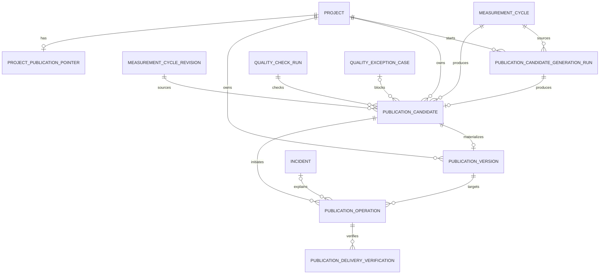

# レコラ管理画面 P0 公開管理画面仕様書

- 文書ID: `RECORA-ADMIN-P0-PUBLICATION-MANAGEMENT`
- 版: `1.1`
- 基準日: `2026-08-01`
- 状態: 正式採用
- 対象: レコラ管理画面P0
- 前提仕様:
  - `RECORA-ADMIN-P0-STATE-MODEL v2.1`
  - `RECORA-ADMIN-P0-READ-MODEL v2.0`
  - `RECORA-ADMIN-P0-AUTHZ-AUDIT v2.0`
  - `RECORA-ADMIN-P0-COMMON-LAYOUT v1.1`
  - `RECORA-ADMIN-P0-MEASUREMENT-MANAGEMENT v1.1`
  - `RECORA-ADMIN-P0-QUALITY-EXCEPTION v1.1`
- 優先順位: 本仕様は、公開前の全件手動承認案、公開版の直接編集案、現在公開中フラグの保存案、失敗operationの再利用案、測定停止と公開停止を同一制御にする案より優先する

---

## 0A. v1.1 最終横断統合更新

公開管理の画面責任・P0範囲はv1.0から変更しない。最終横断レビューにより、前提基盤を正式状態モデルv2.1、read model v2.0、権限・監査仕様v2.0へ更新する。

- 状態enumとcommand state effectは正式状態モデルv2.1を正とする。
- 表示code、件数、badge、facet、available command入力はread model v2.0を正とする。
- capability、scope、risk、command code、auditは権限・監査仕様v2.0を正とする。
- 正式routeと採用文書はcanonical manifest v1.0を正とする。

---

## 0. 正式決定

公開管理のP0を、次の原則で固定する。

1. 通常の公開は自動で行い、管理者が全候補を承認する運用にはしない。
2. 管理者が扱うのは、公開固有の失敗、保留、復元、公開停止・再開などの例外だけとする。
3. 公開候補は測定・解析後に生成し、その不変payloadを自動品質検査と表示安全性検査の対象にする。
4. candidate生成の1回の実行を`publication_candidate_generation_run`として保存し、未開始、待機、実行中、成功、失敗を区別する。
5. candidate、publication version、current pointer、publication operation、delivery verificationを別entityとして管理する。
6. candidateとpublication versionのpayloadを生成後に直接編集しない。
7. 内容修正時は新しいGenerationを作成し、自動品質検査を再実行する。
8. candidateへcycle内`generation_number`とproject全体で単調増加する`project_generation_number`を付与し、project単位のlatest candidateを一意に判定する。
9. 新candidateのcommit後に限り、過去の未消費candidateを`superseded`にする。
10. 自動公開できるのは、project内で最新、品質通過済み、source整合済みのcandidateだけとする。
11. `project.automation_control`は測定自動化の制御であり、公開可否条件へ使用しない。
12. 公開可否は`project.publication_control_state`を正とする。
13. 顧客アクセス停止はログイン・顧客APIの制御であり、candidate生成・pointer切り替えを停止しない。
14. 契約またはentitlementが非activeの場合、新しいpointer切り替えは行わない。
15. current publication versionの唯一の情報源は`project_publication_pointer`とし、versionへ`is_current`を保存しない。
16. project運用開始時にnullableなpointer rowを1件作り、停止時にも削除しない。
17. `publication_operation`は1回の公開意図を表し、terminal operationを再びqueuedまたはrunningへ戻さない。
18. operationの生存状態と工程を`status`と`current_stage`に分離する。
19. retryでは`retry_of_operation_id`を持つ新operationを作成する。
20. 同一projectで非終端publication operationは最大1件とする。
21. candidateから一度作成したversionはretryで再利用し、同じcandidateからversionを重複作成しない。
22. pointer切り替え前にimmutable payloadのprivate render検査を行い、切り替え後に実際の顧客routeを検証する。
23. version materialization、candidate consumed、pointer切り替えを同一transactionで確定する。
24. 切り替え後の表示検証に失敗した場合は、previous pointerまたは準備中状態へ自動rollbackする。
25. rollback結果も検証し、rollback confirmationに失敗した場合はCritical incidentとsystem blockを作成する。
26. 初回公開失敗時はpointerをNULLへ戻し、顧客画面の準備中表示を維持する。
27. `candidate.status = consumed`はversion作成とpointer切り替えtransactionがcommitされた事実を表し、現在公開中を意味しない。
28. manual hold解除では`held -> ready`へ直接戻さず、`held -> checking`として新しい品質検査を行う。
29. quality-owned・system-owned holdをpublication operatorが直接解除できない。
30. 古いcandidateは`superseded`、危険または利用禁止のcandidateは`invalidated`として区別する。
31. 管理者による公開停止ではpointerを削除せず、測定・解析・candidate生成・quality checkを継続可能にする。
32. 公開停止中のready candidateをheldへ自動変更しない。
33. 公開再開は、保持pointerまたは準備中routeの安全再検査後にだけ行う。
34. system blockは通常の管理者操作だけでは解除せず、incident recovery clearanceを必要とする。
35. 管理者停止中の過去版復元を許可するが、顧客には表示せず、再開時にdelivery verificationを必須とする。
36. revoked versionは顧客表示・復元対象にせず、再有効化しない。
37. 公開固有異常、品質異常、共通障害、契約・アクセス異常の担当領域を分け、sidebar badgeへ二重計上しない。
38. ready candidateが通常の自動開始SLA内にある場合、手動公開commandを返さない。
39. 手動公開は、自動公開開始遅延または公開operation失敗など、公開固有の例外時だけ利用可能にする。
40. 公開担当はquality decisionを作成できず、品質担当はpointerを切り替えられない。
41. publication payload、diff、verification detailの閲覧は機密readとして扱い、必要な閲覧を監査する。
42. 公開履歴はgeneration run、candidate、operation、version、verification、pointer変更、control変更を統合表示する。
43. 画面用の「要対応」「現在公開中」「前回版維持」は保存せずread modelで導出する。
44. 公開一覧、運用ホーム、sidebar badgeは同じpublication predicateを使用する。
45. staleまたはunknownなpointer、candidate、version、quality、verification情報では、publish、restore、stop、resumeを開始しない。
46. P0ではpublication version editor、一括公開承認、candidateのdrag-and-drop状態変更、二名承認を作らない。
---

## 1. 目的

公開管理は、顧客画面へ表示する不変な公開内容について、次を安全に管理する専門領域である。

```text
最新の公開候補はどれか
品質検査を通過しているか
自動公開処理は開始・完了したか
現在pointerはどの公開版を参照しているか
顧客が実際に閲覧できているか
失敗時に前回版または準備中へ戻れているか
候補を保留・無効化すべきか
過去版へ復元すべきか
project全体の公開を停止・再開すべきか
```

目標フローは次である。

```text
解析・指標集計
  ↓
最新Generationを生成
  ↓
自動品質検査
  ↓
自動公開operation
  ↓
pointer切り替え
  ↓
顧客route検証
  ↓
完了
```

例外時は次とする。

```text
公開固有異常
  ↓
前回版維持 / 準備中維持 / 公開停止
  ↓
公開担当が例外だけ処理
```

---

## 2. 責任範囲

### 2.1 公開管理で行うこと

- project単位の公開状態確認
- 公開候補Generationの確認
- 最新候補と現在公開版の比較
- 自動公開待ち・進行中・失敗の確認
- 管理上の候補保留
- 保留解除と自動再検査
- 候補再生成要求
- 未消費候補の無効化
- ready候補の例外的な手動公開
- 失敗した公開operationの再試行
- 過去公開版への復元
- project公開停止・再開
- 顧客画面preview
- pre-switch、post-switch、rollback、resume verificationの確認
- pointer変更履歴の確認
- 公開固有異常と品質case・incidentの関連確認

### 2.2 公開管理で行わないこと

- 通常候補の全件承認
- 品質findingの解決
- 品質decisionの作成
- candidate payload、KPI、改善提案、section本文の直接編集
- publication versionの直接編集
- measurement attemptの差し替え
- 解析・指標の再計算
- 契約・entitlementの変更
- customer accessの停止・再開
- AIモデルの停止・復旧
- incidentの共通原因分析
- publication ruleの高度な編集・simulation

### 2.3 専門領域への委譲

| 問題 | 正式な担当領域 |
|---|---|
| 内容品質、KPI、section安全性 | 品質・例外レビュー |
| 再測定、再解析、再計算 | 品質・例外レビュー / 測定管理 |
| 契約・entitlement非active | 顧客管理 |
| customer access停止 | 顧客管理 |
| 共通publication engine障害 | 障害・監査 |
| AIモデル・日次自動処理制御 | 障害・監査 / 管理設定 |
| 現在のpublication rule確認 | 管理設定 |

---

## 3. 不変条件

1. candidate、version、operation、verification、pointerは別の責任を持つ。
2. candidateとversionのpayloadは不変である。
3. pointerだけが現在版を示す。
4. candidate statusだけで顧客表示中かどうかを判定しない。
5. versionが存在するだけでは顧客表示中を意味しない。
6. pointerが存在してもpublication control、customer access、contract、entitlement、project lifecycleの条件を満たさなければ顧客へ表示しない。
7. customer access停止だけを理由にpointerを削除しない。
8. project automation停止だけを理由にready候補を公開不可と判定しない。
9. contractまたはentitlement非active時は新しいpointer切り替えを行わない。
10. current pointer切り替えとversion作成を部分commitしない。
11. pointer切り替え後は必ずpost-switch verificationを行う。
12. post-switch verification失敗後に新versionをそのまま表示し続けない。
13. rollback成功はrollback confirmation通過まで確定しない。
14. rollback失敗を単なるoperation failureとして隠さない。
15. 最新Generation以外を新規公開しない。
16. consumed candidateをreadyへ戻さない。
17. terminal operationを再openしない。
18. terminal verificationを再利用しない。
19. held candidateを直接readyへ戻さない。
20. superseded、invalidated candidateを復活させない。
21. version revocationを通常の公開担当UIから直接行わない。
22. 現在版の停止はpointer削除ではなくpublication controlで行う。
23. 公開停止中にpointerを変更する場合、顧客非表示を維持し、再開時検証を要求する。
24. stale pointer version、stale candidate Generation、stale rule snapshotを前提にwriteしない。
25. publication-specific attentionをquality caseまたはincidentと二重計上しない。

---

## 4. Route・template・最低権限

| Route | Template | 最低capability |
|---|---|---|
| `/admin/publications` | `T3 Work Queue` + history view | `publication.read` |
| `/admin/publications/candidates/[candidateId]` | `T5 Payload Inspector` | `publication.read` |
| `/admin/publications/versions/[versionId]` | `T5 Payload Inspector` | `publication.read` |

payload本文の閲覧には追加で次を必要とする。

```text
publication.payload.read
```

operationとdelivery verificationの詳細はdrawerで表示する。P0では独立URLを必須としない。

```text
publication operation drawer
publication delivery verification drawer
pointer change drawer
system event drawer
audit log drawer
```

---

## 5. 正式entity関係



| Entity | 1行の意味 |
|---|---|
| `publication_candidate_generation_run` | candidate生成1回の実行と成否 |
| `publication_candidate` | 顧客表示候補の1つの不変Generation |
| `publication_version` | candidateからmaterializeされた不変公開版 |
| `project_publication_pointer` | projectの現在版を示す、初回はNULLを許可する1行 |
| `publication_operation` | publish、restore、resumeの1回の意図と結果 |
| `publication_delivery_verification` | operationの特定phaseに対する1回のappend-only検証 |

---

## 6. 公開候補Generation

### 6.1 Candidate generation run

候補が存在しない理由を明確にするため、次を正式な生成実行単位とする。

```text
publication_candidate_generation_run
```

status:

```text
queued
running
completed
failed
cancelled
```

terminal runを再利用せず、retryでは新しい`run_number`を作る。

主な属性:

```text
generation_run_id
project_id
measurement_cycle_id
measurement_cycle_revision_id
project_configuration_revision_id
trigger_source
generation_reason
run_number
status
candidate_id nullable
failure_code nullable
publication_rule_version_id
quality_rule_version_id
render_schema_version
correlation_id
row_version
created_at
started_at nullable
completed_at nullable
```

追加検証からgeneration runを作らない。同一projectで非終端generation runは最大1件とする。

### 6.2 Candidate識別子

candidateは次を必須で保持する。

```text
candidate_id
generation_run_id
project_id
measurement_cycle_id
measurement_cycle_revision_id
project_configuration_revision_id
generation_number
project_generation_number
quality_rule_version_id
publication_rule_version_id
render_schema_version
payload_hash
created_at
```

`generation_number`は同一formal cycle内、`project_generation_number`は同一project全体で単調増加する番号である。

一意制約:

```text
UNIQUE(project_id, measurement_cycle_id, generation_number)
UNIQUE(project_id, project_generation_number)
UNIQUE(generation_run_id)
```

### 6.3 status

```text
generated
checking
ready
held
invalidated
superseded
consumed
```

許可遷移:

```text
generated -> checking
generated -> held
generated -> invalidated
generated -> superseded

checking  -> ready
checking  -> held
checking  -> invalidated
checking  -> superseded

ready     -> held
ready     -> invalidated
ready     -> superseded
ready     -> consumed

held      -> checking
held      -> invalidated
held      -> superseded
```

`invalidated / superseded / consumed`は終端である。

### 6.4 project内の最新Generation

```text
latest project Generation
=
MAX(project_generation_number) for project
```

statusで候補を先に除外してからlatestを選ばない。

新candidateがcommitされた後に限り、同一projectの次の過去candidateを`superseded`へ移す。

```text
status IN (generated, checking, ready, held)
AND project_generation_number < new.project_generation_number
```

consumed candidateと既存versionは変更しない。

latest candidateがinvalidatedになっても、過去candidateを復活させない。新Generationを作る。

### 6.5 Candidate作成transaction

```text
1. source revision・active configuration・tenant境界を再検査
2. cycle内generation_numberを排他的に採番
3. project全体project_generation_numberを排他的に採番
4. immutable candidateをgeneratedで作成
5. generation runへcandidate IDを設定
6. runをcompletedへ変更
7. projectの旧未消費candidateをsupersededへ変更
8. quality check要求をoutboxへ記録
9. commit
```

candidate作成に失敗した場合、旧candidateをsupersededにしない。runだけをfailedへ終端化する。

### 6.6 source整合

公開開始時に次を再検査する。

```text
candidate.measurement_cycle.purpose = formal_daily
candidate.measurement_cycle_revision.status = finalized
candidate.measurement_cycle.current_revision_id
  = candidate.measurement_cycle_revision_id
candidate.project_configuration_revision_id
  = project.active_configuration_revision_id
candidate.project_id
  = cycle.project_id
  = version.project_id
candidate rule snapshotが現在のpublication policyで受理可能
```

cycle再処理でcurrent revisionが切り替わった場合、旧revision由来の未消費candidateは`superseded`にする。

### 6.7 候補の不変性

生成後に次を更新しない。

- 顧客表示用payload
- section構成
- KPI値
- 改善提案
- 根拠・引用表示
- source cycle・revision・configuration
- rule snapshot
- render schema version
- payload hash
- Generation番号

内容変更は新Generationで行う。

### 6.8 保留

`HoldPublicationCandidate`は、公開上の運用理由でproject全体のlatest unconsumed candidateを一時停止するW2操作である。

管理者によるmanual holdの許可対象:

```text
candidate.status IN (generated, checking, ready)
AND candidate.project_generation_number = project内MAX(project_generation_number)
AND hold_origin IS NULL
AND pointer commit済みのoperationがない
```

hold origin:

```text
manual_publication
quality_exception
system_safety
```

publication operatorが作成・解除できるのは`manual_publication`だけである。quality decisionまたはsystem safetyによるholdは、それぞれquality・incidentの正式処理で作成する。

quality checkとholdが競合した場合はrow lockとrow versionで直列化する。holdが先にcommitされたcandidateをquality engineが`ready`へ変更してはならない。

保留中もcurrent pointerと既存versionは変更しない。

### 6.9 保留解除

`ReleasePublicationCandidateHold`はW2とする。

許可条件:

```text
candidate.status = held
hold_origin = manual_publication
candidateがproject全体のlatest Generation
同一projectにpointer mutation中のoperationがない
```

正式遷移:

```text
held
  ↓
checking
  ↓
新しいquality_check_run
```

過去のquality check passをそのまま再利用しない。quality-ownedまたはsystem-owned holdはpublication operatorが解除できない。

### 6.10 無効化

`InvalidatePublicationCandidate`はW2とする。

publication operatorの許可対象:

```text
candidate.status IN (generated, checking, ready)
OR (
  candidate.status = held
  AND hold_origin = manual_publication
)
```

追加条件:

- candidateがproject全体のlatest unconsumed Generation
- pointer commit済みのoperationがない
- quality-ownedまたはsystem-owned attentionが正式な解決先ではない
- reason、row version、idempotency keyがある

効果:

- candidateをterminal `invalidated`へ変更
- pointer commit前の関連operationを安全にcancel
- current pointerと既存versionは変更しない
- exact reasonをaudit logへ保存

quality holdまたはsystem holdのcandidateは、quality decision applicationまたはincident recoveryのsystem actorだけが無効化できる。consumed candidateは無効化しない。

### 6.11 再生成

`RegeneratePublicationCandidate`はW1とする。

- finalizedなcurrent formal cycle revisionをsourceに新generation runを作る
- payload、KPI、section本文のpatch入力を受け取らない
- active configurationとrule snapshotを再取得する
- 同一projectに非終端generation runまたはpointer mutation中operationがない
- quality-ownedまたはincident-ownedの未解決blockerをpublication operatorが迂回しない
- 新candidate commit後に過去の未消費candidateをsupersededにする
- 新candidateはgeneratedから品質検査へ進む
- current pointerは維持する

## 7. 公開可能条件と自動公開

### 7.1 Candidate内容上の公開適格性

`candidate_content_eligible`は、次をすべて満たす場合だけtrueとする。

```text
candidate.status = ready
candidate.project_generation_number = project内MAX(project_generation_number)
source cycle purpose = formal_daily
source cycle revision = cycle.current_revision_id
source cycle revision.status = finalized
source configuration revision = project.active_configuration_revision_id
latest quality_check_run.status in (passed, passed_with_warnings)
unresolved finding with blocking_scope in
  (candidate_generation, publication, optional_section) = 0
candidate公開を阻害する未解決quality case = 0
publication rule compatibility = accepted
payload hash = valid
render schema = supported
tenant・customer・project整合性 = passed
publication_version for candidate = 不存在
```

次は内容上の適格性へ含めない。

```text
project.lifecycle_status
contract.status
project_entitlement.status
project.publication_control_state
project.automation_control
customer.access_control
```

内容品質と、現在operationを開始できるかを混同しないためである。

### 7.2 公開operation開始可能条件

`candidate_operation_eligible`は、内容上の適格性に加えて次を満たす場合だけtrueとする。

```text
project.lifecycle_status = active
contract.status = active
project_entitlement.status = active
project.publication_control_state = enabled
同一projectに非終端publication operationがない
expected pointer_versionが一致
publication engineが利用可能
```

自動公開では、さらに適用中publication ruleのauto publishが有効であることを必要とする。

次はoperation開始条件へ含めない。

```text
project.automation_control = running
customer.access_control = enabled
```

理由:

- 測定停止と公開停止を分離するため
- customer access停止中も、最新の安全なpointerを準備できるようにするため

### 7.3 自動開始SLA

ready candidate作成後、publication ruleに定義されたSLA以内は次として扱う。

```text
自動公開待ち
attention owner = system
human attention = false
```

SLA超過後もoperationが存在しない場合:

```text
公開開始遅延
attention owner = publication
human attention = true
```

SLA値をUIへ固定埋め込みせず、適用中publication rule versionから取得する。

### 7.4 手動公開

`PublishReadyCandidate`はW2であり、通常の承認ボタンではない。

利用可能条件:

- `candidate_operation_eligible = true`
- 自動開始SLA超過、scheduler failure、publication engine recovery後など、publication-owned attentionがある
- candidateとpointerのrow versionが一致
- reasonとidempotency keyがある

SLA内の通常ready candidateにはコマンドを返さない。品質、source、契約、entitlement、publication controlを上書きしない。

## 8. 公開版

### 8.1 不変内容

`publication_version`は次を保持する。

```text
version_id
project_id
version_number
source_candidate_id
payload
payload_hash
section_manifest
source_cycle_id
source_cycle_revision_id
source_configuration_revision_id
quality_rule_version_id
publication_rule_version_id
created_at
created_by_operation_id
revoked_at
revoked_reason
```

次は不変である。

- payload
- payload hash
- section manifest
- source candidate・cycle・revision・configuration
- rule snapshot
- version number

`revoked_at`と`revoked_reason`は安全上の運用metadataであり、payload編集ではない。

### 8.2 一意制約

```text
UNIQUE(project_id, version_number)
UNIQUE(source_candidate_id)
```

同じcandidateから2件目のversionを作らない。

### 8.3 materialization

通常publishでは、pre-switch verification通過後のpointer transaction内で次を行う。

```text
versionが未作成
  ↓
version作成
candidate ready -> consumed
pointer更新
```

transaction失敗時はversion作成、candidate consumed、pointer更新をすべてrollbackする。

post-switch verification失敗後にpointerを戻しても、作成済みversionとcandidate consumedは維持する。再試行では同じversionを使う。

### 8.4 復元可能性

過去versionをrestoreできるのは次を満たす場合だけである。

- 同一project
- revokedでない
- payload hash整合
- tenant・project binding整合
- 現行の表示禁止ルールに抵触しない
- pre-switch render verificationを通過
- 別の非終端operationがない

過去のquality passだけを根拠にせず、現在のpublication safety ruleで再検査する。

---

## 9. Publication operation

### 9.1 operation type

```text
publish_candidate
restore_version
resume_current_pointer
```

| type | 目的 |
|---|---|
| `publish_candidate` | latest ready candidateをversion化してpointerへ切り替える |
| `restore_version` | 過去の不変versionへpointerを切り替える |
| `resume_current_pointer` | 停止中に保持しているpointerまたは準備中routeを検査して公開を再開する |

### 9.2 status

```text
queued
running
completed
rolled_back
failed
cancelled
```

許可遷移:

```text
queued  -> running
queued  -> failed
queued  -> cancelled

running -> completed
running -> rolled_back
running -> failed
running -> cancelled  # 外部可視状態変更前だけ
```

`completed`、`rolled_back`、`failed`、`cancelled`は終端である。

### 9.3 current stage

```text
eligibility_check
pre_switch_verification
version_pointer_commit
post_switch_verification
resume_control
rollback
finalizing
```

`status`はoperationの生存状態、`current_stage`は現在工程である。

### 9.4 必須参照

operation typeに応じて次を保持する。

```text
operation_id
project_id
operation_type
source_candidate_id nullable
target_version_id nullable
previous_pointer_version_id nullable
expected_pointer_version
retry_of_operation_id nullable
execution_mode
status
current_stage
failure_code nullable
started_at
completed_at
correlation_id
```

`execution_mode`:

```text
live_switch
hidden_under_pause
resume_visibility
```

### 9.5 再試行

`failed`または`rolled_back` operationを再びqueuedへ戻さない。

`RetryPublicationOperation`はW2とし、次を作る。

```text
new publication_operation
retry_of_operation_id = failed_or_rolled_back_operation_id
same logical target
new idempotency key
new delivery verifications
```

source candidateからversionが既に作成済みなら、そのversionを再利用する。

次の場合はretryを拒否する。

- newer project Generationがある
- source candidateまたはtarget versionがrevoked・不整合
- contract・entitlement・publication control条件を満たさない
- linked incidentの安全条件を満たさない
- 別の非終端operationがある

### 9.6 同時実行

```text
UNIQUE(project_id)
WHERE status IN (queued, running)
```

実装はproject publication lock、pointer row lock、`pointer_version`、operation row versionを併用する。

---

## 10. Delivery verification

### 10.1 phase

```text
pre_switch_render
post_switch_route
rollback_confirmation
resume_precheck
post_resume_route
```

### 10.2 status

```text
pending
running
passed
failed
cancelled
```

terminal verificationを更新して再利用しない。再実行時は新しいrowを作る。

### 10.3 必須値

```text
verification_id
publication_operation_id
phase
status
expected_project_id
expected_customer_id
expected_version_id nullable
expected_payload_hash nullable
observed_version_id nullable
observed_payload_hash nullable
failure_code nullable
started_at
completed_at
```

### 10.4 検査内容

`pre_switch_render`:

- immutable payloadのschema
- section manifest
- customer/project/tenant binding
- render成功
- payload hash
- route生成に必要な必須値
- current publication ruleとの互換性

`post_switch_route`:

- 顧客routeが期待versionを返す
- project・tenant誤配信がない
- expected payload hashと一致する
- 必須sectionが表示可能
- publication controlとcustomer visibility条件が期待どおり

`rollback_confirmation`:

- pointerがprevious versionまたはNULLへ戻った
- previous payload hashまたは準備中routeが確認できる
- target versionが顧客routeから配信されていない

`resume_precheck`:

- held pointerまたは準備中routeが安全
- contract・entitlement・project lifecycleが有効
- system block clearanceが有効

`post_resume_route`:

- publication control有効化後のrouteが期待状態を返す

### 10.5 failure code

```text
render_error
schema_mismatch
payload_hash_mismatch
project_mismatch
tenant_mismatch
pointer_mismatch
route_unavailable
timeout
access_policy_mismatch
rule_incompatible
unknown
```

`tenant_mismatch`、`project_mismatch`、重大な`pointer_mismatch`はCritical incidentとsystem blockを必須とする。

---

## 11. 通常の自動公開フロー

```text
1. latest ready candidateを選択
2. operationをqueuedで作成
3. eligibilityを再検査
4. pre_switch_render verification
5. candidate・project・pointerを再検査
6. version作成または既存version取得
7. pointer rowをlock
8. previous pointerをoperationへ保存
9. version作成、candidate consumed、pointer更新を同一transactionでcommit
10. post_switch_route verification
11. passedならoperation completed
12. current pointerと顧客表示をread modelへ反映
```

自動operation作成はoutboxまたは同等の冪等な仕組みを使用する。

自動公開開始前とpointer commit直前の2回、candidate最新性と契約・entitlement・publication controlを再検査する。

---

## 12. 失敗・rollback

### 12.1 pointer commit前の失敗

- current pointerを変更しない
- candidateをconsumedにしない
- versionを部分作成しない
- operationをfailedまたはcancelledへ終端化
- failure ownerをquality、publication、incidentのいずれかへ分類

### 12.2 pointer commit後のverification失敗

```text
operation.current_stage = rollback
  ↓
pointerをprevious versionまたはNULLへ戻す
  ↓
rollback_confirmation
```

passed:

```text
operation.status = rolled_back
safe fallback = previous version / preparing
```

failed:

```text
operation.status = failed
failure_stage = rollback
publication_control_state = blocked_by_system
Critical incident作成
```

### 12.3 初回公開

previous pointerがない場合:

```text
rollback target = NULL
customer route = preparing
```

準備中routeの確認に失敗した場合もCritical incidentとsystem blockを作る。

### 12.4 owner分類

| failure | owner |
|---|---|
| 内容・section・KPI安全性 | quality |
| switch、pointer lock、単一projectのoperation実行失敗 | publication |
| 複数project共通engine障害 | incident |
| contract・entitlement非active | customer_management |
| systemが自動retry中 | system |

同じ事象を複数領域のhuman badgeへ重複計上しない。

---

## 13. 公開停止・再開

### 13.1 公開停止

`StopPublication`はW3である。

```text
publication_control_state:
enabled -> paused_by_admin
```

効果:

- 顧客routeは直ちに公開停止表示へ切り替わる
- pointerは保持する
- 測定・解析・候補生成は継続可能
- ready候補の自動operationは開始しない
- queued/pre-switch operationはcancelする
- pointer commit後の非終端operationはprevious pointerへのrollbackを要求する

control更新、active operation調整要求、audit logを同一transactionまたはoutbox整合で記録する。

### 13.2 停止中の候補

停止中にcandidateがreadyになってもstatusをheldへ自動変更しない。

```text
candidate = ready
publication control = paused_by_admin
```

として維持し、再開後に最新性と品質を再検査する。

### 13.3 公開再開

`ResumePublication`はW3で、直接`enabled`へ書き換えない。

```text
resume_current_pointer operation
  ↓
resume_precheck
  ↓
publication controlをenabledへ変更
  ↓
post_resume_route verification
```

失敗時:

- `paused_by_admin`へ戻す、または重大時は`blocked_by_system`
- operationはrolled_backまたはfailed
- pointerは保持する

pointerがNULLの場合は準備中routeを検証して再開する。再開後、latest ready candidateがあれば通常の自動公開が開始される。

### 13.4 system block

`blocked_by_system`からの再開には次を必要とする。

- linked incident
- recovery condition pass
- system-generated clearance tokenまたは同等の不変証跡
- current pointerまたは準備中routeの再検査
- W3 confirmation

通常のpublication operatorが安全再検査を省略してenabledへ変更できない。

---

## 14. 過去版復元

### 14.1 操作

`RestorePublicationVersion`はW3である。

確認画面に次を表示する。

- project
- 現在pointer version
- 復元先version
- 作成日時
- source cycle・configuration
- 現在版との差分要約
- 顧客表示への影響
- current publication control
- delivery verificationの履歴
- 復元理由

### 14.2 enabled中の復元

`execution_mode = live_switch`として、通常publishと同じpre-switch、pointer commit、post-switch verification、rollbackを行う。

### 14.3 管理者停止中の復元

`publication_control_state = paused_by_admin`でも復元を許可する。

```text
execution_mode = hidden_under_pause
pre_switch_render
pointer commit
pointer integrity verification
operation completed
delivery_deferred_until_resume = true
```

顧客表示は停止中のまま変わらない。再開時に`resume_current_pointer` operationを作り、post-resume routeを検証する。

### 14.4 system block中

通常の管理者復元を許可しない。incident recovery planの一部としてsystem operatorまたはsystem actorが実行する。

### 14.5 復元の禁止

- revoked version
- 別project version
- payload hash不一致
- tenant binding不一致
- current safety ruleで禁止
- nonterminal operationあり
- stale pointer version
- required capability・scope・step-up不足

---

## 15. 古い候補・rule変更・configuration変更

### 15.1 新Generation

同一projectで新candidateがcommitされた時点で、過去の未消費candidateをsupersededにする。

### 15.2 cycle revision切り替え

cycle current revisionが変更された場合、旧revision由来の未消費candidateをsupersededにする。

### 15.3 configuration revision切り替え

新configuration revision active化時、旧configuration由来の未消費candidateをsupersededにする。

### 15.4 publication rule変更

active rule version変更後、既存ready candidateの互換性を再評価する。

- compatible: ready維持可能
- recheck required: checkingへ移し新quality check
- incompatible: invalidatedまたはnew Generation要求

過去versionは自動編集しない。現在公開版に重大な不適合が見つかった場合は、quality case、incident、公開停止または復元で扱う。

---

## 16. 公開管理トップ

### 16.1 route

```text
/admin/publications
```

### 16.2 compact summary

大きなKPIカードを並べず、次をcompact summaryで表示する。

```text
公開固有の要対応
保留中
自動公開処理中
自動公開待ち
現在顧客表示中
公開停止中
```

すべて選択中scopeと同じsnapshotで集計する。

### 16.3 正式tab

```text
要対応
保留中
現在公開中
公開停止中
公開履歴
```

「自動公開待ち」はtabにせず、summaryと現在公開中tab上部の補助sectionで表示する。

### 16.4 要対応

対象は `publication_attention_owner = publication` かつhuman attentionの行だけとする。

主な理由:

- auto operation開始SLA超過
- operation failed
- operation rolled_back後の再試行判断
- pointer integrity不一致
- resume precheck失敗
- hidden restore後のresume verification待ちが期限超過

品質caseまたはincidentがownerの場合は、関連情報として表示できるが公開バッジと要対応件数へ含めない。

主要列:

```text
注意度
顧客・プロジェクト
理由
候補 / version
operation stage
安全状態
経過時間
担当領域
最終更新
操作
```

### 16.5 保留中

1 project・latest held candidate単位で表示する。

```text
顧客・プロジェクト
Generation
保留理由
保留者
保留日時
current pointer
safe fallback
関連quality case / incident
操作
```

### 16.6 現在公開中

1 project 1行。

```text
顧客・プロジェクト
current version
source cycle business date
顧客表示状態
最新candidate
最終delivery verification
公開開始日時
最終更新
```

pointerがあってもcustomer access、contract、entitlementで非表示の場合は、「pointer保持・顧客非表示」と明示し、現在公開中件数へ含めない。

### 16.7 公開停止中

`publication_control_state != enabled`を表示する。

```text
管理者停止
システム停止
```

主要列:

```text
顧客・プロジェクト
停止種別
停止理由
held pointer
latest ready candidate
測定継続状態
linked incident
停止日時
再開可否
```

### 16.8 公開履歴

view切替:

```text
操作
公開版
```

operation履歴:

- type
- status
- stage
- target candidate/version
- previous pointer
- execution mode
- delivery result
- safety outcome
- actor source
- started/completed

version履歴:

- version number
- source candidate
- source cycle
- current pointerか
- customer visibleか
- first passed delivery verification
- revoked状態

---

## 17. Candidate詳細

### 17.1 header

```text
project
project Generation / cycle Generation
cycle Generation
status
latest / old
publication eligibility
quality status
current pointerとの関係
safe fallback
created_at
```

### 17.2 section

```text
顧客画面プレビュー
現在版との差分
section manifest
品質検査・case
source cycle・revision
公開operation
履歴
```

### 17.3 preview

- 実際の顧客renderに近い読み取り専用preview
- customer、project、version/candidate IDを常時表示
- preview環境であることを明示
- hidden sectionと理由を表示
- raw JSON editorを作らない
- payloadの直接更新を受け付けない

### 17.4 available commands

状態・権限・scope・freshnessに応じて次を返す。

```text
HoldPublicationCandidate
ReleasePublicationCandidateHold
InvalidatePublicationCandidate
RegeneratePublicationCandidate
PublishReadyCandidate
RetryPublicationOperation
```

candidateが古い、terminal、operation中、staleの場合は該当commandを返さない。

---

## 18. Version詳細

### 18.1 header

```text
project
version number
current pointerか
customer visibleか
revokedか
source candidate
source cycle
created_at
```

### 18.2 section

```text
顧客画面プレビュー
section manifest
source・rule snapshot
publication operations
delivery verifications
pointer history
統合タイムライン
```

### 18.3 available commands

```text
RestorePublicationVersion
StopPublication
ResumePublication
```

current versionへのrestore、revoked version、別project versionにはrestoreを返さない。

---

## 19. Operation・verification drawer

### 19.1 operation drawer

表示内容:

- operation type・status・stage
- execution mode
- source candidate / target version
- previous pointer
- expected pointer version
- retry chain
- failure code
- safe outcome
- correlation ID
- actor source
- timestamps
- verification一覧

### 19.2 verification drawer

表示内容:

- phase
- status
- expected project・customer・version
- expected/observed hashの一致結果
- failure code
- route・componentの安全な要約
- linked incident / quality case
- timestamps

secret、cookie、Authorization header、raw internal URLは返さない。

---

## 20. 顧客画面preview

### 20.1 種類

```text
candidate preview
version preview
current customer view preview
preparing view preview
publication stopped view preview
```

### 20.2 権限

metadataは`publication.read`で閲覧できる。本文は`publication.payload.read`を必要とする。

### 20.3 監査

次の閲覧は敏感なreadとして監査対象にできる。

- candidate本文
- version本文
- current customer viewの機密section
- diffで表示される引用・AI回答由来のexcerpt

一覧responseへpayload全文を含めない。

### 20.4 安全性

- preview URLを外部共有用にしない
- tenant・project bindingをserverで解決する
- client指定のcustomer/projectを信用しない
- previewからwrite APIを呼べない
- previewのキャッシュをtenant間で共有しない

---

## 21. Command matrix

| Command | Risk | 主capability | 主な条件 |
|---|---:|---|---|
| `HoldPublicationCandidate` | W2 | `publication.candidate.manage` | latest unconsumed candidate、operation commit前 |
| `ReleasePublicationCandidateHold` | W2 | `publication.candidate.manage` | held、new quality check必須 |
| `InvalidatePublicationCandidate` | W2 | `publication.candidate.manage` | unconsumed candidate、terminal化 |
| `RegeneratePublicationCandidate` | W1 | `publication.candidate.manage` | finalized current source、payload直接編集不可 |
| `PublishReadyCandidate` | W2 | `publication.publish_ready` | publication-owned attention、latest ready |
| `RetryPublicationOperation` | W2 | `publication.publish_ready` | failed/rolled_back、new operation |
| `RestorePublicationVersion` | W3 | `publication.restore` | same project、有効version、step-up |
| `StopPublication` | W3 | `publication.control` | enabled、pointer保持 |
| `ResumePublication` | W3 | `publication.control` | paused/system clearance、resume operation |

すべてのW2/W3でreason、row version、idempotency key、影響表示を必須とする。

---

## 22. 権限境界

### 22.1 公開運用担当

```text
publication.read
publication.payload.read
publication.candidate.manage
publication.publish_ready
publication.restore
publication.control
quality.read
incident.read.scoped
```

付与しないもの:

```text
quality.decide
quality.reprocess
measurement.retry
contract.manage
customer.access.manage
incident.manage  # 標準ではなし
```

### 22.2 品質レビュー担当

- candidateのredacted quality previewは閲覧可能
- pointer切り替え不可
- publication control変更不可
- restore不可
- manual publish不可

### 22.3 システム運用担当

incident recoveryに関連する場合だけ、operation retry、stop、system-block recoveryを実行できる。通常のproject publication運用を代行しない。

### 22.4 platform admin

全capabilityを持つが、次はできない。

- quality gate直接pass
- candidate/version payload編集
- terminal candidate・operationの復活
- pointer version競合の無視
- system block clearanceの偽造

---

## 23. Attention ownershipとバッジ

### 23.1 owner

```text
publication
quality
incident
customer_management
system
none
```

### 23.2 公開サイドバーバッジ

```text
publication_attention_owner = publication
AND human_attention = true
AND unresolved = true
```

次は含めない。

- quality caseが正式ownerの内容問題
- incidentが正式ownerの共通障害
- contract・entitlement・customer access問題
- systemがSLA内で自動処理中
- 通常のready candidate

### 23.3 一覧との一致

```text
sidebar publication badge
=
公開管理「要対応」facet
=
運用ホームのpublication-owned attention count
```

同じscope、snapshot、freshnessを使用する。

---

## 24. Read model response

### 24.1 `GetPublicationOverview`

```text
meta
scope
freshness
compact_summary
tabs
items
facets
attention_ownership_summary
auto_publish_waiting_summary
section_errors
```

### 24.2 `PublicationProjectSummary`

```text
customer_id
project_id
project_name
publication_control_state
latest_candidate_id
latest_generation_number
latest_candidate_status
candidate_is_latest
candidate_is_eligible_for_publication
can_start_publication_operation
auto_publish_due_at
auto_publish_sla_state
current_pointer_version_id
current_pointer_version_number
pointer_version
is_customer_visible
customer_visibility_blocker_codes[]
latest_operation_id
latest_operation_type
latest_operation_status
latest_operation_stage
latest_verification_phase
latest_verification_status
publication_attention_owner
publication_attention_reason_code
safe_fallback_code
primary_publication_state_code
resume_precheck_required
last_publication_activity_at
row_version
```

### 24.3 primary state

優先順位:

```text
unknown_integrity
requires_attention
stopped_by_system
stopped_by_admin
processing
held
auto_publish_waiting
current
pointer_hidden_external_control
preparing
unknown
```

`pointer_hidden_external_control`は、pointerとpublication controlは有効だが、customer access、contract、entitlementなど他領域の条件で顧客非表示の状態である。公開固有要対応へ数えない。

### 24.4 Candidate detail

```text
candidate metadata
source consistency
quality summary
eligibility checks[]
payload summary
section manifest
diff from current
preview descriptor
related cases/incidents
operation chain
timeline
available_commands
```

### 24.5 Version detail

```text
version metadata
is current pointer
is customer visible
payload summary
section manifest
source snapshot
operation history
verification history
pointer history
timeline
available_commands
```

### 24.6 History

operationとversionのどちらもcursor paginationを使用する。filter、items、facet countは同じsnapshotから作る。

---

## 25. エラー・freshness・競合

### 25.1 stale

次のいずれかがstaleまたはunknownならW2/W3 commandを返さない。

- candidate latestness
- source cycle current revision
- active configuration revision
- quality check result
- contract・entitlement
- publication control
- pointer version
- linked incident clearance

### 25.2 conflict code

```text
PUBLICATION_CANDIDATE_CHANGED
PUBLICATION_NOT_LATEST
PUBLICATION_POINTER_CHANGED
PUBLICATION_OPERATION_IN_PROGRESS
PUBLICATION_CONTROL_CHANGED
PUBLICATION_QUALITY_CHANGED
PUBLICATION_CONTRACT_CHANGED
PUBLICATION_VERSION_REVOKED
PUBLICATION_RESTORE_NOT_ALLOWED
PUBLICATION_SYSTEM_BLOCKED
PUBLICATION_RESUME_PRECHECK_FAILED
PUBLICATION_SCOPE_DENIED
PUBLICATION_STALE_DATA
```

### 25.3 idempotency

- 同じcommand・同じidempotency keyは同じ結果を返す
- operationを重複作成しない
- versionを重複作成しない
- pointer versionを二重増分しない
- replayを新しい公開履歴として数えない

### 25.4 section failure

payload preview取得に失敗しても、metadata、safe fallback、operation statusを表示する。preview failureをcandidate不存在または0件として扱わない。

---

## 26. 監査・system event・timeline

### 26.1 audit log

管理者操作は1回だけ保存する。

```text
HoldPublicationCandidate
ReleasePublicationCandidateHold
InvalidatePublicationCandidate
RegeneratePublicationCandidate
PublishReadyCandidate
RetryPublicationOperation
RestorePublicationVersion
StopPublication
ResumePublication
```

非同期操作は:

```text
result = success
outcome = ACCEPTED_ASYNC
```

### 26.2 system event

- candidate generated / superseded
- quality check started / completed
- auto operation created
- pre-switch verification
- version materialized
- pointer switched
- post-switch verification
- rollback started / completed / failed
- resume precheck / post-resume verification
- system block applied / cleared

### 26.3 before/after summary

本文payloadを保存せず、次の識別子と状態だけを保存する。

```text
candidate_id
generation_number
version_id
pointer_version
publication_control_state
operation_id
status / stage
reason code
```

### 26.4 timeline

```text
audit_log
＋ system_event
＋ candidate/version/operation/verification/pointerの状態遷移
```

同じ管理者要求を完了時に再度audit logへ複製しない。

---

## 27. UI・アクセシビリティ・responsive

- 1366×768でcompact summary、tab、上位3件の要対応を確認できる。
- 1440×900でpreviewと主要metadataを同時に確認できる。
- page全体の横スクロールを発生させない。
- payload比較だけ必要に応じてinspector内部で横スクロールを許可する。
- statusを色だけで伝えず、codeに対応する日本語labelとiconを併用する。
- stop、restore、resumeのW3 dialogはkeyboard操作、focus trap、戻る操作に対応する。
- version・candidate ID、customer・projectをpreview上部に固定表示する。
- 長い日本語project名、URL、rule名でlayoutを崩さない。
- hidden sectionは視覚的に判別でき、理由をテキストで読める。
- loading、empty、stale、permission denied、partial failureを別状態として表示する。

---

## 28. P0で作らないもの

- 全候補の手動承認queue
- 一括公開承認
- 一括candidate hold・release・invalidate
- candidate payload editor
- publication version editor
- 過去versionの内容修正
- pointerの直接ID入力切り替え
- drag-and-drop公開状態変更
- 二名承認
- canary配信割合UI
- 顧客別公開スケジュール
- A/B公開
- 公開versionへのコメントスレッド
- 外部共有可能なpreview URL
- 高度なrule simulation
- mobile専用管理画面

---

## 29. 受け入れ条件

公開管理実装は、最低限次を自動テスト・画面検証で証明する。

### 29.1 Candidate generation・latest判定

1. generation run未作成、queued、running、completed、failed、cancelledを区別できる。
2. terminal generation runを再利用せず、新run numberでretryする。
3. additional validationからgeneration runを作れない。
4. 同一projectへ非終端generation runを2件作れない。
5. candidate作成とgeneration run completedが同一transactionになる。
6. candidate作成失敗時に過去candidateをsupersededへ変更しない。
7. new candidateのcommit後だけ過去の未消費candidateがsupersededになる。
8. consumed candidateが新Generation作成で変更されない。
9. 同一projectでproject_generation_numberが重複しない。
10. latest candidateがinvalidatedでも古いready candidateが自動復活しない。
11. candidate payloadを更新するwrite APIが存在しない。
12. version payloadを更新するwrite APIが存在しない。
13. project全体で最大のproject_generation_number以外を新規公開開始できない。
14. cycle current revisionと異なるsource candidateを公開できない。
15. active configuration revisionと異なるcandidateを公開できない。
16. unresolved blocking findingがあるcandidateを公開できない。
17. latest quality checkがpassed系以外のcandidateを公開できない。

### 29.2 保留・無効化・再生成

18. HoldPublicationCandidateがproject全体のlatest未消費candidateで、generated・checking・readyだけを対象にする。
19. manual holdへorigin、reason、row version、idempotency keyが必須である。
20. holdでcurrent pointerが変化しない。
21. ReleasePublicationCandidateHoldがmanual holdだけを対象にする。
22. quality-ownedまたはsystem-owned holdをpublication operatorが解除できない。
23. hold解除でcandidateがcheckingへ移る。
24. hold解除で過去quality passを再利用せず新check runを作る。
25. InvalidatePublicationCandidateがcandidateをterminal invalidatedへ移す。
26. consumed candidateをInvalidatePublicationCandidateで変更できない。
27. invalidated candidateを元へ戻すcommandが存在しない。
28. RegeneratePublicationCandidateが新generation run、新cycle Generation、新project Generationを作る。
29. candidate再生成でcurrent pointerが変わらない。

### 29.3 公開可能条件・自動開始

30. project非activeで公開開始できない。
31. contract非activeで公開開始できない。
32. entitlement非activeで公開開始できない。
33. publication control非enabledで通常publishを開始できない。
34. project automation pausedでも他条件を満たせば公開可能性を維持できる。
35. customer access停止中でもpointer切り替え処理を継続できる。
36. customer access停止中はpointerがあってもcustomer visibleにならない。
37. ready candidateの自動開始SLA内にmanual publish commandを返さない。
38. SLA超過後にpublication-owned attentionとmanual publish commandを返せる。
39. manual publishがW2 reason、row version、idempotency、impact previewを要求する。
40. quality、configuration、contract、entitlement、tenant境界をmanual publishで上書きできない。

### 29.4 Version・pointer transaction

41. project activation時にnullable pointer rowを1件作る。
42. pointer rowを公開停止時に削除しない。
43. version materialization、candidate consumed、pointer更新が同一transactionになる。
44. pointer transaction失敗でversionだけが残らない。
45. pointer transaction失敗でcandidateだけがconsumedにならない。
46. pointer transaction失敗でpointerだけが切り替わらない。
47. 同じcandidateからversionを2件作れない。
48. candidate consumedが現在公開中を意味しない。
49. publication versionへis_currentまたはis_visibleを保存しない。
50. current versionをpointerだけから判定できる。
51. pointer_versionがpublish、restore、rollback、NULL rollbackでincrementする。
52. revoked versionをcustomer visibleとして扱わない。
53. revoked versionをrestore targetにできない。
54. current version revocationでsystem blockとCritical incidentが作られる。

### 29.5 Operation・verification・rollback

55. operation statusとcurrent stageを分離して保存できる。
56. 同一projectで非終端operationを2件作れない。
57. terminal operationをqueuedまたはrunningへ戻せない。
58. failedまたはrolled_back operationのretryが新operationとretry_of_operation_idを作る。
59. retry時に既存versionがあれば再利用する。
60. newer project Generationがあるterminal operationをretryできない。
61. revokedまたは境界不整合versionをretry targetにできない。
62. pre-switch verification失敗でpointerが変化しない。
63. pre-switch verification失敗でcandidateがconsumedにならない。
64. post-switch verification成功後だけoperation completedになる。
65. post-switch verification失敗でbounded retryまたはrollbackが開始される。
66. retryable failureだけを自動retryする。
67. verification terminal rowを再利用せず、新attempt rowを作る。
68. pre-switch、post-switch、rollback confirmation、resume precheck、post-resumeを区別する。
69. expected/observed versionとchecksumを比較できる。
70. tenant、customer、project mismatchを重大異常として扱う。
71. rollback成功後にprevious pointerまたはNULLが復元される。
72. rollback confirmation通過後だけoperation rolled_backになる。
73. pointer drift時に古いrollbackが新pointerを上書きしない。
74. rollback writeまたはconfirmation失敗でpublication controlがblocked_by_systemになる。
75. rollback failureでCritical incidentが作成される。
76. rollback failureだけでmeasurement automationを無条件停止しない。
77. 初回公開失敗でpointerがNULLへ戻る。
78. 初回公開失敗で準備中routeが維持される。
79. 準備中routeのrollback confirmation失敗を重大異常として扱う。
80. secret、cookie、Authorization header、raw internal URLをverification detailへ返さない。

### 29.6 公開停止・再開

81. StopPublicationがW3とstep-upを要求する。
82. StopPublicationでpointer、version、candidateが削除されない。
83. StopPublicationでcustomer routeが公開停止表示になる。
84. StopPublicationで測定、解析、candidate生成、quality checkを継続できる。
85. 停止後にready candidateをheldへ自動変更しない。
86. 停止中に通常auto publish operationを開始しない。
87. 停止と競合したqueued/pre-switch operationへcancelを要求する。
88. pointer commit済みoperationと停止が競合した場合にsafe rollbackを要求する。
89. ResumePublicationが直接controlをenabledへ書き換えない。
90. ResumePublicationが新resume operationを作る。
91. resume precheck失敗時に公開停止状態を維持する。
92. post-resume verification失敗時に再停止またはsystem blockになる。
93. pointerなしのresumeで準備中routeを検証できる。
94. resume後にlatest ready candidateの自動公開を開始できる。
95. system blockをclearanceなしで解除できない。
96. system block recoveryがlinked incidentとrecovery evidenceを要求する。

### 29.7 過去版復元

97. RestorePublicationVersionがW3とtyped confirmationを要求する。
98. 別project versionを復元できない。
99. revoked versionを復元できない。
100. payload checksum不一致versionを復元できない。
101. current safety ruleで禁止されたversionを復元できない。
102. current pointerと同じversionへrestore commandを返さない。
103. stale pointer versionでrestoreを開始できない。
104. enabled中のrestoreがpre-switchとpost-switch verificationを行う。
105. enabled中のrestore失敗がrestore前pointerへrollbackする。
106. paused_by_admin中にhidden restoreを実行できる。
107. hidden restore中もcustomer routeが公開停止のままになる。
108. hidden restore後にdelivery_deferred_until_resumeを返す。
109. hidden restore後のresumeでpost-resume verificationを必須とする。
110. blocked_by_system中の通常管理者restoreを拒否する。

### 29.8 一覧・詳細・権限・監査

111. 公開管理の要対応、保留中、現在公開中、公開停止中、履歴を正式predicateで表示できる。
112. view内で1projectを重複行にしない。
113. view flagの重複を許可し、view count合計をproject総数と一致させない。
114. pointerありでもcustomer access、contract、entitlementで非表示なら現在公開中件数へ含めない。
115. publication-owned attentionだけをpublication sidebar badgeへ含める。
116. quality-owned問題をpublication badgeへ二重計上しない。
117. incident-owned問題をpublication badgeへ二重計上しない。
118. contract・entitlement原因をpublication badgeへ二重計上しない。
119. systemが通常SLA内で処理中の件数をhuman attentionへ含めない。
120. generation failureをcandidateなしの正常状態へ変換しない。
121. operation failedとsafe fallback confirmedを別fieldで返す。
122. rollback failureとsystem blockを同時に表示できる。
123. publication operatorがquality decisionを作成できない。
124. quality reviewerがpointerを切り替えられない。
125. candidate/version payload権限がない管理者へ本文を返さない。
126. payload権限がなくてもmetadata、section key、eligibilityを返せる。
127. candidate/current diffへAI回答全文を無制限に返さない。
128. sensitive preview readへaudit descriptorを付ける。
129. audit before/afterへpayload全文、raw render、secretを保存しない。
130. system auto publishをadmin actorとして記録しない。
131. 管理者要求をaudit_log、後続処理をsystem_eventへ分離する。
132. generation run、candidate、version、operation、verification、incidentをcorrelation IDで追跡できる。
133. 同じpointer switchをtimelineへ重複表示しない。
134. stale candidate、pointer、version、quality、verificationでwrite commandを返さない。
135. section failureを0件または正常として埋めない。
136. scope外candidate、version、operationの存在・件数を返さない。
137. 1366×768で要対応理由、安全fallback、主要操作を確認できる。
138. 1440×900でcandidate/current比較とoperation状態を横スクロールなしで確認できる。
139. keyboardだけでtab、table、drawer、W2/W3 dialogを操作できる。
140. candidate/version previewからwrite APIを直接呼べない。

---

## 30. 実装順

1. 正式状態モデル v2.1のcandidate・operation・verification定義
2. project内latest candidate採番とsupersede処理
3. publication eligibility evaluator
4. publication operation orchestrator
5. pre-switch render verifier
6. version・pointer atomic commit service
7. post-switch route verifier
8. rollback・rollback confirmation
9. stop・resume control orchestrator
10. restore operation
11. publication attention ownership composer
12. read model v2.0
13. capability・command validator v2.0
14. `/admin/publications`
15. candidate inspector
16. version inspector
17. operation・verification drawer
18. 受け入れ条件1〜140の自動テストとvisual regression

---

## 31. 最終統合後の位置づけ

本仕様v1.1は、canonical manifest v1.0に含まれる公開管理の正式画面仕様である。

新しい画面仕様を追加する段階は完了した。実装時は、正式状態モデルv2.1、read model v2.0、権限・監査仕様v2.0、共通レイアウトv1.1から生成したAPI contractと`available_commands`だけを使用する。
