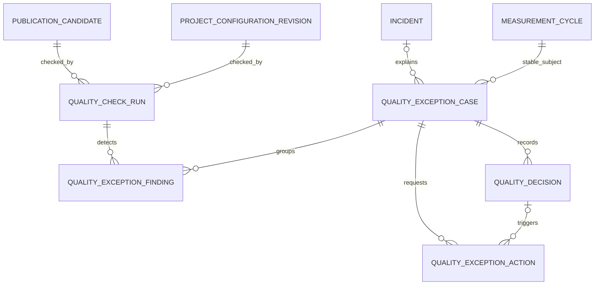

# レコラ管理画面 P0 品質・例外レビュー画面仕様書

- 文書ID: `RECORA-ADMIN-P0-QUALITY-EXCEPTION`
- 版: `1.1`
- 基準日: `2026-08-01`
- 状態: 正式採用
- 対象: レコラ管理画面P0
- 前提仕様:
  - `RECORA-ADMIN-P0-STATE-MODEL v2.1`
  - `RECORA-ADMIN-P0-READ-MODEL v2.0`
  - `RECORA-ADMIN-P0-AUTHZ-AUDIT v2.0`
  - `RECORA-ADMIN-P0-COMMON-LAYOUT v1.1`
  - `RECORA-ADMIN-P0-MEASUREMENT-MANAGEMENT v1.1`
- 優先順位: 本仕様は、過去の品質承認画面案、候補本文の直接編集案、品質作業グループ案、公開画面からの品質上書き案より優先する

---

## 0A. v1.1 最終横断統合更新

品質・例外レビューの画面責任・P0範囲はv1.0から変更しない。最終横断レビューにより、前提基盤を正式状態モデルv2.1、read model v2.0、権限・監査仕様v2.0へ更新する。

- 状態enumとcommand state effectは正式状態モデルv2.1を正とする。
- 表示code、件数、badge、facet、available command入力はread model v2.0を正とする。
- capability、scope、risk、command code、auditは権限・監査仕様v2.0を正とする。
- 正式routeと採用文書はcanonical manifest v1.0を正とする。

---

## 0. 正式決定

品質・例外レビューのP0を、次の原則で固定する。

1. 通常案件は人が承認しない。自動品質検査に通過したものは自動公開へ進む。
2. 人が扱うのは、未解決の品質例外と、自動再処理だけでは解消しなかった案件に限る。
3. 自動品質検査の正式実行単位として `quality_check_run` を追加する。
4. 「自動通過履歴」は `quality_decision = auto_pass` ではなく、`quality_check_run.status in (passed, passed_with_warnings)` を正式情報源とする。
5. `quality_exception_group` は作らない。共通原因は `incident`、個別影響は `quality_exception_case` とする。
6. 同じ問題を新しいcandidate Generationで再検査しても、未解決caseをGenerationごとに増殖させない。
7. caseの重複判定には、candidate IDなどの一時的な発生元ではなく、cycle・configuration revisionなどの安定した対象を使う。
8. exactな検出事実は `quality_exception_finding` に保存し、caseは対応単位として扱う。
9. 再測定・再解析・再計算・再生成は `quality_exception_action` とし、品質判断を表す `quality_decision` と分離する。
10. `quality_decision` から `retry_measurement` と `reanalyze` を外す。
11. 候補内容を変える「注記付き続行」「一部非表示」は、同じcandidateを更新せず新Generationを作る。
12. 人がcandidateを `ready` へ直接変更する操作は作らない。新Generationまたは再検査が自動品質ゲートを通過して初めて `ready` になる。
13. 「前回版維持」と「公開不可」は、そのcandidate・cycleに対する安全な終端判断であり、原則としてプロジェクト全体の公開停止ではない。
14. プロジェクト全体の公開停止は公開管理またはsystem safety controlで扱う。
15. Critical findingはincidentとの関連を必須とし、必要に応じてcandidate生成、automation、publicationをsystemが安全停止する。
16. caseのseverityは、未解決findingの最大severityからread modelで導出する。
17. findingを人が直接 `cleared` に変更できない。修正後の自動再検査だけがclearを確定する。
18. 一括承認、一括「注記付き続行」、一括公開可はP0で作らない。
19. 品質担当と公開担当を分離し、品質担当は公開版切り替えを実行しない。
20. 一覧、サイドバーバッジ、運用ホームの品質件数は、同じread model predicateを使用する。

---

## 1. 目的

品質・例外レビューは、レコラの自動運用で発生した個別例外について、次を判断・実行するための専門領域である。

```text
何が検出されたか
顧客表示へどのような影響があるか
現在どの安全表示が維持されているか
共通障害か、個別問題か
再処理で直すべきか
問題部分を除外して新Generationを作るべきか
前回版を維持すべきか
そのcandidateを公開不可とすべきか
```

品質・例外レビューは、通常案件の確認画面ではない。

次の状態を目標とする。

```text
通常
→ 自動検査
→ 自動通過
→ 自動公開

例外
→ 自動安全処理
→ 自動再処理可能なら自動再処理
→ 解消しない場合だけ人が判断
```

---

## 2. 責任範囲

### 2.1 品質・例外レビューで行うこと

- 設定例外の原因確認
- 測定例外の原因確認
- 解析例外の原因確認
- 指標例外の原因確認
- 顧客表示例外の確認
- 改善提案例外の確認
- 契約・公開整合例外の確認
- 担当者設定
- 再測定要求
- 再解析要求
- 指標再計算要求
- 候補再生成要求
- 自動品質検査の再実行要求
- 注記付き続行
- optional sectionの一部非表示
- 前回版維持
- candidate単位の公開不可
- 再処理後の自動再検査結果確認
- linked incidentの確認
- finding、action、decision、timelineの監査

### 2.2 品質・例外レビューで行わないこと

- 通常案件の全件承認
- 全件手動公開
- 品質例外の一括承認
- candidate本文・KPI・改善提案の直接編集
- publication versionの直接編集
- ready candidateの公開実行
- 過去公開版への復元
- project全体の公開停止・再開
- incidentの共通原因管理
- AIモデルの停止・復旧
- 契約内容の直接修正
- project設定の直接修正
- arbitrary promptの追加
- measurement attemptの手動採用差し替え
- quality ruleの編集・simulation

### 2.3 専門領域への委譲

| 問題 | 正式な操作領域 |
|---|---|
| 契約・entitlementの修正 | 顧客管理 |
| project設定入力の訂正 | 顧客管理 |
| batchの一時停止・安全停止 | 測定管理 |
| ready candidateの公開 | 公開管理 |
| 過去版復元・公開停止 | 公開管理 |
| 共通障害の緩和・復旧 | 障害・監査 |
| AIモデル制御 | 障害・監査 / 管理設定 |
| 品質rule versionの確認 | 管理設定、P0は読み取り中心 |

品質画面は、必要な専門ページへの深いリンクを返す。

---

## 3. 不変条件

1. caseは対応単位、findingは検出事実、actionは再処理、decisionは判断である。
2. case、finding、action、decision、check runは追記型履歴を壊さない。
3. resolved caseを再度openへ戻さない。同じ問題が再発した場合は新しいcaseを作る。
4. 新しいcandidate Generationによる再検査中も、旧公開版または準備中表示を維持する。
5. caseを解決してもfinding、decision、actionを削除しない。
6. actionの完了だけではcaseを解決しない。修正後の再検査または安全な終端decisionが必要である。
7. decisionを記録しただけではcaseを解決しない。decisionの副作用が適用済みであることを必要とする。
8. Criticalまたはtenant boundary問題を注記・一部非表示で続行できない。
9. core KPI、テナント識別、契約境界、必須表示をoptional sectionとして隠せない。
10. quality reviewer、publication operator、platform adminのいずれも品質ゲートを直接passへ書き換えられない。
11. case一覧のseverity、safe fallback、attention ownerを更新可能フィールドとして保存しない。
12. incident group headerは表示上のまとまりであり、更新対象ではない。
13. auto passはcaseを作らない。
14. nonblocking advisoryは、rule policyが許す場合に限りcaseを作らずpassへ含められる。
15. staleまたはunknownな詳細データでは、W2 decisionを開始しない。

---

## 4. Route・template・最低権限

| Route | Template | 最低capability |
|---|---|---|
| `/admin/quality-exceptions` | `T3 Work Queue` | `quality.read` |
| `/admin/quality-exceptions/[caseId]` | `T4 Entity Detail` | `quality.read` |

補助詳細はdrawerを使用する。

```text
finding detail
quality check run detail
measurement attempt evidence
source evidence
rule snapshot
system event
audit log detail
```

candidate previewはcase詳細内のinspector sectionとして扱い、独立した編集画面を作らない。

payload閲覧には追加で次を必要とする。

```text
quality.payload.read
```

---

## 5. 正式entity関係



### 5.1 粒度

| Entity | 1行の意味 |
|---|---|
| `quality_check_run` | 1つの不変subjectに対する1回の自動品質検査 |
| `quality_exception_case` | 1project・1安定対象・1rule・1論理sectionの未解決対応単位 |
| `quality_exception_finding` | 1回の検査または処理で検出された具体的事実 |
| `quality_exception_action` | 1caseに対して要求された再処理 |
| `quality_decision` | 1caseに対する人またはsystemの正式判断 |

### 5.2 P0へ追加する正式データ単位

```text
quality_check_run
```

既存の次は維持する。

```text
quality_exception_case
quality_exception_finding
quality_exception_action
quality_decision
```

---

## 6. `quality_check_run`

### 6.1 目的

次を正式に区別する。

```text
検査前
検査中
検査通過
非blocking警告付き通過
品質例外検出
検査エンジン失敗
対象の失効による取消
```

system eventだけを品質ゲートの現在状態として使用しない。

### 6.2 `check_scope`

```text
setup_configuration
publication_candidate
```

| 値 | subject |
|---|---|
| `setup_configuration` | `project_configuration_revision` |
| `publication_candidate` | `publication_candidate` |

delivery verificationの状態は `publication_delivery_verification` を正とし、重複するquality check runを作らない。delivery verificationから品質caseを作ることはできる。

### 6.3 `status`

```text
queued
running
passed
passed_with_warnings
exception
failed
cancelled
```

許可遷移:

```text
queued  -> running
queued  -> cancelled
running -> passed
running -> passed_with_warnings
running -> exception
running -> failed
running -> cancelled
```

terminal:

```text
passed
passed_with_warnings
exception
failed
cancelled
```

terminal runを再実行状態へ戻さず、新しいrun numberを作る。

### 6.4 主な属性

```text
quality_check_run_id
project_id
check_scope
subject_type
subject_id
run_number
status
quality_rule_version_id
input_digest
blocking_finding_count
advisory_finding_count
started_at
completed_at
failure_reason_code
correlation_id
created_at
```

件数は確定後のsnapshotとして保存してよいが、case件数や人の対応件数はread modelで導出する。

### 6.5 一意制約

```text
UNIQUE(subject_type, subject_id, run_number)
```

部分一意制約または同等の排他制御:

```text
1 subjectにつきqueued/running runは最大1件
```

### 6.6 candidateとの状態連携

```text
candidate generated
  ↓
quality check run queued
  ↓
candidate checking
```

run terminal時:

| run | candidate |
|---|---|
| `passed` | `ready` |
| `passed_with_warnings` | `ready` |
| `exception` | `held` |
| `failed` | `held` |
| `cancelled` | subjectが失効していれば `superseded`、それ以外は状態再検査 |

Critical tenant boundaryなど、候補を保持すること自体が危険な場合は `invalidated` とする。

人間actorはこの対応表を直接実行しない。quality engineまたはquality decision application system actorが行う。

### 6.7 setup configurationとの状態連携

`check_scope = setup_configuration` の場合は、candidateとは別に `project_configuration_revision` を制御する。

```text
configuration revision building
  ↓
quality check run queued
  ↓
configuration revision quality_checking
```

run terminal時:

| run | configuration revision | 後続 |
|---|---|---|
| `passed` | `ready` | 契約・entitlement・AIモデル・row versionを再検査して自動active化 |
| `passed_with_warnings` | `ready` | nonblocking条件を再確認して自動active化 |
| `exception` | `invalid` | setup caseを作り、初回は準備中、運用中更新は旧active revisionを維持 |
| `failed` | `quality_checking`を維持 | 自動retry後、解消しなければengine failure caseを作成 |
| `cancelled` | subjectが失効していれば `invalid` | 新revisionまたは終了処理へ引き継ぐ |

初回設定で`exception`になった場合、formal daily cycleを作成しない。運用中の設定更新で`exception`になった場合、旧active revision・既存cycle・current publication pointerを変更しない。

`failed`は「設定内容が不正」と確定した状態ではないため、retry budget消費前にrevisionを`invalid`へ変更しない。同じ不変revisionへの`rerun_quality_checks`で通過できる。生成物または入力を作り直す場合は、新しいconfiguration revisionとsetup runを作成する。

### 6.8 quality check engine failure

自動retry budgetを使い切ってもrunが`failed`の場合、失敗をrunだけに残して人の対応一覧から消してはならない。

systemは次のsynthetic findingを作る。

```text
rule_code = quality_engine_execution_failure
source_entity_type = quality_check_run
source_entity_id = failed run ID
blocking_scope = publication        # candidate scope
blocking_scope = candidate_generation # candidate保持自体が危険な場合
```

setup scopeでは `case_type = setup`、candidate scopeでは検査不能になった実際の責任範囲に応じて `customer_display` または `contract_publication` を使う。severityは失敗範囲、継続時間、顧客影響、incident有無からrule policyで決め、UIで推測しない。

複数projectに共通する失敗はincidentへ関連付ける。単一projectの一時失敗でもcandidateまたはconfiguration revisionを通過扱いにしない。

### 6.9 自動通過

`passed_with_warnings` は、すべてのfindingが次を満たす場合だけ許可する。

```text
blocking_scope = none
rule policyが自動advisoryを許可
customer-facing safetyを損なわない
case creation不要
```

Critical・High findingをwarning扱いにできない。

---

## 7. Case分類と安定対象

### 7.1 `case_type`

```text
setup
measurement
analysis
metric
customer_display
recommendation
contract_publication
```

### 7.2 stable subject

caseは一時的なcandidate IDではなく、問題が属する安定対象を保持する。

```text
quality_exception_case.stable_subject_type
quality_exception_case.stable_subject_id
```

標準mapping:

| case type / source | stable subject |
|---|---|
| setup | `project_configuration_revision` |
| measurement | `measurement_cycle` |
| analysis | `measurement_cycle` |
| metric | `measurement_cycle` |
| candidate customer display | `measurement_cycle` |
| candidate recommendation | `measurement_cycle` |
| candidate contract/publication | `measurement_cycle` |
| delivery verification | `publication_operation` |
| contract固有 | `contract_version` |
| entitlement固有 | `project_entitlement` |

exactなcandidate、revision、attempt、delivery verificationはfindingのsourceへ保存する。

### 7.3 deduplication key

未解決caseのkey:

```text
project_id
case_type
stable_subject_type
stable_subject_id
rule_code
normalized_section_key
```

```text
UNIQUE(project_id, deduplication_key)
WHERE status <> 'resolved'
```

`normalized_section_key` がない場合は固定値 `__none__` を使う。

### 7.4 Generationをまたぐ継続

新Generationで同じrule・同じ論理sectionが再検出された場合:

```text
既存未解決caseを維持
新しいfindingを追加
旧findingをsuperseded
最新source contextをread modelで更新
```

Generationごとにcaseを増やさない。

resolved後に再発した場合は、新caseを作る。

---

## 8. Severity・blocking scope・policy

### 8.1 severity

```text
critical
high
medium
low
```

case severityは未解決findingの最大値から導出する。

### 8.2 blocking scope

```text
candidate_generation
publication
optional_section
none
```

| 値 | 意味 |
|---|---|
| `candidate_generation` | candidate生成自体を止める必要がある |
| `publication` | candidateは生成できるが公開不可 |
| `optional_section` | 指定optional sectionを除外した新Generationで続行可能 |
| `none` | customer safetyを損なわないadvisory |

### 8.3 標準対応

| Severity | 標準安全処理 | 人の許可可能な判断 |
|---|---|---|
| Critical | candidate停止・無効化、incident、必要なsystem block | 再処理、前回版維持、公開不可。注記・一部非表示不可 |
| High | candidate held、前回版または準備中維持 | 再処理、前回版維持、公開不可。ruleが明示するoptional sectionだけ除外可 |
| Medium | candidate heldまたはsection単位remediation | 再処理、制御注記、optional section除外、前回版維持、公開不可 |
| Low | 自動remediationまたはadvisoryを優先 | rule policyに従い注記、section除外、対応不要解決 |

severityだけで公開可否を決めず、blocking scopeとrule policyを必ず併用する。

### 8.4 Criticalとincident

Critical findingには次を要求する。

```text
incident_id
または
同一transaction / 同一correlationでincident作成要求
```

incidentが作成できない場合、candidateをreadyにせずfail-closedとする。

---

## 9. `quality_exception_finding`

### 9.1 主な属性

```text
finding_id
quality_check_run_id nullable
quality_exception_case_id nullable
project_id
case_type
rule_code
rule_version_id
severity
blocking_scope
section_key nullable
source_entity_type
source_entity_id
status
message_code
evidence_snapshot
policy_snapshot
detected_at
cleared_at nullable
superseded_at nullable
```

`quality_exception_case_id` はnonblocking advisoryでcaseを作らない場合に限りNULLを許容する。

### 9.2 status

```text
open
cleared
accepted_with_note
superseded
```

原則:

- `open`は現在の問題。
- `cleared`は修正後の自動再検査で問題が再現しなかった場合だけsystemが設定する。
- `accepted_with_note`は許可されたdecisionが適用された場合だけ設定する。
- `superseded`はsource Generation・revision・operationが非currentになったことを示し、問題が直ったことを意味しない。
- terminal findingをopenへ戻さず、新しいfindingを作る。
- 管理者向け「finding status変更」APIは作らない。

### 9.3 evidence

evidence snapshotには、判断に必要な最小情報だけを保存する。

許可例:

- 期待値と観測値
- 欠損item数
- 対象AIモデル
- section key
- KPI差分
- redacted回答excerpt
- source URL・見出し・本文segment
- contract/entitlement mismatch code
- rule version・閾値

禁止:

- Authorization header
- cookie
- API key
- raw secret
- 顧客認証情報
- 全candidate payloadの複製
- 全AI回答の無制限複製

---

## 10. Case状態・担当・attention owner

### 10.1 status

```text
open
in_progress
reprocessing
resolved
```

許可遷移:

```text
open         -> in_progress
open         -> reprocessing
open         -> resolved

in_progress  -> open
in_progress  -> reprocessing
in_progress  -> resolved

reprocessing -> open
reprocessing -> in_progress
reprocessing -> resolved
```

`resolved`は終端。

### 10.2 状態変更規則

| 状況 | case status |
|---|---|
| 自動作成・人の判断待ち | `open` |
| 担当設定済み | `in_progress` |
| actionまたはdecision side effect実行中 | `reprocessing` |
| action失敗、担当あり | `in_progress` |
| action失敗、未担当 | `open` |
| 自動再検査通過 | `resolved` |
| 安全な終端decision適用完了 | `resolved` |
| 新Generationでも同問題継続 | 担当あり`in_progress`、未担当`open` |

### 10.3 担当設定

`AssignQualityCase` はW1。

- 自分を担当にする
- 同じquality scopeを持つ別管理者へ割り当てる
- 担当解除

担当設定時に対象管理者のactive状態、MFA、role assignment、effective scopeを再検査する。

担当ありのopen caseは `in_progress` へ移す。担当解除時、非終端actionがなければ `open` へ戻す。

### 10.4 attention owner

| 条件 | owner |
|---|---|
| `resolved` | `none` |
| case=`reprocessing` | `system` |
| latest action=`requested/running` | `system` |
| latest quality run=`queued/running`でcase再検査中 | `system` |
| action/decision application=`failed` | `human` |
| `open/in_progress` | `human` |

sidebar badgeは `attention_owner = human` かつ `status in (open, in_progress)` のcaseだけを数える。

---

## 11. `quality_exception_action`

### 11.1 action type

```text
retry_setup
retry_failed_measurements
reprocess_formal_cycle
reanalyze
recalculate_metrics
regenerate_candidate
rerun_quality_checks
```

`regenerate_candidate` は不変parameter snapshotでmodeを持てる。

```text
standard
exclude_sections
add_controlled_note
```

### 11.2 status

```text
requested
running
completed
failed
cancelled
```

### 11.3 原則

- actionは再処理要求であり、品質判断ではない。
- 1caseにつき非終端actionは最大1件。
- action targetとparameterは作成後に変更しない。
- action完了後、必要な自動品質検査を必ず実行する。
- action completedだけでcaseをresolvedにしない。
- action failed時、現在公開版・旧current revision・準備中表示を維持する。
- system auto-remediationも同じaction entityを使用できる。
- quality reviewerは内部orchestratorへ直接任意commandを送らず、許可されたaction typeだけを要求する。

### 11.4 action別の正式接続

| Action | 接続先 |
|---|---|
| `retry_setup` | 同じ入力snapshotを複製した新configuration revision＋新setup run。入力訂正は顧客管理の別command |
| `retry_failed_measurements` | 新しい`retry_failed_items` batch |
| `reprocess_formal_cycle` | 同じformal cycleの新attempt・新revision・新batch |
| `reanalyze` | 同じcycleの新building revision、解析再実行 |
| `recalculate_metrics` | 同じcycleの新building revision、指標再計算 |
| `regenerate_candidate` | 新Generation、旧candidateはsuperseded/held |
| `rerun_quality_checks` | 同じ不変subjectへの新quality check run |

### 11.5 Risk

| Action | Risk |
|---|---|
| retry setup with same input | W1 |
| failed itemだけ再測定 | W1 |
| transient quality check再実行 | W1 |
| reanalyze / recalculate / candidate regenerate | W1 |
| formal cycle全体の再処理 | W2 |

実際のrisk classは`available_commands`から返し、UIで固定推測しない。

---

## 12. `quality_decision`

### 12.1 decision type

```text
continue_with_note
exclude_optional_sections
maintain_previous_version
publication_blocked
resolved_no_action
```

次はdecisionではなくactionへ移す。

```text
retry_measurement
reanalyze
recalculate_metrics
rerun_quality_checks
```

`auto_pass`はquality check runへ移す。

### 12.2 application status

```text
recorded
applying
applied
failed
superseded
```

decisionは追記型で、過去decisionを更新・削除しない。

新しいdecisionで方針を変更する場合、旧decisionを`superseded`として関連付ける。既に外部副作用が完了したdecisionを消したことにはしない。

### 12.3 共通入力

```text
case_id
decision_type
reason
target_finding_ids
target_section_keys
controlled_note_template_code nullable
expected_case_row_version
expected_candidate_id
expected_candidate_generation
idempotency_key
```

customer-facing自由記述をcandidateへ直接挿入しない。管理者の`reason`は内部監査用である。

### 12.4 `continue_with_note`

許可条件:

- rule policyがnoteを許可
- Criticalではない
- tenant、契約境界、core KPI、必須表示ではない
- controlled note templateが存在
- 対象findingがcurrent
- 新Generationを作り再検査する

自由入力したreasonを顧客表示noteとして使用しない。

### 12.5 `exclude_optional_sections`

許可条件:

- 対象sectionがrule versionでoptional
- core KPI、測定範囲、ブランド識別、引用根拠、契約表示ではない
- selected sectionがcurrent candidateに存在
- 新Generationを作り再検査する

問題のある改善提案だけを除外する場合の標準decisionとする。

### 12.6 `maintain_previous_version`

効果:

```text
対象candidateをheldまたはinvalidated
新規公開を行わない
current pointerを変更しない
```

pointerがある場合:

```text
safe_fallback = previous_version_visible
```

pointerがない場合:

```text
safe_fallback = preparing
```

project全体の `publication_control_state` は変更しない。

### 12.7 `publication_blocked`

candidate・cycle単位の公開不可判断である。

- candidateを公開対象外にする
- current pointerは維持する
- 初回なら準備中を維持する
- project全体の公開停止とは区別する
- 将来cycleは通常どおり自動処理してよい
- Critical system anomalyでは別途system blockとincidentを作る

### 12.8 `resolved_no_action`

次の場合だけ許可する。

- sourceが既にsupersededでcustomer impactがない
- 運用中の設定更新revisionがinvalidで、旧active revisionを維持したままその変更要求を明示的に取り下げる
- ruleがnonblocking
- false positiveを示す検証根拠がある
- current candidateがunsafeでない
- Critical/Highではない

単なる「問題ないと思う」では使用できない。

### 12.9 decision適用とcase解決

| Decision | case解決タイミング |
|---|---|
| note / section除外 | 新Generationの再検査が通過した時 |
| previous version維持 | candidate hold/invalid化とfallback確認が同一処理で完了した時 |
| publication blocked | candidate公開不可化が完了した時 |
| resolved no action | preconditionとfinding dispositionが同一transactionで確定した時 |

---

## 13. Candidate・公開との安全境界

### 13.1 品質担当ができないこと

- candidate JSON更新
- KPI値更新
- sectionの直接削除
- candidate.statusをreadyへ変更
- publication version作成
- pointer切り替え
- publication control変更

### 13.2 新Generation

次はすべて新Generationを作る。

```text
controlled note追加
optional section除外
再解析結果の反映
指標再計算結果の反映
改善提案再生成
```

新Generationは自動check runを通過するまでreadyにならない。

### 13.3 公開可能条件の品質部分

severityだけで判定しない。

```text
latest quality check run in (passed, passed_with_warnings)
AND unresolved finding with blocking_scope in
  (candidate_generation, publication, optional_section) がない
AND candidateに関連する未解決caseで
  candidate公開を阻害するものがない
```

### 13.4 前回版維持と公開停止

| 状態 | pointer | 顧客表示 |
|---|---|---|
| quality exception、pointerあり | 維持 | 前回安全版 |
| quality exception、pointerなし | NULL | 準備中 |
| candidate-specific publication blocked | 維持 | 前回版または準備中 |
| project publication paused/blocked | 維持 | 公開停止表示 |
| customer access停止 | 維持 | 顧客アクセス不可 |

---

## 14. 一覧 `/admin/quality-exceptions`

### 14.1 Page header

```text
品質・例外レビュー
自動検査で解消できなかった案件だけを確認します
```

primary commandは置かない。

右側には次だけを許可する。

- 再読込
- rule version確認へのリンク
- 表示中filterのコピー

### 14.2 Local navigation

```text
未対応
対応中
再処理中
解決済み
自動通過履歴
```

facet countとrowsは同じsnapshotを使う。

### 14.3 Compact summary

case tabでは次をcompact summaryで表示する。

```text
人の対応が必要
Critical・High
前回版維持中
初回準備中
自動再処理中
```

権限外scopeの件数を含めない。

### 14.4 標準列

```text
重要度
種類・問題
顧客 / プロジェクト
発生元
安全な顧客表示
担当
経過時間
最新処理
関連障害
最終更新
```

1366pxでは次を折りたたむ。

- source ID
- latest action詳細
- incident title全文
- last activity補助時刻

重要度、問題、顧客・project、安全表示、担当、経過時間は維持する。

### 14.5 Row action

一覧から許可するquick actionは最大1つとする。

```text
自分が担当する
```

decision、再測定、再解析、候補再生成はcase詳細で実行する。

---

## 15. Tab predicate・filter・sort

### 15.1 排他的predicate

| Tab | Predicate |
|---|---|
| 未対応 | `status = open AND attention_owner = human` |
| 対応中 | `status = in_progress AND attention_owner = human` |
| 再処理中 | `status = reprocessing OR attention_owner = system` |
| 解決済み | `status = resolved` |
| 自動通過履歴 | caseではなくcheck run query |

品質サイドバーバッジ:

```text
未対応件数 + 対応中件数
```

再処理中は人の現在作業ではないためbadgeへ含めない。

### 15.2 Filter

```text
customer
project
case type
severity
assignee
unassigned only
safe fallback
incident linked / unlinked
incident ID
source stage
AI model
business date
opened date
age bucket
rule code
```

自動通過履歴では次へ置き換える。

```text
check scope
passed / passed with warnings
rule version
subject type
checked date
```

### 15.3 Sort

未対応・対応中のdefault:

```text
severity DESC
unassigned first
opened_at ASC
case_id ASC
```

再処理中:

```text
last_activity_at ASC
case_id ASC
```

解決済み:

```text
resolved_at DESC
case_id DESC
```

自動通過履歴:

```text
completed_at DESC
quality_check_run_id DESC
```

---

## 16. Incidentによる視覚グループ

同じ`incident_id`のcaseをgroup headerでまとめる。

group header:

```text
incident title
incident severity
system mitigation state
affected project count
visible case count
incident detail link
```

規則:

- case rowは個別に残す。
- assignee、decision、resolutionをincident単位で一括変更しない。
- scope外project数をgroup headerへ含めない。
- global incident countとscoped visible countを混在させない。
- incidentが解決済みでも、個別caseが未解決ならgroupを表示する。
- group更新APIを作らない。

障害でない共通変更は、次の関連IDをrow badgeとして表示できる。

```text
contract_change_id
configuration_change_id
batch_id
ai_model_id
```

---

## 17. Case詳細 `/admin/quality-exceptions/[caseId]`

### 17.1 Header

```text
case title
severity
case type
status
customer / project
stable case ID
opened at / last activity
safe fallback
assignee
incident
available commands
```

W2 decisionをprimary buttonへ固定しない。主要buttonは状態に応じて次のいずれか1件。

```text
担当する
再処理を選ぶ
判断を記録
```

### 17.2 Safety banner

最上部で、エラー説明より先に現在の顧客安全状態を表示する。

例:

```text
前回の安全な公開版を継続表示しています
```

```text
初回公開前のため顧客画面は準備中です
```

```text
顧客表示へ影響しない内部処理の例外です
```

```text
公開はsystem safety controlにより停止中です
```

unknown時は安全と断定しない。

### 17.3 Tabs

```text
概要
検出内容
顧客表示プレビュー
再処理・判断
履歴
```

candidateが存在しないcaseでは「顧客表示プレビュー」を表示しない。

### 17.4 概要

```text
人が判断すべき内容
顧客への影響
現在の安全処理
発生工程
stable subject
exact source
最新quality check
current candidate
current published version
linked incident
関連する契約・設定・batch・AI model
```

### 17.5 Context rail

```text
担当者
case age
severity
blocking scope
rule version
safe fallback
source ID
candidate Generation
current publication version
incident
```

---

## 18. 検出内容・source evidence

### 18.1 Finding list

各finding:

```text
severity
rule label / rule code
status
blocking scope
affected section
expected
observed
source
detected at
check run
```

finding detailはdrawer。

### 18.2 exact source

case typeに応じて次を表示する。

- setup run・configuration revision
- site analysis evidence
- measurement item・attempt
- cycle revision
- analysis・metric output digest
- publication candidate section
- delivery verification
- contract version・entitlement

### 18.3 Source snapshotの不変性

詳細画面はcurrent sourceだけでなく、過去findingが参照したsource snapshotを確認できる。

新Generationによって旧findingがsupersededになっても、当時のevidenceを失わない。

### 18.4 Redaction

- prompt全文・AI回答全文は、判断に必要なexcerptだけ返す。
- candidate payload全文は一覧へ返さない。
- customer sensitive、secret、token、cookieを返さない。
- evidence access自体をsensitive readとしてauditできる。

---

## 19. 顧客表示プレビュー

### 19.1 目的

品質担当が、実際に顧客へ表示される候補内容と安全な現行表示を比較できるようにする。

### 19.2 構成

```text
左: 現在公開中または準備中
右: 問題が検出されたcandidate
```

表示:

- KPI
- section構成
- 改善提案
- 引用・根拠
- note
- hidden予定section
- finding marker

### 19.3 比較状態

```text
added
changed
unchanged
excluded
blocked
unknown
```

差分はread modelで生成し、candidate本文へ埋め込まない。

### 19.4 禁止

- inline edit
- contenteditable
- drag and drop section削除
- KPI手入力
- note自由入力の顧客表示反映
- previewから直接publish

### 19.5 Payload権限なし

`quality.payload.read`がない場合:

- finding metadata
- section key
- severity
- safe fallback
- action/decision可否

は表示できる。

candidate本文、現在公開版本文、AI回答excerptは返さない。

---

## 20. 再処理UI

### 20.1 選択肢

case typeとstateからserverが返す。

```text
初期設定を同じ入力で再実行
失敗項目だけ再測定
正式cycleを再処理
再解析
指標再計算
candidate再生成
自動品質検査を再実行
```

### 20.2 Preview

実行前に表示する。

```text
対象
使用するsource revision
新しく作られるentity
旧結果・旧公開版が維持されること
推定対象item数
推定追加attempt数
推定原価 optional
再検査の有無
競合処理
理由
```

### 20.3 実行後

```text
audit_log: request accepted
quality_exception_action: requested
system_event: action started/completed/failed
case: reprocessing
```

完了後:

```text
quality check run queued
↓
passed
  -> case resolved
exception
  -> case in_progress/open
failed
  -> case in_progress/open
```

---

## 21. 品質判断UI

### 21.1 W2共通確認

すべてのquality decisionはW2。

```text
判断
対象finding
対象section
顧客への影響
現在の安全表示
適用後のcandidate状態
新Generationの有無
再検査の有無
内部理由
expected row version
idempotency
```

### 21.2 注記付き続行

controlled note templateを選択する。

UIに顧客表示用の自由記述欄を作らない。

内部理由欄は別で必須。

### 21.3 一部非表示

serverがoptionalと判定したsectionだけ選択可能。

選択不可sectionはdisabled表示ではなく候補へ返さない。詳細説明として「必須sectionは非表示にできません」と表示できる。

### 21.4 前回版維持

確認画面に次を表示する。

```text
現在公開版
問題candidate
今後の自動日次は継続
project全体の公開停止ではない
```

pointerがない場合は「前回版維持」ではなく、表示labelを「準備中を維持」に変える。同じdecision codeを使用してよい。

### 21.5 公開不可

確認画面に次を表示する。

```text
対象candidateだけを公開対象外にする
現在版は維持する
将来cycleは継続する
project全体の公開停止ではない
```

---

## 22. Case type別の標準処理

### 22.1 設定例外

安全状態:

```text
project setup_in_progress
formal daily未作成
顧客画面は準備中
```

操作:

- 同じ入力でsetup再実行
- 顧客管理の「入力訂正」へ移動
- linked incident確認

品質担当はsite URL、地域、言語、AIモデル、prompt tierを直接修正しない。

### 22.2 測定例外

操作:

- 失敗項目だけ再測定
- 必要時にformal cycle再処理
- measurement item / attempt evidence確認
- linked batch / AI model / incident確認

selected attemptを手動差し替えない。

### 22.3 解析例外

操作:

- reanalysis
- current measurement revision確認
- rule / parser / model incident確認

新解析結果は新measurement cycle revisionとして保存する。

### 22.4 指標例外

操作:

- metric recalculation
- denominator・eligible item・欠損の確認
- source revision確認

KPI値を手入力で修正しない。

### 22.5 顧客表示例外

操作:

- candidate preview
- controlled note
- optional section除外
- candidate再生成
- 前回版維持
- 公開不可

tenant boundary、別顧客データ、認証情報漏えいはCritical incidentへ接続する。

### 22.6 改善提案例外

推奨優先順:

```text
再生成
↓
問題の改善提案sectionだけ除外
↓
前回版維持
↓
公開不可
```

コアKPIが安全なら、改善提案だけを除外した新Generationを作れる。

### 22.7 契約・公開例外

品質画面では契約を修正しない。

```text
契約・entitlement詳細へ移動
candidateをheld
前回版または準備中を維持
契約修正後に自動再検査
```

契約不整合を注記付きで無視できない。

---

## 23. 自動通過履歴

### 23.1 情報源

```text
quality_check_run.status in
  (passed, passed_with_warnings)
```

caseまたはquality decisionを情報源にしない。

### 23.2 標準列

```text
完了時刻
顧客 / プロジェクト
check scope
subject
結果
advisory件数
rule version
duration
candidate Generation
次工程
```

### 23.3 詳細

run detail drawer:

```text
input digest
rule version
check duration
advisory findings
candidate / configuration revision
correlation ID
system event
```

auto pass履歴からdecision操作は行わない。

### 23.4 保持期間

P0では管理画面に表示する標準期間を30日とし、filterで最大90日まで取得可能とする。正式なデータ保持期間の設定UIはP1以降。

---

## 24. Read model契約

### 24.1 `GetQualityExceptionOverview`

```text
snapshot
scope
selected_tab
facet_counts
compact_summary
incident_groups
items
next_cursor
filters
freshness
```

### 24.2 `QualityCaseSummary`

```text
case_id
case_type
status
customer_id
customer_name
project_id
project_name
stable_subject_type
stable_subject_id
primary_rule_code
primary_rule_label
normalized_section_key
max_open_severity
max_blocking_scope
open_finding_count
attention_owner
human_action_required
assignee_admin_id
assignee_name
incident_id
incident_title
incident_case_count
latest_quality_check_run_id
latest_quality_check_status
latest_action_type
latest_action_status
latest_decision_type
latest_decision_status
safe_fallback_code
current_candidate_id
current_candidate_generation
current_candidate_status
current_publication_version_id
opened_at
resolved_at
last_activity_at
age_seconds
row_version
```

### 24.3 `QualityCheckRunSummary`

```text
quality_check_run_id
project_id
check_scope
subject_type
subject_id
run_number
status
quality_rule_version_id
blocking_finding_count
advisory_finding_count
duration_ms
candidate_id
candidate_generation
started_at
completed_at
failure_reason_code
```

### 24.4 Case detail response

```text
case_summary
current_safety_context
findings
source_context
current_quality_check
quality_check_history
candidate_comparison optional
actions
decisions
linked_incident
related_entities
recent_timeline
state_action_candidates
available_commands
freshness
snapshot
```

### 24.5 Snapshot

次は同一snapshotで返す。

- case header
- unresolved findings
- current candidate
- current publication pointer
- latest action/decision
- available commandsの前提state
- incident link
- safe fallback

large payload previewは遅延読込可能だが、親responseのsnapshot IDとexpected candidate generationを要求する。

---

## 25. 権限・scope・redaction

### 25.1 標準担当

`quality_reviewer`:

```text
quality.read
quality.payload.read
quality.assign
quality.reprocess
quality.decide
```

補助read:

```text
customer.summary.read
project.read
measurement.read
publication.read
incident.read.scoped
rule_version.read
```

品質担当へgenericな `publication.candidate.manage` を付与しない。

### 25.2 Scope

caseのscopeはcanonicalな`project_id`から解決する。

incident groupを表示しても、見えるcaseとaffected project数は管理者のquality scope内だけに限定する。

### 25.3 Payload

`quality.payload.read`で許可する内容:

- redacted candidate preview
- current published comparison
- finding evidence
- measurement/analysis excerpt
- section-level diff

許可しない内容:

- secret
- raw authentication data
- unrestricted AI回答全文export
- scope外customer情報
- candidate direct edit metadata

### 25.4 Quality reviewerとpublication operator

| 操作 | Quality reviewer | Publication operator |
|---|---:|---:|
| finding確認 | 可 | 読み取り可 |
| quality decision | 可 | 不可 |
| 再処理要求 | 可 | 不可 |
| candidate direct hold | 不可 | 状態・権限により可 |
| ready candidate公開 | 不可 | 可 |
| 過去版復元 | 不可 | 可 |
| project公開停止 | 不可 | 可 |

---

## 26. 監査・system event

### 26.1 Audit対象

- 担当設定・解除・変更
- 再処理要求
- quality decision
- sensitive evidence閲覧
- candidate preview全文相当の閲覧
- denied / failed command
- idempotent replay

### 26.2 System event

- quality check queued / started / passed / exception / failed
- automatic remediation requested / started / completed / failed
- new candidate Generation created
- candidate held / invalidated / superseded
- finding created / cleared / superseded
- case auto-resolved
- linked incident created
- safety control applied

### 26.3 非同期境界

```text
管理者が再処理を要求
→ audit_log: ACCEPTED_ASYNC

systemがactionを実行
→ system_event

systemが再検査
→ quality_check_run + system_event

caseが自動解決
→ system_event
```

同じ管理者操作を完了時にもう一度audit logへ保存しない。

### 26.4 before / after

audit summaryへ保存する。

```text
case ID
decision / action code
target finding IDs
target section keys
candidate ID / generation
safe fallback code
row version
reason
```

保存しない。

```text
candidate payload全文
AI回答全文
site本文全文
secret
controlled noteの展開済み全文
```

---

## 27. 同時実行・冪等性

### 27.1 必須制約

```text
未解決deduplication keyは1件
1 caseにつき非終端action最大1件
1 subjectにつき非終端quality check run最大1件
1 candidateにつき同時quality decision application最大1件
```

### 27.2 Lock

decisionまたはaction開始時に最低限次を再検査する。

```text
case row version
case status
latest action status
current candidate ID / generation
candidate status
stable subject current性
rule version policy
current pointer version
incident requirement
```

### 27.3 Idempotency

次はidempotency key必須。

- RequestQualityReprocessing
- RecordQualityDecision
- AssignQualityCase
- quality decision application system command
- quality check run creation

同じkeyの再送は新action・decision・runを増やさない。

### 27.4 State drift

画面表示後にcandidate Generationが変わった場合:

```text
QUALITY_CANDIDATE_CHANGED
```

caseがresolvedになった場合:

```text
QUALITY_CASE_ALREADY_RESOLVED
```

decisionは適用せず、最新状態を再取得する。

---

## 28. Error・freshness・安全表示

### 28.1 Command error code

```text
QUALITY_CASE_ALREADY_RESOLVED
QUALITY_CASE_STATE_CHANGED
QUALITY_ACTION_IN_PROGRESS
QUALITY_CHECK_IN_PROGRESS
QUALITY_CANDIDATE_CHANGED
QUALITY_SOURCE_SUPERSEDED
QUALITY_DECISION_NOT_ALLOWED
QUALITY_RULE_POLICY_DENIED
QUALITY_SECTION_NOT_OPTIONAL
QUALITY_FINDING_NOT_CURRENT
QUALITY_INCIDENT_REQUIRED
QUALITY_PREVIOUS_VERSION_UNAVAILABLE
QUALITY_SCOPE_DENIED
QUALITY_PAYLOAD_REDACTED
QUALITY_READ_MODEL_STALE
```

pointerなしの`maintain_previous_version`は通常、エラーにせず「準備中を維持」へ正規化する。`QUALITY_PREVIOUS_VERSION_UNAVAILABLE`は、明示的に過去version IDを前提とする操作だけで使用する。

### 28.2 Freshness

- list stale: 件数を0にしない。stale bannerを表示。
- case detail stale: W2 decisionを停止。
- preview stale: candidate generation mismatchとして再取得。
- incident section failure: case全体を0件にせずsection error。
- payload section failure: metadataと安全状態を維持し、本文だけ再試行可能。

### 28.3 Fail-closed

次が不明な場合、continue、section除外、publishable相当の判断を許可しない。

- current candidate
- rule policy
- section optionality
- tenant境界
- current pointer
- linked project
- effective scope

---

## 29. 具体レイアウト

### 29.1 `/admin/quality-exceptions` 1440×900

```text
56px context bar
page header
5tab local navigation
compact summary 1行
filter bar
incident group / case table
cursor pagination
```

初期viewportで次を確認できる。

- 5tab
- compact summary
- filter
- case上位5行以上

### 29.2 1366×768

- compact summaryを横1行に維持し、補助説明を省略可能。
- tableは主要列を維持。
- page全体横スクロール禁止。
- incident group headerは2行以内。
- case上位4行以上を確認可能。

### 29.3 Case detail

1440px:

```text
main 8 columns
context rail 4 columns
```

1366px:

```text
main 8
rail 4
```

wide candidate comparisonはmain内で上下配置へ切り替えてよい。

### 29.4 Dialog

W2 dialogは最大720px。finding選択やsection選択が多い場合も、dialog全体を無制限に高くせず内部scrollを使用する。

---

## 30. P0で作らないもの

- 全件手動品質承認
- 品質caseの一括承認
- incident group単位の一括decision
- candidateの直接編集
- KPIの手修正
- promptやAI回答の編集
- finding statusの手動変更
- attemptの手動採用差し替え
- arbitrary customer-facing note
- quality rule editor
- rule simulation UI
- quality thresholdの顧客別編集
- 二名承認
- bulk assignment
- bulk section exclusion
- bulk previous version maintenance
- quality SLA escalation workflow
- chat・comment thread
- 外部ticket同期
- case reopen
- 独立したquality work group
- additional validationから正式結果への昇格

---

## 31. 受け入れ条件

### 31.1 自動品質検査

1. candidate生成後にquality check runが作成される。
2. quality check前にcandidate本文が確定している。
3. 1subjectにqueued/running runを2件同時作成できない。
4. terminal runをrunningへ戻さず新runを作る。
5. passed runでcandidateがreadyになる。
6. passed_with_warningsでblocking findingが0件である。
7. Critical/High findingをpassed_with_warningsへ含められない。
8. exception runでcandidateがheldになる。
9. engine failureでcandidateがreadyにならない。
10. subject superseded時にqueued/running runをcancelできる。
11. auto pass履歴がquality decisionではなくcheck runを読む。
12. setup quality runとcandidate quality runを区別できる。
13. rule versionとinput digestを履歴から確認できる。
14. failed runが0件正常として表示されない。
15. check runのsystem eventと正式statusがcorrelation IDで結び付く。

### 31.2 Case・finding

16. Generationが変わっても同じstable subject・rule・sectionの未解決caseが増えない。
17. resolved後の再発は新caseになる。
18. candidate IDをdedup keyの安定対象として使用しない。
19. exact candidate IDはfinding sourceに残る。
20. case severityがopen findingの最大値と一致する。
21. findingを管理者が直接clearedにできない。
22. 再検査通過時だけfindingをclearedにできる。
23. source supersededと問題clearを区別できる。
24. case解決後もfindingを取得できる。
25. nonblocking advisoryはrule policyによりcaseなしで保存できる。
26. Critical findingにincidentまたはincident作成要求がある。
27. incident作成失敗時にcandidateがreadyにならない。
28. 1つのcaseへ複数runのfinding履歴を保持できる。
29. normalized section keyがない場合もdedupが安定する。
30. `quality_exception_group`が作成されない。

### 31.3 Case状態・担当

31. open caseへ担当設定するとin_progressになる。
32. 担当解除時、非終端actionがなければopenへ戻る。
33. reprocessing中はattention ownerがsystemになる。
34. action failed後、担当ありならin_progressへ戻る。
35. action failed後、未担当ならopenへ戻る。
36. resolved caseをopenへ戻せない。
37. resolved caseをsidebar badgeへ含めない。
38. reprocessing caseを人の作業badgeへ含めない。
39. 担当候補にscope外管理者を含めない。
40. inactiveまたはMFA未設定管理者へ割り当てられない。
41. assignee変更がaudit logへ1回保存される。
42. row version競合で割当が拒否される。

### 31.4 再処理

43. retry_failed_measurementsが新retry batchを作る。
44. reprocess_formal_cycleが2件目のformal cycleを作らない。
45. reanalysisが過去revisionを上書きしない。
46. metric recalculationがKPIを直接更新しない。
47. candidate regenerationが同じGenerationを更新しない。
48. retry quality checkが同じrunを再利用しない。
49. 1caseへ非終端actionを2件作成できない。
50. action completedだけでcaseをresolvedにしない。
51. action完了後に必要な自動再検査が起動する。
52. 再検査で同じ問題が残ればcaseがhuman ownerへ戻る。
53. 再検査通過時にcaseが自動resolvedになる。
54. action失敗時にcurrent pointerが変更されない。
55. action失敗時に旧current measurement revisionが維持される。
56. formal cycle全体再処理だけW2として表示される。
57. quality reviewerが任意batchを直接作成できない。
58. setup入力訂正は顧客管理の別commandとして扱われる。

### 31.5 Decision

59. retry measurementとreanalyzeがquality decision typeに含まれない。
60. auto passがquality decision typeに含まれない。
61. quality decisionが追記型である。
62. decision記録だけでcandidateがreadyにならない。
63. continue with noteがcontrolled templateを要求する。
64. internal reasonを顧客表示noteとして使用しない。
65. Critical findingへcontinue with noteを適用できない。
66. tenant boundaryへcontinue with noteを適用できない。
67. optionalでないsectionを除外できない。
68. core KPI sectionを除外できない。
69. section除外で新Generationが作られる。
70. note追加で新Generationが作られる。
71. 新Generationが再検査を通るまでreadyにならない。
72. maintain previous versionでpointerが変わらない。
73. pointerなしでは準備中維持として表示される。
74. publication blockedがproject publication controlを変更しない。
75. publication blocked後も将来の日次cycleを作成できる。
76. resolved no actionをCritical/Highへ適用できない。
77. source current性が不明な状態でresolved no actionを実行できない。
78. decision application失敗時にcaseがresolvedにならない。
79. decisionのtarget findingとsectionがauditで追跡できる。
80. publication operatorがquality decisionを作成できない。
81. platform adminでも品質passを直接書き込めない。

### 31.6 Candidate・公開安全性

82. quality reviewerがcandidate payloadを直接更新できない。
83. quality reviewerがcandidate statusをreadyへ変更できない。
84. quality reviewerがpublication versionを作成できない。
85. quality reviewerがpointerを切り替えられない。
86. quality reviewerがproject公開停止を実行できない。
87. exception中、pointerありならprevious version visibleを表示する。
88. pointerなしならpreparingを表示する。
89. project publication stoppedとcandidate-specific blockを区別する。
90. unresolved blocking findingがあるcandidateをpublishableにしない。
91. severity Lowでもblocking scopeがpublicationならpublishableにしない。
92. severity Highでもsource superseded・case resolved済みなら旧candidateをcurrentと誤判定しない。
93. candidate Generation mismatchでdecisionを拒否する。
94. configuration revision mismatch candidateを再公開可能と表示しない。

### 31.7 一覧・詳細

95. 5tabのpredicateが排他的である。
96. 自動通過履歴がcase一覧queryを使用しない。
97. quality badgeが未対応＋対応中と一致する。
98. incident groupがcaseを一括更新しない。
99. incident group countへscope外caseを含めない。
100. 未対応default sortがseverity・未割当・古い順になる。
101. 一覧へcandidate payload全文を含めない。
102. case detailでstable subjectとexact sourceを区別できる。
103. candidateがないcaseでpreview tabを表示しない。
104. previewでcurrent versionとcandidateを比較できる。
105. previewから直接編集・公開できない。
106. payload権限がない場合にmetadataだけ返す。
107. stale detailでW2 decisionを開始できない。
108. payload section failure時もsafe fallbackを表示できる。
109. 1366×768で主要4行以上を確認できる。
110. page全体の横スクロールが発生しない。

### 31.8 権限・監査・同時実行

111. quality reviewerにgeneric publication candidate manageを付与しない。
112. quality reprocessing commandがwrite時にscopeを再検査する。
113. sensitive evidence閲覧がauditされる。
114. decision auditへpayload全文を保存しない。
115. async reprocessing requestとsystem completionがaudit/system eventへ分離される。
116. 同じidempotency keyでactionが重複しない。
117. 同じidempotency keyでdecisionが重複しない。
118. case resolved後の古い画面からのdecisionが拒否される。
119. candidate変更後の古いpreviewからのdecisionが拒否される。
120. rule policy変更後の古いavailable commandが再検査で拒否される。
121. scope外caseの存在・件数を返さない。
122. secret、token、cookieがevidence・audit・errorへ出ない。
123. Critical findingとincident作成が同じcorrelationで追跡できる。
124. system auto-remediationがadmin actorとして記録されない。
125. case、finding、action、decision、check runの履歴を同一timelineで安定順序表示できる。

### 31.9 Setup quality・engine failure

126. setup quality run開始時にconfiguration revisionがquality_checkingになる。
127. setup quality通過時だけrevisionがreadyになり、activation条件を再検査する。
128. 初回setup quality exceptionでrevisionがinvalidになり、formal daily cycleが作成されない。
129. 運用中設定更新のquality exceptionで旧active revisionとcurrent publication pointerが維持される。
130. retry budgetを使い切ったquality engine failureがsynthetic finding・caseとして人の対応またはincidentへ接続される。
131. quality engine failureだけでcandidateまたはconfiguration revisionが通過扱いにならない。
132. failed setup quality runを同じ不変revisionへの新runで再検査できる。
133. retry setupがinvalid revisionを戻さず、新configuration revisionと新setup runを作る。
134. active旧revisionを維持した運用中設定更新の取り下げだけを、根拠付きresolved no actionとして処理できる。
135. 初回設定失敗をresolved no actionで準備完了扱いにできない。

---

## 32. 実装順

1. `quality_check_run` table・enum・制約
2. stable subject・deduplication key
3. finding severity・blocking scope・policy snapshot
4. action type・非終端一意制約
5. decision type・application status
6. quality engine run writer
7. finding / case dedup service
8. automatic safety action
9. quality action orchestrator
10. quality decision application service
11. candidate status連携
12. linked incident enforcement
13. `QualityCheckRunSummary`
14. `QualityCaseSummary`
15. `GetQualityExceptionOverview`
16. case detail query composer
17. scope・payload redaction
18. audit/system event
19. list UI
20. case detail UI
21. candidate comparison inspector
22. W1/W2共通command UI
23. 受け入れ条件1〜135

UI実装前に、少なくとも1〜18と状態・権限テストを完成させる。

---

## 33. 最終統合後の位置づけ

本仕様v1.1は、canonical manifest v1.0に含まれる品質・例外レビューの正式画面仕様である。

新しい画面仕様を追加する段階は完了した。実装時は、正式状態モデルv2.1、read model v2.0、権限・監査仕様v2.0、共通レイアウトv1.1から生成したAPI contractと`available_commands`だけを使用する。
