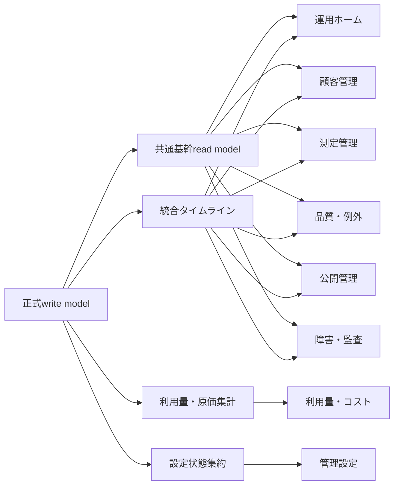

# レコラ管理画面 P0 管理画面用read model仕様書

- 文書ID: `RECORA-ADMIN-P0-READ-MODEL`
- 版: `2.0`
- 基準日: `2026-08-01`
- 状態: 正式採用
- 前提仕様: `RECORA-ADMIN-P0-STATE-MODEL v2.1`
- 対象: レコラ管理画面P0
- 優先順位: 本仕様はページごとの仮集計、仮ステータス、個別API内の独自判定より優先する

---


## 0. v2.0 最終横断統合変更点

全画面の一覧値、badge、available command、route queryを横断照合し、次を最終統一する。

1. 顧客一覧の導入表示codeを `customer_onboarding_state_code` の9値へ一本化する。
2. 顧客アクセス停止、契約停止、初回公開準備は別field・secondary flagで表し、導入codeへ重複保存しない。
3. 測定管理badgeの稼働中batch predicateを `queued / running / pausing / paused / stopping` に統一する。
4. 管理設定badgeを、`SettingsHealthSummary`のsettings-ownedかつCritical/High相当の人対応issueへ統一する。
5. incident detailの管理者commandを `RequestRecoveryBatch`、system作成処理を `CreateRecoveryBatch` として分離する。
6. `/admin/customers/[customerId]/projects/new` のreference queryとroute registryを正式セットへ含める。
7. page、tab count、sidebar badge、CSV、facetは同じsnapshot・scope predicateを使用する原則を再確認する。

v1.9までに確定したread model、freshness、scope、redaction、partial failureの原則は変更しない。

---

## 0. v1.9変更点

管理設定画面と状態モデルv2.0に合わせ、管理者、通知、日次設定、AIモデル、plan、scheduled change、rule/pricingのread contractを次のように修正する。

1. `AdminDirectorySummary`を追加し、admin status、MFA projection、role、scope、last login、available commandsを統一する。
2. `AdminRoleSummary`を追加し、固定role定義、assignment数、MFA注意数、scope構成を返す。
3. `NotificationDestinationSummary`を追加し、検証状態、category coverage、最終test、配送healthを返す。
4. `DailyAutomationSettingsSummary`を追加し、stable control、active/draft version、scheduled change、次回runを同一responseで返す。
5. AIモデル設定は既存`AiModelOperationalSummary`へ影響project・assignment・planned command availabilityを追加して再利用する。
6. `PlanVersionSummary`を追加し、plan codeごとのactive・draft・scheduled versionと差分を返す。
7. `ScheduledConfigurationChangeSummary`を追加し、適用予定・適用中・失敗・取消を区別する。
8. `RuleVersionApplicationSummary`を追加し、品質・公開ruleのactive version、互換性、参照件数を返す。
9. `PricingApplicationSummary`を追加し、rate coverage、missing・ambiguous、redactionを返す。
10. `SettingsHealthSummary`のissue code、attention owner、badge predicateを正式化する。
11. 管理設定トップと各専門pageが同じsettings snapshot・source freshnessを使用する。
12. 権限外設定card・件数・名称を返さず、0値で存在を示さない。
13. 意図した日次停止・AIモデル制限・通知停止を異常ではなくrestrictedとして返す。
14. incident-owned・usage-cost-owned問題をsettings badgeへ二重計上しない。
15. 変更履歴を`TimelineEntry`から構成し、専用履歴viewを重複作成しない。
16. stale・unknown・partial failure時にW2/W3 commandをfail-closedにする。

v1.8で確定した利用量・コストread modelの原則は変更しない。

---

## 0. v1.8変更点

利用量・コスト画面の最終化に伴い、usage fact、current cost result、原価coverage、CSV snapshotのread modelを次のように修正する。

1. `UsageCostFact`を1current usage component・current cost resultにつき1行へ固定する。
2. usage correction chainとcost calculation versionをread modelで解決し、過去versionを通常集計へ混ぜない。
3. `UsageCostDailySummary`に加え、顧客・project、AIモデル、cycle・batch、coverage、exportの共通summaryを追加する。
4. 論理測定項目、実行試行、追加試行、現在採用成功をusage component数と分離してdistinct集計する。
5. 正式日次・追加検証・その他自動処理、通常・retry・incident compensationを別軸として返す。
6. `business_date / cost_incurred_date`を正式date axisとし、同一response内で混在させない。
7. 原価集計を`uncomputed / estimated / provisional / final`へ固定し、未算定amountを0へ変換しない。
8. overall cost labelの不確実性を`uncomputed > estimated > provisional > final`で導出する。
9. AIモデルshareを「算定済み原価内シェア」とし、未算定を0円として分母へ含めない。
10. 重大未算定のbadgeをraw record数ではなく影響distinct project数から導出する。
11. 共通incidentへownerを寄せた原価問題を利用量・コストbadgeへ二重計上しない。
12. usage ingestion、cost calculation、materialized summaryのfreshnessを別々に返す。
13. overview、各tab、facet、badge、CSVで同じeffective scope、filter、read snapshot、source watermarkを使用する。
14. `UsageCostExportSummary`を追加し、request時点のscope・filter・date axis・snapshotを表示できるようにする。
15. pricing detailは`pricing.read`を持ち、対象scopeで実際に適用されたdefinitionだけを返す。
16. CSVやdrawerへprompt、AI回答、provider raw payload、secretを返さない。

v1.7で確定したincident、system status、system event、audit read modelの原則は変更しない。

---

## 0. v1.7変更点

障害・監査画面仕様と状態モデルv1.8に合わせ、incident、component health、recovery、system event、auditのread contractを次のとおり修正する。

1. `IncidentSummary`をfingerprint由来のstable incident、確認済み影響scope、safety control、recovery stage、clearanceへ対応させる。
2. `IncidentScopeSummary`、`IncidentRecoveryPlanSummary`、`IncidentRecoveryStepSummary`を追加する。
3. `SystemComponentHealthSummary`と`AiModelOperationalSummary`を追加し、healthとcontrolを別fieldで返す。
4. component healthから`paused`を削除し、stale観測は`unknown`へ変換する。
5. `SystemEventSummary`を追加し、event class、event level、occurred/recorded、correlationを固定する。
6. system eventの一覧上の短時間集約をpage queryで行い、永続的なevent groupを作らない。
7. `AuditLogSummary`を追加し、risk、result、outcome、actor、target、scope、correlationを固定する。
8. incident一覧の未対応・対応中・監視中・解決済みpredicateを固定する。
9. incident sidebar badgeを、effective scope適用後の未解決Critical・High incident数へ固定する。
10. global potential scopeを確認済み顧客・project件数へ含めない。
11. scoped incident readでは許可scope内の件数だけを返し、全体impact count、fingerprint、global recovery detailをredactする。
12. system statusのoverall stateで、health異常、意図したcontrol制限、unknownを分離する。
13. incident detailへactions、recovery plan・step、batch、clearance、linked quality case、統合timelineを追加する。
14. system event・audit detailをdrawer responseとし、親snapshot、redaction、sensitive read audit descriptorを追加する。
15. audit source・incident scope・component sourceのfailureを0件または正常へ変換しない。
16. incident、system status、events、audit logsのlist・facet・summaryを同じsnapshotへ固定する。

v1.6で確定したpublication read modelの原則は変更しない。

---

## 0. v1.6変更点

公開管理画面仕様と状態モデルv1.7に合わせ、公開read modelを次のとおり修正する。

1. `PublicationGenerationRunSummary` を追加し、candidate生成開始前・queued・running・failedを区別する。
2. `PublicationCandidateSummary`、`PublicationVersionSummary`、`PublicationOperationSummary`、delivery verification summaryを正式化する。
3. `PublicationProjectSummary`へhold origin、version revocation、pointer version、content eligibility、auto publish eligibilityを追加する。
4. 公開可能条件からproject automation controlを除外する。
5. current pointerとcustomer visibilityを分離し、revoked version、customer access、contract、entitlement、publication controlを実効表示式へ追加する。
6. `GetPublicationOverview`へcompact summary、automatic processing、5view facet、project row、history rowを追加する。
7. 公開管理の5viewは相互排他ではなく、現在公開中と保留中などの重複を許可するview flag方式へ変更する。
8. generation・operation・verificationのsystem processingをhuman attentionへ含めず、SLA超過時だけpublication-specific work itemへ変換する。
9. quality-owned hold、incident-owned block、publication-owned failureのownerとbadge重複防止を固定する。
10. candidate・version inspector、operation・verification drawer、publication historyのsnapshot・redactionを固定する。
11. sensitive preview、diff、delivery evidenceのread audit metadataを追加する。
12. stale・section failure時にpublish/restore/stop/resume commandをfail-closedにする。

---

## 0. v1.5変更点

品質・例外レビュー画面仕様と状態モデルv1.6に合わせ、品質read modelを次のとおり修正する。

1. `QualityCheckRunSummary` を追加し、自動通過、warning付き通過、品質例外、check engine failureを区別する。
2. 自動通過履歴を `quality_decision.auto_pass` ではなく `quality_check_run` から生成する。
3. `QualityCaseSummary`へstable subject、primary rule、blocking scope、latest check run、decision application statusを追加する。
4. candidate Generationをまたぐ同一未解決caseを1行に維持し、exact sourceはfinding detailで返す。
5. 未対応・対応中・再処理中・解決済みのpredicateと、quality sidebar badgeを同一式へ固定する。
6. quality case detailへcandidate比較、finding history、check run history、action、decision、linked incidentを追加する。
7. incident group countをeffective quality scope適用後に計算し、groupを更新可能なentityとして返さない。
8. quality payload権限がない場合のsection redactionと、sensitive evidence read audit metadataを追加する。
9. `quality_check_run`、stable dedup、finding severity・blocking scopeに必要なindexを追加する。
10. list、detail、facet、available commandsの同一snapshot条件を固定する。

---

## 0. v1.4変更点

測定管理画面仕様と状態モデルv1.5に合わせ、測定read modelを次のとおり修正する。

1. `measurement_cycle.current_revision_id` と `measurement_cycle_revision_item` を、現在採用中の測定結果の正式情報源に変更する。
2. `measurement_item.selected_attempt_id` を用いた採用成功集計を廃止する。
3. `MeasurementCycleRevisionSummary`、`MeasurementItemSummary`、`MeasurementAttemptSummary`、`MeasurementBatchAssignmentSummary` を追加する。
4. batch type、pausing/stopping、assignment retry_wait、parent batch、trigger sourceを一覧・詳細contractへ追加する。
5. 完了済みcycleの再処理中に旧current revisionを維持する表示を追加する。
6. 本日の測定、実行中、実行履歴のresponse、facet、sort、同一snapshot条件を固定する。
7. 一括正式測定previewへselection token、limit、expected version、create/reprocess/blocked内訳を追加する。
8. item・attempt・revision・batch assignmentの詳細redactionと遅延結果表示を固定する。

---

## 0. v1.3変更点

顧客管理画面仕様と状態モデルv1.4に合わせ、次を正式化する。

1. 顧客一覧へ導入・運用状態を導出する `customer_onboarding_state_code` とオンボーディングchecklistを追加する。
2. projectのprimary表示優先順位へ契約終了、契約停止、active契約なし、entitlement非activeを追加する。
3. 運用中の設定revision更新を `configuration_update_state` と `building_configuration` で表示する。
4. project detail用の `GetProjectConfigurationRevisionReference` を追加し、W2設定更新dialogへ正式な許可値と影響を返す。
5. 初期設定中の入力訂正と、運用中の設定更新を別のavailable commandとして返す。
6. superseded configurationを参照する未公開candidateを公開可能として表示しない。
7. 顧客・project・契約・問い合わせの主要sectionを同じread snapshotで返す原則を維持する。

---

## 0.1 v1.2で確定済みの変更点

状態モデルv1.3と顧客管理画面仕様に合わせ、次を正式に追加・修正する。

1. `CustomerAdminSummary` に顧客アクセス制御、customer user、主連絡先、契約・project準備状況を追加する。
2. `ProjectCurrentOperationalSummary` にcustomer access、project作成元、setup current stage、publication content availabilityを追加する。
3. `is_customer_visible` を、customer access、project lifecycle、publication control、current pointerの積として再定義する。
4. customer access停止中を初回公開準備中と誤表示しないprimary表示規則を追加する。
5. 顧客詳細へアクセス状態、customer user、契約・entitlement、問い合わせ、timelineのexact contractを追加する。
6. project詳細へ初期設定8工程、サイト分析根拠、カテゴリ、競合候補12件、ペルソナ・トピック、50/100/200 prompt setのcontractを追加する。
7. contract summaryへplan version、project枠、利用中枠、scheduled change、entitlement healthを追加する。
8. inquiry summaryへ送信者要約、本文excerpt、通知状態、同一customer内project関連を追加する。
9. 顧客管理のlist・detail・form参照データ・available commandsを同じscopeとsnapshotで返す規則を追加する。
10. 権限に応じてcustomer sensitive、measurement payload、internal noteをsection単位でredactする。

v1.1で追加した日次target run、SLA判定、運用ホームsnapshotの規則は変更しない。
---

## 1. 目的

管理画面の8領域が、同じ正式状態から同じ結果を表示するためのread modelを固定する。

対象は次のとおり。

1. 運用ホーム
2. 顧客管理
3. 測定管理
4. 品質・例外レビュー
5. 公開管理
6. 障害・監査
7. 利用量・コスト
8. 管理設定

本仕様で解決する問題は次のとおり。

- 「要対応」などの表示状態を複数テーブルへ保存しない
- 運用ホームと専門ページで件数が食い違わない
- サイドバーバッジと一覧件数が食い違わない
- 同じ障害に属する複数ケースを、別の永続グループなしでまとめる
- 現在公開版と顧客が実際に閲覧できる版を区別する
- 操作履歴を `audit_log` と別テーブルへ二重保存しない
- 未算定原価を0円として表示しない
- 権限外の顧客・プロジェクト件数を集計値からも漏らさない

---

## 2. 正式決定

### 2.1 read modelは書き込み元ではない

read modelは正式状態から導出される読み取り専用データである。

許可するもの:

- SQL viewへの導出
- materialized viewまたは投影テーブルへの導出
- サーバー側query composerによる合成
- 表示ラベル、注意度、件数、タブ分類のmaterialize

禁止するもの:

- 管理画面からread modelを直接更新すること
- read modelの表示状態をwrite modelへ逆書きすること
- コマンドがread modelだけを根拠に正式状態を変更すること
- ページ内で独自に正式状態を再判定すること

コマンド実行時は必ずwrite modelを再取得し、状態・権限・一意制約を再検査する。

### 2.2 表示用状態のmaterializeは可能

`display_state_code`、`attention_owner`、`safe_fallback_code`などはread model内に保持してよい。

ただし、これらは次の条件を満たす必要がある。

- 正式状態から再生成可能
- 管理者が直接編集できない
- write modelの真実を上書きしない
- 再構築時に同じ入力から同じ結果になる

### 2.3 物理実装はハイブリッドとする

P0では次を採用する。

| 種類 | 実装 | 理由 |
|---|---|---|
| 状態・例外・公開・障害 | 通常SQL viewまたは同等の同期query | 運用画面で古い状態を出さないため |
| 詳細ページ | 共通viewを基礎にしたサーバー側合成query | 不要な巨大viewを増やさないため |
| 日別原価・長期間集計 | materialized viewまたは集計投影 | 集計負荷を分離するため |
| CSV | 画面と同じread model・filter contract | 画面と出力の数値差を防ぐため |

全ページを1つの巨大viewへまとめない。共通基幹viewを再利用し、ページ固有部分だけを合成する。

### 2.4 read modelはブラウザへ直接公開しない

推奨物理schemaは `admin_read` とする。

- ブラウザからの直接参照は禁止
- 管理画面サーバー層を経由する
- 管理者の権限・管理対象範囲を適用してから集計する
- scope適用前の総件数を返さない
- payload、監査内容、内部メモは必要権限がある場合だけ返す

---

## 3. 全体構造



### 3.1 共通基幹read model

P0で正式に持つ共通基幹read modelは次の41個に限定する。

| 論理名 | 推奨物理名 | 粒度 |
|---|---|---|
| ProjectCurrentOperationalSummary | `admin_read.v_project_current_operational_summary` | 1プロジェクト1行 |
| CustomerAdminSummary | `admin_read.v_customer_admin_summary` | 1顧客1行 |
| ContractAdminSummary | `admin_read.v_contract_admin_summary` | 1契約1行 |
| InquiryAdminSummary | `admin_read.v_inquiry_admin_summary` | 1問い合わせ1行 |
| DailyTargetRunSummary | `admin_read.v_daily_target_run_summary` | 1業務日1行 |
| DailyMeasurementStatus | `admin_read.v_daily_measurement_status` | 1プロジェクト・1業務日1行 |
| MeasurementCycleSummary | `admin_read.v_measurement_cycle_summary` | 1サイクル1行 |
| MeasurementBatchSummary | `admin_read.v_measurement_batch_summary` | 1バッチ1行 |
| MeasurementCycleRevisionSummary | `admin_read.v_measurement_cycle_revision_summary` | 1cycle revision 1行 |
| MeasurementItemSummary | `admin_read.v_measurement_item_summary` | 1論理測定項目1行 |
| MeasurementAttemptSummary | `admin_read.v_measurement_attempt_summary` | 1attempt 1行 |
| MeasurementBatchAssignmentSummary | `admin_read.v_measurement_batch_assignment_summary` | 1batch assignment 1行 |
| QualityCheckRunSummary | `admin_read.v_quality_check_run_summary` | 1品質検査run 1行 |
| QualityCaseSummary | `admin_read.v_quality_case_summary` | 1例外ケース1行 |
| PublicationProjectSummary | `admin_read.v_publication_project_summary` | 1プロジェクト1行 |
| IncidentSummary | `admin_read.v_incident_summary` | 1障害1行 |
| IncidentScopeSummary | `admin_read.v_incident_scope_summary` | 1incident scope 1行 |
| IncidentRecoveryPlanSummary | `admin_read.v_incident_recovery_plan_summary` | 1recovery plan 1行 |
| IncidentRecoveryStepSummary | `admin_read.v_incident_recovery_step_summary` | 1recovery step attempt 1行 |
| SystemComponentHealthSummary | `admin_read.v_system_component_health_summary` | 1component instance 1行 |
| AiModelOperationalSummary | `admin_read.v_ai_model_operational_summary` | 1AIモデル1行 |
| SystemEventSummary | `admin_read.v_system_event_summary` | 1system event 1行 |
| AuditLogSummary | `admin_read.v_audit_log_summary` | 1audit log 1行 |
| AttentionWorkItem | `admin_read.v_attention_work_item` | 1対応単位1行 |
| SidebarBadge | `admin_read.v_sidebar_badge` | 1領域1行 |
| TimelineEntry | `admin_read.v_timeline_entry` | 1履歴項目1行 |
| UsageCostFact | `admin_read.v_usage_cost_fact` | 1current usage component・current cost result 1行 |
| UsageCostDailySummary | `admin_read.mv_usage_cost_daily_summary` | 日・主要集計軸1行 |
| UsageCostEntitySummary | `admin_read.v_usage_cost_entity_summary` | 顧客またはproject 1行 |
| UsageCostAiModelSummary | `admin_read.v_usage_cost_ai_model_summary` | provider・AIモデル・tier 1行 |
| UsageCostCycleBatchSummary | `admin_read.v_usage_cost_cycle_batch_summary` | cycleまたはbatch 1行 |
| UsageCostCoverageSummary | `admin_read.v_usage_cost_coverage_summary` | 未算定理由・scope・日付単位1行 |
| UsageCostExportSummary | `admin_read.v_usage_cost_export_summary` | export job 1行 |

| AdminDirectorySummary | `admin_read.v_admin_directory_summary` | 1管理者1行 |
| AdminRoleSummary | `admin_read.v_admin_role_summary` | 1標準role 1行 |
| NotificationDestinationSummary | `admin_read.v_notification_destination_summary` | 1通知先1行 |
| DailyAutomationSettingsSummary | `admin_read.v_daily_automation_settings_summary` | singleton 1行 |
| PlanVersionSummary | `admin_read.v_plan_version_summary` | 1plan code・version 1行 |
| ScheduledConfigurationChangeSummary | `admin_read.v_scheduled_configuration_change_summary` | 1適用予定変更1行 |
| RuleVersionApplicationSummary | `admin_read.v_rule_version_application_summary` | rule種別1行 |
| PricingApplicationSummary | `admin_read.v_pricing_application_summary` | pricing match key 1行 |


| SettingsHealthSummary | `admin_read.v_settings_health_summary` | 1設定検査項目1行 |

ページごとに同種のviewを増殖させない。ページ詳細はこれらと正式テーブルをIDで結合して返す。

---

## 4. 共通の表示型

### 4.1 `attention_level`

```text
critical
high
medium
low
none
```

注意度は正式な障害重大度、品質finding重大度、処理失敗種別、顧客影響から導出する。

### 4.2 `attention_owner`

```text
human
system
none
```

| 値 | 意味 |
|---|---|
| `human` | 現時点で管理者の判断または操作が必要 |
| `system` | 再処理、検証、公開切り替えなどシステム処理待ち |
| `none` | 対応不要または解決済み |

未解決件数と人の作業件数を混同しない。

### 4.3 `safe_fallback_code`

```text
previous_version_visible
preparing
publication_stopped
no_customer_impact
unknown
```

| 値 | 条件 |
|---|---|
| `previous_version_visible` | lifecycle active、pointerあり、公開制御enabled、最新処理は例外 |
| `preparing` | pointerなし、公開制御enabled |
| `publication_stopped` | `publication_control_state != enabled` |
| `no_customer_impact` | 顧客表示へ影響しない内部処理 |
| `unknown` | 整合性異常で安全状態を断定できない |

### 4.4 `display_tone`

```text
danger
warning
info
success
neutral
```

色名やCSS classをread modelへ保存しない。UIは `display_tone` をデザイントークンへ変換する。

### 4.5 共通メタデータ

すべてのread responseに次を含める。

```text
read_snapshot_at
business_date
business_timezone
source_updated_at
freshness_state
```

`freshness_state`:

```text
fresh
delayed
stale
unknown
```

---

## 5. 基幹モデル: ProjectCurrentOperationalSummary

### 5.1 役割

プロジェクトの「いま」を表す最重要read modelである。

次の画面が共通利用する。

- 運用ホーム
- 顧客詳細のプロジェクト一覧
- プロジェクト一覧・詳細
- 測定管理の本日状況
- 品質・例外一覧
- 公開管理
- 障害影響プロジェクト一覧

同じプロジェクト状態をページごとに再計算してはならない。

### 5.2 主な正式情報源

```text
customer
project
contract
contract_version
project_entitlement
project_setup_run
project_configuration_revision
daily_target_decision
measurement_cycle
measurement_batch
quality_exception_case
quality_exception_finding
publication_candidate
publication_version
project_publication_pointer
publication_operation
publication_delivery_verification
incident
incident_scope
```

### 5.3 必須フィールド

#### 識別・所属

```text
customer_id
customer_name
customer_access_control
project_id
project_name
project_creation_source
site_url
contract_id
```

#### 正式状態

```text
project_lifecycle_status
project_automation_control
project_publication_control_state
contract_status
entitlement_status
active_configuration_revision_id
active_configuration_revision_number
building_configuration_revision_id
building_configuration_revision_number
building_configuration_revision_status
configuration_update_state
```

`configuration_update_state`:

```text
none
building_current_kept
quality_checking_current_kept
ready_waiting_activation
failed_current_kept
activated_waiting_measurement
```

#### 初期設定

```text
latest_setup_run_id
latest_setup_run_status
latest_setup_current_stage
latest_setup_trigger_source
latest_setup_failure_reason_code
latest_setup_exception_case_id
setup_started_at
setup_completed_at
setup_progress_completed_stage_count
setup_progress_total_stage_count
```

#### 本日の日次

```text
business_date
daily_target_decision_id
daily_target_decision
daily_target_reason_code
formal_cycle_id
formal_cycle_status
formal_cycle_current_stage
formal_cycle_started_at
formal_cycle_completed_at
running_batch_count
```

#### 品質

```text
unresolved_quality_case_count
human_quality_case_count
system_processing_quality_case_count
max_quality_attention_level
oldest_unresolved_case_at
```

#### 公開状態

```text
latest_candidate_generation_run_id
latest_candidate_generation_run_status
latest_candidate_id
latest_candidate_generation
latest_candidate_status
latest_candidate_hold_origin
latest_candidate_is_ready
candidate_content_eligible
candidate_auto_publish_eligible
current_publication_version_id
current_publication_version_number
current_publication_version_revoked
publication_pointer_version
publication_pointer_switched_at
latest_publication_operation_id
latest_publication_operation_type
latest_publication_operation_status
publication_delivery_verification_status
has_current_publication_pointer
is_publication_content_available
is_customer_dashboard_accessible
is_customer_visible
```

`is_publication_content_available` の正式式:

```text
project_publication_pointer.publication_version_id IS NOT NULL
AND pointed publication_version.revoked_at IS NULL
AND project.publication_control_state = 'enabled'
AND project.lifecycle_status = 'active'
AND contract.status = 'active'
AND project_entitlement.status = 'active'
```

`is_customer_dashboard_accessible` の正式式:

```text
customer.access_control = 'enabled'
```

`is_customer_visible` の正式式:

```text
is_publication_content_available = true
AND is_customer_dashboard_accessible = true
```

customer user個人のログイン可否は `customer_user.status = active` をさらに検査する。pointerが存在しても、version revocation、customer access、publication control、contract、entitlementのいずれかが無効なら `is_customer_visible = false` とする。project automation controlはこの式へ含めない。

#### 障害

```text
open_incident_count
open_critical_high_incident_count
max_incident_severity
```

#### 導出表示

```text
primary_display_state_code
primary_display_label
primary_display_tone
attention_required
attention_owner
attention_level
primary_attention_reason_code
safe_fallback_code
secondary_flag_codes[]
last_operational_activity_at
```

### 5.4 primary表示状態の優先順位

複数の問題が同時に存在しても、一覧の主ラベルは1つだけ返す。その他は `secondary_flag_codes` へ残す。

| 優先 | 条件 | `primary_display_state_code` | 表示例 |
|---:|---|---|---|
| 1 | automationがsystem block | `system_blocked` | システム停止 |
| 2 | lifecycleがclosed | `closed` | 終了 |
| 3 | automationがadmin pause | `measurement_paused` | 測定停止中 |
| 4 | contract ended | `contract_ended` | 契約終了・対象外 |
| 5 | contract suspended | `contract_suspended` | 契約停止・対象外 |
| 6 | active contract/versionなし | `contract_required` | 契約が必要 |
| 7 | entitlementがactive以外 | `entitlement_inactive` | 利用権限なし・対象外 |
| 8 | 初期設定中かつ未解決setup case | `setup_attention` | 要対応・初期設定 |
| 9 | 初期設定中 | `setup_running` | 初期設定中 |
| 10 | active projectの設定更新caseあり | `configuration_update_attention` | 要対応・設定更新／現行版継続 |
| 11 | active projectで新revision構築中 | `configuration_updating` | 設定更新中・現行版継続 |
| 12 | 当日precheck例外 | `precheck_attention` | 要対応・事前例外 |
| 13 | Critical/Highの未解決品質・公開異常 | `critical_attention` | 緊急対応 |
| 14 | 公開operation失敗・復元済み | `publication_failed_safe` | 要対応・前回版維持 |
| 15 | 未解決品質例外かつpointerあり | `quality_attention_previous` | 要対応・前回版維持 |
| 16 | 未解決品質例外かつpointerなし | `quality_attention_preparing` | 要対応・準備中 |
| 17 | formal cycle実行中 | `cycle_running` | 自動処理中 |
| 18 | publication system block | `publication_blocked` | 公開停止・システム制御 |
| 19 | publication admin pause | `publication_paused` | 公開停止・測定継続 |
| 20 | 公開operation実行中 | `publication_processing` | 公開処理中 |
| 21 | customer accessがsystem block | `customer_access_blocked` | 顧客アクセス停止・システム制御 |
| 22 | customer accessがadmin suspension | `customer_access_suspended` | 顧客アクセス停止・運用継続 |
| 23 | `is_customer_visible = true` | `active_published` | 運用中 |
| 24 | activeかつpointerなし | `initial_publication_preparing` | 初回公開準備中 |
| 25 | pointerあり・content available・customer accessだけ不可 | `customer_access_unavailable` | 顧客アクセス停止・公開版あり |
| 26 | その他 | `unknown` | 状態確認中 |

契約・entitlementの状態はprojectへ複製保存せず、同一snapshotで参照した正式状態から導出する。主ラベルだけで件数集計せず、人の対応件数は `AttentionWorkItem` を正とする。

### 5.5 secondary flagの例

```text
contract_suspended
entitlement_suspended
cost_uncomputed
incident_linked
candidate_held
publication_verification_failed
inquiry_open
configuration_change_scheduled
customer_access_suspended
customer_user_invite_pending
```

---

## 6. 基幹モデル: AttentionWorkItem

### 6.1 目的

管理者が現在対応すべき単位を、領域横断で一貫して数える。

これはread model上の仮想作業単位であり、永続的な品質作業グループではない。

`quality_exception_group` は作成しない。

### 6.2 生成元

| `source_domain` | 生成元 | 1行の単位 |
|---|---|---|
| `quality` | 未解決 `quality_exception_case` | 1case |
| `publication` | 品質case・incidentに吸収されていない公開固有異常 | 1generation run、1candidateまたは1operation |
| `incident` | 未解決 `incident` | 1incident |
| `inquiry` | `new` または `in_progress` の問い合わせ | 1inquiry |
| `cost` | 重大な未算定・算定基盤異常 | 1reason・1業務日・1対象scope |
| `settings` | MFA・適用失敗など | 1設定問題 |

### 6.3 navigation domain

```text
quality
publication
incident
customer
cost
settings
```

問い合わせの `navigation_domain` は `customer` とする。品質caseが公開を阻害していても、原因解決画面が品質・例外レビューなら `quality` とする。

### 6.4 二重計上防止

次の優先順位で1つの対応単位へ寄せる。

1. 公開異常に未解決 `quality_exception_case` がある場合、quality rowだけを作る
2. 品質caseが `incident_id` を持っていても、caseとincidentは別責任なので両方保持する
3. caseは個別プロジェクト対応、incidentは共通原因対応として数える
4. 同じ公開operationの複数eventから複数work itemを作らない
5. 同じ設定適用失敗を通知・system eventごとに重複作成しない

### 6.5 必須フィールド

```text
work_item_id
source_domain
source_entity_type
source_entity_id
navigation_domain
customer_id
project_id
incident_id
attention_level
attention_owner
human_action_required
title
summary
reason_code
blocked_process_code
safe_fallback_code
assignee_admin_id
first_detected_at
last_updated_at
age_seconds
grouping_key
route
```

`work_item_id` は次のような再生成可能なnamespaced keyとする。

```text
quality:{quality_exception_case_id}
publication:{source_entity_type}:{source_entity_id}
incident:{incident_id}
inquiry:{customer_inquiry_id}
cost:{reason_code}:{business_date}:{scope_type}:{scope_id}
settings:{issue_code}:{target_id}
```

### 6.6 attention owner導出

#### 品質case

| 条件 | owner |
|---|---|
| status=`resolved` | `none` |
| 最新actionが`requested/running` | `system` |
| latest quality check runが`queued/running`でcase再検査中 | `system` |
| case status=`reprocessing` | `system` |
| 最新actionまたはdecision applicationが`failed/cancelled` | `human` |
| status=`open/in_progress` | `human` |

#### 公開対応

| 条件 | owner |
|---|---|
| generation run=`queued/running` | `system` |
| generation run=`failed`かつautomatic retryあり | `system` |
| generation run=`failed`かつretry exhausted | `human`。共通障害ならincident owner |
| operation=`queued/prechecking/preparing/switching/verifying/rolling_back` | `system` |
| operation=`failed/rolled_back`で公開固有確認待ち | `human` |
| operation=`rollback_failed` | incident owner。publication critical alertも表示 |
| candidate=`held`かつhold origin=`manual_publication` | `human` |
| candidate=`held`かつhold origin=`quality_exception` | quality caseのowner |
| candidate=`held`かつhold origin=`system_safety` | incident owner |
| candidate=`checking` | `system` |
| ready candidateがoperation開始SLA内 | `system` |
| ready candidateがoperation開始SLA超過 | `human`またはsystem incident owner |
| publication control=`paused_by_admin` | `none`。意図した停止として別view表示 |
| publication control=`blocked_by_system` | incidentのownerに従う |

#### incident

| 条件 | owner |
|---|---|
| status=`resolved` | `none` |
| recovery plan・step・health checkが実行中 | `system` |
| monitoring window中で新規重大eventなし | `system` |
| failed step、clearance不足、scope判断待ち | `human` |
| status=`open/mitigating`かつ自動処理なし | `human` |
| monitoring中に新規Critical/High event | `human` |

#### inquiry

`new` と `in_progress` は `human`、`resolved` は `none`。

### 6.7 incidentによる視覚グループ

品質一覧では `incident_id` が同じcaseを隣接表示できる。

read modelは次を返す。

```text
incident_group_id
incident_title
incident_severity
incident_case_count
incident_affected_project_count
```

これは表示上のgroupingであり、更新可能な作業グループではない。

---

## 7. サイドバーバッジ

### 7.1 正式モデル

`admin_read.v_sidebar_badge` は、権限scope適用後に1領域1行を返す。

```text
area_code
badge_count
badge_kind
has_badge
calculated_at
```

`badge_kind`:

```text
activity
attention
critical
```

### 7.2 領域別計算

| 領域 | 正式計算 | badge kind |
|---|---|---|
| 顧客管理 | `customer_inquiry.status = new` の件数。0なら非表示 | `attention` |
| 測定管理 | `measurement_batch.status in (queued,running,pausing,paused,stopping)` のうち現在稼働管理対象となるdistinct batch数 | `activity` |
| 品質・例外 | `AttentionWorkItem.navigation_domain = quality AND human_action_required` | `attention` |
| 公開管理 | 公開固有work itemのうち `human_action_required` | `attention` |
| 障害・監査 | status未解決かつseverity `critical/high` のincident数 | `critical` |
| 利用量・コスト | 前業務日以前の未算定影響distinct project数＋global重大問題最大1件。incident-ownedは除外 | `critical` |
| 管理設定 | `SettingsHealthSummary`のうち`attention_owner = settings`、`human_attention = true`、Critical/High相当のdistinct issue数 | `critical` |
| 運用ホーム | バッジなし | - |

### 7.3 禁止するバッジ

次は表示しない。

- 全顧客数
- 全プロジェクト数
- 正常処理件数
- 解決済み件数
- 現在公開中の件数
- 総原価レコード数

### 7.4 品質と公開の二重バッジ防止

公開阻害の原因が品質caseとして存在する場合は、品質・例外バッジだけへ計上する。

公開管理バッジへ計上するのは次に限定する。

- candidate generation retry budget超過
- pointer切り替え前後のpublication operation失敗
- delivery verification失敗
- rollback失敗またはrolled back後の公開固有確認
- manual hold後に判断待ちとなった候補
- ready candidateのoperation開始SLA超過
- pointer/version整合性異常
- 公開制御の解除前検査失敗

---

## 8. 統合タイムライン

### 8.1 正式モデル

`admin_read.v_timeline_entry` は次を統合する。

```text
audit_log
system_event
measurement_attempt
quality_check_run
quality_decision
quality_exception_action
publication_operation
publication_delivery_verification
incident_action
incident_recovery_plan
customer_inquiry_note
```

対象固有レコードは、事実として追記された状態遷移だけをtimelineへ投影する。

### 8.2 必須フィールド

```text
timeline_entry_id
occurred_at
origin_type
origin_entity_type
origin_entity_id
event_code
title
summary
result
actor_type
actor_id
customer_id
project_id
related_entity_type
related_entity_id
correlation_id
request_id
severity
is_sensitive
route
```

### 8.3 重複防止

- 同じ管理操作は `audit_log` の1行だけを操作履歴として表示する
- その操作で生じたシステム処理は別の `system_event` として表示可能
- 同じeventをsystem eventと対象固有レコードの両方から二重投影しない
- `timeline_entry_id = origin_type + origin_entity_id + event_code + event_version` を基本とする

### 8.4 安定ソート

```text
occurred_at DESC,
origin_priority DESC,
timeline_entry_id DESC
```

同じ時刻の場合の優先順位:

```text
audit_log
system_event
entity_fact
```

### 8.5 セキュリティ

次をtimelineへ出さない。

- API key
- token
- Authorization header
- 生のsecret
- 顧客の不要な個人情報
- AIプロンプト全文
- 外部レスポンス全文

必要な場合はID、件数、hash、短い要約へ変換する。

---

## 9. 運用ホームread model

対象route:

```text
/admin
```

運用ホームは独立した集計テーブルを持たず、共通基幹read modelを同一snapshotで合成するserver queryとする。

正式query contract:

```text
GetOperationsHomeSnapshot
```

### 9.1 response構造

```text
operations_home
├ page_context
├ operational_verdict
├ today_automation
├ human_attention
├ publication_status
├ system_health
├ recent_important_timeline
└ section_errors
```

`page_context`:

```text
business_date
timezone
scope_type
scope_id
read_snapshot_id
read_snapshot_at
freshness_state
source_watermark
```

主要sectionは同じ `read_snapshot_id` を使用する。timelineなどの任意sectionだけが失敗した場合は `section_errors` に記録し、成功sectionを消さない。

### 9.2 `operational_verdict`

運用ホーム最上部の結論を返す読み取り専用導出値であり、write modelへ保存しない。

```text
code
label
title
summary
display_tone
reason_items[]
formal_cycle_progress
running_cycle_count
human_attention_count
published_today_count
safe_fallback_summary
```

`code`:

```text
scheduled
processing
normal
attention
critical
unknown
```

判定の詳細は運用ホーム画面仕様で固定する。ブラウザで各countを再解釈して独自判定しない。

### 9.3 本日の自動処理

正式情報源:

```text
DailyTargetRunSummary
DailyMeasurementStatus
MeasurementCycleSummary
MeasurementBatchSummary
```

必須値:

```text
business_day_phase
run_status
scheduled_at
started_at
population_snapshot_at
completed_at
start_sla_state
evaluation_sla_state

scheduled_population_count
scheduled_finalized_decision_count
scheduled_pending_decision_count
scheduled_evaluating_decision_count
scheduled_failed_decision_count
late_activation_count

total_finalized_decision_count
eligible_count
intentionally_excluded_count
precheck_exception_count

expected_formal_cycle_count
awaiting_cycle_creation_count
created_formal_cycle_count
overdue_missing_formal_cycle_count
planned_cycle_count
running_cycle_count
delayed_cycle_count
completed_cycle_count
exception_cycle_count
stopped_cycle_count
running_batch_count
paused_batch_count
stage_group_counts
consistency_issue_count
```

正式式:

```text
expected_formal_cycle_count
= count(finalized decision in ['eligible','precheck_exception'])
```

```text
awaiting_cycle_creation_count
= expected decisionがある
  AND formal_daily cycleがない
  AND cycle creation SLA内
```

```text
overdue_missing_formal_cycle_count
= expected decisionがある
  AND formal_daily cycleがない
  AND cycle creation SLA超過
```

SLA内の待機を「欠落」や「異常」として数えない。

`stage_group_counts` は、1正式cycleを現在の工程へ1回だけ割り当てる。

```text
cycle_preparation
measurement_analysis
quality_publication
completed
exception
stopped
```

`additional_validation` は正式日次のprogressへ含めない。

### 9.4 人の対応が必要な例外

正式情報源は `AttentionWorkItem`。

主件数へ含めるnavigation domain:

```text
quality
publication
incident
```

さらに、管理者がそのdomainを閲覧できるcapabilityとscopeを持つ行だけを返す。

```text
human_attention_count
critical_high_attention_count
unassigned_attention_count
system_processing_attention_count
by_domain
oldest_attention_age_seconds
items[]
```

`items` は最大5件とし、`human_action_required = true` のみを返す。

問い合わせはこの主件数へ含めない。原価・設定問題もそれぞれの専門領域で扱う。

品質caseと関連incidentは責任単位が異なるため両方存在できるが、`incident_id` とgroup metadataを返して関連を明示する。

### 9.5 自動公開状況

正式情報源は `PublicationProjectSummary`。

```text
published_today_count
publication_processing_count
publication_ready_waiting_count
publication_ready_over_sla_count
previous_version_maintained_count
initial_preparing_count
initial_preparing_over_sla_count
publication_stopped_count
publication_paused_by_admin_count
publication_blocked_by_system_count
publication_failed_attention_count
customer_display_unknown_count
attention_items[]
```

すべてproject単位のdistinct countとする。同じprojectで複数operationが完了しても `published_today_count` を重複計上しない。

`attention_items` は公開固有の要対応を最大4件返す。未解決品質caseへ責任が移っている場合は、公開固有itemとして二重返却しない。

### 9.6 システム状態

正式情報源:

```text
SystemComponentHealthSummary
AiModelOperationalSummary
IncidentSummary
```

```text
visibility_mode
overall_state
critical_incident_count
high_incident_count
degraded_component_count
unavailable_component_count
unknown_component_count
restricted_ai_model_count
paused_ai_model_count
components[]
ai_models[]
incidents[]
```

`visibility_mode`:

```text
hidden
scope_impact_only
component_detail
```

- `system_status.read`がある場合だけcomponent・AI model detailを返す。
- scoped incident権限だけの場合は、選択scopeに影響するincident summaryだけを返す。
- どちらもない場合はsectionを返さず、権限外件数も返さない。

`overall_state`優先順位:

```text
critical: unresolved Critical incidentまたはcore component unavailable
high: unresolved High incident
degraded: degraded component
restricted: health異常はないが意図したAI model・automation制限あり
normal: 必要componentがfreshかつoperational
unknown: component source不足、stale、control・incident取得不整合
```

health stateへ`paused`を使用しない。planned controlは`restricted`表示であり、degradedとして扱わない。

### 9.7 最近の重要履歴

正式情報源は `TimelineEntry`。

最大8件を返す。

対象:

- Critical/High障害
- 公開失敗・rollback・復元
- system block
- 管理者による停止・再開
- 権限・管理者変更。ただし閲覧capabilityがある場合のみ
- 品質上の重要decision
- 日次target runの失敗・復旧

問い合わせ受信は顧客管理を主導線とし、運用ホームでは原則として返さない。

各行のrouteは認可済みの場合だけ返す。routeをブラウザ側でentity IDから組み立てない。

### 9.8 section failureとpage verdict

次を主要sectionとする。

```text
today_automation
human_attention
publication_status
```

主要sectionのsourceがstale・unknown・取得失敗の場合、既知のCritical事実がある場合を除き `operational_verdict = unknown` とする。

`recent_important_timeline` のみの失敗ではpage全体をunknownにせず、section partial errorとして扱う。

system healthが表示対象である管理者について、component sourceがunknownの場合はverdict判定へ反映する。
---

## 10. 顧客管理read model

### 10.1 routeとquery contract

| route | query contract |
|---|---|
| `/admin/customers` | `ListCustomers` |
| `/admin/customers/new` | `GetCustomerCreateReference` |
| `/admin/customers/[customerId]` | `GetCustomerDetail` |
| `/admin/projects` | `ListProjects` |
| `/admin/projects/[projectId]` | `GetProjectDetail` |
| project detail設定更新dialog | `GetProjectConfigurationRevisionReference` |
| `/admin/customers/[customerId]/projects/new` | `GetProjectCreateReference` |
| `/admin/contracts` | `ListContracts` |
| customer detail契約作成dialog | `GetContractCreateReference` |
| `/admin/contracts/[contractId]` | `GetContractDetail` |
| contract detail version editor | `GetContractVersionEditorReference` |
| `/admin/inquiries` | `ListInquiries` |
| `/admin/inquiries/[inquiryId]` | `GetInquiryDetail` |

全queryは次を返す。

```text
read_snapshot_id
read_snapshot_at
freshness_state
scope_context
redacted_sections[]
available_commands[]
```

### 10.2 CustomerAdminSummary

1顧客1行。

必須フィールド:

```text
customer_id
customer_name
customer_access_control
customer_access_label
primary_contact_name
primary_contact_email_masked_or_full
primary_customer_user_id
active_customer_user_count
invited_customer_user_count
suspended_customer_user_count
project_count
active_project_count
setup_project_count
setup_exception_project_count
measurement_paused_project_count
publication_stopped_project_count
human_attention_project_count
current_contract_count
active_contract_count
scheduled_contract_change_count
new_inquiry_count
open_inquiry_count
last_activity_at
created_at
row_version
customer_onboarding_state_code
customer_onboarding_state_label
customer_onboarding_state_tone
```

`customer_onboarding_state_code`:

```text
attention_required
new_inquiry
contract_required
project_required
setup_attention
setup_running
contract_excluded
operational
record_only
```

`customer_onboarding_state_code`はこの9値だけを使用する。`access_suspended`、`access_blocked`、`contract_suspended`、`contract_ended`、`initial_publication_preparing`は、`customer_access_label`、契約summary、project summary、secondary flagとして返し、同じ意味を別のonboarding codeへ複製しない。

導出原則:

- `customer_access_label` は `customer.access_control` から導出する。
- `human_attention_project_count` はscope内projectの `AttentionWorkItem` から算出する。
- customer access停止はproject attentionへ混ぜない。
- `new_inquiry_count` はstatus `new` だけ、`open_inquiry_count` は `new + in_progress` とする。
- emailは `customer.sensitive.read` がない場合、maskedまたはsection省略とする。

オンボーディング状態の優先順位:

```text
人の対応あり
→ new問い合わせあり
→ active契約なし
→ active契約あり・projectなし
→ setup例外あり
→ setup実行中
→ active projectがすべて契約・entitlement対象外
→ active projectあり
→ record only
```

この状態は保存せず、顧客一覧と顧客詳細で同じ式を利用する。

### 10.3 顧客一覧facet

```text
all
access_enabled
access_suspended
has_setup_attention
has_open_inquiry
has_contract_issue
```

一覧のprimary sort:

```text
attentionあり
→ access停止
→ open inquiryあり
→ last_activity_at desc
→ customer_id desc
```

検索対象:

```text
customer name
primary contact name
primary contact email exact/prefix when permitted
project name
site host
```

scope外の検索一致件数を返さない。

### 10.4 顧客詳細

`GetCustomerDetail` は次を1つのread snapshotで返す。

```text
customer_summary
onboarding_checklist[]
access_summary
projects[]
contracts[]
contract_capacity_summary
customer_users[]
inquiries_summary
recent_inquiries[]
recent_timeline[]
available_commands[]
```

`onboarding_checklist[]`:

```text
step_code: customer_created / active_contract_ready / project_created / setup_completed / first_publication_completed / customer_user_invited
state: completed / current / blocked / pending / attention
label
supporting_entity_id
navigation_target
blocking_reason_code
```

checklistは業務状態から導出する補助表示であり、顧客の正式statusとして保存しない。全項目完了後は折りたたみ表示を標準とする。

`access_summary`:

```text
access_control
customer_dashboard_accessible
active_user_count
invited_user_count
last_access_control_changed_at
access_control_reason_summary
```

`customer_dashboard_accessible` はcustomer accessがenabledであることだけを表す。個別userがログインできるかはuser statusを別に表示する。

### 10.5 CustomerUserAdminSummary

顧客詳細内だけで使用する。

```text
customer_user_id
customer_id
display_name
email
status
is_primary_contact
invited_at
invite_last_sent_at
activated_at
suspended_at
revoked_at
last_sign_in_at_summary
last_activity_at
row_version
available_commands[]
```

原則:

- P0では顧客ユーザーrole、project別scope、権限編集列を表示しない。
- password、token、session、MFA secretは返さない。
- last sign-inはcustomer sensitive権限がある場合だけ返す。
- 招待配送の成功・失敗はuser statusと混ぜずsystem event要約で返す。

### 10.6 ProjectCurrentOperationalSummaryの顧客管理利用

project一覧と顧客詳細のproject rowは、基幹 `ProjectCurrentOperationalSummary` を共通利用する。

顧客管理用の追加表示フィールド:

```text
project_creation_source
target_brand_name
target_region
target_language
target_ai_model_labels[]
prompt_count_tier
active_plan_version_label
setup_progress_label
customer_safe_display_code
```

`customer_safe_display_code`:

```text
preparing
current_version
previous_version_maintained
publication_stopped
customer_access_stopped
closed
unknown
```

### 10.7 プロジェクト一覧

`ListProjects` のfilter:

```text
customer_id
lifecycle_status
primary_display_state_code
setup_status
setup_current_stage
contract_status
entitlement_status
prompt_count_tier
creation_source
has_open_inquiry
```

標準列:

```text
project / customer
primary status
setup or current stage
contract / entitlement
prompt tier / AI models
current publication
last operational activity
```

一覧へsite analysis本文、prompt本文、publication payloadを返さない。

### 10.8 プロジェクト詳細

`GetProjectDetail`:

```text
project_summary
customer_context
contract_and_entitlement
project_input_configuration
configuration_update_summary
configuration_revision_history[]
building_configuration
setup_summary
setup_stage_progress[]
setup_run_history[]
site_analysis
site_analysis_evidence_summary
active_category_set
active_competitor_set
active_persona_topic_set
active_prompt_set
prompt_distribution_summary
today_measurement
current_publication
customer_display_preview_summary
open_quality_cases
linked_incidents
open_inquiries
recent_timeline
available_commands[]
```

`project_input_configuration`:

```text
project_name
target_site_url
normalized_site_host
target_brand_name
target_region
target_language
target_ai_models[]
prompt_count_tier
creation_source
configuration_revision_id
```

測定条件に影響するfieldはdetail上でinline編集しない。

- `setup_in_progress` では `RetryProjectSetupWithInputCorrection` が新revisionを作る。
- `active` では `CreateProjectConfigurationRevision` が現行版を維持したまま新revisionを作る。
- `closed` では設定変更commandを返さない。

`configuration_update_summary`:

```text
state
active_revision_id
active_revision_number
building_revision_id
building_revision_number
building_status
building_current_stage
started_at
last_progress_at
linked_setup_case_id
safe_current_revision_kept
next_expected_action
```

`configuration_revision_history[]`:

```text
revision_id
revision_number
status
trigger_source
base_revision_id
captured_at
activated_at
superseded_at
changed_field_codes[]
setup_run_id
```

`building_configuration` は存在する場合だけ返し、変更前後の差分、stage、例外、安全な現行版維持状態を表示する。生成artifact本文はactive revisionとbuilding revisionを明確に分離する。

### 10.8.1 Project設定revision作成参照データ

`GetProjectConfigurationRevisionReference`:

```text
project_summary
active_configuration
editable_field_constraints
allowed_target_regions[]
allowed_target_languages[]
allowed_ai_models[]
allowed_prompt_count_tiers[]
active_contract_summary
active_entitlement_summary
current_publication_safe_state
running_cycle_summary
existing_building_revision
expected_row_versions
available_commands[]
```

返却原則:

- `project.configuration.manage` capabilityと対象scopeを持つ管理者にだけ、設定候補値と `CreateProjectConfigurationRevision` を返す。
- `CreateProjectConfigurationRevision` はprojectがactiveで、active contract・entitlementが有効で、非終端revisionがない場合だけ返す。
- `blocked_by_system` の場合はcommandを返さない。
- current publicationを止める、現在pointerを外す、進行中cycleを書き換えるという影響を表示してはならない。
- active contract/version、entitlement IDは参照表示のみとし、管理者入力候補へ含めない。
- prompt tierとAIモデル候補は契約・plan・model controlを適用した許可値だけを返す。
- read snapshot後に条件が変わり得るため、command endpointで必ず再検査する。

### 10.8.2 設定revisionと公開候補の整合

project detailの候補要約では、candidateのconfiguration revisionを返す。

```text
candidate_configuration_revision_id
is_candidate_for_active_configuration
```

active revisionと一致しない未公開candidateは、`publishable = false` とする。旧revisionから既に公開済みのversionはcurrent pointerが示す限り安全な前回版として表示できる。

### 10.9 初期設定表示

`setup_summary`:

```text
latest_setup_run_id
run_number
status
current_stage
trigger_source
started_at
last_progress_at
completed_at
failure_reason_code
linked_setup_case_id
active_configuration_revision_id
latest_building_revision_id
customer_safe_state
```

`setup_stage_progress[]` は次の8工程を固定順で返す。

```text
site_fetch
site_analysis
category_generation
competitor_generation
persona_topic_generation
prompt_generation
quality_check
activation
```

内部状態の `configuration_assembly` は独立した9工程目として表示しない。`prompt_generation` 完了後からassembly完了までは、同じ表示工程内に補助ラベル「設定をまとめています」を表示し、assembly完了後に `quality_check` へ進める。

各工程:

```text
stage_code
stage_label
stage_state: pending / running / completed / exception / skipped
started_at
completed_at
source_artifact_id
error_summary
```

正常案件に承認待ち状態を作らない。`quality_check` 通過後は自動activationへ進む。

### 10.10 サイト分析と根拠

`site_analysis`:

```text
snapshot_id
analysis_summary
service_summary
source_page_count
captured_at
analysis_model_version
```

根拠は `site_analysis_snapshot` の正式な参照位置から返す。

```text
evidence_id
source_url
source_page_title
source_type: description / heading / body
heading_level
excerpt_summary
captured_at
used_for_codes[]
```

`analysis_summary` と `service_summary` はevidence markerを持てる。

```text
summary_segments[]
  text
  evidence_ids[]
```

一覧やtimelineへ本文全文、raw HTML、認証headerを返さない。

### 10.11 カテゴリ

```text
category_set_id
version
status
primary_category
category_candidates[]
  category_name
  rank
  rationale_summary
  evidence_count
  selection_state
```

空の「その他」候補を初期表示しない。カテゴリはサイト分析から生成し、active configuration revisionに含まれるものだけを正式利用対象とする。

### 10.12 競合候補

初期設定完了時は12件を正式期待数とする。

```text
competitor_set_id
version
expected_candidate_count = 12
actual_candidate_count
candidates[]
  competitor_name
  normalized_name
  candidate_rank
  candidate_reason
  source_evidence_count
  selection_state
```

12件未満、重複、根拠不足、tenant混入はquality gateの検査対象。管理画面から候補名をinline編集しない。

### 10.13 ペルソナ・トピック

```text
persona_topic_set_id
version
status
persona_count
topic_count
personas[]
  persona_id
  label
  summary
topics[]
  topic_id
  label
  summary
persona_topic_links[]
```

一覧表示は要約と件数を基本とし、詳細payload権限がない場合は全文を返さない。

### 10.14 プロンプトセット

```text
prompt_set_id
version
configured_prompt_count
actual_prompt_count
prompt_count_tier
status
created_at
distribution
  non_branded_count
  branded_count
  comparison_count
  citation_check_count
  other_count
prompt_preview[] optional
```

`prompt_count_tier` は `50 / 100 / 200`。actual count不一致はquality検査対象。

- customer operatorにはmetadataとdistributionを返し、prompt全文は標準では返さない。
- measurement payload閲覧が許可された管理者だけ、遅延読込のprompt一覧を取得できる。
- brandedはブランド印象用途、non-brandedはAI表示率等の主要集計用途というtaxonomyを保持する。
- comparison、citation checkは通常集計へ無条件に混ぜない。

### 10.15 ContractAdminSummary

1契約1行。

```text
contract_id
customer_id
customer_name
contract_status
active_version_id
active_version_number
active_plan_version_id
active_plan_label
effective_from
effective_to
scheduled_version_id
scheduled_plan_label
scheduled_effective_at
project_capacity
allocated_project_count
available_project_slots
active_project_count
suspended_entitlement_count
entitlement_issue_count
last_changed_at
row_version
```

契約一覧でprojectの日次状態を詳細表示しない。測定詳細は測定管理へ遷移する。

### 10.16 契約詳細

`GetContractDetail`:

```text
contract_summary
draft_version
active_version
scheduled_version
version_history[]
entitlement_summary
linked_projects[]
impact_preview
recent_timeline[]
available_commands[]
```

activeまたはsuperseded versionはread-only。plan内容、AIモデル、prompt tier、project枠は参照したplan versionから返し、画面側で再計算しない。

`impact_preview` はcommandごとに次を返す。

```text
affected_project_count
running_cycle_count
current_publication_pointer_count
customer_access_will_change = false
effective_business_date
```

### 10.16.1 契約作成参照データ

`GetContractCreateReference`:

```text
customer_summary
selectable_plan_versions[]
default_service_period
allowed_effective_date_range
existing_contract_summary
field_constraints
expected_customer_row_version
available_commands[]
```

原則:

- `/admin/contracts/new` は作らず、顧客詳細からdialogまたはsheetで開始する。
- `CreateContract` はcontract本体と初回draft versionを同一transactionで作る。
- plan内容、project枠、prompt tier、AIモデルは選択した正式plan versionから返す。
- 同一顧客に別契約を作れるが、重複期間・同一planの候補は警告する。名称一致だけでhard rejectしない。

### 10.16.2 契約version編集参照データ

`GetContractVersionEditorReference`:

```text
contract_summary
editable_draft_version
current_active_version
current_scheduled_version
selectable_plan_versions[]
allowed_effective_date_range
project_entitlement_impact_preview
running_cycle_summary
current_publication_summary
expected_row_versions
available_commands[]
```

原則:

- `UpdateDraftContractVersion` はdraftだけに返す。
- `ScheduleContractVersion` はdraftかつ適用日時が将来である場合だけ返す。
- `ActivateContractVersion` はdraftを即時適用できる状態でだけ返す。
- `CancelContractVersion` はdraftまたはscheduledにだけ返し、active・supersededへ返さない。
- active・scheduled・supersededの本文はread-onlyとし、変更には新versionを作る。
- impact previewは画面側で再計算せず、同じscope・read snapshotから返す。

### 10.17 InquiryAdminSummary

```text
inquiry_id
status
customer_id
customer_name
project_id
project_name
sender_customer_user_id
sender_name
sender_email_masked_or_full
subject
body_excerpt
received_at
assignee_admin_id
assignee_name
internal_note_count
last_internal_note_at
notification_delivery_state
last_activity_at
row_version
```

問い合わせ一覧タブ:

```text
new
in_progress
resolved
```

サイドバーバッジは `new` だけを数える。顧客詳細の未解決数は `new + in_progress`。

sort:

```text
new優先
→ 未割当優先
→ received_at asc
→ inquiry_id asc
```

### 10.18 問い合わせ詳細

```text
inquiry_summary
immutable_received_message
customer_project_context
project_link_candidates[]
internal_notes[]
received_notification_events[]
recent_timeline[]
available_commands[]
```

`immutable_received_message`:

```text
subject
body
sender_name
sender_email
received_at
source_channel
```

原則:

- 受信本文を編集するcommandを返さない。
- project link候補は同一customerのprojectだけを返す。
- 内部メモは追記順に返し、編集・削除commandを返さない。
- P0では送信メール本文作成、チャット、外部返信スレッドを含めない。

### 10.19 顧客作成参照データ

`GetCustomerCreateReference`:

```text
default_access_control = enabled
field_constraints
duplicate_warning_candidates[]
```

duplicate候補は警告であり、customer名の一致だけをhard rejectにしない。email等の機微値は権限に応じてmaskする。

### 10.20 Project作成参照データ

`GetProjectCreateReference`:

```text
customer_summary
active_contract_options[]
selected_contract_version
plan_entitlement_summary
available_project_slots
allowed_ai_models[]
default_ai_models[]
prompt_count_tier
target_region_options
target_language_options
field_constraints
expected_row_versions
available_commands[]
```

active contract、active version、available slotのいずれかがなければcreate commandを返さない。form参照値は実行時に再検査する。

### 10.21 顧客管理のredaction

| section | 必要な権限 | 権限なしの扱い |
|---|---|---|
| 主連絡先・customer user | `customer.sensitive.read` | section省略またはmasked summary |
| site analysis要約 | `project.read` | 表示可 |
| site analysis evidence excerpt | customer operatorまたは監査相当 | section省略可能 |
| prompt metadata | `project.read` | 表示可 |
| prompt全文 | measurement payload閲覧可 | 遅延section省略 |
| inquiry内部メモ | `inquiry.internal_note.read` | section省略 |
| publication payload | `publication.payload.read` | 顧客管理ではsummaryのみ |
| audit detail | audit detail権限 | timeline要約のみ |

redacted sectionを0件として表示しない。`redacted_sections` にcodeを返す。

---

## 11. 測定管理read model

### 11.1 routeとquery contract

| route | query contract |
|---|---|
| `/admin/measurements` | `GetMeasurementOverview` |
| `/admin/measurements/bulk` | `GetBulkMeasurementCandidates` |
| `/admin/measurements/bulk/confirm` | `PreviewBulkMeasurementCommand` |
| `/admin/measurements/cycles/[cycleId]` | `GetMeasurementCycleDetail` |
| `/admin/measurements/batches/[batchId]` | `GetMeasurementBatchDetail` |

すべてのresponseは次を含む。

```text
read_snapshot_id
business_date
refreshed_at
freshness_state
scope_context
redacted_sections
```

### 11.2 `GetMeasurementOverview`

query:

```text
tab = today | running | history
history_record = cycles | batches
cursor
limit
search
customer_id
project_id
state
ai_model_id
purpose
trigger_source
result
from_business_date
to_business_date
```

response:

```text
daily_target_run_summary       // todayのみ
summary_counts
facet_counts
items
available_commands
pagination
read_snapshot
```

summary、facet、itemsは同じread snapshotで計算する。

### 11.3 DailyTargetRunSummary

1業務日1行。

正式情報源:

```text
daily_target_evaluation_run
daily_target_decision
daily_automation_configuration
```

必須フィールド:

```text
business_date
run_id
run_status
scheduled_at
started_at
population_snapshot_at
completed_at
start_deadline_at
evaluation_deadline_at
start_sla_state
evaluation_sla_state
scheduled_population_count
scheduled_finalized_count
scheduled_pending_count
scheduled_evaluating_count
scheduled_failed_count
late_activation_count
total_decision_count
total_finalized_count
eligible_count
intentionally_excluded_count
precheck_exception_count
business_day_phase
failure_reason_code
consistency_state
refreshed_at
```

SLA state:

```text
not_due
within_sla
over_sla
not_applicable
unknown
```

`business_day_phase`:

```text
before_start
target_evaluation
cycle_creation
measurement_analysis
quality_publication
completed
paused
failed
unknown
```

`scheduled_population_count` はrunへ関連付いたdecision行数から算出する。late activationはscheduled populationと分離し、formal cycle期待件数には含める。

### 11.4 DailyMeasurementStatus

1project・1business date 1行。

必須フィールド:

```text
business_date
customer_id
customer_name
project_id
project_name
target_domain
evaluation_run_id
decision_id
decision_source
decision_evaluation_status
decision
decision_reason_code
decision_finalized_at
formal_cycle_expected
formal_cycle_id
formal_cycle_status
formal_cycle_current_stage
formal_cycle_current_revision_id
cycle_trigger_source
cycle_creation_deadline_at
cycle_creation_state
cycle_started_at
cycle_latest_completed_at
logical_item_count
current_selected_success_count
final_failed_item_count
excluded_item_count
running_assignment_count
running_batch_count
primary_batch_id
active_reprocessing
previous_result_retained
human_attention_required
primary_display_state_code
secondary_flag_codes
consistency_state
latest_activity_at
available_commands
```

`cycle_creation_state`:

```text
not_expected
awaiting
created
overdue_missing
unknown
```

`consistency_state`:

```text
consistent
run_membership_mismatch
unexpected_cycle
multiple_cycle_detected
invalid_decision_cycle_pair
revision_pointer_mismatch
multiple_active_batch_assignment
unknown
```

SLA内の未作成は`awaiting`。`eligible`または`precheck_exception`でSLA超過後にcycleがなければ`overdue_missing`。

### 11.5 本日の測定facet

```text
all
target_waiting
measurement_running
analysis_or_later
completed
precheck_exception
intentionally_excluded
overdue_missing
consistency_error
```

正式predicate:

- `target_waiting`: decision eligible、cycle absent awaiting、またはcycle planned/precheck
- `measurement_running`: cycle runningかつstage measurement/integration
- `analysis_or_later`: cycle runningかつstage analysis以降
- `completed`: cycle completed
- `precheck_exception`: decision precheck_exceptionまたはcycle exception/precheck
- `intentionally_excluded`: decision intentionally_excluded
- `overdue_missing`: cycle_creation_state overdue_missing
- `consistency_error`: consistency_state != consistent

### 11.6 MeasurementCycleSummary

```text
cycle_id
purpose
trigger_source
business_date
customer_id
customer_name
project_id
project_name
status
current_stage
project_configuration_revision_id
contract_version_id
project_entitlement_id
current_revision_id
current_revision_number
building_revision_id
revision_count
reprocessing_count
active_reprocessing
previous_result_retained
logical_item_count
execution_attempt_count
additional_attempt_count
current_selected_success_count
final_failed_item_count
excluded_item_count
cancelled_item_count
running_assignment_count
running_batch_count
open_quality_case_count
latest_candidate_id
latest_candidate_status
first_started_at
latest_started_at
latest_completed_at
latest_execution_duration_seconds
safe_fallback_code
consistency_state
latest_activity_at
```

正式式:

```text
logical_item_count = count distinct measurement_item.id
execution_attempt_count = count distinct measurement_attempt.id
additional_attempt_count = sum(max(attempt_count_per_item - 1, 0))
current_selected_success_count = count(revision_item)
  where revision_item.revision_id = cycle.current_revision_id
  and selected_attempt.status = succeeded
```

`measurement_item.selected_attempt_id`は使用しない。

### 11.7 追加検証表示

`purpose = additional_validation`:

- analysis完了でcompleted
- current revisionを持てる
- latest candidateは常にnull
- publication summaryを返さない
- 「正式結果へ反映」commandを返さない
- formal daily件数へ含めない

### 11.8 MeasurementCycleRevisionSummary

```text
revision_id
cycle_id
revision_number
status
creation_reason_code
selected_item_count
missing_item_count
excluded_item_count
integration_rule_version_id
analysis_rule_version_id
analysis_status
result_digest
created_at
finalized_at
is_current
candidate_id
failure_reason_code
```

`is_current`は保存値ではなく `cycle.current_revision_id = revision_id` から導出する。最大revision numberをcurrentとみなさない。

### 11.9 MeasurementItemSummary

```text
measurement_item_id
cycle_id
logical_item_key
prompt_id
prompt_excerpt
ai_model_id
ai_model_name
language
region
measurement_mode
item_status
current_revision_selected_attempt_id
current_revision_selected_attempt_number
attempt_count
latest_attempt_id
latest_attempt_status
latest_latency_ms
latest_error_code
active_assignment_id
active_batch_id
retryable
retry_unavailable_reason_code
latest_activity_at
```

`current_revision_selected_attempt_id`はrevision mappingから取得する。

### 11.10 MeasurementAttemptSummary

```text
attempt_id
measurement_item_id
attempt_number
attempt_kind
status
batch_id
assignment_id
ai_model_id
started_at
ended_at
latency_ms
provider_status_code
usage_quantity_summary
result_arrival_state
error_code
error_message_safe
payload_access_level
correlation_id
```

`result_arrival_state`:

```text
on_time
late_after_timeout
late_after_cancel
not_received
unknown
```

late resultをsucceededまたはselectedとして返さない。

### 11.11 MeasurementBatchSummary

`batch_type`:

```text
scheduled_daily
manual_formal
additional_validation
retry_failed_items
incident_recovery
```

```text
batch_id
batch_type
trigger_source
status
business_date
parent_batch_id
customer_count
project_count
cycle_count
assignment_count
queued_count
running_count
retry_wait_count
succeeded_count
failed_count
cancelled_count
progress_ratio
started_at
last_progress_at
completed_at
terminal_at
pause_requested_at
stop_requested_at
pause_reason_code
stop_reason_code
stalled_state
linked_incident_id
linked_quality_action_id
correlation_id
latest_activity_at
```

`stalled_state`:

```text
not_stalled
within_threshold
stalled
unknown
```

サイドバーバッジの稼働中batch predicate:

```text
status in ('queued','running','pausing','paused','stopping')
```

同じbatchをproject数だけ重複計上しない。

### 11.12 MeasurementBatchAssignmentSummary

```text
assignment_id
batch_id
measurement_item_id
cycle_id
customer_id
project_id
status
latest_attempt_id
latest_attempt_number
automatic_retry_count
automatic_retry_limit
next_retry_at
latest_latency_ms
latest_error_code
claimed_at
last_progress_at
updated_at
```

### 11.13 実行中tab

response itemsを2sectionに分ける。

```text
active_batches: MeasurementBatchSummary[]
non_batch_cycle_processing: MeasurementCycleSummary[]
```

active batch predicateはバッジと同じ。non-batch sectionはprecheck、item生成、integration、analysis、revision finalize待ちなど、現在active batchだけでは説明できないcycleを返す。

### 11.14 実行履歴

`history_record = cycles`:

```text
MeasurementCycleSummary[]
```

`history_record = batches`:

```text
MeasurementBatchSummary[]
```

default periodは直近7business days。P0の1query最大期間は90日。cursor paginationとstable ID tie breakerを使用する。

再処理は別cycleとして重複表示せず、`reprocessing_count`とrevision detailで表す。

### 11.15 Cycle detail

```text
cycle_summary
stage_progress
current_result_safety
revisions: MeasurementCycleRevisionSummary[]
item_summary
items: MeasurementItemSummary[]
attempts: MeasurementAttemptSummary[]
batches: MeasurementBatchSummary[]
open_quality_cases
publication_summary
related_incidents
recent_timeline
available_commands
read_snapshot
```

- publication summaryはformal dailyだけ。
- item、attempt、revisionはsection単位遅延取得を許可する。
- section failureを0件として返さない。
- current result safetyは `none / retained_during_reprocessing / retained_after_reprocessing_failure / current_ready` を返す。

### 11.16 Batch detail

```text
batch_summary
progress_counts
assignments: MeasurementBatchAssignmentSummary[]
related_cycles: MeasurementCycleSummary[]
related_incident
related_quality_action
recent_timeline
available_commands
read_snapshot
```

batch全体のpause/resume/stop commandは、管理者がbatch内全対象scopeを持つ場合だけ返す。

### 11.17 BulkMeasurementPreview

候補queryは各projectについて次を返す。

```text
project_id
customer_id
eligibility
existing_formal_cycle_id
existing_cycle_status
planned_command
blocked_reason_code
estimated_logical_item_count
conflicting_batch_id
expected_project_row_version
expected_cycle_row_version
```

`planned_command`:

```text
create_formal_daily
reprocess_existing_cycle
not_allowed
```

confirm preview:

```text
selection_token
read_snapshot_id
business_date
rows
create_count
reprocess_count
blocked_count
estimated_logical_item_count
estimated_initial_attempt_count
max_selectable_projects
max_estimated_logical_items
expires_at
expected_versions
```

同日のformal dailyがある場合に2件目作成を返さない。

### 11.18 Available command source

測定commandは状態モデル、capability、scope、freshness、row versionから生成する。

```text
CreateFormalDailyCycle
ReprocessFormalDailyCycle
ExecuteBulkFormalMeasurement
CreateAdditionalValidation
RetryFailedItems
PauseMeasurementBatch
ResumeMeasurementBatch
StopMeasurementBatch
```

read modelが返すcommandは表示支援であり、endpointはwrite modelを再検査する。

### 11.19 Redaction

- listではprompt excerptだけ。
- prompt・AI回答全文はmeasurement payload権限に従う。
- customer sensitive、publication payload、cost sensitiveは不要なroleへ返さない。
- secretは常に省略。
- redacted sectionを0件として表示しない。

---

## 12. 品質・例外レビューread model

### 12.1 Routeとquery contract

```text
/admin/quality-exceptions
/admin/quality-exceptions/[caseId]
```

正式query:

```text
GetQualityExceptionOverview
GetQualityCaseDetail
GetQualityCasePayloadPreview
GetQualityCheckRunDetail
```

### 12.2 `GetQualityExceptionOverview`

```text
snapshot
scope
selected_tab
facet_counts
compact_summary
incident_groups
items
next_cursor
filters
freshness
```

`facet_counts`、`compact_summary`、`incident_groups`、`items` は同じsnapshotとeffective quality scopeで計算する。

### 12.3 `QualityCheckRunSummary`

```text
quality_check_run_id
project_id
customer_id
check_scope
subject_type
subject_id
run_number
status
quality_rule_version_id
blocking_finding_count
advisory_finding_count
duration_ms
candidate_id
candidate_generation
started_at
completed_at
failure_reason_code
engine_failure_case_id nullable
engine_failure_incident_id nullable
correlation_id
```

`status`:

```text
queued
running
passed
passed_with_warnings
exception
failed
cancelled
```

auto pass履歴は次だけを返す。

```text
status in (passed, passed_with_warnings)
```

`quality_decision`をauto pass履歴の情報源にしない。

`status = failed` はauto pass履歴へ含めず、retry budget後は `engine_failure_case_id` または関連incidentを必ず返す。関連がまだ確立していない短い整合性windowでは `attention_state = unknown` とし、正常0件へ変換しない。

setup scopeでは、subject configuration revisionの現在status、旧active revision ID、project lifecycle、formal cycle作成有無をdetailで返し、初回失敗と運用中設定更新失敗を区別する。

### 12.4 `QualityCaseSummary`

```text
case_id
case_type
status

customer_id
customer_name
project_id
project_name

stable_subject_type
stable_subject_id
primary_rule_code
primary_rule_label
normalized_section_key

max_open_severity
max_blocking_scope
open_finding_count

attention_owner
human_action_required
assignee_admin_id
assignee_name

incident_id
incident_title
incident_severity
incident_case_count

latest_quality_check_run_id
latest_quality_check_status
latest_action_type
latest_action_status
latest_decision_type
latest_decision_status

safe_fallback_code
current_candidate_id
current_candidate_generation
current_candidate_status
current_publication_version_id

opened_at
resolved_at
last_activity_at
age_seconds
row_version
```

case severityは未解決findingの最大severityから導出する。case tableの更新可能severityを使用しない。

stable subjectはcaseの重複防止・履歴連続性に使用し、exact candidate、revision、attempt、delivery verificationはfinding sourceから返す。

### 12.5 List tabの正式predicate

case tabは排他的にする。

| Tab | Predicate |
|---|---|
| 未対応 | `status = open AND attention_owner = human` |
| 対応中 | `status = in_progress AND attention_owner = human` |
| 再処理中 | `status = reprocessing OR attention_owner = system` |
| 解決済み | `status = resolved` |
| 自動通過履歴 | case queryではなくcheck run query |

quality sidebar badge:

```text
未対応facet count + 対応中facet count
```

再処理中は人の現在作業件数へ含めない。

### 12.6 Compact summary

case tab:

```text
human_action_required_count
critical_high_count
previous_version_visible_count
preparing_count
system_reprocessing_count
```

auto pass tab:

```text
passed_count
passed_with_warnings_count
setup_check_count
candidate_check_count
median_duration_ms
```

権限外scope、redacted domain、別routeの件数を含めない。

### 12.7 Filter・sort

case filter:

```text
customer_id
project_id
case_type
severity
assignee_admin_id
unassigned_only
safe_fallback_code
incident_linked
incident_id
source_stage
ai_model_id
business_date
opened_from
opened_to
age_bucket
rule_code
```

default sort:

```text
未対応・対応中:
  max_open_severity DESC
  unassigned first
  opened_at ASC
  case_id ASC

再処理中:
  last_activity_at ASC
  case_id ASC

解決済み:
  resolved_at DESC
  case_id DESC
```

auto pass:

```text
completed_at DESC
quality_check_run_id DESC
```

### 12.8 Stable subjectとGeneration継続

未解決caseの論理key:

```text
project_id
case_type
stable_subject_type
stable_subject_id
rule_code
normalized_section_key
```

新Generationのfindingが同じkeyに一致する場合:

- case rowは増やさない
- open finding countとlatest source contextを更新する
- 過去findingは履歴に残す
- old candidate IDをcurrent sourceと誤表示しない

### 12.9 Incident group表示

read modelは表示用groupを返す。

```text
incident_group_id
incident_title
incident_severity
system_mitigation_status
visible_affected_project_count
visible_case_count
route
case_ids
```

規則:

- `case_ids`は現在page内または現在queryで見えるIDだけとする。
- global affected countをscoped管理者へ返さない。
- group更新command、group row version、group decision候補を返さない。
- caseの担当・判断・解決は個別に行う。

### 12.10 Case detail

```text
case_summary
current_safety_context
findings[]
source_context
current_quality_check
quality_check_history[]
candidate_comparison optional
actions[]
decisions[]
linked_incident
related_entities
recent_timeline[]
state_action_candidates
available_commands
freshness
snapshot
```

主要sectionは同じread snapshotを使う。

candidate payloadだけは遅延読込可能だが、次を要求する。

```text
parent_snapshot_id
expected_case_row_version
expected_candidate_id
expected_candidate_generation
```

### 12.11 Finding detail

```text
finding_id
case_id nullable
quality_check_run_id nullable
rule_code
rule_label
rule_version_id
severity
blocking_scope
section_key
status
message_code
expected_summary
observed_summary
source_entity_type
source_entity_id
evidence
detected_at
cleared_at
superseded_at
```

`evidence`はfield-level redactionを適用する。

### 12.12 Candidate comparison

```text
current_display
candidate_display
section_diffs
finding_markers
hidden_or_blocked_sections
controlled_note_context
```

section diff state:

```text
added
changed
unchanged
excluded
blocked
unknown
```

previewはread-only。編集command、publish command、candidate ready commandを返さない。

pointerがない場合、`current_display`はnullとし、`safe_fallback_code = preparing`を返す。

### 12.13 Source context

case typeに応じて次をserver query composerで返す。

- setup run / configuration revision
- site analysis evidence
- measurement item / attempt
- cycle revision
- analysis / metric digest
- publication candidate section
- delivery verification
- contract version / entitlement

exact sourceとstable subjectを別フィールドで返す。

### 12.14 State action candidates

状態上可能な候補:

```text
assign_case
unassign_case

retry_setup
retry_failed_measurements
reprocess_formal_cycle
reanalyze
recalculate_metrics
regenerate_candidate
rerun_quality_checks

continue_with_note
exclude_optional_sections
maintain_previous_version
publication_blocked
resolved_no_action
```

read modelは次をcandidateとして返さない。

- Critical findingへのnote
- mandatory/core section除外
- stale candidateを前提とするdecision
- 非終端actionがあるcaseへの2件目action
- resolved caseへの操作
- quality reviewer向けgeneric candidate hold/ready/publish
- project全体のpublication stop

API層でcapability、scope、step-up、rule policyと交差させ `available_commands` を作る。

### 12.15 Auto pass履歴

標準列:

```text
completed_at
customer_id
project_id
check_scope
subject_type
subject_id
status
advisory_finding_count
quality_rule_version_id
duration_ms
candidate_id
candidate_generation
next_stage_code
```

標準表示期間は30日、最大90日。

run detailはdrawerで返す。case decision commandは返さない。

### 12.16 Redaction

`quality.payload.read`なし:

- candidate本文を返さない
- current publication本文を返さない
- AI回答excerptを返さない
- evidenceの機微値を返さない
- section key、rule code、severity、safe fallback、件数は返せる

一覧responseへpayload全文を含めない。

sensitive evidenceまたはpayload preview readは、responseに `sensitive_read_audit_required = true` を付け、serverでauditする。

### 12.17 Freshness・section failure

- case list staleを0件正常へ変換しない。
- case detail staleではW2 decision candidateを返さない。
- payload section failureでもcase metadataとsafe fallbackを返す。
- incident section failureをincidentなしとして扱わない。
- candidate generation mismatchではpreviewを返さず `QUALITY_CANDIDATE_CHANGED` とする。

---

## 13. 公開管理read model

### 13.1 Routeとquery contract

```text
GET /admin/publications
GET /admin/publications/candidates/[candidateId]
GET /admin/publications/versions/[versionId]
```

server query:

```text
GetPublicationOverview
GetPublicationCandidateDetail
GetPublicationVersionDetail
GetPublicationOperationDrawer
GetPublicationVerificationDrawer
```

すべてで次を先に適用する。

```text
認証
→ capability
→ role assignment scope
→ project row filter
→ field redaction
→ count / facet / summary
```

### 13.2 `GetPublicationOverview`

response:

```text
snapshot
scope
freshness
publication_engine_health
summary
automatic_processing[]
view_facets
rows
history_rows optional
section_errors
```

`summary`:

```text
publication_human_attention_count
automatic_processing_count
held_project_count
customer_visible_project_count
stopped_project_count
previous_version_maintained_count
preparing_first_publication_count
unknown_visibility_count
```

summary、facet、rows、automatic processingは同じsnapshotを使う。

### 13.3 `PublicationProjectSummary`

1project1行の基幹表示モデル。

```text
customer_id
customer_name
project_id
project_name
publication_control_state
publication_control_changed_at
latest_formal_cycle_id
latest_generation_run_id
latest_generation_run_status
latest_generation_run_failure_code
latest_candidate_id
latest_candidate_generation
latest_candidate_status
latest_candidate_hold_origin
latest_candidate_hold_reason_code
latest_candidate_is_latest
candidate_content_eligible
candidate_auto_publish_eligible
candidate_eligibility_failure_codes[]
current_publication_version_id
current_publication_version_number
current_version_revoked
pointer_version
pointer_switched_at
is_current_pointer_available
is_publication_content_available
is_customer_dashboard_accessible
is_customer_visible
effective_customer_display_code
latest_operation_id
latest_operation_type
latest_operation_status
latest_operation_failure_code
latest_verification_status
latest_verification_failure_class
publication_attention_owner
publication_attention_level
publication_attention_reason_code
safe_fallback_code
has_quality_owned_hold
has_incident_owned_block
linked_quality_case_count
linked_incident_count
in_requires_attention_view
in_held_view
in_current_view
in_stopped_view
last_successful_publication_at
last_publication_activity_at
available_commands
row_version
snapshot_version
```

### 13.4 Content eligibility

`candidate_content_eligible`:

```text
candidate.status = ready
AND candidate is latest generation
AND source cycle purpose = formal_daily
AND candidate.measurement_revision_id = cycle.current_revision_id
AND source revision.status = finalized
AND candidate.configuration_revision_id = project.active_configuration_revision_id
AND latest quality check run.status in (passed, passed_with_warnings)
AND unresolved blocking finding count = 0
AND candidate-blocking unresolved quality case count = 0
AND publication rule compatibility = valid
AND payload checksum / render schema = valid
AND tenant-project validation = passed
AND publication version does not yet exist
```

### 13.5 Auto publish eligibility

```text
candidate_content_eligible = true
AND project.lifecycle_status = active
AND contract.status = active
AND project_entitlement.status = active
AND project.publication_control_state = enabled
AND nonterminal publication operation count = 0
AND publication engine is available
```

次は含めない。

```text
project.automation_control
customer.access_control
```

`customer.access_control`は実効customer visibilityでだけ使用する。

### 13.6 Current pointerとcustomer visibility

```text
is_current_pointer_available
=
pointer.version_id IS NOT NULL
```

```text
is_publication_content_available
=
is_current_pointer_available
AND pointed version.revoked_at IS NULL
AND project.lifecycle_status = active
AND project.publication_control_state = enabled
AND contract.status = active
AND project_entitlement.status = active
```

```text
is_customer_dashboard_accessible
=
customer.access_control = enabled
```

```text
is_customer_visible
=
is_publication_content_available
AND is_customer_dashboard_accessible
```

いずれかの入力がunknownならfalseへ正規化せず、visibility qualityをunknownとして返す。

### 13.7 `primary_publication_state_code`

1つの代表状態が必要な場所では次の優先順位を使用する。

| 優先 | 条件 | state |
|---:|---|---|
| 1 | freshness/visibility input unknown | `unknown` |
| 2 | latest operation rollback_failed | `critical_rollback_failed` |
| 3 | publication-specific human attention | `requires_attention` |
| 4 | publication control system block | `stopped_by_system` |
| 5 | publication control admin pause | `stopped_by_admin` |
| 6 | operation queued〜rolling_back | `processing` |
| 7 | generation run queued/running | `generating` |
| 8 | candidate checking | `quality_checking` |
| 9 | candidate held | `held` |
| 10 | candidate ready、operation未開始 | `ready` |
| 11 | is_customer_visible | `current` |
| 12 | active projectでpointerなし | `preparing` |
| 13 | その他 | `unknown` |

これは一覧view所属の単一情報源ではない。5viewは次のflagsを使用する。

### 13.8 View flags

```text
in_requires_attention_view
=
publication-specific AttentionWorkItem
AND human_action_required
```

```text
in_held_view
=
latest candidate.status = held
```

```text
in_current_view
=
is_customer_visible = true
```

```text
in_stopped_view
=
publication_control_state in (paused_by_admin, blocked_by_system)
```

同一projectがcurrentとheldの両方へ所属できる。

同一view内はproject IDで1行にする。

### 13.9 Automatic processing

`automatic_processing[]`の対象:

```text
generation run queued/running
candidate checking
ready candidateがoperation開始SLA内
operation queued/prechecking/preparing/switching/verifying/rolling_back
```

必須フィールド:

```text
processing_item_id
processing_type
customer_id
project_id
candidate_id nullable
operation_id nullable
status
stage_label
started_at
age_seconds
sla_state
safe_fallback_code
route
```

`automatic_processing`は人の対応件数へ含めない。

SLA超過時だけAttentionWorkItemを生成する。

### 13.10 `PublicationGenerationRunSummary`

```text
generation_run_id
customer_id
project_id
measurement_cycle_id
measurement_revision_id
configuration_revision_id
trigger_source
generation_reason
run_number
status
candidate_id
failure_code
failure_summary
started_at
completed_at
correlation_id
```

candidate未作成のfailed runを正常な「候補なし」に変換しない。

### 13.11 `PublicationCandidateSummary`

```text
candidate_id
customer_id
project_id
measurement_cycle_id
measurement_revision_id
configuration_revision_id
generation_run_id
generation_number
status
hold_origin
hold_reason_code
hold_source_type
hold_source_id
is_latest_generation
content_eligible
auto_publish_eligible
resume_target_eligible
eligibility_checks[]
quality_check_summary
blocking_findings_summary
open_quality_cases_summary
publication_rule_version_id
quality_rule_version_id
render_schema_version
payload_checksum
payload_summary
section_manifest[]
section_visibility[]
diff_from_current_version
linked_publication_version_id
recent_operations[]
safe_fallback_code
created_at
ready_at
row_version
snapshot_version
available_commands
```

### 13.12 Candidate eligibility check

`eligibility_checks[]`:

```text
check_code
status: passed | failed | unknown | not_applicable
summary
blocking
owner_domain
route nullable
```

標準check:

```text
latest_generation
formal_daily_source
current_measurement_revision
finalized_revision
active_configuration
quality_check_passed
no_blocking_findings
no_blocking_cases
publication_rule_compatible
payload_integrity
project_active
contract_active
entitlement_active
publication_control_enabled
tenant_project_valid
no_operation_conflict
```

read側とwrite preflightは同じpolicy libraryを使用する。

### 13.13 Candidate detail

`GetPublicationCandidateDetail`:

```text
snapshot
candidate_summary
customer_project_context
preview_descriptor
payload_section
current_version_comparison
quality_section
source_context
generation_run
operation_history
recent_timeline
available_commands
section_errors
sensitive_read_audit_descriptor
```

payload section failure時はcandidate metadataとsafe fallbackを返すが、publish・restore系commandを返さない。

candidate generation mismatchではpreviewを返さず、再取得を要求する。

### 13.14 Preview descriptor

```text
renderer_contract_version
candidate_id
expected_payload_checksum
preview_mode
rendered_at
links_disabled
customer_boundary_label
project_boundary_label
```

previewはpointer・customer cache・customer visible stateを変更しない。

### 13.15 Candidate/current diff

```text
current_version_id nullable
candidate_id
kpi_change_summary
section_added[]
section_removed[]
section_visibility_changed[]
citation_source_change_summary
recommendation_change_summary
rule_version_change_summary
redaction_state
```

AI回答全文の無制限diffを返さない。

### 13.16 `PublicationVersionSummary`

```text
version_id
customer_id
project_id
version_number
source_candidate_id
source_generation_number
measurement_cycle_id
measurement_revision_id
configuration_revision_id
is_current_pointer
is_customer_visible
is_revoked
revoked_at
revocation_reason_code
incident_id
publication_rule_version_id
quality_rule_version_id
render_schema_version
payload_checksum
payload_summary
section_manifest[]
created_at
created_by
switch_count
latest_switch_operation
latest_delivery_verification
restore_eligibility_checks[]
row_version
snapshot_version
available_commands
```

### 13.17 Version detail

`GetPublicationVersionDetail`:

```text
snapshot
version_summary
customer_project_context
preview_descriptor
payload_section
source_candidate_summary
source_quality_summary
publication_operations[]
delivery_verifications[]
restore_eligibility
recent_timeline
available_commands
section_errors
sensitive_read_audit_descriptor
```

`is_current_pointer`と`is_customer_visible`を区別する。

### 13.18 Restore eligibility

標準check:

```text
same_project
not_current_target
not_revoked
payload_integrity
tenant_project_valid
current_rule_safe
contract_active
entitlement_active
no_operation_conflict
pointer_version_current
```

古いconfiguration revision由来だけを理由にfailedへしない。

### 13.19 `PublicationOperationSummary`

```text
operation_id
customer_id
project_id
operation_type
trigger_source
status
source_candidate_id
target_version_id
previous_pointer_version_id
expected_pointer_version
previous_publication_control_state
resume_control_after_success
parent_operation_id
attempt_number
failure_stage
failure_code
failure_summary
latest_verification_status
started_at
completed_at
correlation_id
```

operation drawerではexact state transitionsとsystem eventを統合する。

### 13.20 `PublicationDeliveryVerificationSummary`

```text
verification_id
operation_id
attempt_number
verification_mode
status
expected_version_id
observed_version_id
expected_payload_checksum
observed_payload_checksum
failure_class
failure_code
evidence_summary
started_at
completed_at
correlation_id
```

secret・cookie・Authorization headerを返さない。

### 13.21 `PublicationHistoryEntry`

永続tableではなく統合read model。

```text
history_entry_id
entry_type
occurred_at
stable_sequence
customer_id
project_id
candidate_id
version_id
operation_id
verification_id
control_state_before
control_state_after
result_code
actor_summary
correlation_id
route
```

entry type:

```text
candidate_generation_completed
candidate_generation_failed
candidate_held
candidate_released
candidate_invalidated
version_created
pointer_switched
verification_passed
verification_failed
rolled_back
rollback_failed
version_restored
publication_stopped
publication_resumed
version_revoked
```

同じpointer switchをversion・operation・system eventの3行へ重複表示しない。operationを代表行とし、関連eventを展開へまとめる。

### 13.22 View facet

```text
requires_attention_count
held_count
current_count
stopped_count
history_count optional
```

- `requires_attention_count`はpublication-specific human work item数。
- `held_count`はlatest held candidateを持つproject数。
- `current_count`はcustomer visible project数。
- `stopped_count`はpublication control停止project数。
- view間の重複を許可するため、4件数の合計はproject総数と一致しなくてよい。

### 13.23 Attention ownerと二重計上

優先順位:

1. root causeが未解決quality caseならnavigation domain=`quality`
2. root causeがincident recoveryならownerはincident。publicationには影響表示だけ返す
3. manual hold、operation failure、resume precheck failureはnavigation domain=`publication`
4. 同じoperationの複数verification attemptを1work itemにする
5. manual holdとqueued operation cancellationを1work itemにする

`rollback_failed`はincident critical countとpublication alertの両方へ表示できるが、publication sidebar badgeでは同一project・operationを1件とする。

### 13.24 Safe fallback

```text
current_version_visible
previous_version_maintained
preparing_first_publication
publication_paused_by_admin
publication_blocked_by_system
customer_access_unavailable
contract_or_entitlement_unavailable
visibility_unknown
```

pointerがNULLのとき`previous_version_maintained`を返さない。

### 13.25 Available commands source

候補:

```text
HoldPublicationCandidate
ReleasePublicationCandidate
RegeneratePublicationCandidate
InvalidatePublicationCandidate
PublishReadyCandidate
RetryPublicationOperation
RestorePublicationVersion
StopPublication
ResumePublication
```

commandはcapability、scope、state、freshness、row version、pointer version、quality、rule compatibilityからserverで生成する。

### 13.26 Redaction

`publication.payload.read`なし:

- preview本文を返さない
- detailed KPI valuesを返さない
- raw citation snippetsを返さない
- candidate/current diff本文を返さない
- internal render evidenceを返さない

metadata、section key・件数、checksum、eligibility summaryは返せる。

### 13.27 Sensitive read audit descriptor

次のfull readで返す。

```text
should_audit_read
sensitivity_class
audit_action_code
target_type
target_id
reason_required
```

対象:

- candidate full preview
- version full preview
- detailed diff
- delivery evidence
- tenant validation evidence

### 13.28 Freshness・section failure

- stale/unknownではW2/W3 commandを返さない。
- visibility input unknownをfalseへ変換しない。
- quality section failureをquality passへ変換しない。
- payload render failure時にpublish commandを返さない。
- incident section failureをincidentなしとして扱わない。
- pointer/version mismatchではcurrent version previewを返さず状態不明とする。

---

## 14. 障害・監査read model

### 14.1 Routeとquery

```text
GET /admin/operations/incidents
GET /admin/operations/incidents/[incidentId]
GET /admin/operations/system-status
GET /admin/operations/events
GET /admin/operations/audit-logs
```

server query:

```text
GetIncidentOverview
GetIncidentDetail
GetSystemStatus
GetSystemEvents
GetSystemEventDrawer
GetAuditLogs
GetAuditLogDrawer
```

すべてで次を先に適用する。

```text
認証
→ capability
→ role assignment scope
→ entity・scope filter
→ field redaction
→ count・facet・summary
```

### 14.2 `IncidentSummary`

```text
incident_id
incident_key
title
summary_excerpt
severity
status
source_type
primary_component_code
primary_ai_model_id
owner_admin_id
owner_display

confirmed_customer_count
confirmed_project_count
potential_scope_count
contained_scope_count
recovering_scope_count
linked_quality_case_count

active_safety_control_codes[]
recovery_plan_id
recovery_plan_status
recovery_stage_code
failed_recovery_step_count
valid_clearance_count

human_action_required
attention_owner
first_detected_at
last_activity_at
monitoring_started_at
resolved_at
row_version
route
state_action_candidates
```

`confirmed_customer_count`と`confirmed_project_count`は、impact stateが`confirmed / contained / recovering`のscopeだけをdistinct集計する。

`global + potential`を全customer・全project countへ展開しない。

### 14.3 `IncidentScopeSummary`

```text
incident_scope_id
incident_id
scope_type
impact_kind
impact_state
component_code
ai_model_id
customer_id
customer_name
project_id
project_name
daily_target_run_id
measurement_cycle_id
measurement_batch_id
publication_operation_id
first_affected_at
last_confirmed_at
contained_at
recovered_at
safe_control_codes[]
linked_quality_case_count
evidence_availability
row_version
```

project表示は`ProjectCurrentOperationalSummary`を再利用する。

scoped viewerでは、許可scope内のrowだけを返し、全体countも再計算する。

### 14.4 `IncidentRecoveryPlanSummary`

```text
incident_recovery_plan_id
incident_id
plan_version
status
recovery_mode
success_criteria_summary
rollback_criteria_summary
monitoring_window_seconds
completed_step_count
total_required_step_count
failed_step_count
current_logical_step_key
valid_clearance_count
ready_at
started_at
verification_started_at
completed_at
failure_code
row_version
```

### 14.5 `IncidentRecoveryStepSummary`

```text
incident_recovery_step_id
incident_recovery_plan_id
logical_step_key
sequence_number
attempt_number
retry_of_step_id
step_type
target_type
target_id
status
dependency_state
measurement_batch_id
success_condition_code
failure_code
evidence_availability
started_at
completed_at
correlation_id
```

同じlogical stepのcurrent attemptは最大attempt numberではなく、planの正式なstep progressionとterminal状態を検査して返す。

### 14.6 `GetIncidentOverview`

response:

```text
snapshot
scope
freshness
summary
view_facets
rows[]
section_errors
```

summary:

```text
unresolved_critical_count
unresolved_high_count
confirmed_affected_project_count
system_blocked_target_count
running_recovery_plan_count
unassigned_human_attention_count
```

view flags:

```text
unassigned
in_progress
monitoring
resolved
```

predicate:

```text
unassigned:
  unresolved AND human_action_required AND owner_admin_id IS NULL

in_progress:
  status IN (open, mitigating)
  AND (ownerあり OR nonterminal action/planあり)

monitoring:
  status = monitoring

resolved:
  status = resolved
```

### 14.7 Incident list sort・filter

デフォルトsort:

```text
unresolved first
severity critical -> high -> medium -> low
human action required first
ownerなし first
last_activity_at desc
incident_id desc
```

filter:

```text
status
severity
component
ai model
customer
project
owner
impact state
safety control
recovery plan status
date range
incident key exact
correlation ID exact
```

### 14.8 `GetIncidentDetail`

```text
snapshot
incident_summary
customer_project_impact_summary
system_evidence_section
affected_scopes[]
actions[]
recovery_plan
recovery_steps[]
recovery_batches[]
clearances[]
linked_quality_cases[]
linked_measurement_entities[]
linked_publication_entities[]
component_state_changes[]
recent_timeline[]
state_action_candidates
available_commands
section_errors
sensitive_read_audit_descriptor
```

主要sectionは同じsnapshotを使う。

sensitive evidenceだけ遅延読込可能だが、次を要求する。

```text
parent_snapshot_id
expected_incident_row_version
expected_scope_visibility
```

### 14.9 Incident redaction

`incident.read.scoped`だけの場合:

返す:

- incident key・title
- severity・status
- 許可scope内の影響
- そのscopeへ適用されたsafe control
- 関連quality case
- safe fallback

返さない:

- 全体affected count
- scope外の名称
- incident fingerprint
- security detector evidence
- provider内部diagnostic
- global recovery plan detail
- clearance detail
- global write command

`incident.sensitive.read`がない場合、evidenceはavailabilityとredacted summaryだけを返す。

### 14.10 `SystemComponentHealthSummary`

```text
component_code
component_instance_key
ai_model_id
region_code
health_state
health_reason_code
observed_at
fresh_until
freshness_state
related_incident_count
control_summary
last_success_at
row_version
```

`freshness_state`:

```text
fresh
delayed
stale
unknown
```

`stale / unknown`では`health_state = unknown`として返す。

### 14.11 `AiModelOperationalSummary`

```text
ai_model_id
provider_name
model_name
health_state
control_state
control_origin
restriction_summary
incident_id
last_success_at
last_failure_at
freshness_state
recovery_stage
state_action_candidates
available_commands
```

healthとcontrolを1つのstatusへ統合しない。

### 14.12 `GetSystemStatus`

```text
snapshot
freshness
overall_state
summary
components[]
ai_models[]
unresolved_incidents[]
consistency_warnings[]
state_action_candidates
available_commands
section_errors
```

`overall_state`:

```text
critical
high
degraded
restricted
normal
unknown
```

優先順位:

```text
Critical incidentまたはcore component unavailable
→ critical

High incident
→ high

degraded component
→ degraded

健康異常はないが意図したcontrol制限あり
→ restricted

必要componentがfreshかつoperational
→ normal

source欠損・stale・不整合
→ unknown
```

planned restrictionをdegradedへ変換しない。

consistency warning例:

```text
health operational / incident pause中
incident resolved / system block残存
clearance issued後のrow version drift
component freshness SLA超過
control source取得失敗
```

### 14.13 System status command candidate

候補:

```text
RunSystemHealthCheck
ChangeAiModelControl
OpenRelatedIncident
```

管理者へ`SetComponentOperational`を返さない。

incident-linked system block解除commandは、valid clearanceがあってもsystem actor用であり、人間actorへ直接返さない。

### 14.14 `SystemEventSummary`

```text
system_event_id
event_code
event_class
event_level
event_summary
producer_component_code
component_code
ai_model_id
customer_id
project_id
incident_id
target_type
target_id
correlation_id
causation_id
occurred_at
recorded_at
recording_delay_seconds
route_descriptors[]
redaction_state
```

### 14.15 `GetSystemEvents`

```text
snapshot
filters
facet_counts
grouped_rows[]
page_info
section_errors
```

grouped row:

```text
event_group_key
event_code
event_class
max_event_level
component_code
ai_model_id
occurrence_count
first_occurred_at
last_occurred_at
incident_id
correlation_id
sample_event_ids[]
```

短時間集約はread queryだけで行う。永続event group IDをwrite modelへ作らない。

filter:

```text
date range
event class
event level
event code
component
ai model
customer
project
incident
correlation ID exact
producer event ID exact
```

標準期間7日、上限90日。

### 14.16 System event drawer

```text
snapshot
event_summary
producer_context
sanitized_fields
entity_references[]
related_incident
correlation_context
related_events[]
route_descriptors[]
section_errors
```

raw provider payload、prompt、AI answer、HTML、secretを返さない。

system eventへ既読、owner、resolved commandを返さない。

### 14.17 `AuditLogSummary`

```text
audit_log_id
occurred_at
actor_type
actor_id
actor_display
action_code
risk_class
result
outcome_code
target_type
target_id
target_display
customer_id
project_id
reason_summary
correlation_id
request_id
has_detail_access
```

### 14.18 `GetAuditLogs`

```text
snapshot
filters
facet_counts
rows[]
page_info
section_errors
```

filter:

```text
date range
result
outcome code
risk class
actor type
actor ID
action code
target type
customer
project
correlation ID exact
request ID exact
audit log ID exact
```

標準期間30日、上限180日。

scoped auditorでは`audit_log_scope`を先にfilterし、その後でfacet・countを計算する。

### 14.19 Audit log drawer

```text
snapshot
audit_summary
actor_context
action_context
target_context
scope_context
authorization_context
before_summary
after_summary
reason
request_context
security_context_redacted
related_system_events[]
correction_relation
sensitive_read_audit_descriptor
section_errors
```

監査詳細閲覧自体をauditする。drawer responseへraw IP、session、secretを返さない。

### 14.20 Timeline deduplication

incident detailのtimeline source:

```text
audit_log
system_event
incident_action
recovery step
scope state transition
component health transition
control state transition
```

代表行規則:

1. 管理者requestはaudit rowを代表行にする。
2. 後続event・action・stepは展開情報にする。
3. system safety controlはcontrol state transitionを代表行にし、detector event・auditを展開へまとめる。
4. 同じcontrol変更を3行へ重複表示しない。
5. 同時刻は`occurred_at DESC, stable_sequence DESC`で安定化する。

### 14.21 Sidebar badge

```text
area = operations
badge_count = count distinct incident_id
WHERE status <> resolved
AND severity IN (critical, high)
AND effective incident scopeで可視
```

global operatorは全incident、scoped roleは許可scopeへ影響するincidentだけを数える。全体countをscoped roleへ返さない。

### 14.22 Available commands

incident detail候補:

```text
AssignIncident
UpdateIncidentSummary
ChangeIncidentSeverity
RecordIncidentAction
ConfirmIncidentScope
MarkIncidentScopeNotAffected
CreateIncidentRecoveryPlan
ReadyIncidentRecoveryPlan
StartIncidentRecoveryPlan
RetryIncidentRecoveryStep
CancelIncidentRecoveryPlan
RequestRecoveryBatch
RunSystemHealthCheck
ResolveIncident
```

commandはcapability、global scope、state、row version、recovery plan、scope、clearance、freshnessからserverで生成する。

### 14.23 Freshness・section failure

- stale incident detailではW2/W3 commandを返さない。
- stale component healthをoperationalへ変換しない。
- control section failureをenabledへ変換しない。
- incident source failureを未解決0件へ変換しない。
- scope source failureを影響なしへ変換しない。
- recovery source failureをplan不要へ変換しない。
- audit source failureを操作0件へ変換しない。
- event source failureをevent 0件へ変換しない。

---

## 15. 利用量・コストread model

対象route:

```text
/admin/usage-costs
```

### 15.1 共通query contract

```text
GetUsageCostOverview
GetUsageCostCustomerProjects
GetUsageCostAiModels
GetUsageCostCyclesBatches
GetUsageCostFactDrawer
GetUsageCostExportJobs
```

共通filter:

```text
date_axis
from_date
to_date
customer_id
project_id
provider_code
ai_model_id
workload_category
cycle_purpose
attempt_reason_category
calculation_status
measurement_cycle_id
measurement_batch_id
search
```

`date_axis`:

```text
business_date
cost_incurred_date
```

初期値は`business_date`、初期期間は直近7業務日、P0 API上限は180日とする。

### 15.2 `UsageCostFact`

画面集計の最小current fact行。

```text
usage_record_id
usage_event_key
usage_component_code
usage_correction_version
usage_is_current
usage_capture_status
unavailable_reason_code
usage_quantity
usage_unit_code
provider_code
provider_usage_event_display
ai_model_id
ai_model_display_name
service_tier_code
source_entity_type
source_entity_id
customer_id
customer_display_name
project_id
project_display_name
workload_category
cycle_purpose
attempt_reason_category
measurement_cycle_id
measurement_batch_id
measurement_item_id
measurement_attempt_id
incident_id
occurred_at
cost_incurred_date
business_date
cost_record_id
cost_calculation_version
cost_calculation_status
known_cost_amount
currency_code
pricing_definition_id
pricing_key
rate_confidence
uncomputed_reason_code
calculated_at
usage_recorded_at
correlation_id
source_watermark
```

通常queryでは`usage_is_current = true`の行だけを返す。

costは、同じusage recordについて次を満たす最大calculation versionを採用する。

```text
cost_calculation_run.status
IN (completed, completed_with_uncomputed)
```

未算定では`known_cost_amount = NULL`とする。

### 15.3 Distinct指標

```text
logical_measurement_item_count
= count distinct measurement_item_id

execution_attempt_count
= count distinct measurement_attempt_id

additional_attempt_count
= sum(max(distinct attempt count per measurement item - 1, 0))

currently_adopted_success_count
= current cycle revisionのrevision itemに含まれる
  succeeded attemptを持つdistinct measurement item
```

- 1attemptのinput/output/request等を複数試行として数えない。
- measurement外usageを論理測定項目へ含めない。
- 採用成功は`measurement_item.selected_attempt_id`から算定しない。
- CSV snapshotではsnapshot時点のcycle current revisionを固定する。

### 15.4 Cost aggregate

```text
known_cost_amount
usage_record_count
uncomputed_record_count
estimated_record_count
provisional_record_count
final_record_count
affected_project_count
```

overall表示の導出:

```text
source unknown/stale and safe rebuild不可
→ unknown

全件uncomputed
→ uncomputed_without_amount

算定済みとuncomputed混在
→ partial_uncomputed

uncomputedなし、estimatedあり
→ estimated

uncomputed・estimatedなし、provisionalあり
→ provisional

全件final
→ final
```

未算定を0円へ変換する次の処理を禁止する。

```text
COALESCE(uncomputed_amount, 0)
```

### 15.5 `UsageCostDailySummary`

`admin_read.mv_usage_cost_daily_summary`は、date axisごとに別の正式列を持つ。1つの`date`列へ曖昧に混在させない。

主要axis:

```text
business_date
cost_incurred_date
customer_id nullable
project_id nullable
provider_code nullable
ai_model_id nullable
service_tier_code nullable
workload_category nullable
cycle_purpose nullable
attempt_reason_category nullable
calculation_status nullable
```

主要metric:

```text
known_cost_amount
usage_record_count
logical_measurement_item_count
execution_attempt_count
additional_attempt_count
currently_adopted_success_count
uncomputed_record_count
estimated_record_count
provisional_record_count
final_record_count
```

refresh metadata:

```text
read_snapshot_id
refreshed_at
usage_source_watermark
cost_source_watermark
source_max_occurred_at
```

### 15.6 `UsageCostEntitySummary`

`entity_type`:

```text
customer
project
```

主要field:

```text
entity_type
customer_id
project_id nullable
display_name
known_cost_amount
overall_calculation_state
logical_measurement_item_count
execution_attempt_count
additional_attempt_count
currently_adopted_success_count
uncomputed_record_count
estimated_record_count
provisional_record_count
final_record_count
primary_ai_model_display
latest_usage_at
oldest_uncomputed_business_date
```

project scope viewerへ同一customerの別project件数や名称を返さない。

### 15.7 `UsageCostAiModelSummary`

表示単位:

```text
provider_code
＋ ai_model_id
＋ service_tier_code
```

主要field:

```text
provider_code
ai_model_id
ai_model_display_name
service_tier_code
known_cost_amount
known_cost_share
share_denominator_code
calculation_state
execution_attempt_count
usage_by_unit
retry_attempt_count
incident_compensation_attempt_count
uncomputed_record_count
latest_usage_at
current_model_health nullable
current_model_control nullable
```

`known_cost_share`の分母は算定済み原価だけとし、`share_denominator_code = known_cost_only`を返す。

異なるusage unitを1quantityへ合算しない。`usage_by_unit`はunitごとの配列または子queryで返す。

### 15.8 `UsageCostCycleBatchSummary`

`row_type`:

```text
measurement_cycle
measurement_batch
```

cycle主要field:

```text
measurement_cycle_id
business_date
customer_id
project_id
cycle_purpose
cycle_status
current_revision_id
logical_measurement_item_count
execution_attempt_count
additional_attempt_count
currently_adopted_success_count
known_cost_amount
calculation_state
uncomputed_record_count
related_batch_count
```

batch主要field:

```text
measurement_batch_id
batch_type
batch_status
customer_count
project_count
cycle_count
execution_attempt_count
normal_attempt_count
retry_attempt_count
incident_compensation_attempt_count
known_cost_amount
calculation_state
uncomputed_record_count
started_at
completed_at
```

同じattemptを複数batchへ費用複製しない。正式な実行assignmentを持つbatchへ帰属させる。

### 15.9 `UsageCostCoverageSummary`

未算定・算定基盤問題の読み取り専用summary。

```text
coverage_issue_key
reason_code
business_date
scope_type
customer_id nullable
project_id nullable
incident_id nullable
attention_owner
human_action_required
affected_usage_record_count
affected_project_count
oldest_usage_at
latest_detected_at
related_route
safe_summary
```

P0では次を持たない。

```text
assignee
editable status
resolution note
approval
```

reason例:

```text
usage_unavailable
pricing_not_found
pricing_ambiguous
unsupported_usage_unit
currency_mismatch
source_scope_inconsistent
calculator_failed
calculator_stale
pricing_coverage_gap
```

共通incidentが正式ownerの場合:

```text
attention_owner = incident
human_action_required = false for cost domain
```

利用量・コスト画面には影響を表示するが、cost badgeへ二重計上しない。

### 15.10 Sidebar badge

```text
area = usage_cost
badge_count
= count distinct affected project_id
  for non-incident-owned critical coverage issue
  where business_date < current_business_date
+ project非帰属global重大問題があれば最大1
```

当日処理中の一時未算定は通常badgeへ含めない。

raw usage/cost record数をbadgeへ表示しない。

### 15.11 `GetUsageCostOverview`

response:

```text
metadata
scope
filter
freshness
compact_summary
daily_series
workload_breakdown
attempt_reason_breakdown
calculation_status_breakdown
uncomputed_reason_breakdown
warnings
export_descriptor
section_errors
```

compact summary:

```text
known_cost
logical_measurement_items
execution_attempts
additional_attempts
currently_adopted_successes
uncomputed
```

金額は必ずcalculation stateを併記する。

### 15.12 `GetUsageCostCustomerProjects`

```text
metadata
scope
filter
summary
customer_rows
project_rows
facets
pagination
section_errors
```

初期sort:

```text
has_uncomputed DESC
known_cost_amount DESC
project_id ASC
```

### 15.13 `GetUsageCostAiModels`

```text
metadata
scope
filter
summary
rows
usage_unit_facets
pagination
section_errors
```

AIモデルhealth/controlは現在状態の参考情報であり、過去原価の正式状態と混同しない。

### 15.14 `GetUsageCostCyclesBatches`

```text
metadata
scope
filter
view_mode
summary
rows
facets
pagination
section_errors
```

`view_mode`:

```text
cycles
batches
```

### 15.15 Provenance drawer

```text
usage_fact
cost_fact
source_links
pricing_descriptor
freshness
sensitive_read_audit_descriptor
```

pricing rate detailは`pricing.read`がある場合だけ返す。

禁止field:

```text
prompt body
AI response body
provider raw payload
authorization header
cookie
token
secret
customer billing data
```

### 15.16 `UsageCostExportSummary`

```text
usage_cost_export_job_id
requested_by_admin_id
status
scope_summary
filter_summary
date_axis
read_snapshot_id
usage_source_watermark
cost_source_watermark
schema_version
requested_at
completed_at
row_count
file_checksum
expires_at
download_available
failure_code
```

`download_available`は、job status、期限、requester、現在のadmin status・capability・scopeから導出する。

### 15.17 CSV snapshot

CSVと画面は同じfilter contractを使う。

要求時に次を固定する。

```text
effective scope
filter
date axis
read snapshot ID
usage source watermark
cost source watermark
current revision watermark
```

生成時はsnapshot cutoff以下のusage correction versionとcost calculation versionだけを採用する。

### 15.18 Freshness

別々に返す。

```text
usage_ingestion_freshness
cost_calculation_freshness
summary_refresh_freshness
```

各状態:

```text
fresh
delayed
stale
unknown
```

- usage unknownを利用量0へ変換しない。
- cost unknownを原価0へ変換しない。
- summary staleでもfactから同一snapshotを安全に再構築できる場合は、その事実を明示する。

### 15.19 Partial failure

section別にfailureを返せる。

```text
cost_amount_section_error
usage_count_section_error
coverage_section_error
export_section_error
pricing_descriptor_error
```

一部section失敗をpage全体0件へ変換しない。

### 15.20 Redaction・scope

- effective scopeを集計前に適用する。
- scope外の金額、未算定件数、AIモデル、facetを返さない。
- project scope viewerへ同一customerの別project集計を返さない。
- `pricing.read`を持っていても、対象scopeで未使用の全社pricing catalogを返さない。
- provider usage event IDは必要に応じて部分redactionする。

### 15.21 P0で返さないwrite command

利用量・コストpageの`available_commands`は、原則として次だけである。

```text
RequestUsageCostCsvExport
DownloadUsageCostCsvExport
```

次を返さない。

```text
EditUsageRecord
AdjustCostRecord
ResolveUncomputedCost
EditPricingDefinition
ConvertCurrency
CreateInvoice
```

---


## 16. 管理設定read model

### 16.1 Route

```text
/admin/settings
/admin/settings/admins
/admin/settings/roles
/admin/settings/notifications
/admin/settings/daily-automation
/admin/settings/ai-models
/admin/settings/plans
/admin/settings/change-history
/admin/settings/quality-publication-rules
/admin/settings/pricing
```

### 16.2 Settings snapshot

管理設定の主要summaryは次を共有する。

```text
read_snapshot_at
identity_watermark
admin_access_watermark
notification_watermark
daily_automation_watermark
ai_model_health_watermark
ai_model_control_watermark
plan_watermark
scheduled_change_watermark
rule_watermark
pricing_watermark
audit_event_watermark
```

権限のないsourceはwatermarkを返さない。

### 16.3 `AdminDirectorySummary`

1管理者1行。

```text
admin_user_id
display_name
email_display
admin_status
mfa_state
role_codes[]
scope_summary
last_login_at nullable
invited_at
updated_at
attention_level
attention_reasons[]
expected_row_version
state_action_candidates[]
```

`mfa_state`:

```text
not_enrolled
enrolled
unknown
```

MFA sourceがunknownのとき、enrolledとして返さない。

email、MFA、scopeは`admin_directory.read`とglobal scopeを持つ閲覧者だけに返す。

### 16.4 `AdminRoleSummary`

1標準role 1行。

```text
role_code
name
responsibility_summary
capability_groups[]
allowed_scope_types[]
active_assignment_count
mfa_missing_assignment_count
expiring_assignment_count
assignees[] nullable
is_system_defined
is_editable
```

role code・capability定義はread-onlyである。

### 16.5 `NotificationDestinationSummary`

1通知先1行。

```text
notification_destination_id
channel_type
address_display
display_name
status
category_codes[]
minimum_severity
verified_at nullable
last_test_at nullable
last_test_result_code nullable
last_successful_delivery_at nullable
consecutive_failure_state
coverage_contribution[]
attention_level
expected_row_version
state_action_candidates[]
```

通常queryでnotification本文や全配送明細を返さない。

category coverage:

```text
critical_incident_active_count
admin_security_active_count
other_category_active_counts
```

### 16.6 `DailyAutomationSettingsSummary`

singleton 1行。

```text
configuration_id
control_state
control_origin
active_version
  version_id
  version_number
  business_timezone
  daily_start_local_time
draft_version nullable
scheduled_change nullable
next_business_date
next_run_scheduled_at nullable
current_run_status nullable
last_successful_run_at nullable
last_failed_run_at nullable
freshness
attention_level
expected_control_row_version
state_action_candidates[]
```

intentional `paused_by_admin`は`restricted`であり、health errorではない。

active configuration sourceがunknownなら次回run時刻を確定値として返さない。

### 16.7 AIモデル設定

既存`AiModelOperationalSummary`を利用し、次を追加する。

```text
normal_workload_allowed
recovery_workload_allowed
health_probe_allowed
impacted_project_count
running_assignment_count
scheduled_formal_item_count
control_change_owner
expected_control_row_version
state_action_candidates[]
```

healthとcontrolを別fieldとして維持する。

```text
health = operational
control = paused
```

を同時に返せる。

incident safety originでは、planned admin release commandを返さない。

### 16.8 `PlanVersionSummary`

1plan code・version 1行。

```text
plan_code
plan_name
plan_version_id
version_number
status
project_limit
customer_user_limit
prompt_count_tier
allowed_ai_models[]
paused_ai_model_count
active_contract_reference_count
active_project_reference_count
is_current_active
is_current_draft
is_scheduled_target
scheduled_effective_at nullable
diff_from_active nullable
expected_row_version
state_action_candidates[]
```

既存契約への自動適用件数を返さない。影響previewは「新規契約default」と「既存pin」を分離する。

### 16.9 `ScheduledConfigurationChangeSummary`

1change 1行。

```text
change_id
change_type
target_domain_key
target_version_id
target_version_display
expected_active_version_id
effective_at
status
requested_by
request_reason
retry_of_change_id nullable
failure_code nullable
failure_summary nullable
is_overdue
attention_owner
attention_level
expected_row_version
state_action_candidates[]
```

`target_version_id`と`expected_active_version_id`は、保存テーブルのdomain別FKから導出する表示用aliasである。polymorphicな汎用version IDを正式な保存元にしない。

`is_overdue`:

```text
status = scheduled
AND effective_at + apply_start_sla < now
```

通常の未来scheduled changeはhuman attentionに含めない。

### 16.10 `RuleVersionApplicationSummary`

rule種別1行。

```text
rule_type
active_version_id
version_code
activated_at
schema_hash
compatibility_state
rule_count
blocking_policy_summary
auto_publish_policy_summary nullable
reference_count
previous_version_id nullable
freshness
attention_level
```

`rule_type`:

```text
quality
publication
```

active version不足、compatibility failure、source unknownを区別する。

### 16.11 `PricingApplicationSummary`

pricing match key 1行。

```text
provider_code
ai_model_id
service_tier_code
usage_unit_code
currency
active_definition_id nullable
scheduled_definition_id nullable
application_status
rate_confidence nullable
rate_amount nullable
unit_size nullable
effective_period nullable
usage_coverage_count
uncomputed_usage_count
missing_reason nullable
freshness
redaction
```

rate detailは`pricing.read`を持つ閲覧者だけへ返す。

scope制限ありの閲覧者には、そのscopeのusageへ実際に適用されたdefinitionだけを返す。

### 16.12 `SettingsHealthSummary`

1導出issue 1行。

```text
issue_id
issue_code
target_type
target_id nullable
attention_level
attention_owner
human_attention
summary
safe_state_summary
first_detected_at
last_checked_at
route
source_freshness
```

主なissue code:

```text
admin_mfa_missing
admin_assignment_invalid
critical_notification_destination_missing
admin_security_notification_destination_missing
notification_destination_invalid
daily_automation_configuration_missing
daily_automation_configuration_invalid
scheduled_change_apply_failed
scheduled_change_overdue
ai_model_health_control_unknown
ai_model_recovery_check_failed
plan_active_version_missing
plan_version_apply_failed
quality_rule_version_missing
publication_rule_version_missing
rule_version_incompatible
```

settings badge:

```text
COUNT DISTINCT issue_id
WHERE attention_owner = settings
  AND human_attention = true
  AND attention_level IN (critical, high)
```

次をbadgeへ含めない。

```text
intentional daily pause
planned AI model restriction
paused notification destination
future scheduled change
incident-owned issue
usage-cost-owned pricing issue
```

### 16.13 `GetSettingsOverview`

```text
settings_health
admin_summary nullable
notification_summary nullable
daily_automation_summary nullable
ai_model_summary nullable
plan_summary nullable
rule_summary nullable
pricing_summary nullable
scheduled_changes[]
recent_changes[]
freshness_by_source
available_navigation[]
read_snapshot_at
```

権限のないsummaryは0件として返さずfieldを省略する。

### 16.14 各route response

```text
GetAdminDirectory
GetAdminRoles
GetNotificationDestinations
GetDailyAutomationSettings
GetAiModelSettings
GetPlanSettings
GetRuleVersionSettings
GetPricingApplicationSettings
GetSettingsChangeHistory
```

すべて次を共有する。

```text
items or summary
facet_counts where applicable
page_info where applicable
freshness
read_snapshot_at
redaction
available_commands
```

### 16.15 Change history

`/admin/settings/change-history`は専用のhistory tableを使用しない。

```text
TimelineEntry
WHERE domain IN (
  admin,
  role_scope,
  notification,
  daily_automation,
  ai_model,
  plan,
  scheduled_change,
  quality_rule,
  publication_rule,
  pricing
)
```

同じ管理者requestと後続system applyを別originとして表示し、同じ事実を重複代表表示しない。

### 16.16 Scope・redaction

- 管理者directoryとrole assignment detailはglobal scopeを要求する。
- global設定writeはすべてglobal scopeを要求する。
- rule versionは`rule_version.read`で参照できる。
- pricingは既存pricing scope規則を適用する。
- `settings.change_history.read`があっても、閲覧者が読めないdomainのtarget名・before/afterをredactする。
- admin email、MFA state、scopeはsecurity-sensitive fieldとして扱う。
- secret、token、credentialを返さない。

### 16.17 Freshness・partial failure

sourceごとに次を返す。

```text
fresh
delayed
stale
unknown
failed
```

一部section failureを設定全体正常・0件へ変換しない。

必要sourceがstale・unknown・failedのW2/W3 commandを返さない。

### 16.18 P0で返さないcommand

```text
CreateCustomAdminRole
EditRoleCapabilities
CreateNotificationWorkflow
EditActiveDailyAutomationVersion
ReleaseSystemBlockedAutomationWithoutClearance
RegisterAiModel
EditProviderCredential
CreatePlanCode
EditActivePlanVersion
MigrateExistingContractsToPlan
EditQualityRules
SimulateQualityRules
EditPublicationRules
EditPricingDefinition
```


## 17. ページと単一情報源の対応

| 表示・ページ | 正式read model |
|---|---|
| 運用ホームの今日 | DailyMeasurementStatus |
| 運用ホームの要対応 | AttentionWorkItem |
| 運用ホームの公開 | PublicationProjectSummary |
| 運用ホームのシステム | IncidentSummary＋system component state |
| 顧客一覧 | CustomerAdminSummary |
| プロジェクト一覧 | ProjectCurrentOperationalSummary |
| 契約一覧 | ContractAdminSummary |
| 問い合わせ一覧 | InquiryAdminSummary |
| 本日の測定 | DailyMeasurementStatus |
| 実行履歴 | MeasurementCycleSummary |
| 稼働中バッチ | MeasurementBatchSummary |
| 品質一覧 | QualityCaseSummary |
| 品質の件数 | AttentionWorkItem |
| 公開一覧 | PublicationProjectSummary |
| 現在公開中 | pointer＋publication controlから導出 |
| 障害一覧 | IncidentSummary＋IncidentScopeSummary |
| 障害復旧 | IncidentRecoveryPlanSummary＋IncidentRecoveryStepSummary |
| システム状態 | SystemComponentHealthSummary＋AiModelOperationalSummary＋IncidentSummary |
| system event一覧 | SystemEventSummary |
| 監査ログ一覧 | AuditLogSummary |
| 操作履歴 | TimelineEntryのaudit origin |
| システム処理履歴 | TimelineEntryのsystem origin |
| 利用量・原価 | UsageCostFact＋Daily/Entity/AiModel/CycleBatch/Coverage Summary |
| 原価CSV | UsageCostExportSummary＋固定snapshot fact query |
| 管理者 | AdminDirectorySummary＋AdminRoleSummary |
| 通知先 | NotificationDestinationSummary |
| 日次設定 | DailyAutomationSettingsSummary |
| AIモデル設定 | AiModelOperationalSummary |
| 標準plan | PlanVersionSummary |
| 適用予定変更 | ScheduledConfigurationChangeSummary |
| 品質・公開rule | RuleVersionApplicationSummary |
| pricing適用 | PricingApplicationSummary |
| 設定異常 | SettingsHealthSummary |
| サイドバーバッジ | SidebarBadge |

---

## 18. filter・sort・pagination contract

### 18.1 共通filter

```text
customer_id
project_id
search
business_date
date_from
date_to
```

各ページは必要なものだけを公開する。利用量・コストでは`date_axis`と180日上限を追加する。

### 18.2 search

顧客・プロジェクトの共通search対象:

```text
customer_name
project_name
site_url
customer_id exact
project_id exact
```

監査・イベントの全文検索をP0で必須にしない。

### 18.3 cursor pagination

大量化する一覧はoffsetではなくcursorを基本とする。

```text
sort_value
entity_id
```

デフォルト:

```text
updated_at DESC, id DESC
```

audit/event:

```text
occurred_at DESC, id DESC
```

### 18.4 件数と一覧の一致

タブ件数と行一覧は同じpredicate、同じ権限scope、同じread snapshotで返す。

推奨response:

```text
items[]
page_info
facet_counts
read_snapshot_at
```

facet countを別APIで独自集計しない。

### 18.5 期間上限

P0の初期値:

- 操作・イベント: 直近7日
- 測定履歴: 直近30日
- 原価: 当月
- 監査ログ: 直近30日

上限値はAPI側で定義し、無制限取得を許可しない。

---

## 19. 権限・scope適用

### 19.1 原則

権限判定は次の順で行う。

```text
管理者認証
↓
機能権限
↓
管理対象scope
↓
行filter
↓
集計
↓
field redaction
```

scope適用後に集計することが重要である。

禁止:

```text
全社件数を集計
↓
一覧行だけscope filter
```

これを行うと、権限外の顧客・障害件数が漏れる。

### 19.2 read modelに必要なscope key

すべての関連modelへ可能な限り次を保持する。

```text
customer_id
project_id
```

全体設定・system component・incidentは、専用のglobal permissionを要求する。

### 19.3 field redaction

| データ | 通常運用者 | 監査権限 | 原価権限 |
|---|---|---|---|
| 顧客基本情報 | 可 | 可 | 必要範囲のみ |
| candidate/version payload | 品質・公開権限時のみ | 可 | 不可 |
| audit before/after | 制限要約 | 詳細可 | 不可 |
| 内部原価 | 不可 | 原則不可 | 可 |
| 問い合わせ内部メモ | 顧客対応権限時のみ | 監査目的で可 | 不可 |

最終的なroleとcapabilityは次工程の権限・監査マトリクスで固定する。

### 19.4 available commands

read responseの `state_action_candidates` と管理者capabilityを交差し、API層で `available_commands` を生成する。

```text
available = state allows command AND permission allows command AND scope allows target
```

command endpointは再度すべてを検査する。

---

## 20. 整合性・freshness

### 20.1 状態重要度別の更新目標

| class | 対象 | 目標 | stale判定 |
|---|---|---:|---:|
| A | 測定、品質、公開、障害、バッジ | 10秒以内 | 60秒超 |
| B | 顧客、契約、設定 | 30秒以内 | 5分超 |
| C | 原価集計 | 15分以内 | 30分超 |

通常SQL viewはquery時点の状態を返すため、主にsource更新時刻を表示する。

materialized集計は `refreshed_at` を必須とする。

### 20.2 stale表示

`freshness_state = stale` の場合:

- 数値を正常と断定しない
- 「更新が遅れています」を表示
- 強い操作はwrite model再検査後のみ許可
- state critical pageでは再取得を促す

### 20.3 1画面のsnapshot

詳細画面の複数ブロックは、可能な限り同一DB transactionまたは同一snapshot queryで構成する。

少なくとも次が途中で食い違わないようにする。

- pointerとversion
- candidateとquality case
- cycleとrevision
- inquiry statusとnotes
- incident statusとrecovery plan

### 20.4 再構築

read modelは正式データから全再構築可能でなければならない。

再構築時に必要なもの:

```text
projection version
rebuild started_at
rebuild completed_at
source watermark
row count
error count
```

read model専用の手修正は禁止する。

---

## 21. 物理実装指針

### 21.1 通常view推奨

次は通常viewを推奨する。

```text
v_project_current_operational_summary
v_customer_admin_summary
v_contract_admin_summary
v_inquiry_admin_summary
v_daily_measurement_status
v_measurement_cycle_summary
v_measurement_batch_summary
v_quality_check_run_summary
v_quality_case_summary
v_publication_project_summary
v_incident_summary
v_attention_work_item
v_sidebar_badge
v_timeline_entry
v_usage_cost_fact
v_usage_cost_entity_summary
v_usage_cost_ai_model_summary
v_usage_cost_cycle_batch_summary
v_usage_cost_coverage_summary
v_usage_cost_export_summary
v_settings_health_summary
```

### 21.2 materialized推奨

```text
mv_usage_cost_daily_summary
```

長期のtimeline件数やホーム推移グラフを将来追加する場合だけ、追加materializeを検討する。P0で先に作らない。

### 21.3 server query composer

詳細ページ用に巨大な物理viewを作らず、サーバーrepositoryで共通viewを組み合わせる。

例:

```text
GetProjectDetail
  = ProjectCurrentOperationalSummary
  + active configuration artifacts
  + open quality cases
  + publication summary
  + timeline
```

共通式はviewへ置き、repository内へ複製しない。

### 21.4 source fieldの不足

本read modelを実装するため、次のsource fieldはP0テーブル設計で必須確認する。

```text
quality_check_run check_scope / status / rule version / input digest
quality_exception_case stable subject / normalized section key / row version
quality_exception_finding severity / blocking scope / source entity / policy snapshot
quality_exception_action action type / status
quality_decision decision type / application status
measurement_attempt.reason_code
usage_record usage quantity/unit
cost_record.calculation_status
cost_record.cost_incurred_date
usage_record.usage_event_key / usage_component_code / usage_capture_status
usage_record.workload_category / attempt_reason_category / source watermark
cost_record.calculation_version / uncomputed_reason_code
cost_calculation_run.status / calculator version
pricing_definition.rate_confidence / effective range
usage_cost_export_job.scope/filter/snapshot/watermark
scheduled_configuration_change apply status
admin_user MFA state
system_event severity / component code
```

不足している場合は、表示側の仮判定で補わず、正式write modelへ追加する。

---

## 22. 必要indexの方向性

詳細なDDLは次工程で固定するが、read modelから最低限必要なindex方向を定める。

```text
daily_target_decision(project_id, business_date)
measurement_cycle(project_id, business_date, purpose)
measurement_cycle(status, current_stage, business_date)
measurement_batch(status, updated_at)
quality_check_run(subject_type, subject_id, run_number desc)
quality_check_run(project_id, status, completed_at desc)
quality_exception_case(project_id, status, incident_id)
quality_exception_case(project_id, deduplication_key) WHERE status <> 'resolved'
quality_exception_case(status, assignee_admin_id, updated_at)
quality_exception_finding(quality_exception_case_id, status, severity)
quality_exception_finding(quality_check_run_id, status, blocking_scope)
quality_exception_action(quality_exception_case_id, status, created_at desc)
quality_decision(quality_exception_case_id, created_at desc)
publication_candidate(project_id, measurement_cycle_id, generation_number desc)
publication_operation(project_id, created_at desc)
project_publication_pointer(project_id)
incident(status, severity, updated_at)
incident_scope(incident_id, project_id)
customer_inquiry(status, received_at desc)
audit_log(target_type, target_id, occurred_at desc)
audit_log(customer_id, project_id, occurred_at desc)
system_event(correlation_id, occurred_at desc)
system_event(project_id, occurred_at desc)
usage_record(project_id, business_date)
cost_record(project_id, business_date, calculation_status)
usage_record(provider_code, provider_usage_event_id, usage_component_code)
usage_record(provider_code, source_invocation_key, usage_component_code)
usage_record(project_id, business_date, occurred_at)
usage_record(ai_model_id, occurred_at)
cost_record(usage_record_id, calculation_version DESC)
cost_record(cost_calculation_run_id, usage_record_id)
pricing_definition(provider_code, ai_model_id, service_tier_code, usage_unit_code, effective_from)
cost_calculation_run(status, requested_at)
usage_cost_export_job(requested_by_admin_id, requested_at DESC)
```

権限scopeに使う `customer_id`、`project_id` を複合indexへ含める。

---

## 23. API responseの共通規則

### 23.1 nullと0

- 「該当なし」は0
- 「未算定」はnull＋status
- 「未取得・不明」はnull＋unknown reason
- pointerなしはnull
- 金額未算定を0にしない

### 23.2 codeとlabel

APIは安定したcodeを返す。

```text
primary_display_state_code = quality_attention_previous
```

日本語labelはサーバーまたはUI辞書から生成してよいが、filter・testはcodeを使う。

### 23.3 IDs

表示名だけを関連キーとして使わない。すべて正式IDを返す。

### 23.4 payloadサイズ

- listで候補・公開payload全文を返さない
- timelineでbefore/after巨大JSONを返さない
- 詳細はsection単位の遅延読込を許可
- CSVは非同期ジョブをP0必須にせず、期間・行数上限を設定する

### 23.5 エラー

read model不整合時に空配列で正常扱いしない。

```text
READ_MODEL_INCONSISTENT
READ_MODEL_STALE
SCOPE_RESOLUTION_FAILED
SOURCE_ROW_MISSING
```

管理画面には安全な説明を返し、内部詳細はsystem eventへ記録する。

---

## 24. 受け入れ条件

read model実装は最低限、次を自動テストで証明する。

### 24.1 共通・導出

1. write modelに `display_status` を追加しなくてもプロジェクト表示状態を導出できる。
2. 同じ正式状態から再構築したread modelが同じ表示codeを返す。
3. 主表示で隠れた異常が `secondary_flag_codes` またはAttentionWorkItemへ残る。
4. pointerあり・project active・publication control enabled・active contract・active entitlement・customer access enabledの全条件を満たす場合だけ `is_customer_visible = true` になる。
5. pointerを保持したままでも、publication pause、customer access停止、contract非active、entitlement非activeのいずれかで `is_customer_visible = false` になる。
6. 管理者の公開停止でpointerが消えず、測定中表示を継続できる。
7. additional validationがPublicationProjectSummaryへ公開可能候補として出ない。

### 24.2 件数一致

8. 品質サイドバーバッジ、ホーム品質件数、品質一覧facetが同じpredicateで一致する。
9. 公開固有異常が品質caseに吸収されている場合、公開バッジへ二重計上されない。
10. 測定バッジが稼働中batchの共通predicateと一致する。
11. 障害バッジが未解決Critical/High incident数と一致する。
12. 問い合わせバッジはnewだけ、顧客詳細の未解決数はnew＋in_progressになる。
13. scope外の行だけでなくscope外件数も返らない。

### 24.3 日次・測定

14. eligibleまたはprecheck exceptionなのにcycleがない場合、`missing_cycle` を返す。
15. intentionally excludedにformal cycleがある場合、`unexpected_cycle` を返す。
16. 同一日・同一projectのformal cycleは一覧上1件だけになる。
17. cycle件数式でattempt再試行をlogical itemへ重複計上しない。
18. additional attempt countがitemごとの2回目以降だけを数える。
19. additional validationは解析完了をcompletedとして表示し、公開ブロックを表示しない。
19a. current selected success countがcycle current revisionとrevision item mappingから算出される。
19b. 最大revision numberをcurrentとして誤判定しない。
19c. completed cycle再処理中に旧current revisionを保持して表示できる。
19d. pausing、paused、stoppingを稼働中batch predicateへ含める。
19e. 同じbatchをproject数だけバッジへ重複計上しない。
19f. late after timeout/cancelのattemptをselectedとして返さない。
19g. bulk previewがcreate/reprocess/not allowedを同じsnapshotで返す。

### 24.4 品質・公開

20. incident_idが同じ複数caseを表示上まとめられる。
21. groupを更新するwrite APIが存在しない。
22. caseがreprocessing中ならattention ownerがsystemになる。
23. action失敗後はattention ownerがhumanへ戻る。
24. candidate最新性はgeneration番号から導出される。
25. 過去candidateをpublishableと判定しない。
26. current version判定にpublication_versionの `is_current` を使わない。
27. delivery verification失敗・rollback成功時に前回版維持を表示する。
28. rollback失敗時にpublication system blockとCritical incidentを表示する。

### 24.5 履歴・監査

29. 詳細ページの操作履歴がaudit_logの対象filterと一致する。
30. 同じ重要操作が別の操作履歴行として二重表示されない。
31. audit操作と、その後のsystem処理eventは別事実として表示できる。
32. timelineの同時刻順序が安定する。
33. secret、token、Authorization headerがtimelineへ出ない。
34. 監査権限のない管理者へaudit件数も返さない。

### 24.6 原価

35. 未算定原価が0円にならない。
36. 一部未算定時に既知小計と未算定件数を同時表示できる。
37. 原価発生日と業務日帰属を切り替えても同じ軸を混在させない。
38. 画面とCSVが同じfilterで同じ件数・合計を返す。
39. 当日の一時的未算定は重大バッジへ出さず、前業務日以前は出る。

### 24.7 pagination・freshness

40. cursor paginationで同一sort値の行を欠落・重複させない。
41. facet countとitemsが同じread snapshotを使う。
42. materialized原価集計にrefreshed_atが表示される。
43. stale判定時に正常表示へ偽装しない。
44. read model全再構築後も行数・主要件数が一致する。
45. 日次開始時刻前をmissing decisionまたはmissing cycleとして表示しない。
46. scheduled母集団のpending decisionをSLA内とSLA超過で区別できる。
47. late activationがscheduled populationと別集計され、formal cycle期待件数には含まれる。
48. precheck_exceptionはformal cycle期待件数へ含まれる。
49. intentionally_excludedはformal cycle期待件数へ含まれない。
50. SLA内のcycle作成待ちはawaiting、SLA超過後だけoverdue_missingになる。
51. published todayが同一projectの複数operationで二重計上されない。
52. 運用ホーム主要sectionが同一read snapshotを使い、権限外domain件数を返さない。

### 24.8 顧客管理

53. customer access停止中のprojectを初回公開準備中として誤表示しない。
54. customer access停止中でもpointerとpublication content availabilityを別々に取得できる。
55. 顧客一覧のnew inquiry数と問い合わせ一覧new facetが同一snapshotで一致する。
56. customer sensitive権限がない管理者へ主連絡先emailとcustomer user詳細を返さない。
57. setup stage progressが8工程の固定順で返り、exception工程を特定できる。
58. setup retry後も過去runと過去artifactを履歴として取得できる。
59. site analysis summary segmentから利用根拠evidenceへ遷移できる。
60. raw HTML、Authorization header、認証cookieがsite evidence responseへ含まれない。
61. completed initial setupのcompetitor expected countが12で、actual不足を検出できる。
62. prompt count tierが50/100/200以外の場合にread consistency errorを返せる。
63. customer operatorへprompt全文を返さずmetadataとdistributionだけを返す。
64. contract available slotが0の場合、project create commandを返さない。
65. contract versionのproject capacityとallocated countが同一snapshotで整合する。
66. contract停止後もcurrent publication pointer countを保持して表示できる。
67. inquiry project候補に別customerのprojectを含めない。
68. inquiry受信本文と内部メモを別sectionとして返す。
69. resolved inquiryをnew sidebar badgeへ含めない。
70. 顧客詳細のproject rowとproject一覧が同じProjectCurrentOperationalSummaryを使う。
71. contract ended/suspendedまたはentitlement非activeのprojectを運用中と表示しない。
72. 顧客一覧と顧客詳細が同じcustomer_onboarding_state導出式を使う。
73. onboarding checklistを更新可能なcustomer statusとして保存しない。
74. active projectの設定更新中に旧active revisionとcurrent publicationを安全状態として表示できる。
75. 設定更新失敗時に「現行版継続」を表示し、初期設定失敗の「準備中」と混同しない。
76. setup入力訂正とactive project設定更新で別available commandを返す。
77. 非終端revisionがあるprojectへ新しい設定更新commandを返さない。
78. `project.configuration.manage` と対象scopeを持つ管理者にだけproject設定更新参照データを返し、契約・planで許可されたAIモデルとprompt tierだけを含める。
79. superseded configurationを参照する未公開candidateをpublishableとして返さない。
80. project detailのactive artifactとbuilding artifactがrevision IDで明確に分離される。
81. contract作成参照データが顧客scope外のplan・契約情報を返さない。
82. contract detailでdraft、scheduled、active、supersededを混同せず表示できる。
83. activeまたはsuperseded versionへ編集commandを返さない。
84. contract versionの即時適用・予約・取消が同じimpact preview式を使う。
85. customer userのpassword、token、session情報をどのread responseにも返さない。
86. customer create/project createのreference responseが実行時再検査用row versionを返す。


### 24.9 品質・例外v1.5追加条件

87. auto pass履歴がquality check runから生成される。
88. passedとpassed_with_warningsを区別できる。
89. quality check failedを0件正常として表示しない。
90. case一覧がstable subjectを使い、Generationごとに重複しない。
91. exact candidate・revision・attemptをfinding detailから取得できる。
92. case severityがopen findingの最大値と一致する。
93. blocking scopeがseverityとは別に返る。
94. 未対応・対応中・再処理中・解決済みのfacetが排他的である。
95. quality badgeが未対応＋対応中と一致する。
96. reprocessing caseをhuman badgeへ含めない。
97. auto pass tabがcase queryを使用しない。
98. incident group countがeffective quality scope内だけを数える。
99. incident groupへ更新commandを返さない。
100. case detailのheader、finding、candidate、pointer、available commandsが同じsnapshotを使う。
101. candidate payloadの遅延読込でexpected Generationを検査する。
102. Generation mismatch時に古いpreviewを返さない。
103. payload権限がない場合にmetadataを維持し本文をredactする。
104. candidate比較から編集・publish commandを返さない。
105. Critical findingへのcontinue with note candidateを返さない。
106. mandatory sectionへのexclude candidateを返さない。
107. 非終端actionがあるcaseへ2件目action candidateを返さない。
108. resolved caseへwrite candidateを返さない。
109. stale detailでW2 decisionを返さない。
110. payload section failure時もsafe fallbackを表示できる。
111. sensitive evidence readへaudit requirementを付けられる。
112. auto pass履歴を30日default・90日上限で取得できる。
113. quality check run、action、decisionをtimelineへ安定順序で投影できる。
114. previous version visibleとpreparingをpointer有無から正しく区別できる。
115. candidate-specific publication blockとproject publication stopを混同しない。
116. unresolved blocking findingがあるcandidateをpublishableと表示しない。
117. failed quality check runをauto pass履歴へ含めない。
118. retry budget後のfailed runがengine failure caseまたはincidentへ接続されない場合、状態不明として返す。
119. setup quality detailで初回setupと運用中設定更新を区別できる。
120. setup exception時に旧active revision維持とformal cycle未作成を正しく表示できる。
121. setup failed runをinvalid設定内容と誤表示せず、品質検査失敗として表示できる。
122. publishable判定がlatest quality check runと全blocking scopeを状態モデルと同じ式で使用する。

---


### 24.10 公開管理v1.6追加条件

123. generation run未作成、queued、running、failedを別の表示codeで返す。
124. failed generation runを正常なcandidateなしへ変換しない。
125. generation runとcandidateをrun IDで追跡できる。
126. candidate hold originをmanual、quality、systemで区別する。
127. manual holdだけにReleasePublicationCandidateを返す。
128. candidate content eligibilityがproject automation controlを参照しない。
129. auto publish eligibilityがpublication controlを参照する。
130. customer access停止中もcandidate content eligibilityを維持できる。
131. customer access停止中はis_customer_visible=falseになる。
132. current version revocationでis_publication_content_available=falseになる。
133. current pointerあり・publication pauseでis_current_pointer_available=true、is_customer_visible=falseを返す。
134. visibility input不明時にunknownを返しfalseへ正規化しない。
135. candidate detailのeligibility checklistがwrite preflightと同じpolicy結果を返す。
136. cycle current revision不一致をeligibility failureへ返す。
137. active configuration不一致をeligibility failureへ返す。
138. publication rule incompatibilityをeligibility failureへ返す。
139. same projectの非終端operationをeligibility failureへ返す。
140. automatic processingにgeneration、quality checking、operationを含める。
141. automatic processingをhuman attention countへ含めない。
142. ready candidateのSLA超過後だけpublication work itemを作る。
143. 5view flagsを返し、currentとheldの重複を許可する。
144. 同一view内でprojectを重複行にしない。
145. held view countとlatest held project数が一致する。
146. current view countとis_customer_visible project数が一致する。
147. stopped view countとpublication control停止project数が一致する。
148. view count合計をproject総数と一致させる前提を置かない。
149. quality-owned holdをpublication sidebar badgeへ二重計上しない。
150. incident-owned system blockをmanual holdとして数えない。
151. manual holdとqueued operation cancellationを1work itemにまとめる。
152. rollback_failedをCritical状態として返す。
153. operation status queued〜rolling_backをsystem processingとして返す。
154. failed operationのretry commandをretryableな場合だけ返す。
155. revoked target versionへrestore commandを返さない。
156. current versionと同じversionへrestore commandを返さない。
157. pointer version stale時にrestore commandを返さない。
158. candidate payload権限なしでpreview本文を返さない。
159. candidate payload権限なしでもsection keyとeligibilityを返せる。
160. version detailでis_current_pointerとis_customer_visibleを別表示する。
161. candidate/current diffへAI回答全文を無制限に返さない。
162. preview descriptorがcustomer・project境界を返す。
163. preview render failure時にpublish commandを返さない。
164. delivery verification evidenceからsecretを除外する。
165. sensitive preview readにaudit descriptorを付けられる。
166. historyで同じpointer switchを3重表示しない。
167. generation failure、version creation、switch、verification、rollbackを同一correlationで表示できる。
168. pointerなしでsafe fallbackをprevious version maintainedにしない。
169. publication pausedをcandidate heldと誤表示しない。
170. list、facets、summary、automatic processingが同じsnapshotを使う。
171. candidate detailのpayload遅延読込でcandidate row versionとchecksumを検査する。
172. version detailのpayload遅延読込でversion checksumを検査する。
173. stale publication overviewを0件正常として返さない。
174. incident section failureをincidentなしとして返さない。
175. quality section failureをquality passとして返さない。
176. rollback failureとsystem blockの両方をProjectCurrentOperationalSummaryへ反映できる。
177. publication stop中の測定継続状態を別fieldで返せる。
178. system block解除前にresume commandを返さない。


### 24.11 障害・監査v1.7追加条件

179. IncidentSummaryがincident key、severity、status、owner、recovery stageを返す。
180. confirmed customer・project countが確認済みscopeだけをdistinct集計する。
181. global potential scopeをconfirmed countへ含めない。
182. recovered・not affected scopeをcurrent impact countへ含めない。
183. scoped incident一覧のcountへscope外impactを含めない。
184. scoped viewerへglobal total、fingerprint、global recovery detailを返さない。
185. incident listの未対応・対応中・監視中・解決済みpredicateが正式statusとattentionから導出される。
186. incident listで同じincidentを重複行にしない。
187. incident sidebar badgeが未解決Critical・High distinct incident数と一致する。
188. badge、facet、rowsが同じeffective scope・snapshotを使う。
189. owner未設定Critical・Highを未対応上位へ返す。
190. monitoring中の自動観測をhuman attentionへ含めない。
191. monitoring中に新規重大eventがある場合human attentionへ戻せる。
192. IncidentScopeSummaryがimpact kind・state・targetを区別する。
193. project scope表示がProjectCurrentOperationalSummaryを再利用する。
194. scope section failureを影響なしへ変換しない。
195. IncidentRecoveryPlanSummaryがplan version・status・step進捗を返す。
196. IncidentRecoveryStepSummaryがlogical step・attempt・dependencyを返す。
197. failed step retryを同一rowのstatus変更として表示しない。
198. recovery batchをincident・plan・stepへ関連付けて表示できる。
199. valid clearance countとtarget transitionをincident detailへ返せる。
200. clearance detailをscoped viewerへ返さない。
201. incident detailの主要sectionが同じsnapshotを使う。
202. sensitive evidence遅延読込でincident row versionを検査する。
203. incident row drift時に古いevidenceを返さない。
204. state action candidateがstale detailでW2/W3 commandを返さない。
205. auditorへincident write commandを返さない。
206. scoped operatorへglobal recovery commandを返さない。
207. SystemComponentHealthSummaryがhealth stateとfreshnessを返す。
208. stale operational観測をhealth unknownとして返す。
209. health stateへpausedを返さない。
210. AiModelOperationalSummaryがhealthとcontrolを別fieldで返す。
211. planned restrictionをdegradedとして返さない。
212. health operational・control restrictedを同時表示できる。
213. overall system stateでCritical incidentを最優先できる。
214. core component unavailableをcriticalへ反映する。
215. degraded componentをdegradedへ反映する。
216. health異常なし・意図したcontrolありをrestrictedへ反映する。
217. component source不足・staleをunknownへ反映する。
218. incident source failureをunresolved 0へ変換しない。
219. control source failureをenabledへ変換しない。
220. system statusでhealth/control/incident不整合warningを返せる。
221. system statusからSetComponentOperational commandを返さない。
222. RunSystemHealthCheckだけを状態上のcandidateとして返せる。
223. SystemEventSummaryがevent classとevent levelを別fieldで返す。
224. event levelをincident severityとして表示しない。
225. occurred_atとrecorded_atの遅延を返せる。
226. event groupがread queryだけで生成される。
227. event group rowから個別eventを展開できる。
228. event group table由来のIDを返さない。
229. system eventへ既読・resolved commandを返さない。
230. event drawerへraw provider payload、prompt、AI answer、secretを返さない。
231. scope外event・facet・countをscoped viewerへ返さない。
232. event source failureを0件へ変換しない。
233. AuditLogSummaryがactor、action、risk、result、outcome、targetを返す。
234. scoped audit filterをcount・facetより先に適用する。
235. scoped auditorへglobal管理操作・全体facetを返さない。
236. audit detail閲覧へsensitive read audit descriptorを返す。
237. audit drawerへraw IP、session、secretを返さない。
238. denied audit rowでscope外target displayを返さない。
239. audit correction relationをdrawerで表示できる。
240. audit source failureを操作0件へ変換しない。
241. audit、system event、action、stepをcorrelation IDで関連表示できる。
242. 同じ管理者requestをauditとtimelineへ二重代表表示しない。
243. 同じsystem control変更をaudit・event・stateの3行へ重複表示しない。
244. timelineの同時刻順序がstable sequenceで安定する。
245. incident list標準期間・event 7日・audit 30日の初期filterを適用できる。
246. event 90日・audit 180日のAPI上限を適用できる。
247. permission deniedと0件を別状態として返す。
248. unknown・stale・partial failureを別状態として返す。
249. 1366×768用responseでCritical・High件数と上位incidentを優先できる。
250. 1440×900用detailで影響scopeとrecovery progressを同時に構成できる。


### 24.12 利用量・コストv1.8追加条件

251. UsageCostFactがcurrent usage correction chainだけを返す。
252. UsageCostFactが有効runの最大cost calculation versionだけを返す。
253. 過去cost versionが通常集計へ重複加算されない。
254. 1attemptの複数usage componentがexecution attempt 1件になる。
255. logical item countがdistinct measurement itemになる。
256. measurement外usageがlogical item countへ入らない。
257. additional attemptがitemごとのdistinct attempt数から計算される。
258. currently adopted successがcurrent revision mappingから計算される。
259. selected_attempt_idを採用成功の単一情報源にしない。
260. uncomputed amountがNULLとして返る。
261. uncomputedをknown amountへ含めない。
262. 全件uncomputedで金額を返さない。
263. mixed uncomputedで算定済み小計と一部未算定を返す。
264. estimatedがprovisionalより不確実なoverall stateとして優先される。
265. source unknownを0円・0件へ変換しない。
266. business date axisとcost incurred date axisを別queryとして扱う。
267. 同じresponseで2つの日付軸を混在させない。
268. 初期期間が直近7業務日になる。
269. 180日を超える期間を拒否する。
270. overview、tab、facetが同じscope・filter・snapshotを使う。
271. DailySummaryがusageとcostのsource watermarkを返す。
272. EntitySummaryがcustomer/projectを区別する。
273. project scope viewerへ同一customerの別project情報を返さない。
274. AiModelSummaryがprovider・model・tier単位になる。
275. 異なるusage unitを1quantityへ合算しない。
276. known cost shareの分母がknown amountだけになる。
277. share denominator codeを返せる。
278. CycleBatchSummaryがcycleとbatchをrow typeで区別する。
279. 同じattempt costを複数batchへ複製しない。
280. formal dailyとadditional validationを区別する。
281. normal・retry・incident compensationを別metricで返す。
282. CoverageSummaryが未算定理由を区別する。
283. CoverageSummaryへassignee・editable statusを返さない。
284. incident-owned coverage issueをcost human attentionへ含めない。
285. cost badgeを非incident-ownedの影響distinct project数から計算する。
286. 当日一時未算定を通常badgeへ含めない。
287. project非帰属global重大問題を最大1件として加算できる。
288. badge、coverage rows、facetが同じscope・snapshotを使う。
289. GetUsageCostOverviewが6つのcompact summary値を返す。
290. 金額summaryがcalculation stateを併記する。
291. daily seriesが未算定を0円として描画する値を返さない。
292. workload breakdownが正式日次・追加検証・その他を分ける。
293. reason breakdownが通常・retry・incident compensationを分ける。
294. calculation status breakdownが件数とamountを分ける。
295. customer/project初期sortで未算定ありを先にできる。
296. AIモデルcurrent health/controlを過去原価状態と別fieldで返す。
297. drawerがusage sourceとcost calculation provenanceを返す。
298. pricing.readなしでrate amountを返さない。
299. pricing.readありでもscope未使用definitionを返さない。
300. drawerへprompt、AI回答、raw provider payload、secretを返さない。
301. provider usage event displayをredactできる。
302. UsageCostExportSummaryがscope・filter・snapshotを返す。
303. download availableが期限と現在権限から導出される。
304. CSV snapshotがusage/cost/current revision watermarkを固定する。
305. CSV生成時にsnapshot後のusage correctionを混ぜない。
306. CSV生成時にsnapshot後のcost versionを混ぜない。
307. 画面とCSVのknown amountが同一snapshotで一致する。
308. 画面とCSVのuncomputed countが同一snapshotで一致する。
309. usage ingestion、cost calculation、summary refreshのfreshnessを別々に返す。
310. summary staleをfact safe rebuild可能とunknownに分けられる。
311. section failureをpage全体0件へ変換しない。
312. cost amount section失敗時にusage countだけを返せる。
313. usage count section失敗時にcostを推測補完しない。
314. scope外のamount・uncomputed・model・facetを返さない。
315. usage/cost pageからCSV以外のwrite commandを返さない。
316. auditorにcost roleがない場合、内部原価amountを返さない。
317. 1366×768向けresponseでsummaryと重大警告を優先できる。
318. 1440×900向けresponseでdaily seriesとbreakdownを同時構成できる。
319. NULL、0、unknownをAPI上で区別できる。
320. P0 read modelに請求・粗利・予算・為替換算fieldを追加しない。

---


### 24.13 管理設定v1.9追加条件

321. AdminDirectorySummaryがadmin statusとMFA stateを別fieldで返す。
322. MFA source unknownをenrolledへ変換しない。
323. admin directoryへrole・scope要約を返せる。
324. 権限外閲覧者へadmin email・MFA・scopeを返さない。
325. AdminRoleSummaryが固定roleとassignment数を返す。
326. role definitionをeditableとして返さない。
327. NotificationDestinationSummaryが検証状態とdelivery healthを返す。
328. critical incidentとadmin security category coverageを返せる。
329. notification本文・全配送明細を通常queryへ返さない。
330. DailyAutomationSettingsSummaryがstable controlとactive versionを分離する。
331. daily summaryがdraft・scheduled change・next runを同時に返せる。
332. intentional pauseをconfiguration failureとして返さない。
333. daily source unknown時に次回実行時刻を確定表示しない。
334. AiModelOperationalSummaryが設定page向け影響件数を返せる。
335. AI model healthとcontrolを別fieldで返す。
336. incident safety originでplanned release commandを返さない。
337. PlanVersionSummaryがactive・draft・scheduled targetを区別する。
338. plan summaryがprompt tierと許可AIモデルを返す。
339. plan summaryが既存contract pinと新規defaultを分離する。
340. paused AIモデルを含むplanへwarningを返せる。
341. ScheduledConfigurationChangeSummaryが5状態を区別する。
342. 未来scheduled changeをhuman attentionへ含めない。
343. overdue changeを通常予定として返さない。
344. failed changeの旧active維持をsafe state summaryで返せる。
345. RuleVersionApplicationSummaryがqualityとpublicationを区別する。
346. active rule不足・互換性failure・source unknownを区別する。
347. PricingApplicationSummaryがactive・scheduled・missingを区別する。
348. pricing.readなしでrate detailを返さない。
349. scope未使用pricing definitionを返さない。
350. SettingsHealthSummaryが正式状態からissueを導出する。
351. SettingsHealthSummaryへeditable status・assigneeを返さない。
352. settings badgeがcritical/highのsettings-owned issueだけを数える。
353. intentional controlをsettings badgeへ含めない。
354. incident-owned issueをsettings badgeへ二重計上しない。
355. usage-cost-owned pricing issueをsettings badgeへ二重計上しない。
356. GetSettingsOverviewが権限のあるsummaryだけを返す。
357. 権限外summaryを0値で返さない。
358. overviewと専門pageが同じsettings snapshotを使用する。
359. scheduled change countと一覧が同じpredicateを使用する。
360. change historyをTimelineEntryから構成する。
361. 管理者requestとsystem applyを重複代表表示しない。
362. settings historyでsuccess・denied・failedを区別する。
363. domain権限がないchange history targetをredactする。
364. admin sensitive detail readにaudit descriptorを返せる。
365. pricing sensitive readにaudit descriptorを返せる。
366. source freshnessをidentity、notification、daily、model、plan、rule、pricingで分離する。
367. 一部source failureをsettings全体0件へ変換しない。
368. 必要source stale時にW2/W3 commandを返さない。
369. available commandsがstate candidate・capability・global scope・freshnessから導出される。
370. 最後のplatform adminを失うcommandを返さない。
371. MFA未設定adminへ通常commandを返さない。
372. notification invalid destinationへresume commandを返さない。
373. active daily versionへedit commandを返さない。
374. active plan versionへedit commandを返さない。
375. applying scheduled changeへcancel commandを返さない。
376. system blocked daily controlへ通常resume commandを返さない。
377. incident safety model controlへplanned release commandを返さない。
378. rule・pricing pageへwrite commandを返さない。
379. 1366×768用overviewで重大issueと適用予定を優先できる。
380. 1440×900用overviewで8領域summaryと最近の変更を構成できる。
381. 長いemail・model名・plan名を安全にtruncateできる。
382. permission denied・0件・stale・unknown・partial failureを区別する。
383. settings responseへsecret・token・credentialを返さない。
384. P0 read modelにcustom role editor・rule simulation・pricing edit fieldを追加しない。
385. `customer_onboarding_state_code`が正式な9値以外を返さない。
386. access・contract・initial publication状態をonboarding codeと別fieldへ重複表現しない。
387. 測定badgeが`queued/running/pausing/paused/stopping`のdistinct batch数と一致する。
388. settings badgeがSettingsHealthSummaryのsettings-owned Critical/High相当issueと一致する。
389. incident detailが`RequestRecoveryBatch`だけを人間用available commandとして返す。
390. `/admin/customers/[customerId]/projects/new`が`GetProjectCreateReference`と同じscopeで認可される。
391. canonical route registryにない業務routeをread APIとして公開しない。
392. canonical manifestに含まれない旧read modelを画面集計へ使用しない。


## 25. 実装順

read modelは、ページ単位ではなく共通の依存関係に沿って実装する。

1. `admin_read` schema、snapshot ID、scope fingerprint、freshness contract
2. customer・contract・project・entitlement・configurationのcurrent summary
3. `DailyTargetRunSummary`、`DailyMeasurementStatus`、cycle・batch・attempt summary
4. `QualityCheckRunSummary`、`QualityCaseSummary`、品質finding・action・decision summary
5. candidate generation、publication candidate/version/pointer/operation/delivery summary
6. incident、scope、recovery、component health、AI model operational summary
7. `TimelineEntry`、system event、audit summaryと重複代表表示
8. usage correction解決、current cost version、日別・entity・AIモデル・cycle/batch原価summary
9. admin directory、role/scope、notification、daily automation、plan、rule/pricing、scheduled change summary
10. `SettingsHealthSummary`、`AttentionWorkItem`、`SidebarBadge`
11. 運用ホームresponse contractと各専門ページの共通filter contract
12. routeごとのquery contract、drawer provenance、field redaction
13. CSV export用snapshot fact queryとwatermark
14. cache invalidation、partial failure、stale/unknown回帰
15. 受け入れ条件1〜392の自動テスト

UI実装は、1〜14と該当する権限・scope・freshnessテストが完成してから行う。
---

## 26. 最終統合後の位置づけ

本仕様v2.0を、管理画面の表示code、件数、badge、facet、timeline、available command入力の唯一の読み取り基準とする。

実装は、正式状態モデルv2.1、権限・監査仕様v2.0、canonical manifest v1.0と同時に固定し、画面ごとの独自集計を追加しない。

次工程は、`admin_read` schemaのview・materialized view・server query・snapshot contractへの変換である。
