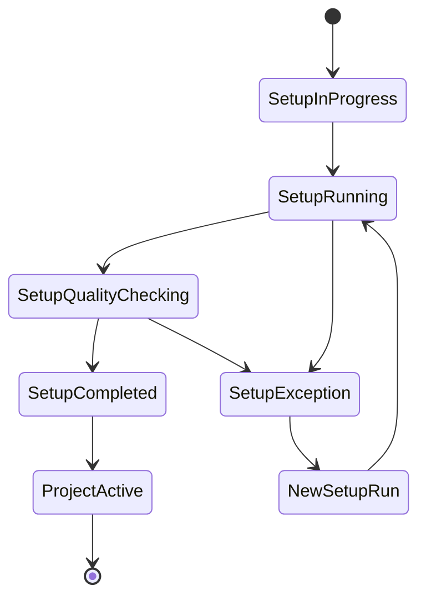
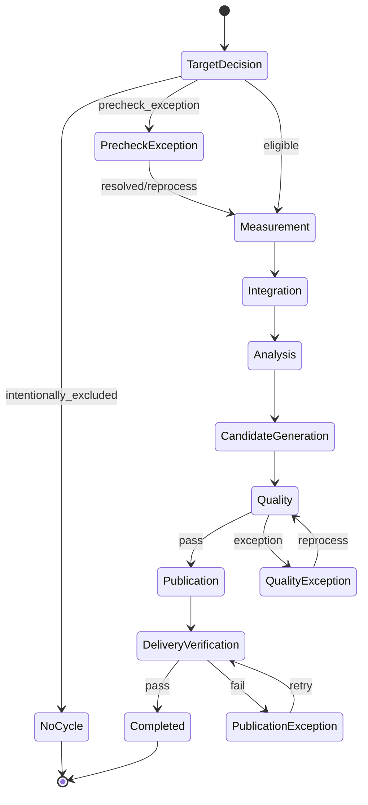
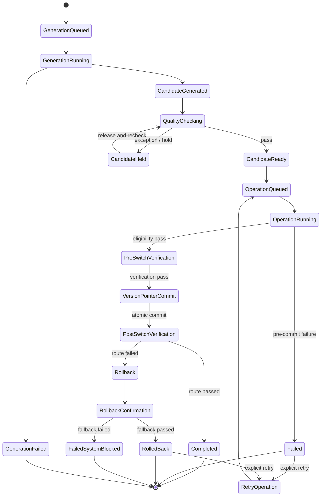
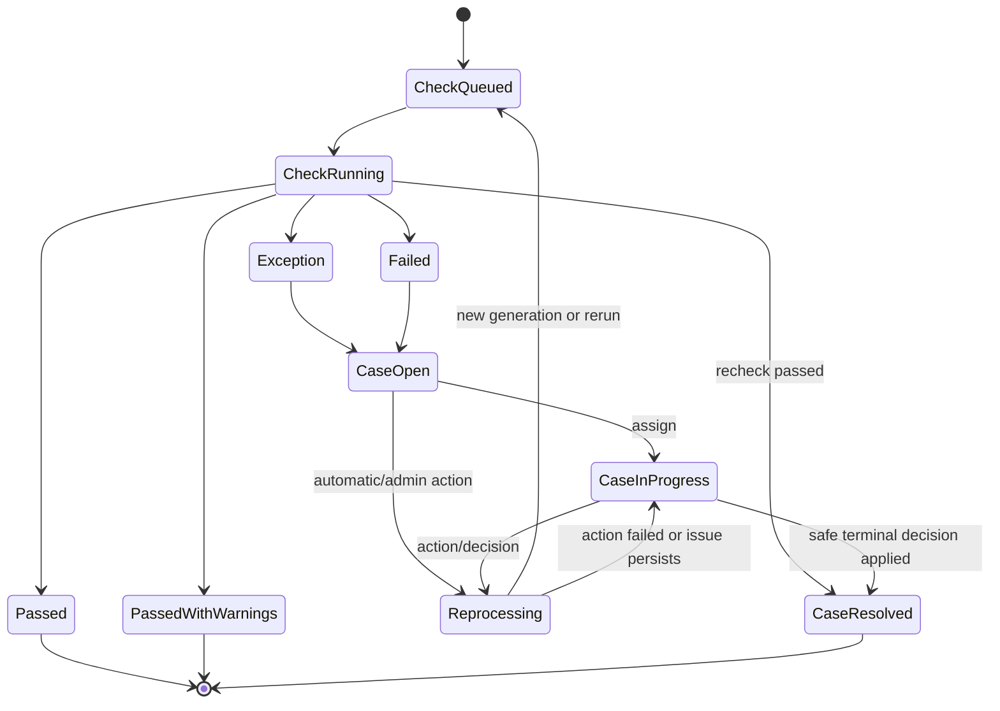

# レコラ管理画面 P0 正式状態モデル仕様書

- 文書ID: `RECORA-ADMIN-P0-STATE-MODEL`
- 版: `2.1`
- 基準日: `2026-08-01`
- 状態: 正式採用
- 対象: レコラ管理画面P0
- 優先順位: 本仕様はv2.0以前を含む過去の管理画面案・画面単位の仮ステータス定義より優先する

---


## 0. v2.1 最終横断統合変更点

全8領域・read model・権限・監査・routeを横断照合し、状態変更commandの名称と主体を最終統一する。

1. system safety commandを `BlockCustomerAccessBySystem`、`BlockProjectAutomationBySystem`、`BlockPublicationBySystem`、`BlockDailyAutomationBySystem` に統一する。
2. 管理者が復旧batchを要求する `RequestRecoveryBatch` と、systemが実体を作る `CreateRecoveryBatch` を分離する。
3. 日次schedulerの `StartDailyTargetEvaluationRun` と `CreateActivationDayTargetDecision` を正式なsystem-only command registryへ含める。
4. 管理者停止・system block・clearance解除を別commandとして扱い、同じcommand名で `paused_by_admin` と `blocked_by_system` を切り替えない。
5. `ResumeProjectAutomation`、`ApplyScheduledContractVersion`、`MarkIncidentScopeNotAffected`、`CancelIncidentRecoveryPlan` など、画面・権限仕様に存在していたcommandを状態モデルへ補完する。
6. scheduled apply、recovery、identity projection、publication completion、pricing supersedeに必要なsystem commandを補完する。
7. 顧客導入表示codeはwrite modelへ保存せず、read model v2.0の単一code setから導出する。
8. 旧command名 `BlockCustomerAccess`、`BlockProjectAutomation`、`ApplyPublicationSystemBlock` は正式registryから除外する。

v2.0までに確定したデータ単位、状態遷移、不変性、P0/P1境界は変更しない。

---

## 0. v2.0変更点

管理設定画面の最終化に伴い、管理者、通知、日次設定version、AIモデルcontrol、標準plan、適用予定変更、rule/pricing参照の正式状態を次のように修正する。

1. `admin_user`のstatusを`invited / active / suspended / deactivated`に固定し、MFA状態は認証基盤を正とする。
2. 管理者招待時に初期role assignmentとscope assignmentを同一transactionで作成する。
3. 最後の有効なplatform adminを停止・無効化・role/scope解除できない不変条件を状態モデルへ追加する。
4. `admin_role`は固定seedとし、P0でrole定義・capability定義を編集しない。
5. `notification_destination`をemail channelの正式単位とし、statusを`pending_verification / active / paused / invalid / revoked`に固定する。
6. 通知addressは作成後に直接変更せず、新destination作成と旧destination revokeで変更履歴を維持する。
7. `daily_automation_configuration`をstable control row、`daily_automation_configuration_version`をimmutable設定versionとして分離する。
8. 日次設定versionのstatusを`draft / ready / active / superseded / cancelled`に固定する。
9. P0のbusiness timezoneを`Asia/Tokyo`へ固定し、日次開始時刻だけをversioned editable settingとする。
10. 日次設定とplan versionの適用を`scheduled_configuration_change`へ統一する。
11. scheduled change statusを`scheduled / applying / applied / failed / cancelled`に固定し、terminal rowを再openしない。
12. 設定適用失敗時は旧active versionを維持し、target versionをactiveにしない。
13. `daily_automation_configuration.control_state`を`enabled / paused_by_admin / blocked_by_system`に固定する。
14. 日次停止は新しい日次runの開始だけを停止し、実行中batchを暗黙停止しない。
15. `blocked_by_system`解除をincident recovery clearance経由のsystem commandだけに限定する。
16. AIモデルhealthと`ai_model_control`を分離したまま、`enabled / restricted / paused`の運用意味を固定する。
17. planned admin controlとincident safety controlを`control_origin`で区別し、incident safety解除をclearance経由にする。
18. `plan_version`をseed済みplan codeごとのimmutable versionとし、statusを`draft / ready / active / superseded / cancelled`に固定する。
19. prompt count tierを`50 / 100 / 200`へ限定し、許可AIモデルを`plan_version_ai_model`で保持する。
20. 新plan version適用で既存`contract_version.plan_version_id`を変更しない。
21. `scheduled_configuration_change`の対象を日次設定versionとplan versionのactivationへ限定する。
22. `quality_rule_version`と`publication_rule_version`をP0でread-onlyなimmutable system-managed versionとして固定する。
23. rule version不足・不整合時は自動品質・公開処理をfail-closedにする。
24. pricing definitionの管理者編集禁止を維持し、管理設定では適用状況だけを参照する。
25. 設定異常はread modelから導出し、独立した`settings_work_item`や更新可能な設定表示statusを作らない。
26. 管理設定のwrite commandをglobal scope、MFA、row version、idempotency、W2/W3安全要件へ接続する。
27. 設定変更履歴は`audit_log + system_event + 対象固有状態遷移`から導出し、別の履歴tableへ二重保存しない。

v1.9で確定したusage、pricing、cost calculation、CSV snapshotの原則は変更しない。

---

## 0. v1.9変更点

利用量・コスト画面の最終化に伴い、usage、pricing、cost calculation、CSV snapshotの正式状態を次のように修正する。

1. `usage_record`を1provider利用event・1利用componentのappend-only事実として固定する。
2. 同じAI呼び出しのinput token、output token、request count等は別recordとし、`usage_event_key`で関連付ける。
3. `usage_capture_status`を`reported / derived / unavailable`に固定し、未取得数量を0へ変換しない。
4. usageの訂正は元recordを更新せず、system actorが新recordと`correction_of_usage_record_id`を作る。
5. `workload_category`と`attempt_reason_category`を追加し、正式日次・追加検証、通常・retry・incident compensationを分離する。
6. `cost_incurred_date`と`business_date`をusage作成時に固定し、後日のtimezone変更で再帰属しない。
7. `pricing_definition`を有効期間付きの不変単価definitionとして固定し、active definitionの直接編集を禁止する。
8. pricingのapplication statusを`scheduled / active / superseded / cancelled / invalid`、rate confidenceを`estimated / provisional / final`に固定する。
9. P0の原価表示通貨を1通貨に限定し、通貨不一致を自動換算せず未算定とする。
10. 原価算定処理1回の正式単位として`cost_calculation_run`を追加する。
11. run statusを`queued / running / completed / completed_with_uncomputed / failed / cancelled`に固定する。
12. `cost_record`を1usage record・1算定versionの不変結果とし、再算定で過去recordを更新しない。
13. cost statusを`uncomputed / estimated / provisional / final`に固定する。
14. `uncomputed`のamountをNULLとし、未算定を0円へ変換しない。
15. current cost resultは有効runに属する最大`calculation_version`から導出し、`is_current`を保存しない。
16. CSV生成の正式単位として`usage_cost_export_job`を追加し、scope、filter、date axis、read snapshot、source watermarkを要求時に固定する。
17. export job statusを`queued / running / completed / failed / expired / cancelled`に固定し、terminal jobを再openしない。
18. 管理者によるusage、cost、pricingの直接編集・調整をP0で禁止し、管理者writeはCSV要求だけとする。
19. 前業務日以前の重大未算定はread model上のattentionとして扱い、独立した原価異常workflowを作らない。
20. 顧客請求、売上、粗利、予算、為替換算、請求照合を内部変動原価から分離し、P1以降へ送る。

v1.8で確定したincident、recovery、clearance、system component health、auditの原則は変更しない。

---

## 0. v1.8変更点

障害・監査画面の最終化に伴い、incident、system component health、recovery plan、clearance、system event、auditの正式状態を次のように修正する。

1. `incident`へ安定した`incident_fingerprint`、表示用`incident_key`、source、recurrence、resolution codeを追加する。
2. 同じfingerprintの未解決incidentは最大1件とし、同一障害eventは既存incidentへscope・evidenceを追加する。
3. 解決済みincidentの再発では過去incidentを再openせず、新incidentと`recurrence_of_incident_id`を作る。
4. incident statusを`open / mitigating / monitoring / resolved`として維持し、action・plan・stepのstatusと混同しない。
5. `incident_scope`へscope type、impact kind、impact stateを追加し、潜在影響と確認済み顧客影響を分離する。
6. global potential scopeを全顧客・全projectの確認済み影響として数えない。
7. `incident_action`を調査、緩和、安全制御、回復、検証、連絡、注記の正式実行単位とし、terminal actionの再openを禁止する。
8. `incident_recovery_plan`へversion、`verifying`、`superseded`を追加し、draft以外の直接編集を禁止する。
9. 段階的復旧の正式単位として`incident_recovery_step`を追加し、失敗stepの再試行では新attempt rowを作る。
10. system block解除用の`incident_recovery_clearance`を追加する。
11. clearanceはsystemだけが発行し、対象control、from/to state、row version、有効期限を限定する。
12. clearance消費とcontrol解除を同一transactionへ固定する。
13. `system_component_state.state`を`health_state`へ変更し、値を`operational / degraded / unavailable / unknown`に固定する。
14. component healthから`paused`を削除し、意図的停止・制限は各control stateで表現する。
15. component観測へ`observed_at`と`fresh_until`を必須化し、stale観測はread modelで`unknown`へ変換する。
16. 管理者によるcomponent healthの直接更新を禁止し、health check要求だけを許可する。
17. AIモデルhealthと`ai_model_control.control_state`を分離し、incident-linked pauseの解除をrecovery clearance経由にする。
18. `system_event`へproducer event ID、event class、event level、occurred/recorded時刻、sanitized payloadを追加し、append-only deduplicationを固定する。
19. system eventへ既読・解決・担当状態を追加しない。対応が必要な場合はincident等の正式作業単位へ接続する。
20. audit logへ`action_code`、risk、outcome、認可context、`corrects_audit_log_id`を持たせ、追記型の単一保存原則を維持する。
21. Criticalまたはsystem blockを伴うincidentは、recovery plan・検証・clearanceなしでresolvedにできない。
22. incidentをresolvedにしてもquality case、measurement cycle、publication operationを暗黙解決しない。

v1.7で確定したpublication candidate、version、pointer、operation、verificationの原則は変更しない。

---

## 0. v1.7変更点

公開管理画面の最終化に伴い、candidate Generation、公開版、pointer、operation、delivery verification、停止・復元の正式状態を次のように修正する。

1. `publication_candidate`へcycle内の`generation_number`と、project全体で単調増加する`project_generation_number`を持たせる。
2. 新しいproject Generationを作成したとき、同一projectの過去の未消費candidateを`superseded`へ移す。
3. 新規公開対象は、project全体で最大の`project_generation_number`を持つcandidateだけとする。
4. candidate生成の正式実行単位として`publication_candidate_generation_run`を維持し、runの再試行では過去runを更新しない。
5. candidate、version、pointer、operation、delivery verificationの責任を分離し、payloadの直接編集を禁止する。
6. `publication_version`はcandidateから一度だけmaterializeし、同じcandidateから重複versionを作らない。
7. version作成、candidateの`consumed`化、pointer切り替えを同一transactionへ固定する。
8. pointer切り替えtransactionがcommitする前の失敗では、version、candidate consumed、pointer変更を一切残さない。
9. pointer切り替え後の検証失敗ではversionとconsumed candidateを保持し、pointerだけをprevious versionまたはNULLへ戻す。
10. `publication_operation.status`を生存状態、`current_stage`を工程として分離する。
11. operation typeを`publish_candidate / restore_version / resume_current_pointer`に固定する。
12. operation statusを`queued / running / completed / rolled_back / failed / cancelled`に固定し、終端operationを再openしない。
13. 再試行では`retry_of_operation_id`を持つ新operationを作り、同一の論理targetと既存versionを再利用する。
14. delivery verification phaseを`pre_switch_render / post_switch_route / rollback_confirmation / resume_precheck / post_resume_route`に固定する。
15. terminal verificationを更新して再利用せず、再検証では新しいrowを作る。
16. pointer切り替え前にimmutable payloadを検査し、切り替え後に実際の顧客routeを検査する。
17. rollback confirmation失敗、tenant mismatch、project mismatch、重大なpointer mismatchではCritical incidentと`blocked_by_system`を必須にする。
18. 公開可能条件から`project.automation_control`と`customer.access_control`を除外し、測定自動化、pointer準備、顧客アクセスを分離する。
19. 契約またはentitlementが非activeの場合は新しいpointer切り替えを禁止する。
20. 管理者による公開停止ではpointerを保持し、測定・解析・candidate生成・quality checkを継続可能にする。
21. 公開再開は`resume_current_pointer` operationと安全検査を経由し、control値だけを直接変更しない。
22. `paused_by_admin`中の過去版復元を`hidden_under_pause`として許可し、顧客非表示を維持して再開時検証を要求する。
23. `blocked_by_system`中の通常管理者復元・再開を禁止し、incident recovery clearanceを必要とする。
24. ready candidateが通常の自動開始SLA内にある間はsystem対応とし、SLA超過後だけpublication-owned human attentionへ変換する。
25. 公開固有異常、品質異常、共通障害、契約・アクセス異常をattention ownerで分離し、バッジへ二重計上しない。
26. candidate内容適格性とoperation開始可能性を分離し、project lifecycle・契約・entitlement・publication controlは後者で判定する。

v1.6で確定したquality check run、stable case、finding blocking scope、quality action・decisionの原則は変更しない。

---

## 0. v1.6変更点

品質・例外レビュー画面の最終化に伴い、自動品質検査、case重複防止、再処理と判断の境界を修正する。

1. 自動品質検査の正式実行単位として `quality_check_run` を追加する。
2. 自動通過履歴の正式情報源を `quality_decision.auto_pass` から、`quality_check_run.status in (passed, passed_with_warnings)` へ変更する。
3. quality check runのstatusを `queued / running / passed / passed_with_warnings / exception / failed / cancelled` に固定する。
4. `quality_exception_case`へstable subjectを追加し、candidate Generationが変わっても同じ未解決問題のcaseが増殖しないdeduplication keyへ変更する。
5. exactなcandidate、revision、attemptなどはfindingのsourceへ保持し、caseの安定対象と分離する。
6. findingへ `severity`、`blocking_scope`、rule・policy snapshotを必須化する。
7. 再測定・再解析・再計算・再生成を `quality_exception_action`、注記・一部非表示・前回版維持・公開不可を `quality_decision` として分離する。
8. `quality_decision` から `auto_pass / retry_measurement / reanalyze` を外し、application statusを追加する。
9. candidate本文を変えるdecisionは新Generationを作り、自動品質検査へ再投入する。
10. 人間actorはcandidateを直接 `ready` にできず、quality reviewerへgenericなcandidate管理権限を要求しない。
11. 公開可能条件をseverityだけでなく、latest quality check runとunresolved blocking findingから判定する。
12. Critical findingはincident関連を必須とし、必要なsystem safety controlをfail-closedで適用する。

v1.5で確定したcycle revision、attempt採用、batch制御の原則は変更しない。

---

## 0. v1.5変更点

測定管理画面の最終化に伴い、サイクル再処理、統合revision、batch制御、attempt採用の不足を修正する。

1. `measurement_cycle.current_revision_id` を追加し、現在採用中の統合・解析結果を明示的なpointerで管理する。
2. `measurement_cycle_revision_item` を追加し、revisionごとに採用したmeasurement itemとattemptを不変mappingとして保存する。
3. `measurement_item.selected_attempt_id` を正式な単一情報源として使用しない。現在採用中のattemptはcycle pointerとrevision mappingから判定する。
4. 完了済みformal daily cycleは、W2の正式再処理で同じcycleを`running`へ戻せる。ただし旧current revisionと現在公開版を維持し、新attempt・新revision・新batchを作る。
5. batch typeを `scheduled_daily / manual_formal / additional_validation / retry_failed_items / incident_recovery` に固定する。
6. batch statusへ `pausing / stopping`、assignment statusへ `retry_wait` を追加し、一時停止と安全停止のdrain状態を正式に表現する。
7. `failed`または`stopped` batchを直接再開しない。再測定・復旧は新しいretry/recovery batchで行う。
8. attempt kindを `initial / automatic_retry / manual_retry / incident_recovery` に固定する。timeoutまたはcancel後の遅延結果は採用しない。
9. 管理者が任意batchを直接作る操作を廃止し、正式測定、追加検証、再測定などの業務commandの副作用としてsystem actorがbatchを作る。
10. `PauseMeasurementBatch / ResumeMeasurementBatch / StopMeasurementBatch / ReprocessFormalDailyCycle / ExecuteBulkFormalMeasurement` の状態境界を追加する。

v1.4で確定した顧客、契約、configuration revision、初期設定の原則は変更しない。

---

## 0. v1.4変更点

顧客管理画面の最終化に伴い、運用中プロジェクトの設定変更を、現在運用を壊さない正式なP0コマンドとして固定する。

1. `CreateProjectConfigurationRevision` を、`project.lifecycle_status = active` のプロジェクトに対するW2管理者操作として正式化する。
2. 初期設定中の入力訂正は `RetryProjectSetupWithInputCorrection`、運用開始後の設定更新は `CreateProjectConfigurationRevision` とし、目的と監査actionを分離する。
3. 1プロジェクトで同時に進行できる非終端のconfiguration revisionを最大1件とし、競合する設定更新を禁止する。
4. 運用中の設定更新中も、旧active revision、進行中cycle、現在公開版pointerを維持する。
5. 新revisionのactive化時に、契約、entitlement、prompt tier、AIモデル制御、row versionを再検査する。
6. 新revisionが失敗した場合は `invalid` とし、旧active revisionを維持して「設定更新失敗・現行版継続」と表示する。
7. 新revisionのactive化後、superseded revisionを参照する未公開candidateは新規公開不可とし、`superseded` へ終端化する。現在公開中のversionは次の安全な公開切り替えまで維持する。
8. 既に作成済みのmeasurement cycleは作成時のconfiguration revisionを保持し、設定切り替えによって入力を差し替えない。

v1.3で確定した顧客、契約、顧客ユーザー、問い合わせ、初期設定stageの状態定義は変更しない。

---

## 0.1 v1.3で確定済みの変更点

v1.2までの決定を維持したうえで、顧客管理画面を実装可能にするため次を正式化する。

1. `customer` は顧客マスタとして扱い、P0では更新可能なライフサイクルstatus、削除、統合、アーカイブを追加しない。顧客の「導入準備中」「契約停止」「運用中」は契約・プロジェクト・問い合わせからread modelで導出する。
2. `customer.access_control` を `enabled / suspended_by_admin / blocked_by_system` に固定し、顧客ログイン停止を契約・測定・公開制御から分離する。
3. `customer_user.status` を `invited / active / suspended / revoked` に固定し、招待・利用停止・再開・取消の正式状態を定義する。
4. P0の顧客ユーザー権限は顧客単位とし、project別の顧客ユーザーscopeと顧客側カスタム役割はP1以降とする。
5. 初回契約を作る `CreateContract`、契約再開、契約versionの即時適用・適用予約・取消を正式コマンドへ追加する。
6. 契約versionと `project_entitlement` の適用境界を固定する。契約停止ではentitlementを一括更新せず、日次判定時に契約statusとentitlementの両方を評価する。
7. `CreateProject` は有効な契約versionと利用権限を必須とし、project、entitlement、初期configuration revision、queued setupを冪等に作成する。
8. `project_setup_run.current_stage` と不変な設定入力snapshotを追加し、サイト取得から品質ゲートまでの進行を正式事実から表示できるようにする。
9. 初期設定の再試行と設定変更は、過去run・artifactを戻さず、新しいrunと新しいconfiguration revisionを作成する。
10. 正式測定cycleは作成時に `project_configuration_revision_id` を固定し、後から有効設定が切り替わっても既存cycleの入力を差し替えない。
11. 契約停止・契約終了・利用権限停止をprojectのprimary表示状態へ追加し、「運用中」と誤表示しない。
12. 問い合わせ内部メモの用途を `internal / resolution / correction / reopen_reason` に固定し、解決・再開の根拠を追記型で残す。
13. 顧客作成、契約作成、project作成、顧客ユーザー招待、問い合わせ対応の一意制約と監査境界を追加する。

v1.2で追加した日次対象判定run、公開制御の分離、追加検証の公開禁止、現在公開版pointerの原則は変更しない。

---

## 1. 目的

レコラ管理画面P0における、次の処理を一貫した状態モデルで接続する。

1. 顧客・契約・プロジェクト作成
2. 自動初期設定
3. 設定品質ゲート
4. 運用開始
5. 日次対象判定
6. 正式日次サイクル
7. 測定・再試行・結果統合
8. 解析・指標集計
9. 公開候補Generation生成
10. 自動品質・表示安全性検査
11. 公開版生成・現在公開版切り替え
12. 顧客画面表示検証
13. 品質例外・障害・監査・原価記録

画面表示用の状態を各テーブルへ重複保存せず、正式な処理状態と明示的な制御状態からread modelで導出する。

---

## 2. P0の不変条件

以下はP0実装で必ず守る。

### 2.1 自動化

- 通常処理は自動で行う。
- 初回処理も通常日次と同じ正式フローへ入れる。
- 品質判定と公開も自動で行う。
- 管理者が日常的に全件承認する設計にしない。
- 人が対応するのは例外だけとする。

### 2.2 初期設定と運用開始後

- `project.lifecycle_status = setup_in_progress` のプロジェクトは正式日次対象に含めない。
- 初期設定失敗時は設定例外を作成するが、正式日次サイクルは作成しない。
- `project.lifecycle_status = active` のプロジェクトは、意図的な停止対象でない限り毎日 `daily_target_decision` を作成する。
- 運用開始後の事前判定失敗では、正式日次サイクルを `precheck` 段階の例外状態で作成する。

### 2.3 測定

- 正式日次サイクルは、1プロジェクト・1業務日につき最大1件とする。
- 同日の手動正式測定は、既存正式日次サイクルの再処理または新revisionとして扱う。
- 追加検証は正式日次とは別用途とし、正式結果へ直接昇格させない。
- 実行試行は追記型で保存し、過去試行を上書きしない。

### 2.4 品質

- 公開候補Generationを生成した後、その候補内容に対して `quality_check_run` で品質・表示安全性検査を行う。
- 自動通過は `quality_check_run` のterminal statusを正とし、caseやdecisionを作らない。
- 品質例外の「作業グループ」を独立永続化しない。
- 共通原因は `incident`、個別影響は `quality_exception_case` で表現する。
- 同じ障害に関連する複数ケースは `incident_id` で画面上まとめる。
- 候補内容を修正する場合は新しいGenerationを作成する。
- 公開管理から品質ゲートを直接上書きしない。

### 2.5 公開

- 測定自動化の制御と顧客公開の制御を分離する。
- 管理者による公開停止では、正式日次測定・解析・候補生成を停止しない。
- 公開停止中も最後の安全な `project_publication_pointer` を保持し、顧客への表示可否は `project.publication_control_state` と組み合わせて判定する。
- 公開候補と公開版の本文・集計結果は生成後に直接編集しない。
- 自動公開できるのは、最新かつ有効で品質検査済みのGenerationだけとする。
- 現在公開中の版は `project_publication_pointer` だけを正とする。
- 公開失敗時は前回版を維持する。
- 初回公開失敗時は準備中表示を維持する。
- 各pointer変更transactionを原子的に行い、切り替え後の失敗は検証済みrollbackで安全に復元する。

### 2.6 履歴

- 管理者・システムの重要操作は `audit_log` に1回だけ保存する。
- システム処理イベントは `system_event` に保存する。
- 詳細ページの操作履歴は `audit_log` を対象IDで絞ったread modelとする。
- タイムラインは `audit_log`、`system_event`、対象固有の状態遷移を統合表示する。
- `audit_log` と `system_event` は追記型とし、過去記録を更新・削除しない。

---

## 3. 共通用語

| 用語 | 定義 |
|---|---|
| 業務日 | 日次処理を帰属させる日付。P0ではサービス設定タイムゾーンを使用し、初期値は `Asia/Tokyo` |
| 正式日次 | 顧客画面へ反映可能な正式測定フロー |
| 追加検証 | 正式日次と切り離された検証用測定。正式結果への直接昇格不可 |
| Generation | 同じ測定サイクルから生成される公開候補の世代番号 |
| revision | 再測定・再統合・再解析によって作られる不変な処理結果の版 |
| 正式状態 | 処理の事実として保存する状態 |
| 制御状態 | 管理者またはシステムが明示的に処理可否を制御する状態 |
| 表示状態 | 正式状態・制御状態・未解決例外・公開状態からread modelで導出する画面用状態 |

---

## 4. 顧客・プロジェクト・契約状態

### 4.1 `project.lifecycle_status`

```text
setup_in_progress
active
closed
```

| 状態 | 意味 |
|---|---|
| `setup_in_progress` | 自動初期設定開始後、設定品質ゲート通過前 |
| `active` | 設定品質ゲートを通過し、正式日次対象になり得る |
| `closed` | 運用終了。P0では自動的に再開しない |

許可遷移:

```text
setup_in_progress -> active
setup_in_progress -> closed
active            -> closed
```

禁止:

```text
closed -> active
```

再開が必要な場合は、P1で再契約・再開手続きを定義する。P0では個別の直接復活を行わない。

### 4.2 `project.automation_control`

```text
running
paused_by_admin
blocked_by_system
```

| 状態 | 意味 |
|---|---|
| `running` | 自動処理を許可 |
| `paused_by_admin` | 管理者が意図的に停止 |
| `blocked_by_system` | セキュリティ、テナント境界、重大障害などによりシステムが停止 |

許可遷移:

```text
running           <-> paused_by_admin
running           <-> blocked_by_system
paused_by_admin   -> blocked_by_system
blocked_by_system -> paused_by_admin
```

すべての制御変更は `audit_log` に保存する。システム起因の変更は `system_event` にも保存する。

### 4.3 `project.publication_control_state`

```text
enabled
paused_by_admin
blocked_by_system
```

| 状態 | 意味 |
|---|---|
| `enabled` | 品質・公開条件を満たす候補の自動公開を許可 |
| `paused_by_admin` | 管理者が顧客公開だけを停止。測定・解析・候補生成は継続可能 |
| `blocked_by_system` | テナント境界、表示安全性、重大公開障害などによりシステムが顧客公開を停止 |

許可遷移:

```text
enabled           <-> paused_by_admin
enabled           <-> blocked_by_system
paused_by_admin   -> blocked_by_system
blocked_by_system -> paused_by_admin
```

原則:

- `paused_by_admin` への変更と解除は管理者コマンドで行い、`audit_log` を必須とする。
- `blocked_by_system` への変更はシステム安全処理が行い、`audit_log` と `system_event` の両方へ記録する。
- `blocked_by_system` の解除は回復条件の自動再検査を通過した後に行う。
- 公開停止時も `project_publication_pointer` は削除しない。
- 顧客へ現在版を表示できるのは、pointerが存在し、pointer先versionが非revokedで、`publication_control_state = enabled`、`customer.access_control = enabled`、`contract.status = active`、`project_entitlement.status = active`、`project.lifecycle_status = active` をすべて満たす場合だけとする。
- customer access、契約、entitlementによって非表示になってもpointerは削除しない。
- 公開停止中に新しい候補が `ready` になっても、自動公開operationは開始しない。

### 4.4 正式日次対象条件

正式日次対象候補は次で判定する。

```text
project.lifecycle_status = active
AND project.automation_control = running
AND project_entitlement.status = active
AND contract.status = active
```

最終結果は必ず `daily_target_decision` に記録する。

### 4.5 `contract.status`

```text
draft
active
suspended
ended
```

許可遷移:

```text
draft     -> active
draft     -> ended
active    -> suspended
active    -> ended
suspended -> active
suspended -> ended
```

### 4.6 `contract_version.status`

```text
draft
scheduled
active
superseded
cancelled
```

原則:

- 同一契約で `active` は最大1件。
- 適用予定変更は `scheduled` として保持する。
- 新version適用時、旧versionを `superseded` にする。
- 適用済みversionの内容は直接編集しない。

### 4.7 `project_entitlement.status`

```text
scheduled
active
suspended
expired
revoked
```

`active` 以外は正式日次の対象外理由になり得る。

### 4.8 契約versionとproject entitlementの適用規則

契約は、顧客との契約単位である `contract` と、適用内容を不変に保持する `contract_version` を分ける。

初回作成:

```text
CreateContract
  ↓
contract.status = draft
contract_version.status = draft
```

初回versionを即時適用する場合:

```text
contract_version draft -> active
contract draft          -> active
対象project_entitlement -> active
```

既存契約の新versionを即時適用する場合:

```text
新version draft      -> active
旧version active     -> superseded
新entitlement set    -> active
旧entitlement set    -> expired
```

将来適用する場合:

```text
新version draft -> scheduled
有効日時にsystemが再検査
  ├ 成功: activeへ切り替え
  └ 失敗: versionはscheduledのまま、契約・公開例外を作成
```

P0の原則:

- 同一契約で `active` versionは最大1件。
- 同一契約で `scheduled` versionは最大1件。
- `scheduled` または `active` になったversion本文を直接編集しない。
- `draft` は適用前に更新可能だが、変更は監査対象とする。
- 契約を `suspended` にしても、`project_entitlement` を一括して別statusへ書き換えない。正式日次判定は `contract.status = active` と `project_entitlement.status = active` の両方を要求する。
- 契約を再開しても、期限切れ・取消済みentitlementは復活させない。
- 契約を `ended` にした場合、同一transactionで有効なentitlementを `expired`、未適用scheduled versionを `cancelled` にする。
- 契約終了だけで `project.lifecycle_status` を自動的に `closed` へ変更しない。project終了は別のW3操作とする。
- 1projectにつき `active` entitlementは最大1件。
- project作成時は、選択したactive contract versionが許可する範囲から、prompt count tier `50 / 100 / 200` を1つ確定する。

### 4.9 `customer_user.status`

```text
invited
active
suspended
revoked
```

| 状態 | 意味 |
|---|---|
| `invited` | 招待済みで、顧客ユーザー本人の登録・確認待ち |
| `active` | 顧客画面へアクセス可能 |
| `suspended` | 管理者が一時的にアクセス停止。再開可能 |
| `revoked` | アクセス取消済み。P0では終端状態 |

許可遷移:

```text
invited   -> active
invited   -> suspended
invited   -> revoked
active    -> suspended
active    -> revoked
suspended -> active
suspended -> revoked
```

禁止:

```text
revoked -> invited
revoked -> active
```

再招待が必要な場合は、同じmembershipを戻さず、新しい `customer_user` を作成する。

P0のアクセスモデル:

- `customer_user` は顧客へのmembershipである。
- `active` の顧客ユーザーは、その顧客に属し契約・利用権限上表示可能な全projectへアクセスできる。
- project別アクセス、顧客側カスタム役割、二段階承認はP1以降とする。
- 招待tokenの平文をDB、監査ログ、API responseへ保存しない。
- 招待期限切れは更新可能statusを増やさず、`invitation_expires_at` から表示状態として導出する。
- 同じ顧客・正規化メールアドレスで、`revoked` 以外のmembershipを重複作成しない。

### 4.10 `customer.access_control`

```text
enabled
suspended_by_admin
blocked_by_system
```

| 状態 | 意味 |
|---|---|
| `enabled` | activeな顧客ユーザーのログインと、契約・entitlement上許可されたproject表示を許可 |
| `suspended_by_admin` | 管理者が顧客全体のアクセスを停止。測定・解析・候補生成は継続可能 |
| `blocked_by_system` | テナント境界、セキュリティ、重大障害によりシステムが顧客アクセスを停止 |

許可遷移:

```text
enabled              <-> suspended_by_admin
enabled              <-> blocked_by_system
suspended_by_admin    -> blocked_by_system
blocked_by_system     -> suspended_by_admin
```

原則:

- 管理者停止はW3、`suspended_by_admin` からの通常再開はW2とし、理由、影響確認、監査ログを必須とする。system blockの解除は別の安全再検査を要求する。
- system blockはincident、audit log、system eventを必須とし、管理者が直接enabledへ上書きしない。
- access controlは顧客ログイン・表示可否だけを制御し、project automation、publication generation、現在pointerを変更しない。
- `suspended_by_admin` または `blocked_by_system` へ変更した場合、既存の顧客セッションを無効化または次requestでfail-closedにする。
- 顧客アクセス停止中でも、顧客から既に受信済みの問い合わせ、監査、測定履歴は保持する。

顧客ユーザーの実効アクセス:

```text
customer_user.status = active
AND customer.access_control = enabled
```

projectの実効表示には、さらにactive contract、active entitlement、project lifecycle、publication control、current pointerを要求する。

### 4.11 顧客マスタの原則

P0の `customer` は顧客を識別するマスタであり、独立したライフサイクルstatusを持たない。`access_control` は明示的な安全制御であり、導入・契約・運用statusではない。

保存する主な事実:

```text
customer_id
customer_name
primary_contact_name
primary_contact_email
access_control
created_at
updated_at
row_version
```

原則:

- 同名顧客を禁止する一意制約は設けない。
- 顧客名、主担当者名、連絡先は更新可能だが監査対象とする。
- 顧客の削除、統合、別顧客へのproject移動はP0では行わない。
- 「契約が必要」「project作成待ち」「初期設定中」「運用中」「要対応」はread modelで導出する。

---

## 5. 自動初期設定

### 5.1 `project_setup_run.status`

```text
queued
running
quality_checking
completed
exception
cancelled
```

許可遷移:

```text
queued           -> running
queued           -> cancelled
running          -> quality_checking
running          -> exception
running          -> cancelled
quality_checking -> completed
quality_checking -> exception
quality_checking -> cancelled
```

`completed`、`exception`、`cancelled` はそのrunでは終端状態とする。

再実行時は過去runを戻さず、新しい `project_setup_run` を作成する。

#### 5.1.1 `project_setup_run.current_stage`

```text
initializing
site_fetch
site_analysis
category_generation
competitor_generation
persona_topic_generation
prompt_generation
configuration_assembly
quality_check
activation
```

`status` と `current_stage` の関係:

| status | 許可するstage |
|---|---|
| `queued` | `initializing` |
| `running` | `site_fetch` から `configuration_assembly` |
| `quality_checking` | `quality_check` または `activation` |
| 終端状態 | 最後に到達したstageを保持 |

`configuration_assembly` は正式な内部stageとして記録するが、管理画面では独立した9工程目にしない。`prompt_generation` の表示工程内で補助ラベル「設定をまとめています」を表示する。

「サイト分析中」「競合候補生成中」などを別の更新可能なdisplay statusとして保存しない。

#### 5.1.2 設定入力snapshotとrunの関係

各 `project_configuration_revision` は、次の設定入力を不変snapshotとして保持する。

```text
target_site_url
target_brand_name
target_region
language
prompt_count_tier
contract_version_id
project_entitlement_id
ai_model_configuration_version
captured_at
```

原則:

- `project_setup_run` は必ず1つの `project_configuration_revision` を参照する。
- 初回project作成時は `building` revisionと `queued` setup runを作成する。
- setup再試行では、過去runを戻さず、同じ入力snapshotを複製した新revisionと新runを作成する。
- サイトURL、ブランド名、地域、言語、prompt tierなどの設定影響項目を変更する場合も、新revisionと新runを作成する。
- project名など表示上の非設定項目だけを変更する場合は、新setup runを作成しない。
- active projectの再設定中は、現在のactive revisionを維持する。新revisionが品質ゲートを通過するまで、既存の日次測定と顧客公開へ影響させない。

### 5.2 初期設定の成果物

各成果物は生成後に直接上書きせず、新しい版を作る。

- `site_analysis_snapshot`
- `category_set`
- `competitor_set`
- `persona_topic_set`
- `prompt_set`

`project_configuration_revision` が、採用する成果物群をまとめて参照する。

### 5.3 `project_configuration_revision.status`

```text
building
quality_checking
ready
active
superseded
invalid
```

許可遷移:

```text
building         -> quality_checking
building         -> invalid
quality_checking -> ready
quality_checking -> invalid
ready            -> active
ready            -> invalid
active           -> superseded
```

原則:

- 1プロジェクトにつき `active` revisionは最大1件。
- 1つのsetup runは1つのconfiguration revisionだけを構築する。
- 初回の `active` 化と同一トランザクションで `project.lifecycle_status` を `active` にする。
- active projectの新revisionを `active` にする場合は、旧active revisionを同一transactionで `superseded` にする。
- 新revisionの品質検査に失敗した場合は新revisionを `invalid` とし、旧active revisionを維持する。
- 一度 `active` になったrevisionを `invalid` へ変更しない。重大な欠陥が判明した場合はautomation・publicationの安全制御、品質例外または障害を作成し、replacement revisionを構築する。
- revisionの内容変更は行わず、新revisionを作る。

### 5.3.1 運用中プロジェクトの設定revision更新

運用開始後に、対象サイトURL、対象ブランド、対象地域、言語、対象AIモデル構成、prompt count tierなど測定条件へ影響する設定を変更する場合、既存revisionを編集しない。

正式フロー:

```text
CreateProjectConfigurationRevision
  ↓
現在active revisionをbase revisionとして固定
  ↓
新しいbuilding revisionとqueued setup runを作成
  ↓
旧active revisionで日次測定・現在公開版を継続
  ↓
サイト取得・分析・生成・設定品質ゲート
  ├ 通過
  │  ↓
  │ 契約・entitlement・AIモデル・row versionを再検査
  │  ↓
  │ 新revisionをactive、旧revisionをsupersededへ原子的に切替
  │  ↓
  │ 以後に作成するcycleは新revisionを参照
  │
  └ 失敗
     ↓
     新revisionをinvalid
     ↓
     旧active revisionと現在公開版を維持
```

対象の分離:

| project状態 | 使用するcommand | 意味 |
|---|---|---|
| `setup_in_progress` | `RetryProjectSetupWithInputCorrection` | 初回設定入力を訂正し、準備中のまま新runを作る |
| `active` | `CreateProjectConfigurationRevision` | 現行運用を維持したまま新設定を構築する |
| `closed` | なし | P0では設定更新不可 |

管理者が指定できる設定影響項目:

```text
target_site_url
target_brand_name
target_region
language
target_ai_model_selection
prompt_count_tier
```

次はcommand serviceが正式情報源から固定し、クライアント指定を信用しない。

```text
customer_id
active_contract_id
active_contract_version_id
active_project_entitlement_id
allowed_ai_model_configuration_version
base_active_configuration_revision_id
```

開始条件:

```text
project.lifecycle_status = active
AND project.automation_control <> blocked_by_system
AND contract.status = active
AND project_entitlement.status = active
AND active configuration revisionが1件存在
AND 非終端のbuilding revisionが存在しない
```

`paused_by_admin` のプロジェクトでも設定構築は許可できるが、active化後も測定停止は維持する。`blocked_by_system` の場合は、原因解決前に新しい設定更新を受理しない。

同時実行:

- `building / quality_checking / ready` のrevisionは1プロジェクト最大1件とする。
- 同じidempotency keyの再送は既存revisionとrunを返す。
- 異なる要求が同時に届いた場合は、先に作成された非終端revisionを返して競合エラーとする。
- active化は、projectのactive revision IDとrow versionをcompare-and-swapで検査する。
- active化時に契約・entitlement・AIモデル条件が変わっていた場合、新revisionをactiveにせず、設定例外を作成する。

測定・公開との境界:

- 既存cycleの `project_configuration_revision_id` は変更しない。
- 新revisionのactive化より前に作成されたcycleは旧revisionのまま完了できる。
- 新revisionのactive化後、旧revisionを参照し未公開のcandidateは `superseded` とし、新規公開を禁止する。
- 旧revisionから既に公開済みの `publication_version` と現在pointerは削除しない。
- 新revisionを参照する正式日次から安全なcandidateが公開されるまで、前回版を維持する。
- 設定更新完了そのものを公開完了として扱わない。

### 5.3.2 設定更新の表示用導出

次は保存せずread modelで導出する。

```text
configuration_updating_current_kept
configuration_update_failed_current_kept
configuration_ready_waiting_activation
configuration_activated_waiting_measurement
```

顧客管理画面の主表示は、品質例外やシステム停止などより弱い補助状態として扱う。ただし設定更新自体に未解決設定例外がある場合は、人の対応対象として表示する。

### 5.4 初期設定失敗時

```text
project.lifecycle_status = setup_in_progress
project_setup_run.status = exception
quality_exception_case.case_type = setup
正式日次サイクル = 作成しない
顧客画面 = 準備中
```

---

## 6. 日次対象判定

### 6.1 `daily_target_evaluation_run`

日次対象判定には、1業務日全体の実行状態を示す親単位を持つ。

```text
daily_target_evaluation_run
```

粒度:

```text
1業務日につき1件
```

このrunは、画面表示用の集計状態ではない。日次schedulerがその業務日の対象母集団を確定し、各プロジェクトのdecisionを評価したという正式な処理事実である。

主な属性:

```text
id
business_date
status
scheduled_at
started_at
population_snapshot_at
completed_at
daily_automation_configuration_version_id
correlation_id
failure_reason_code
created_at
updated_at
```

一意制約:

```text
UNIQUE(business_date)
```

P0は単一の正式業務タイムゾーンを前提とする。将来複数タイムゾーンへ分割する場合に限り、一意制約へtimezoneまたはschedule scopeを追加する。

### 6.2 `daily_target_evaluation_run.status`

```text
scheduled
snapshotting
evaluating
completed
failed
skipped_by_control
```

| 値 | 意味 |
|---|---|
| `scheduled` | 当日のrunは作成済みだが、設定された開始時刻前または開始待ち |
| `snapshotting` | 当日の判定母集団を確定し、decision行を確保中 |
| `evaluating` | 母集団確定済みで、各decisionを評価中 |
| `completed` | scheduled母集団に属する全decisionが確定済み |
| `failed` | scheduler・母集団確定・対象判定のシステム処理が完了できない |
| `skipped_by_control` | 日次処理全体が管理者またはシステム制御により意図的に停止され、その日を実行しない |

正式遷移:

```text
scheduled
  -> snapshotting
  -> evaluating
  -> completed
```

例外遷移:

```text
scheduled/snapshotting/evaluating -> failed
scheduled -> skipped_by_control
failed -> snapshotting または evaluating
```

再試行では同じrunを利用し、同一業務日に2件目のrunを作らない。

`skipped_by_control` は `reason_code`、制御元、適用中の設定versionを必須とする。単にschedulerが動かなかった場合は `skipped_by_control` にせず `failed` または開始遅延として扱う。

### 6.3 母集団確定の原子性

scheduled runの母集団は、`population_snapshot_at` 時点で `project.lifecycle_status = active` のプロジェクトを基本とする。

初期設定中と終了済みプロジェクトはscheduled母集団へ含めない。

母集団確定処理では、次を同一transactionで実行する。

```text
run.status = snapshotting
  ↓
対象プロジェクトごとにdaily_target_decision行を確保
  ↓
既に同日decisionがある場合は重複作成せずrunへ関連付け
  ↓
run.population_snapshot_atを記録
  ↓
run.status = evaluating
```

transactionが失敗した場合、母集団の一部だけを確定済みとして残さない。

母集団の件数は、runへ関連付いた `daily_target_decision` の件数から導出する。件数を別の更新可能な集計フィールドとして二重管理しない。

### 6.4 `daily_target_decision.evaluation_status`

```text
pending
evaluating
finalized
failed
```

| 値 | 意味 |
|---|---|
| `pending` | 母集団へ確保済みだが、個別判定は未開始 |
| `evaluating` | 契約・設定・制御状態などを評価中 |
| `finalized` | `decision` が正式に確定済み |
| `failed` | 個別判定処理のシステム失敗。再試行可能 |

原則:

- `decision` は `finalized` になるまで `NULL` を許容する。
- `finalized` の場合だけ、`decision`、`reason_code`の要否、`finalized_at`を検証する。
- `failed` は業務上の `precheck_exception` と同義ではない。
- 契約・設定の内容を評価した結果として正式日次を進められない場合は、処理失敗ではなく `finalized + precheck_exception` とする。
- `failed` からの再試行で新しいdecision行を作らず、同じ行を `evaluating` へ戻す。
- `finalized` 後のdecisionは直接変更しない。確定後に前提条件が変化した場合は、decisionを書き換えず、cycleの事前例外、品質例外、管理者操作、system eventとして後続事実を記録する。

### 6.5 `daily_target_decision.decision_source`

```text
scheduled_daily
project_activation
```

| 値 | 意味 |
|---|---|
| `scheduled_daily` | 当日のscheduled runによる通常の日次対象判定 |
| `project_activation` | 設定品質ゲート通過後、その日の初回正式cycleを即時作成するための判定 |

プロジェクトがscheduled runの母集団確定後に運用開始した場合:

```text
project_activation decisionを同日のbusiness_dateで作成
  ↓
decision = eligible
  ↓
初回formal_daily cycleを作成
```

このlate activationによって完了済みscheduled runを再オープンしない。運用ホームではscheduled母集団とlate activationを分けて表示し、正式cycleの総期待件数には両方を含める。

プロジェクト運用開始とscheduled runが同時に競合した場合は、`UNIQUE(project_id, business_date)` と冪等性キーによりdecisionを1件へ収束させる。

### 6.6 `daily_target_decision.decision`

```text
eligible
intentionally_excluded
precheck_exception
```

| 値 | 意味 |
|---|---|
| `eligible` | 正式日次を通常開始できる |
| `intentionally_excluded` | 管理者停止、契約停止、利用権限停止など、意図した対象外 |
| `precheck_exception` | 運用中だが、その日の設定・契約・事前整合性判定に失敗 |

原則:

- `active` のプロジェクトについて、scheduled母集団または運用開始起点で毎業務日最大1件作成する。
- `intentionally_excluded` と `precheck_exception` は `reason_code` 必須。
- `eligible` と `precheck_exception` は正式日次サイクルを作成する。
- `intentionally_excluded` は正式日次サイクルを作成しない。
- 初期設定中のプロジェクトはscheduled日次判定の対象外とする。
- `project_activation` 起点のdecisionは原則 `eligible` とし、運用開始直後に前提が崩れた場合はcycle作成前の正式再検査で例外化する。

### 6.7 一意制約

```text
daily_target_evaluation_run:
  UNIQUE(business_date)

daily_target_decision:
  UNIQUE(project_id, business_date)
```

同じscheduler、運用開始処理、再試行を複数回実行しても、run、decision、formal daily cycleを重複させない。

### 6.8 事前例外時

```text
daily_target_decision.evaluation_status = finalized
daily_target_decision.decision = precheck_exception
measurement_cycle.status = exception
measurement_cycle.current_stage = precheck
quality_exception_case.case_type = contract_publication または measurement
```

原因種別は `reason_code` と例外ケースの `finding` に保存する。

### 6.9 システム失敗時

個別decisionが `failed`、またはrunが `failed` の場合は、業務上のprecheck例外へ偽装しない。

```text
run/decision processing failure
  ↓
system_event
  ↓
必要に応じてincident
  ↓
自動再試行
  ↓
SLA超過時は管理画面で整合性異常
```

run開始前、SLA内の待機、SLA超過はread modelで導出し、`missing`という更新可能statusを保存しない。
---

## 7. 測定サイクル

### 7.1 `measurement_cycle.purpose`

```text
formal_daily
additional_validation
```

| 値 | 意味 |
|---|---|
| `formal_daily` | 顧客画面へ反映可能な正式日次 |
| `additional_validation` | 追加検証。正式結果へ直接昇格不可 |

### 7.2 `measurement_cycle.trigger_source`

```text
scheduler
admin
incident_recovery
```

初回正式日次も `purpose = formal_daily` とし、初回専用フローを作らない。初回かどうかは、そのprojectの過去正式cycle有無から導出する。

#### 7.2.1 使用configuration revisionの固定

`measurement_cycle` は作成時に次を必須で保持する。

```text
project_configuration_revision_id
contract_version_id
project_entitlement_id
```

原則:

- cycle作成時点で有効な設定・契約・利用権限をsnapshotとして固定する。
- cycle作成後に新しいconfiguration revisionまたはcontract versionがactiveになっても、既存cycleの参照先を差し替えない。
- 新しい設定は、その設定がactiveになった後に作成される次のformal daily cycleから使用する。
- 初回activation時は、新しくactiveになったconfiguration revisionを参照する同日formal daily cycleを作成する。
- 参照先の整合性が失われた場合は、過去cycleを書き換えず、precheckまたは測定例外として記録する。

### 7.3 `measurement_cycle.status`

```text
planned
running
exception
completed
stopped
```

`completed`は「最後に要求された正式処理が安全に完了した」状態であり、過去結果を上書きしない明示的な再処理に限り `running` へ戻せる。`stopped`はcycle全体を明示的に放棄した場合の終端状態であり、通常のbatch停止では使用しない。

### 7.4 `measurement_cycle.current_stage`

```text
precheck
measurement
integration
analysis
candidate_generation
quality
publication
delivery_verification
```

### 7.5 `measurement_cycle.current_revision_id`

現在採用中の統合・解析結果を示す明示的なpointerとする。

原則:

- 初回revision finalize前は `NULL` を許容する。
- 同じcycleに属する `status = finalized` のrevisionだけを参照できる。
- revision finalizeとpointer切替は同一transactionで行う。
- 再処理中も旧pointerを維持し、新revisionがfinalizeされるまで差し替えない。
- 新revisionが失敗した場合は旧pointerを維持する。
- 最大revision numberを暗黙のcurrentとして扱わない。

### 7.6 状態と工程の意味

- `status` はcycle全体の現在の生存状態。
- `current_stage` は最後に要求された処理が現在どの工程にいるか。
- 「要対応」「前回結果保持」「再処理中」は保存せず、status、current stage、current revision、非終端revision・batchから導出する。
- 例外発生時は `status = exception` とし、`current_stage` は失敗工程を保持する。
- 再処理開始時は同一cycleを `running` に戻し、新attempt、新building revision、新batchを作る。
- current revisionがある再処理では、旧結果を安全なfallbackとして維持する。
- `formal_daily` の `completed` は、公開切り替えと顧客画面表示検証が安全に終了した場合、品質decisionによる安全な前回版維持が確定した場合、または管理者公開停止中にcandidateとsafe fallbackが確定した場合とする。
- `additional_validation` の `completed` は、測定結果統合と解析が完了し、検証結果がcurrent revisionとして確定した場合とする。
- `stopped`はsystemによるcycle全体の安全停止など限定用途とし、通常のbatch stopではcycleを `exception / measurement` にする。

### 7.7 標準遷移

正式日次の初回処理:

```text
planned / precheck
  -> running / measurement
  -> exception / precheck
  -> stopped / precheck

running / measurement
  -> running / integration
  -> exception / measurement

running / integration
  -> running / analysis
  -> exception / integration

running / analysis
  -> running / candidate_generation
  -> exception / analysis

running / candidate_generation
  -> running / quality
  -> exception / candidate_generation

running / quality
  -> running / publication
  -> exception / quality

running / publication
  -> running / delivery_verification
  -> completed / publication: 管理者公開停止中の安全延期
  -> completed / publication: 前回版維持・candidate公開不可の安全判断
  -> exception / publication

running / delivery_verification
  -> completed / delivery_verification
  -> exception / delivery_verification
```

追加検証:

```text
planned / precheck
  -> running / measurement
  -> exception / precheck

running / measurement
  -> running / integration
  -> exception / measurement

running / integration
  -> running / analysis
  -> exception / integration

running / analysis
  -> completed / analysis
  -> exception / analysis
```

追加検証では次を禁止する。

```text
additional_validation -> candidate_generation
additional_validation -> publication_candidate
additional_validation -> publication_version
```

再処理:

```text
exception / 任意工程
  -> running / 対象工程

completed / delivery_verification
  -> running / measurement または integration
```

条件:

- 管理者W2、quality action、incident recoveryなど正式な起点がある。
- 対象cycleに非終端の再処理がない。
- 新attempt、新building revision、新batchのいずれかを作る。
- current revisionと現在公開版を、新revision finalizeまで維持する。
- 追加検証では新Generationを作らない。
- 直接データを書き換えて正常化しない。

### 7.8 一意制約

正式日次:

```text
UNIQUE(project_id, business_date)
WHERE purpose = 'formal_daily'
```

追加検証:

- 同一日・同一projectに複数件作成可能。
- 正式日次と同じ一意制約を共有しない。

### 7.9 手動正式測定と追加検証

```text
同一業務日の formal_daily がない
AND daily target decision = eligible
  -> 管理者操作で formal_daily を作成

同一業務日の formal_daily がある
  -> 同じcycleで正式再処理を開始
  -> formal_daily を追加作成しない

追加検証を実行する
  -> purpose = additional_validation の別cycleを作成
  -> 解析完了で終了
  -> publication candidateを生成しない
```

`intentionally_excluded`、`precheck_exception`、decision未確定またはsystem failedを、測定管理の手動正式測定で強制上書きしない。

---

## 8. 測定revision・項目・試行・batch

### 8.1 `measurement_cycle_revision.status`

```text
building
finalized
failed
superseded
```

原則:

- 統合結果と解析入力を不変なrevisionとして保存する。
- 1cycleにつき非終端の`building` revisionは最大1件。
- 公開候補は、cycleの `current_revision_id` が参照する `finalized` revisionからのみ生成できる。
- 再統合・再解析時は新revisionを作る。
- 新revision採用後、旧revisionを `superseded` にするが、内容とmappingは変更しない。
- `failed` revisionはcurrent pointerになれない。

### 8.2 `measurement_cycle_revision_item`

revisionごとに採用したmeasurement itemとattemptを固定する正式mappingである。

主な属性:

```text
measurement_cycle_revision_id
measurement_item_id
selected_attempt_id
selection_reason_code
result_digest
created_at
```

制約:

```text
UNIQUE(measurement_cycle_revision_id, measurement_item_id)
```

原則:

- selected attemptは同じmeasurement itemに属する `status = succeeded` のattemptだけを参照する。
- mappingはrevision finalize transaction内で確定し、その後更新・削除しない。
- 過去revisionのmappingは後続retryで変化しない。
- 現在採用中のattemptは `measurement_cycle.current_revision_id` と本mappingから判定する。

### 8.3 `measurement_item.status`

```text
pending
running
succeeded
failed
excluded
cancelled
```

原則:

- `measurement_item` は論理測定項目。
- item statusは現在の実行状態の要約であり、revisionごとの正式採用結果ではない。
- 正式な採用結果を `measurement_item.selected_attempt_id` として持たない。
- `succeeded`表示と採用成功数はcurrent revision mappingから導出する。
- 失敗項目だけ再測定する場合も、同じitemに新attemptを追加する。
- `excluded` と `cancelled` はreason codeを必須とする。

### 8.4 `measurement_attempt.status`

```text
queued
running
succeeded
failed
timed_out
cancelled
```

`measurement_attempt` は追記型で、終端状態から別の終端状態へ変更しない。

再試行時は新しい `attempt_number` の行を作る。

#### 8.4.1 `measurement_attempt.attempt_kind`

```text
initial
automatic_retry
manual_retry
incident_recovery
```

- timeout処理とresult arrivalはattempt行をロックして競合解決する。
- `timed_out` または `cancelled` の後に到着した遅延結果は診断記録へ残してよいが、`succeeded`へ変更せずrevisionへ採用しない。
- 入力configuration revision、prompt、AI model、language、regionがitemと一致しないattemptは採用不可。

### 8.5 `measurement_batch.batch_type`

```text
scheduled_daily
manual_formal
additional_validation
retry_failed_items
incident_recovery
```

| 値 | 意味 |
|---|---|
| `scheduled_daily` | schedulerによる通常正式日次 |
| `manual_formal` | 管理者による新規正式測定または正式cycle再処理 |
| `additional_validation` | 正式結果へ直接反映しない追加検証 |
| `retry_failed_items` | 自動retry上限後の失敗項目を管理者またはquality actionで再測定 |
| `incident_recovery` | incident recovery planに基づく回復batch |

batchは実行単位であり、1batchは複数project・cycleを含められる。1cycleは複数batch履歴を持てる。

### 8.6 `measurement_batch.status`

```text
queued
running
pausing
paused
stopping
completed
failed
stopped
```

許可遷移:

```text
queued  -> running
queued  -> pausing -> paused
queued  -> stopping -> stopped
running -> pausing -> paused
paused  -> running
running/pausing/paused -> stopping -> stopped
running -> completed
running -> failed
pausing -> failed
```

原則:

- `pausing`では新しいassignment claimを停止し、実行中attemptを原則drainする。
- running assignmentが0件になった時点で`paused`にする。
- `stopping`では新しいclaimを停止し、queued/retry_wait assignmentをcancelled、running attemptへ取消要求を出す。
- `completed / failed / stopped` はterminal。直接`running`へ戻さない。
- failed/stopped後の再測定は新しいretry/recovery batchを作る。
- batch stopだけで関連cycleを一括`stopped`にしない。未完了必須itemが残るcycleは`exception / measurement`へ移す。

### 8.7 `batch_item_assignment.status`

```text
queued
running
retry_wait
succeeded
failed
cancelled
```

自動再試行:

```text
running
  -> retry_wait
  -> queued
  -> running
```

retry budget超過後は`failed`へ終端化する。

管理者再測定では元assignmentを戻さず、新しい`retry_failed_items` batchとassignmentを作る。

### 8.8 batch parent・trigger

retry/recovery batchは次を保持できる。

```text
parent_batch_id
quality_exception_action_id
incident_recovery_plan_id
trigger_source
correlation_id
```

`trigger_source`:

```text
scheduler
admin
automatic_retry
quality_action
incident_recovery
```

`CreateMeasurementBatch`はsystem-only commandとし、管理者向けには直接公開しない。

### 8.9 主な一意制約

```text
UNIQUE(measurement_cycle_id, revision_number)
UNIQUE(measurement_cycle_revision_id, measurement_item_id)
UNIQUE(measurement_item_id, attempt_number)
UNIQUE(measurement_batch_id, measurement_item_id)
UNIQUE(measurement_cycle_id, logical_item_key)
```

部分一意制約または同等の排他制御:

```text
1 cycleにつきbuilding revision最大1件
1 measurement itemにつき非終端assignment最大1件
```

`logical_item_key` は少なくとも以下を正規化して生成する。

```text
prompt_id
ai_model_id
language
region
measurement_mode
```

---

## 9. 品質・例外

### 9.1 `quality_check_run.check_scope`

```text
setup_configuration
publication_candidate
```

| 値 | subject |
|---|---|
| `setup_configuration` | `project_configuration_revision` |
| `publication_candidate` | `publication_candidate` |

delivery verificationの正式状態は `publication_delivery_verification` を正とし、重複するcheck runを作らない。delivery verificationから品質caseを作ることはできる。

### 9.2 `quality_check_run.status`

```text
queued
running
passed
passed_with_warnings
exception
failed
cancelled
```

許可遷移:

```text
queued  -> running
queued  -> cancelled
running -> passed
running -> passed_with_warnings
running -> exception
running -> failed
running -> cancelled
```

terminal runを再利用せず、新しい `run_number` を作る。

主な制約:

```text
UNIQUE(subject_type, subject_id, run_number)
1 subjectにつきqueued/running run最大1件
```

`passed_with_warnings` は、すべてのfindingがnonblockingで、rule policyが自動advisoryを許可する場合だけ使用できる。Critical・High findingを含めない。

### 9.3 Candidateとの連携

```text
candidate generated
  -> quality check queued
  -> candidate checking
```

run terminal時:

| quality check | candidate |
|---|---|
| `passed` | `ready` |
| `passed_with_warnings` | `ready` |
| `exception` | `held` |
| `failed` | `held` |
| `cancelled` | subject current性を再検査し、失効時は`superseded` |

tenant boundaryなどcandidate保持自体が危険なCritical異常では `invalidated` とする。

人間actorはcandidateを直接`ready`へ変更できない。

### 9.3.1 Setup configurationとの連携

`check_scope = setup_configuration` の場合:

```text
building revision
  -> quality check run queued
  -> revision quality_checking
```

terminal対応:

| quality check | configuration revision | 安全処理 |
|---|---|---|
| `passed` | `ready` | activation条件を再検査 |
| `passed_with_warnings` | `ready` | nonblocking policyを再確認してactivation条件を再検査 |
| `exception` | `invalid` | setup case。初回は準備中、更新時は旧active revision維持 |
| `failed` | `quality_checking`維持 | retry後も失敗ならengine failure case |
| `cancelled` | subject失効時は`invalid` | replacement revisionまたは終了処理へ引継ぎ |

初回setup exceptionではformal daily cycleを作らない。active projectの設定更新exceptionでは、旧active revision、既存cycle、current publication pointerを変更しない。

`failed`は設定内容の不正確定ではない。同じ不変revisionへの新quality check runで再検査できる。生成物・入力を作り直す場合は、invalid revisionを戻さず新configuration revisionと新setup runを作る。

### 9.3.2 Quality engine failure

自動retry budget消費後の`quality_check_run.failed`は、run単体で放置しない。systemは `quality_engine_execution_failure` のsynthetic findingを作り、stable subjectに対応するquality caseへ接続する。

- candidate scopeでは少なくともpublicationをblockする。
- setup scopeではactivationをblockする。
- candidate保持自体が危険な場合は`candidate_generation` blockとしcandidateをinvalidatedにする。
- 複数project・AIモデル・共通componentへ広がる場合はincidentへ関連付ける。
- failed runをpassed、passed_with_warnings、readyへ読み替えない。

### 9.4 `quality_exception_case.case_type`

```text
setup
measurement
analysis
metric
customer_display
recommendation
contract_publication
```

### 9.5 Stable subject

caseは、一時的なcandidate Generationではなく安定した対象を保持する。

```text
quality_exception_case.stable_subject_type
quality_exception_case.stable_subject_id
```

標準mapping:

| source | stable subject |
|---|---|
| setup | `project_configuration_revision` |
| measurement / analysis / metric | `measurement_cycle` |
| candidate display / recommendation / contract-publication | `measurement_cycle` |
| delivery verification | `publication_operation` |
| contract固有 | `contract_version` |
| entitlement固有 | `project_entitlement` |

exactなcandidate、revision、attempt、verificationはfindingのsourceへ保存する。

### 9.6 `quality_exception_case.status`

```text
open
in_progress
reprocessing
resolved
```

許可遷移:

```text
open         -> in_progress
open         -> reprocessing
open         -> resolved

in_progress  -> open
in_progress  -> reprocessing
in_progress  -> resolved

reprocessing -> open
reprocessing -> in_progress
reprocessing -> resolved
```

`resolved` は終端状態とする。同じ問題が再発した場合は新しいcaseを作る。

caseをresolvedにできるのは、次のいずれかを満たす場合だけとする。

- 修正後の自動再検査が通過した
- safe terminal decisionの副作用が適用済み
- sourceがsupersededでcustomer impactがないことを正式に検証した

action completedだけではresolvedにしない。

### 9.7 Finding severity・blocking scope

`quality_exception_finding.severity`:

```text
critical
high
medium
low
```

`quality_exception_finding.blocking_scope`:

```text
candidate_generation
publication
optional_section
none
```

case severityは未解決findingの最大値からread modelで導出し、caseへ更新可能なseverityを重複保存しない。

Critical findingは `incident_id` または同一correlationでのincident作成要求を必須とする。

### 9.8 `quality_exception_finding.status`

```text
open
cleared
accepted_with_note
superseded
```

原則:

- findingは検出事実を保持し、case解決後も削除しない。
- `cleared`は修正後の自動再検査だけが設定できる。
- `accepted_with_note`は許可されたdecisionの適用後だけ設定できる。
- `superseded`はsourceが非currentになったことを示し、問題が直ったことを意味しない。
- 管理者向けfinding status直接変更commandを作らない。
- nonblocking advisoryはrule policyが許す場合にcaseなしで保存できる。

### 9.9 `quality_exception_action.action_type`

```text
retry_setup
retry_failed_measurements
reprocess_formal_cycle
reanalyze
recalculate_metrics
regenerate_candidate
rerun_quality_checks
```

candidate再生成は不変parameter snapshotとして次のmodeを持てる。

```text
standard
exclude_sections
add_controlled_note
```

### 9.10 `quality_exception_action.status`

```text
requested
running
completed
failed
cancelled
```

原則:

- actionは再処理でありquality decisionではない。
- 1caseにつき非終端actionは最大1件。
- action完了後に必要な自動再検査を起動する。
- action completedだけでcaseをresolvedにしない。
- action failed時は旧current revision、current publication pointer、準備中表示を維持する。

### 9.11 `quality_decision.decision_type`

```text
continue_with_note
exclude_optional_sections
maintain_previous_version
publication_blocked
resolved_no_action
```

次はdecisionではなくactionへ移す。

```text
retry_measurement
reanalyze
recalculate_metrics
rerun_quality_checks
```

`auto_pass`は `quality_check_run` へ移す。

### 9.12 `quality_decision.application_status`

```text
recorded
applying
applied
failed
superseded
```

原則:

- `quality_decision` は追記型。
- decisionを変更する場合は新しいdecisionを作る。
- decisionを記録しただけではcaseをresolvedにしない。
- `continue_with_note` はcontrolled note templateを使用し、任意の管理者理由を顧客表示へ直接挿入しない。
- `exclude_optional_sections` はruleでoptionalと定義されたsectionだけを対象にする。
- note追加またはsection除外では必ず新Generationを作り、自動品質検査を再実行する。
- `maintain_previous_version` はcandidateを公開せず、current pointerを維持する。pointerがない場合は準備中を維持する。
- `publication_blocked` はcandidate・cycle単位の公開不可であり、原則としてprojectの `publication_control_state` を変更しない。
- `resolved_no_action` はnonblocking、superseded source、または旧active revisionを維持した運用中設定更新revisionの明示的な取り下げでcustomer impactがない場合だけ許可し、Critical・Highや初回設定未完了には使用しない。

### 9.13 共通原因との関連

```text
quality_exception_case.incident_id
quality_exception_case.contract_change_id
quality_exception_case.configuration_change_id
quality_exception_case.batch_id
quality_exception_case.ai_model_id
```

- `incident_id` が同じcaseを一覧上まとめる。
- `quality_exception_group` は作成しない。
- 障害でない共通変更は契約変更ID、設定変更ID、バッチID、AIモデルIDでまとめる。
- incident group単位の一括decision・一括resolvedはP0で作らない。

### 9.14 重複ケース防止

未解決caseの `deduplication_key`:

```text
project_id
case_type
stable_subject_type
stable_subject_id
rule_code
normalized_section_key
```

```text
UNIQUE(project_id, deduplication_key)
WHERE status <> 'resolved'
```

新Generationで同じrule・同じ論理sectionが再検出された場合は、既存未解決caseへ新findingを追加し、旧findingをsupersededにする。

---

## 10. 公開候補Generation

### 10.1 `publication_candidate_generation_run.status`

```text
queued
running
completed
failed
cancelled
```

許可遷移:

```text
queued  -> running
queued  -> failed
queued  -> cancelled
running -> completed
running -> failed
running -> cancelled
```

terminal runを再利用しない。retryは同じsource revisionを参照する新runを作る。

### 10.2 Generation runの正式属性

```text
generation_run_id
project_id
measurement_cycle_id
measurement_cycle_revision_id
project_configuration_revision_id
trigger_source
generation_reason
run_number
status
quality_rule_version_id
publication_rule_version_id
render_schema_version
candidate_id nullable
failure_code nullable
correlation_id
row_version
created_at
started_at nullable
completed_at nullable
```

`trigger_source`:

```text
cycle_completion
quality_action
publication_operator
system_recovery
```

`generation_reason`:

```text
initial
reanalysis
metric_recalculation
controlled_note
optional_section_exclusion
manual_regeneration
system_recovery
```

### 10.3 Generation runの作成条件と完了transaction

作成条件:

```text
measurement_cycle.purpose = formal_daily
measurement_cycle.current_revision_id = source revision
source revision.status = finalized
additional_validationではない
同一projectに非終端generation runがない
source project・customer・tenant境界が一致
```

run完了時は同一transactionで次を行う。

```text
1. source revision、active configuration、tenant・project整合性を再検査
2. cycle内generation_numberを排他的に採番
3. project全体project_generation_numberを排他的に採番
4. immutable candidateをstatus=generatedで作成
5. runへcandidate_idを設定
6. run.status=completed
7. 同一projectの旧未消費candidateをsuperseded
8. quality check run開始要求をoutboxへ記録
9. commit
```

candidate作成に失敗した場合、旧candidateをsupersededにせず、runだけをfailedへ終端化する。

### 10.4 Candidateの正式属性

```text
candidate_id
generation_run_id
project_id
measurement_cycle_id
measurement_cycle_revision_id
project_configuration_revision_id
generation_number
project_generation_number
quality_rule_version_id
publication_rule_version_id
render_schema_version
payload
payload_hash
section_manifest
status
hold_origin nullable
hold_reason_code nullable
hold_reason_text nullable
created_at
row_version
```

一意制約:

```text
UNIQUE(project_id, measurement_cycle_id, generation_number)
UNIQUE(project_id, project_generation_number)
UNIQUE(generation_run_id)
```

### 10.5 `publication_candidate.status`

```text
generated
checking
ready
held
invalidated
superseded
consumed
```

許可遷移:

```text
generated -> checking
generated -> held
generated -> invalidated
generated -> superseded

checking  -> ready
checking  -> held
checking  -> invalidated
checking  -> superseded

ready     -> held
ready     -> invalidated
ready     -> superseded
ready     -> consumed

held      -> checking
held      -> invalidated
held      -> superseded
```

`invalidated`、`superseded`、`consumed`は終端状態である。

### 10.6 Candidate hold

`hold_origin`:

```text
manual_publication
quality_exception
system_safety
```

- `HoldPublicationCandidate`はproject全体のlatest unconsumed candidateへだけ適用できる。
- 管理者によるmanual holdは`generated / checking / ready`を対象にできる。
- quality decisionまたはsystem safetyは、それぞれの正式処理としてholdを作成できる。
- pointer commit済みのoperationがあるcandidateをholdへ変更しない。
- quality check完了とholdが競合した場合はrow lockとrow versionで直列化し、hold済みcandidateをquality engineが`ready`へ変更しない。
- hold中もcurrent pointerと既存versionを変更しない。
- manual hold解除は`ReleasePublicationCandidateHold`で`held -> checking`と新しい`quality_check_run`を作る。
- quality holdは品質decisionの適用、system holdはincident recoveryの正式処理だけで解除する。
- publication operatorがquality holdまたはsystem holdを直接解除できない。

### 10.7 Candidate invalidation・regeneration

`InvalidatePublicationCandidate`:

- publication operatorは`generated / checking / ready`または`manual_publication` holdのlatest candidateだけを対象にできる。
- quality holdまたはsystem holdは、quality decision applicationまたはincident recoveryのsystem actorだけが無効化できる。
- `consumed` candidateには適用しない。
- queuedまたは外部可視変更前のoperationはcancelする。
- current pointerと既存versionは変更しない。
- invalidated candidateを元へ戻さない。

`RegeneratePublicationCandidate`:

- finalizedなcurrent formal cycle revisionをsourceに新Generationを作る。
- payload、KPI、section本文のpatch入力を受け取らない。
- active configurationとrule snapshotを再取得する。
- 同一projectに非終端generation runまたはpointer mutation中operationがないことを再検査する。
- publication operatorはquality-ownedまたはincident-ownedの未解決blockerを迂回できない。
- 新Generationは自動品質検査へ進む。
- current pointerは維持する。

### 10.8 Candidateの不変性

生成後に次を変更しない。

- 顧客表示用payload
- payload hash
- section manifest
- KPI値
- 改善提案
- 根拠・引用表示
- source cycle・revision・configuration
- quality・publication rule snapshot
- render schema version
- `generation_number`
- `project_generation_number`

内容変更は新Generationで行う。

### 10.9 Project全体のlatest Generation

```text
latest project Generation
=
MAX(project_generation_number) for project
```

新candidate作成transactionでは、同じprojectの次の旧candidateを`superseded`へ移す。

```text
status IN (generated, checking, ready, held)
AND project_generation_number < new.project_generation_number
```

`consumed` candidateと既存versionは変更しない。

latest candidateが`invalidated`または`superseded`でも、古いcandidateを自動復活させない。再公開が必要なら新Generationを作る。

cycle current revisionまたはactive configuration revisionが切り替わった場合、旧sourceを参照する未消費candidateを`superseded`へ移す。

### 10.10 Candidate内容上の公開適格性

`candidate_content_eligible`:

```text
candidate.status = ready
candidate.project_generation_number = project内MAX(project_generation_number)
source cycle purpose = formal_daily
candidate.measurement_cycle_revision_id = cycle.current_revision_id
source revision.status = finalized
candidate.project_configuration_revision_id = project.active_configuration_revision_id
latest quality_check_run.status in (passed, passed_with_warnings)
unresolved finding with blocking_scope in
  (candidate_generation, publication, optional_section) = 0
candidate公開を阻害する未解決quality case = 0
publication rule compatibility = accepted
payload hash・render schema = valid
tenant・customer・project整合性 = passed
publication_version for candidate = 不存在
```

次は内容上の適格性へ含めない。

```text
project.lifecycle_status
contract.status
project_entitlement.status
project.publication_control_state
project.automation_control
customer.access_control
```

`candidate_operation_eligible`は、内容上の適格性に加えて次を満たす。

```text
project.lifecycle_status = active
contract.status = active
project_entitlement.status = active
project.publication_control_state = enabled
同一projectに非終端publication operationがない
expected pointer_versionが一致
publication engineが利用可能
```

自動公開では、さらに適用中publication ruleのauto publishが有効であることを必要とする。

次はoperation開始条件へ含めない。

```text
project.automation_control = running
customer.access_control = enabled
```

### 10.11 Candidate consumed

`candidate.status = consumed`は、次のtransactionがcommitされた事実を表す。

```text
publication_version作成または既存version取得
＋
candidate ready -> consumed（新規version作成時）
＋
project_publication_pointer切り替え
```

`consumed`は現在公開中を意味しない。post-switch verification失敗でpointerを戻しても、作成済みversionとconsumed candidateは維持する。

---

## 11. 公開版・現在公開版・公開処理

### 11.1 `publication_version`

publication versionの内容は不変である。

```text
version_id
project_id
version_number
source_candidate_id
source_cycle_id
source_cycle_revision_id
source_configuration_revision_id
quality_check_run_id
quality_rule_version_id
publication_rule_version_id
render_schema_version
payload
payload_hash
section_manifest
created_at
created_by_operation_id
revoked_at nullable
revoked_reason_code nullable
incident_id nullable
```

一意制約:

```text
UNIQUE(project_id, version_number)
UNIQUE(source_candidate_id)
```

versionへ`is_current`または`is_visible`を保存しない。

### 11.2 Version revocation

revocationはpayload編集ではなく、一方向の安全control metadataである。

- revoked versionは顧客表示・復元対象にできない。
- revocationを元へ戻さない。
- current pointerがrevoked versionを参照した場合、publicationを`blocked_by_system`にし、Critical incidentを作る。
- 安全な過去versionがあればincident recoveryでrollbackを試みる。
- P0にgeneric version revoke UIを作らない。

### 11.3 `project_publication_pointer`

project運用開始時に1行を作り、初回公開前は`publication_version_id = NULL`を許可する。

```text
project_id
publication_version_id nullable
pointer_version
switched_at nullable
switched_by_operation_id nullable
row_version
```

```text
UNIQUE(project_id)
```

pointer rowを削除しない。公開停止時もversion IDを保持する。

`pointer_version`はpublish、restore、rollback、NULL rollbackごとにincrementする。

### 11.4 実効顧客表示条件

```text
pointer.publication_version_id IS NOT NULL
AND pointed version.revoked_at IS NULL
AND project.lifecycle_status = active
AND project.publication_control_state = enabled
AND contract.status = active
AND project_entitlement.status = active
AND customer.access_control = enabled
```

`project.automation_control`は含めない。

### 11.5 `publication_operation.operation_type`

```text
publish_candidate
restore_version
resume_current_pointer
```

`execution_mode`:

```text
live_switch
hidden_under_pause
resume_visibility
```

| operation type | 目的 |
|---|---|
| `publish_candidate` | latest ready candidateをversion化しpointerへ切り替える |
| `restore_version` | 過去の不変versionへpointerを切り替える |
| `resume_current_pointer` | 保持pointerまたは準備中routeを検査して公開を再開する |

### 11.6 `publication_operation.status`と`current_stage`

`status`:

```text
queued
running
completed
rolled_back
failed
cancelled
```

許可遷移:

```text
queued  -> running
queued  -> failed
queued  -> cancelled

running -> completed
running -> rolled_back
running -> failed
running -> cancelled  # 外部可視状態変更前だけ
```

`completed`、`rolled_back`、`failed`、`cancelled`は終端である。

`current_stage`:

```text
eligibility_check
pre_switch_verification
version_pointer_commit
post_switch_verification
resume_control
rollback
finalizing
```

`status`はoperationの生存状態、`current_stage`は現在工程である。終端operationをqueuedまたはrunningへ戻さない。

### 11.7 Operationの正式属性

```text
operation_id
project_id
operation_type
source_candidate_id nullable
target_version_id nullable
previous_pointer_version_id nullable
expected_pointer_version
retry_of_operation_id nullable
execution_mode
status
current_stage
failure_stage nullable
failure_code nullable
delivery_deferred_until_resume
incident_id nullable
correlation_id
row_version
created_at
started_at nullable
completed_at nullable
```

同一projectで`status IN (queued, running)`のoperationは最大1件である。

### 11.8 Operation retry

`failed`または`rolled_back` operationを再びqueuedへ戻さない。

`RetryPublicationOperation`は、次を持つ新operationを作る。

```text
retry_of_operation_id = terminal operation ID
same logical target
new idempotency key
new delivery verification rows
```

source candidateからversionが既に作成済みなら、そのversionを再利用する。

次の場合はretryを拒否する。

- newer project Generationがある
- source candidateまたはtarget versionがrevoked・不整合
- contract・entitlement・publication control条件を満たさない
- linked incidentの安全条件を満たさない
- 別の非終端operationがある

### 11.9 `publication_delivery_verification`

`phase`:

```text
pre_switch_render
post_switch_route
rollback_confirmation
resume_precheck
post_resume_route
```

`status`:

```text
pending
running
passed
failed
cancelled
```

正式属性:

```text
verification_id
publication_operation_id
phase
phase_attempt_number
status
expected_project_id
expected_customer_id
expected_version_id nullable
expected_payload_hash nullable
observed_version_id nullable
observed_payload_hash nullable
failure_code nullable
started_at nullable
completed_at nullable
correlation_id
```

terminal verificationを更新して再利用しない。再実行時は新しいrowを作る。

```text
UNIQUE(publication_operation_id, phase, phase_attempt_number)
```

failure code:

```text
render_error
schema_mismatch
payload_hash_mismatch
project_mismatch
tenant_mismatch
pointer_mismatch
route_unavailable
timeout
access_policy_mismatch
rule_incompatible
unknown
```

`tenant_mismatch`、`project_mismatch`、重大な`pointer_mismatch`はCritical incidentとsystem blockを必須にする。

### 11.10 通常の自動公開flow

```text
1. project全体のlatest ready candidateを選択
2. operationをqueuedで作成
3. eligibilityを再検査
4. pre_switch_render verification
5. candidate、project、pointerを再検査
6. pointer rowをlock
7. previous pointerをoperationへ保存
8. version作成、candidate consumed、pointer更新を同一transactionでcommit
9. post_switch_route verification
10. passedならoperation completed
11. current pointerと顧客表示をread modelへ反映
```

versionが既に存在するretryでは、同じversionを利用してpointerだけを安全に切り替える。

自動operation作成はoutboxまたは同等の冪等な仕組みを使用する。operation開始前とpointer commit直前の2回、candidate最新性、source整合、契約、entitlement、publication controlを再検査する。

### 11.11 失敗・rollback

pointer commit前の失敗:

- current pointerを変更しない。
- candidateをconsumedにしない。
- versionを部分作成しない。
- operationをfailedまたはcancelledへ終端化する。

pointer commit後の`post_switch_route`失敗:

```text
operation.current_stage = rollback
  ↓
pointerをprevious versionまたはNULLへ戻す
  ↓
rollback_confirmation
```

rollback confirmation passed:

```text
operation.status = rolled_back
safe fallback = previous version / preparing
```

rollbackまたはconfirmation failed:

```text
operation.status = failed
failure_stage = rollback
project.publication_control_state = blocked_by_system
Critical incident作成
顧客routeをfail-closed
```

初回公開でprevious pointerがない場合はNULLへ戻し、準備中routeを検証する。準備中routeの確認失敗もCritical incidentとsystem blockを作る。

### 11.12 公開停止

`StopPublication`:

```text
enabled -> paused_by_admin
```

- pointerを削除しない。
- 顧客routeを公開停止表示へ切り替える。
- 測定、解析、candidate生成、quality checkを継続可能にする。
- ready candidateをheldへ自動変更しない。
- 新しいauto publish operationを開始しない。
- queuedまたはpre-switch operationをcancelする。
- pointer commit後の非終端operationはprevious pointerへのrollbackを要求する。

system block:

```text
enabled / paused_by_admin -> blocked_by_system
```

通常管理者は直接解除できない。

### 11.13 公開再開

`ResumePublication`はcontrol値を直接書き換えず、`resume_current_pointer` operationを作る。

```text
resume_precheck
  ↓
current pointerまたは準備中routeを検査
  ↓
publication_control_state = enabled
  ↓
post_resume_route
```

pointerがNULLの場合は準備中routeを検証して再開する。再開後、latest ready candidateがあれば通常の自動公開を開始する。

失敗時は`paused_by_admin`へ戻し、重大時は`blocked_by_system`へ移す。pointerは保持する。

`blocked_by_system`からの回復には、linked incident、recovery condition pass、system-generated clearance、W3 confirmationを必要とする。

### 11.14 過去版復元

`RestorePublicationVersion`は新しい`restore_version` operationを作り、versionを複製しない。

`publication_control_state = enabled`:

```text
execution_mode = live_switch
pre_switch_render
pointer commit
post_switch_route
失敗時はprevious pointerへrollback
```

`publication_control_state = paused_by_admin`:

```text
execution_mode = hidden_under_pause
pre_switch_render
pointer commit
pointer integrity確認
operation completed
delivery_deferred_until_resume = true
```

顧客routeは公開停止のまま維持する。再開時に`resume_current_pointer` operationと`post_resume_route`を必須にする。

`blocked_by_system`中の通常管理者復元は禁止し、incident recovery planの一部としてだけ許可する。

### 11.15 Formal cycleの安全完了

formal daily cycleを安全にcompletedへできる条件:

```text
A. publication operation completedかつ必要なdelivery verification passed
B. quality decisionでmaintain_previous_versionまたはpublication_blockedが適用完了
C. publication_control_state = paused_by_adminで、candidate状態とsafe fallbackが確定し、非終端operation・quality actionがない
```

Cは「公開停止中・候補保持」などread modelから導出する。後日のresume・publishは同じcycleの新しいpublication operationとして行い、2件目のformal daily cycleを作らない。

---

## 12. 障害・システム状態

### 12.1 `incident`の正式属性

```text
incident_id
incident_key
incident_fingerprint
source_type
source_rule_code nullable
source_system_event_id nullable
status
severity
title
summary
primary_component_code nullable
primary_ai_model_id nullable
owner_admin_id nullable
recurrence_of_incident_id nullable
duplicate_of_incident_id nullable
first_detected_at
opened_at
last_activity_at
monitoring_started_at nullable
resolved_at nullable
resolution_code nullable
resolution_summary nullable
row_version
```

`incident_key`は表示用の安定ID、`incident_fingerprint`は未解決incidentの重複防止用内部keyとする。browserからfingerprintを指定させない。

`source_type`:

```text
automatic_detection
manual_report
external_provider_signal
security_detection
```

### 12.2 `incident.status`

```text
open
mitigating
monitoring
resolved
```

許可遷移:

```text
open       -> mitigating
open       -> monitoring
open       -> resolved
mitigating -> monitoring
mitigating -> resolved
monitoring -> mitigating
monitoring -> resolved
```

`resolved`後に再発した場合は新incidentを作り、`recurrence_of_incident_id`で過去incidentを参照する。過去incidentを再openしない。

### 12.3 `incident.severity`

```text
critical
high
medium
low
```

severity変更は理由と監査を必須とし、event levelから機械的に同値コピーしない。

### 12.4 Resolution

`resolution_code`:

```text
recovered
false_positive
duplicate
superseded
external_dependency_recovered
mitigated_with_restriction
```

`duplicate`では`duplicate_of_incident_id`を必須とする。

resolved条件:

```text
非終端incident action = 0
非終端recovery plan = 0
confirmed / recovering scope = 0
未消費の有効clearance = 0
resolution code・summaryあり
Critical/Highは回復evidenceあり
```

incident解決によって関連quality case、measurement cycle、publication operationを暗黙変更しない。

### 12.5 `incident_scope`

`scope_type`:

```text
global
system_component
ai_model
customer
project
daily_target_run
measurement_cycle
measurement_batch
publication_operation
```

`impact_state`:

```text
potential
confirmed
contained
recovering
recovered
not_affected
```

`impact_kind`:

```text
availability
latency
measurement_missing
analysis_incomplete
quality_check_unavailable
publication_blocked
incorrect_publication_risk
customer_access_blocked
notification_delivery
cost_calculation
security_boundary
other
```

scope typeに対応するtarget IDを1種類だけ必須とする。scope rowは削除せず、誤検知は`not_affected`へ変更する。

現在影響件数へ含めるのは`confirmed / contained / recovering`だけとする。`global + potential`を全顧客・全projectとして数えない。

### 12.6 Incident fingerprint・再発

同じfingerprintの未解決incidentがある場合は新incidentを作らず、既存incidentへevent、scope、evidenceを関連付ける。

同じfingerprintの最新incidentがresolvedの場合は、新incidentを作りrecurrenceとして関連付ける。

### 12.7 `incident_action`

`action_category`:

```text
investigation
mitigation
safety_control
recovery
verification
communication
annotation
```

`status`:

```text
requested
running
completed
failed
cancelled
```

terminal actionを再openしない。再試行は新actionと`retry_of_incident_action_id`を作る。

operation codeはallowlist化し、任意shell・SQL・scriptを受け付けない。

### 12.8 `incident_recovery_plan`

`status`:

```text
draft
ready
running
verifying
completed
failed
cancelled
superseded
```

原則:

- draftだけ編集可能
- ready以降の変更は新plan versionを作る
- incidentごとに非終端plan最大1件
- Critical incidentはplan必須
- system block、incident-linked AI model control、global daily controlを伴うHigh incidentもplan必須
- success criteria、rollback criteria、monitoring windowをready前に必須化する
- failed planをrunningへ戻さない

### 12.9 `incident_recovery_step`

`step_type`:

```text
health_check
canary_execution
limited_enablement
recovery_batch
publication_verification
customer_route_verification
observation_window
issue_clearance
restore_full_capacity
```

`status`:

```text
pending
queued
running
verifying
completed
failed
skipped
cancelled
```

stepはlogical key、sequence、attempt number、dependency、success conditionを保持する。terminal stepを再openせず、retryで新attempt rowを作る。

recovery batchは`batch_type = incident_recovery`とし、incident、plan、stepを必須参照する。

### 12.10 `incident_recovery_clearance`

`status`:

```text
issued
consumed
revoked
expired
```

clearanceは次を保持する。

```text
incident_id
recovery_plan_id
source_recovery_step_id
target_control_type
target IDs
permitted_from_state
permitted_to_state
expected_target_row_version
issued_at
expires_at
evidence_hash
```

systemだけが発行できる。control解除では、clearance有効性の検査、control state変更、clearance consumed化を同一transactionで行う。

期限切れ、row version drift、新しい重大event、failed/cancelled/superseded planでは使用できない。

### 12.11 `system_component_state.health_state`

```text
operational
degraded
unavailable
unknown
```

`paused`はhealth stateではない。意図的停止は`daily_automation_configuration`、`ai_model_control`、project automation・publication controlなどの正式controlから表示する。

必須属性:

```text
component_code
component_instance_key
ai_model_id nullable
region_code nullable
health_state
health_reason_code nullable
observed_at
fresh_until
source_system_event_id nullable
evidence_summary nullable
row_version
```

`now > fresh_until`では、保存値がoperationalでもread modelはunknownを返す。

更新主体はsystem actorだけとし、管理者はhealth checkを要求できるが結果を指定できない。

### 12.12 AIモデル制御

`ai_model_control.control_state`:

```text
enabled
restricted
paused
```

`control_origin`:

```text
planned_admin
incident_safety
system_policy
```

incident safetyではincident IDを必須とする。

restricted policyはallowlist済みschemaで次を保持できる。

```text
blocked_processing_purposes[]
blocked_regions[]
max_concurrency nullable
allowed_recovery_only
policy_schema_version
```

health状態はsystem component stateから導出し、controlへ混ぜない。

incident-linked pauseの通常復旧は`paused -> restricted -> enabled`を原則とし、各解除にrecovery clearanceを要求する。

### 12.13 System block解除

次のcontrolは管理者が直接通常状態へ書き戻せない。

```text
project.automation_control = blocked_by_system
project.publication_control_state = blocked_by_system
customer.access_control = blocked_by_system
incident-linked ai_model_control
```

解除はlinked incident、completed verification、valid clearance、最新row versionを必要とするsystem commandだけが行う。

### 12.14 Attention

incidentのattention ownerはread modelで導出する。

```text
resolved -> none
plan / step / health check実行中 -> system
failed step・clearance不足・判断待ち -> human
open / mitigatingで自動処理なし -> human
monitoring window中 -> system
monitoring中の新規重大event -> human
```

sidebar badgeは未解決Critical・High incidentをincident単位で数える。

---

## 13. 顧客お問い合わせ

### 13.1 `customer_inquiry.status`

```text
new
in_progress
resolved
```

許可遷移:

```text
new         -> in_progress
new         -> resolved
in_progress -> resolved
resolved    -> in_progress
```

原則:

- `customer_id` は必須、`project_id` は任意とする。
- `project_id` を持つ場合、そのprojectは同じcustomerへ属していなければならない。
- P0の受信channelは `customer_portal` を正式対象とする。メール受信連携、チャット、管理画面からの外部返信はP1以降とする。
- 担当者割当とstatus変更は別の正式操作とし、割当だけで自動的に `in_progress` へ変更しない。
- `resolved` へ変更する際はresolution noteを必須とする。
- `resolved -> in_progress` は再開として扱い、reopen reasonと監査ログを必須とする。

### 13.2 `customer_inquiry_note.note_type`

```text
internal
resolution
correction
reopen_reason
```

| 種類 | 用途 |
|---|---|
| `internal` | 通常の内部メモ |
| `resolution` | 問い合わせ解決時の内部要約 |
| `correction` | 過去メモの誤記訂正。元メモIDを参照 |
| `reopen_reason` | 解決済み問い合わせを再開する理由 |

原則:

- noteは追記型とする。
- 既存本文を直接編集・削除しない。
- 誤記訂正は `correction` noteを追加し、対象noteを参照する。
- 問い合わせ本文と内部メモを `audit_log` へ全文複製しない。

### 13.3 受信通知

- 問い合わせ受信時の通知要求、配信成功、再試行、配信失敗は `system_event` へ保存する。
- 通知配信失敗によって問い合わせstatusを変更しない。
- 通知先の設定は管理設定を正とし、問い合わせ側へ別の通知先マスタを持たない。
- P0では通知配信の状態を問い合わせ詳細へ表示するが、問い合わせ画面から通知先を編集しない。

---

## 14. 操作履歴・監査・イベント

### 14.1 `audit_log`

重要な管理者操作とsystemによる重要control変更の唯一の監査保存元とする。

必須属性:

```text
audit_log_id
occurred_at
actor_type
actor_id
actor_display_snapshot
action_code
risk_class
result
outcome_code
target_type
target_id
customer_id nullable
project_id nullable
scope_class
capability_code nullable
role_assignment_id nullable
authorization_scope_type nullable
authorization_scope_id nullable
before_summary nullable
after_summary nullable
reason_code nullable
reason_text nullable
request_id
correlation_id
idempotency_key nullable
auth_assurance
step_up_verified
session_id_hash nullable
source_ip_hash nullable
user_agent_class nullable
corrects_audit_log_id nullable
```

`result`:

```text
success
denied
failed
```

管理者・systemの同じ操作を別の操作履歴tableへ二重保存しない。

### 14.2 `audit_log_scope`

bulkまたは複数scope操作でもaudit logを対象数だけ複製しない。

```text
audit_log 1行
＋ audit_log_scope N行
```

scoped監査、詳細timeline、facetは`audit_log_scope`で認可・集計する。

### 14.3 `system_event`

必須属性:

```text
system_event_id
producer_component_code
producer_event_id
event_code
event_class
event_level
event_summary
component_code nullable
ai_model_id nullable
customer_id nullable
project_id nullable
incident_id nullable
target_type nullable
target_id nullable
correlation_id
causation_id nullable
payload_schema_version
sanitized_payload nullable
occurred_at
recorded_at
```

`event_class`:

```text
lifecycle
control
failure
recovery
security
delivery
notification
cost
```

`event_level`:

```text
info
warning
error
critical
```

event levelはincident severityと別概念とする。

### 14.4 Event deduplication

```text
UNIQUE(producer_component_code, producer_event_id)
```

system eventはappend-onlyとする。一覧上の短時間集約はread modelで行い、永続的なevent groupを作らない。

system eventへ`is_read`、`resolved`、`assignee`を保存しない。

### 14.5 保存原則

- `audit_log`、`audit_log_scope`、`system_event`は更新・削除禁止。
- audit訂正は新rowと`corrects_audit_log_id`を作る。
- system eventへraw provider payload、prompt全文、AI回答全文、secretを保存しない。
- audit before/afterへraw request、payload、HTML、token、cookie、Authorization headerを保存しない。
- audit detail、incident sensitive evidenceなどの重要readをauditする。
- 管理者要求はaudit log、後続system処理はsystem eventへ分離する。
- 詳細ページtimelineはread modelで統合し、同じcontrol変更を重複表示しない。

---

## 15. 利用量・コスト

### 15.1 `usage_record`

`usage_record`は、1provider利用eventに含まれる1利用componentの不変事実である。

必須属性:

```text
usage_record_id
usage_event_key
usage_component_code
provider_code
provider_usage_event_id nullable
source_invocation_key
source_entity_type
source_entity_id
customer_id nullable
project_id nullable
ai_model_id nullable
service_tier_code nullable
usage_unit_code
usage_quantity nullable
usage_capture_status
unavailable_reason_code nullable
occurred_at
cost_incurred_date
business_date
workload_category
cycle_purpose nullable
attempt_reason_category
measurement_cycle_id nullable
measurement_batch_id nullable
measurement_item_id nullable
measurement_attempt_id nullable
incident_id nullable
correction_of_usage_record_id nullable
recorded_at
correlation_id
```

1回のAI呼び出しにinput token、output token、request countがある場合、3件のusage recordを作り、同じ`usage_event_key`で関連付ける。

### 15.2 `usage_capture_status`

```text
reported
derived
unavailable
```

- `reported / derived`では`usage_quantity >= 0`を必須にする。
- `unavailable`ではquantityをNULLにし、理由codeを必須にする。
- providerが明示した0だけを0として保存できる。
- 未取得・不明を0へ変換しない。

### 15.3 Usage source・分類

P0のsource entity type:

```text
measurement_attempt
project_setup_run
measurement_cycle_revision
publication_candidate_generation_run
quality_check_run
publication_delivery_verification
incident_recovery_step
```

`workload_category`:

```text
project_setup
formal_daily
additional_validation
quality_reprocessing
publication_generation
publication_delivery
incident_recovery
other_automation
```

`attempt_reason_category`:

```text
normal
retry
incident_compensation
```

incident-linked compensationを最優先し、その次にautomatic/manual retry、それ以外をnormalとする。

### 15.4 Usageの日付と不変性

```text
cost_incurred_date
→ occurred_atを原価基準timezoneで日付化

business_date
→ sourceとなる正式業務処理のbusiness date
```

両者を作成時に固定する。後日のtimezone変更で過去usageを再帰属しない。

usage recordはappend-onlyとし、訂正時はsystem actorが新recordと`correction_of_usage_record_id`を作る。管理者による更新・削除・訂正UIは作らない。

### 15.5 `pricing_definition`

必須属性:

```text
pricing_definition_id
pricing_key
provider_code
ai_model_id nullable
service_tier_code nullable
usage_unit_code
unit_size
rate_amount
currency_code
rate_confidence
application_status
effective_from
effective_to nullable
source_reference
version_number
supersedes_pricing_definition_id nullable
created_at
activated_at nullable
```

`application_status`:

```text
scheduled
active
superseded
cancelled
invalid
```

`rate_confidence`:

```text
estimated
provisional
final
```

active definitionを直接編集しない。変更時は新definitionを作り、旧definitionをsupersededにする。

単価はusageの`occurred_at`時点で選択する。同じprovider・model・tier・unit・currencyについて、active/scheduledの有効期間を重複させない。

P0は1 reporting currencyに限定し、通貨不一致では自動換算せず未算定とする。

### 15.6 `cost_calculation_run`

status:

```text
queued
running
completed
completed_with_uncomputed
failed
cancelled
```

- `completed_with_uncomputed`はrun完了だが未算定recordが残る状態である。
- failed runを再openせず、retryでは`retry_of_run_id`を持つ新runを作る。
- 管理者が任意のcost calculation runを直接作るP0 commandは設けない。

### 15.7 `cost_record`

1usage recordに対する1回の算定結果を、1件の不変cost recordとして保存する。

必須属性:

```text
cost_record_id
usage_record_id
cost_calculation_run_id
calculation_version
calculation_status
cost_amount nullable
currency_code
pricing_definition_id nullable
quantity_used nullable
unit_size nullable
rate_amount nullable
calculation_method_version
uncomputed_reason_code nullable
supersedes_cost_record_id nullable
calculated_at
cost_incurred_date
business_date
correlation_id
```

`calculation_status`:

```text
uncomputed
estimated
provisional
final
```

決定規則:

```text
数量・単価・通貨・算定処理に問題
→ uncomputed

usageがderivedまたはrateがestimated
→ estimated

usageがreportedかつrateがprovisional
→ provisional

usageがreportedかつrateがfinal
→ final
```

不確実性の優先順位:

```text
uncomputed > estimated > provisional > final
```

`uncomputed`ではamountをNULLにし、次の理由codeのいずれかを必須にする。

```text
usage_unavailable
pricing_not_found
pricing_ambiguous
unsupported_usage_unit
currency_mismatch
source_scope_inconsistent
calculator_failed
```

### 15.8 Cost再算定とcurrent result

cost recordは更新しない。再算定では同じusage recordへ新しい`calculation_version`を作る。

現在採用する結果:

```text
同じusage_record_id
AND run.status IN (completed, completed_with_uncomputed)
の最大calculation_version
```

`is_current`フラグを保存しない。

基本式:

```text
usage_quantity / unit_size * rate_amount
```

高精度decimalで計算し、record単位の早期表示丸めを禁止する。

### 15.9 `usage_cost_export_job`

status:

```text
queued
running
completed
failed
expired
cancelled
```

jobは要求時に次を固定する。

```text
requested admin
effective scope
filter
date axis
read snapshot ID
usage source watermark
cost source watermark
schema version
```

terminal jobを再openしない。再出力は新jobを作る。

CSV artifactは短時間の署名URLで提供し、download時に管理者状態、capability、scopeを再検査する。

### 15.10 重大未算定

前業務日以前の未算定、retry exhaustedのcost run失敗、pricing coverage gap、calculator unavailable/staleを重大候補とする。

独立した原価異常caseを作らず、read model上のattentionとして扱う。共通原因がincidentの場合はincident ownerへ寄せ、バッジを二重計上しない。

### 15.11 P0の境界

P0で管理者が実行できるwriteはCSV要求だけである。

次はP1以降とする。

```text
usage/costの手動調整
pricing編集
通貨換算
請求照合
顧客請求
売上・粗利・予算
原価異常workflow
```

---


## 15A. 管理設定の正式状態

### 15A.1 基本原則

管理設定では、次を分離する。

```text
stable identity / control
immutable version
scheduled application
system observation
read model上の表示状態
```

次のような画面用状態を保存しない。

```text
settings_status
settings_attention_status
configuration_display_status
```

### 15A.2 `admin_user`

主な属性:

```text
admin_user_id
normalized_email
display_name
status
auth_subject_id nullable
invited_at
activated_at nullable
suspended_at nullable
deactivated_at nullable
row_version
created_at
updated_at
```

status:

```text
invited
active
suspended
deactivated
```

許可遷移:

```text
invited -> active
invited -> suspended
invited -> deactivated
active -> suspended
active -> deactivated
suspended -> active
suspended -> deactivated
```

`deactivated`は終端である。

MFA状態、credential、session、invitation tokenは認証基盤を正とし、`admin_user`へ重複保存しない。

有効なplatform admin:

```text
admin_user.status = active
MFA enrolled
platform_admin role assignmentが有効
global scope assignmentが有効
期限内
```

この件数を0にするtransactionを拒否する。

### 15A.3 `admin_role`・assignment・scope

`admin_role`は固定seedとする。

```text
is_system_defined = true
is_editable = false
```

`admin_role_assignment.status`:

```text
active
revoked
expired
```

scope type:

```text
global
customer
project
```

role assignment作成時は、1件以上の有効scopeを同一transactionで作る。

role assignment revoke時は、関連する有効scopeを同一transactionでrevokeする。

### 15A.4 `notification_destination`

P0 channel:

```text
email
```

主な属性:

```text
notification_destination_id
channel_type
normalized_address
display_name
status
category_codes
minimum_severity
verified_at nullable
last_test_requested_at nullable
last_test_result_code nullable
created_by_admin_id
row_version
created_at
updated_at
```

status:

```text
pending_verification
active
paused
invalid
revoked
```

許可遷移:

```text
pending_verification -> active
pending_verification -> invalid
pending_verification -> revoked
active -> paused
active -> invalid
active -> revoked
paused -> active
paused -> revoked
invalid -> pending_verification
invalid -> revoked
```

`revoked`は終端である。

addressは作成後に変更しない。address変更は新destinationと旧destination revokeで行う。

有効なcritical通知条件:

```text
status = active
AND category_codes contains critical_incident
```

有効なsecurity通知条件も同様に`admin_security`を使用する。

### 15A.5 `daily_automation_configuration`

P0はsingleton stable rowを1件持つ。

```text
daily_automation_configuration_id
active_version_id
control_state
control_origin
control_reason_code nullable
incident_id nullable
row_version
created_at
updated_at
```

control state:

```text
enabled
paused_by_admin
blocked_by_system
```

control origin:

```text
planned_admin
incident_safety
system_policy
```

`paused_by_admin`は新しいdaily target evaluation runを停止するが、実行中batchを暗黙停止しない。

`blocked_by_system`解除はtarget限定recovery clearanceを消費するsystem commandだけが行う。

### 15A.6 `daily_automation_configuration_version`

主な属性:

```text
daily_automation_configuration_version_id
version_number
status
business_timezone
daily_start_local_time
created_by_admin_id
created_at
ready_at nullable
activated_at nullable
superseded_at nullable
cancelled_at nullable
row_version
```

status:

```text
draft
ready
active
superseded
cancelled
```

許可遷移:

```text
draft -> ready
draft -> cancelled
ready -> active
ready -> cancelled
active -> superseded
```

`superseded`、`cancelled`は終端である。

編集できるのは`draft`だけである。

P0制約:

```text
business_timezone = Asia/Tokyo
frequency = daily
```

同時に存在できる非終端draftは最大1件、active versionは最大1件とする。

`daily_target_evaluation_run`は作成時点のactive version IDをpinする。

### 15A.7 `ai_model_control`

AIモデルidentityとhealthは別sourceとし、controlだけを保持する。

```text
ai_model_control_id
ai_model_id
control_state
control_origin
restriction_reason_code nullable
incident_id nullable
row_version
updated_at
```

control state:

```text
enabled
restricted
paused
```

意味:

- `enabled`: 通常の新規provider callを許可する。
- `restricted`: 通常の新規callを停止し、canary・incident recovery・health probeだけを許可する。
- `paused`: 新規provider callを停止し、health probeだけを許可する。

control origin:

```text
planned_admin
incident_safety
system_policy
```

incident safety originをplanned admin commandで解除しない。

AIモデルcontrol変更でplan、project configuration、過去attemptを変更しない。

### 15A.8 `plan_version`

`plan_code`はseedされたstable identityとし、P0で新しいplan codeを作らない。

主な属性:

```text
plan_version_id
plan_code
version_number
status
display_name
project_limit
customer_user_limit
prompt_count_tier
daily_measurement_enabled
created_by_admin_id
created_at
ready_at nullable
activated_at nullable
superseded_at nullable
cancelled_at nullable
row_version
```

status:

```text
draft
ready
active
superseded
cancelled
```

許可遷移:

```text
draft -> ready
draft -> cancelled
ready -> active
ready -> cancelled
active -> superseded
```

編集できるのはdraftだけである。

```text
prompt_count_tier IN (50, 100, 200)
```

同じplan codeにactive versionは最大1件、非終端draftは最大1件とする。

### 15A.9 `plan_version_ai_model`

```text
plan_version_ai_model_id
plan_version_id
ai_model_id
created_at
```

制約:

```text
UNIQUE(plan_version_id, ai_model_id)
```

ready化には1件以上の登録済みAIモデルを必要とする。

AIモデルの現在controlがpausedでもplan versionを自動変更しない。read modelでwarningを導出する。

### 15A.10 `scheduled_configuration_change`

P0の対象:

```text
daily_automation_configuration_version_activation
plan_version_activation
```

主な属性:

```text
scheduled_configuration_change_id
change_type
target_domain_key
target_daily_automation_configuration_version_id nullable
target_plan_version_id nullable
expected_daily_automation_configuration_version_id nullable
expected_plan_version_id nullable
effective_at
status
requested_by_admin_id
request_reason
retry_of_change_id nullable
failure_code nullable
failure_summary nullable
row_version
created_at
started_at nullable
completed_at nullable
```

status:

```text
scheduled
applying
applied
failed
cancelled
```

許可遷移:

```text
scheduled -> applying
scheduled -> cancelled
applying -> applied
applying -> failed
```

`applied`、`failed`、`cancelled`は終端である。

同じ`target_domain_key`に非終端changeは最大1件とする。

scheduled changeへ任意patch payloadを保存しない。

`change_type`ごとに対応する明示的なtarget FKとexpected active FKだけを使用し、もう一方のdomainのFKはNULLにする。DBのCHECK制約でexactly-one domainを保証する。画面用の汎用`target_version_id`と`expected_active_version_id`はread modelで導出し、永続化しない。

適用transaction:

```text
1. target version = readyを再検査
2. expected active versionをlock・再検査
3. target domainの非終端changeを再検査
4. target versionをactive
5. old active versionをsuperseded
6. stable active pointerをtargetへ変更
7. changeをapplied
8. outboxへsystem eventを記録
9. commit
```

失敗時は旧active versionを維持し、changeだけをfailedへ終端化する。

retryでは新changeと`retry_of_change_id`を作る。

### 15A.11 Rule version

`quality_rule_version`と`publication_rule_version`はimmutable system-managed versionである。

P0の管理画面ではread-onlyとする。

共通status:

```text
active
superseded
retired
```

各種類のactive versionは最大1件である。

quality check run、publication candidate、publication versionは使用したversion IDをpinする。

active versionが存在しない、または互換性検査に失敗する場合、自動品質・公開処理をfail-closedにする。

### 15A.12 Pricing参照

`pricing_definition`のv1.9原則を維持する。

- active definitionを管理者が直接編集しない。
- 管理設定では適用状況だけを参照する。
- missing・ambiguous pricingの正式ownerがusage-costまたはincidentの場合、settings attentionへ二重計上しない。

### 15A.13 Settings health

設定異常はread modelから導出する。

主なsource:

```text
admin/MFA projection
role・scope整合性
notification destination
active daily configuration
scheduled configuration change
AI model health・control
active plan version
active rule version
pricing application coverage
```

独立した`settings_work_item`、assignee、editable statusを作らない。

### 15A.14 管理設定command

| command | actor | 主な状態変更 |
|---|---|---|
| `InviteAdmin` | 管理者 | invited admin＋role＋scope＋invite outbox |
| `ActivateAdminFromIdentityProvider` | システム | invited -> active。認証providerの確認済みsubjectだけ |
| `RecordAdminMfaProjection` | システム | 認証基盤のMFA状態projection・鮮度を更新 |
| `ResendAdminInvite` | 管理者 | provider invite再送要求 |
| `SuspendAdmin` | 管理者 | active/invited -> suspended |
| `ResumeAdmin` | 管理者 | suspended -> active |
| `DeactivateAdmin` | 管理者 | invited/active/suspended -> deactivated |
| `AssignAdminRole` | 管理者 | role assignment＋初期scope作成 |
| `RevokeAdminRole` | 管理者 | role assignment＋関連scope revoke |
| `AssignAdminScope` | 管理者 | scope assignment作成 |
| `RevokeAdminScope` | 管理者 | scope assignment revoke |
| `CreateNotificationDestination` | 管理者 | pending destination作成＋test要求 |
| `UpdateNotificationDestinationPreferences` | 管理者 | address以外のcategory・severity・display name更新 |
| `PauseNotificationDestination` | 管理者 | active -> paused |
| `ResumeNotificationDestination` | 管理者 | verified paused -> active |
| `RevokeNotificationDestination` | 管理者 | 非終端状態 -> revoked |
| `SendNotificationDestinationTest` | 管理者 | delivery test要求 |
| `RecordNotificationDeliveryResult` | システム | destination検証結果反映 |
| `CreateDailyAutomationConfigurationVersion` | 管理者 | draft version作成 |
| `UpdateDailyAutomationConfigurationDraft` | 管理者 | draftの開始時刻を更新 |
| `ReadyDailyAutomationConfigurationVersion` | 管理者 | draft -> ready |
| `ScheduleDailyAutomationConfigurationChange` | 管理者 | scheduled change作成 |
| `PauseDailyAutomation` | 管理者 | controlを`paused_by_admin`へ変更 |
| `BlockDailyAutomationBySystem` | システム | controlを`blocked_by_system`へ変更しincidentへ関連付け |
| `ResumeDailyAutomation` | 管理者 | `paused_by_admin`だけを安全再検査後に解除 |
| `ChangeAiModelControl` | 管理者 | planned admin controlだけを変更 |
| `ApplyIncidentAiModelRestriction` | システム | incident safetyとしてrestricted/pausedを適用 |
| `ReleaseAiModelControlWithClearance` | システム | recovery clearanceを消費して段階解除 |
| `CreatePlanVersionDraft` | 管理者 | plan draft作成 |
| `UpdatePlanVersionDraft` | 管理者 | draftのlimit・prompt tier・許可AIモデルを更新 |
| `ReadyPlanVersion` | 管理者 | draft -> ready |
| `SchedulePlanVersionChange` | 管理者 | scheduled change作成 |
| `CancelPlanVersion` | 管理者 | draftまたは未適用ready -> cancelled |
| `CancelScheduledConfigurationChange` | 管理者 | scheduled -> cancelled |
| `ApplyScheduledConfigurationChange` | システム | version activation transaction |

### 15A.15 自動安全処理

- 設定apply失敗時は旧active versionを維持する。
- scheduled changeがoverdueまたはfailedの場合はsettings healthへ出す。
- active critical notification destinationが0件ならhigh attentionを導出する。
- active rule version不足時は品質・公開処理をfail-closedにする。
- AI model incident safety controlはclearanceなしで解除しない。
- admin access projectionがunknownならrole/scope writeをfail-closedにする。


## 16. 画面表示状態の導出

表示状態は保存しない。次の優先順位で導出する。

### 16.1 プロジェクト表示

| 優先 | 条件 | 表示 |
|---:|---|---|
| 1 | `automation_control = blocked_by_system` | システム停止 |
| 2 | `lifecycle_status = closed` | 終了 |
| 3 | `automation_control = paused_by_admin` | 測定停止中 |
| 4 | `contract.status = ended` | 契約終了・対象外 |
| 5 | `contract.status = suspended` | 契約停止・対象外 |
| 6 | active contractがない | 契約が必要 |
| 7 | `project_entitlement.status <> active` | 利用権限なし・対象外 |
| 8 | `lifecycle_status = setup_in_progress` かつ未解決設定例外あり | 要対応・初期設定 |
| 9 | `lifecycle_status = setup_in_progress` | 初期設定中 |
| 10 | active projectで新configuration revisionを構築中 | 設定更新中・現行版継続 |
| 11 | `customer.access_control = blocked_by_system` | 顧客アクセス停止・システム制御 |
| 12 | `customer.access_control = suspended_by_admin` | 顧客アクセス停止・測定継続 |
| 13 | 当日cycleが `exception/precheck` | 要対応・事前例外 |
| 14 | 未解決品質例外あり、公開ポインタあり | 要対応・前回版維持 |
| 15 | 未解決品質例外あり、公開ポインタなし | 要対応・準備中 |
| 16 | 当日cycleが `running` | 自動処理中 |
| 17 | `publication_control_state = blocked_by_system` | 公開停止・システム制御 |
| 18 | `publication_control_state = paused_by_admin` | 公開停止・測定継続 |
| 19 | 公開ポインタあり、実効表示条件を満たす | 運用中 |
| 20 | `active` かつ公開ポインタなし | 初回公開準備中 |

契約・entitlementによる対象外は、更新可能なproject statusとして保存せず、契約・利用権限の正式状態から導出する。

### 16.2 測定サイクル表示

| 条件 | 表示 |
|---|---|
| `status = planned` | 開始待ち |
| `status = running` | `current_stage` に応じた処理中表示 |
| `status = exception` | 要対応・`current_stage` |
| `status = stopped` | 安全停止 |
| `status = completed` | 完了 |

### 16.3 公開表示

| 条件 | 表示 |
|---|---|
| generation run `queued/running` | 公開候補生成中 |
| generation run `failed`かつretry exhausted | 候補生成失敗・要対応 |
| candidate `checking` | 品質検査中 |
| candidate `ready`、auto開始SLA内 | 自動公開待ち |
| candidate `ready`、SLA超過、operationなし | 公開開始遅延・要対応 |
| candidate `ready`、publication停止中 | 公開停止中・候補保持 |
| candidate `held`、origin=`manual_publication` | 手動保留 |
| candidate `held`、origin=`quality_exception` | 品質対応待ち |
| candidate `held`、origin=`system_safety` | system safety保留 |
| operation `status IN (queued, running)` | `current_stage`に応じた公開処理中 |
| operation `current_stage = rollback` | 前回版または準備中へ復元中 |
| operation `status = rolled_back`、previous pointerあり | 前回版へ復元済み |
| operation `status = rolled_back`、previous pointerなし | 準備中へ復元済み |
| operation `status = failed`、安全fallback確認済み | 公開失敗・安全表示維持 |
| rollback confirmation失敗 | 重大・システムによる公開停止 |
| pointerあり、version非revoked、実効表示条件を満たす | 現在公開中 |
| pointerあり、publication control有効、customer access等の外部条件で非表示 | pointer保持・顧客非表示 |
| pointerあり、version revoked | 公開版無効・システム停止 |
| `publication_control_state = paused_by_admin` | 管理者による公開停止中 |
| `publication_control_state = blocked_by_system` | システムによる公開停止中 |

---
## 17. 冪等性・重複防止

### 17.1 必須一意制約

```text
daily_target_evaluation_run:
  UNIQUE(business_date)

daily_target_decision:
  UNIQUE(project_id, business_date)

measurement_cycle:
  UNIQUE(project_id, business_date)
  WHERE purpose = 'formal_daily'

measurement_cycle_revision:
  UNIQUE(measurement_cycle_id, revision_number)
  UNIQUE(measurement_cycle_id)
  WHERE status = 'building'

measurement_cycle_revision_item:
  UNIQUE(measurement_cycle_revision_id, measurement_item_id)

measurement_item:
  UNIQUE(measurement_cycle_id, logical_item_key)

measurement_attempt:
  UNIQUE(measurement_item_id, attempt_number)

measurement_batch_assignment:
  UNIQUE(measurement_batch_id, measurement_item_id)
```

同じitemが複数の非終端batchへ同時に割り当てられないよう、partial unique indexまたはtransaction lockで保証する。

その他の既存制約:

```text
publication_candidate_generation_run:
  UNIQUE(measurement_cycle_id, run_number)
  1 projectにつき非終端run最大1件

publication_candidate:
  UNIQUE(project_id, measurement_cycle_id, generation_number)
  UNIQUE(project_id, project_generation_number)

publication_version:
  UNIQUE(project_id, version_number)
  UNIQUE(source_candidate_id)

publication_operation:
  1 projectにつきstatus IN (queued, running)のoperation最大1件

publication_delivery_verification:
  UNIQUE(publication_operation_id, phase, phase_attempt_number)

project_publication_pointer:
  UNIQUE(project_id)

project_configuration_revision:
  UNIQUE(project_id, revision_number)
  1 projectにつき非終端revision最大1件

customer_user:
  同一customer・normalized emailの有効membership最大1件
```


### 17.1.1 障害・監査の追加制約

```text
incident:
  UNIQUE(incident_key)
  同じincident_fingerprintの未解決incident最大1件

incident_scope:
  UNIQUE NULL-SAFE(incident_id, scope_type, target IDs, impact_kind)

incident_recovery_plan:
  UNIQUE(incident_id, plan_version)
  incidentごとに非終端plan最大1件

incident_recovery_step:
  UNIQUE(incident_recovery_plan_id, logical_step_key, attempt_number)

incident_recovery_clearance:
  同じtarget control・from/to transitionのstatus=issued最大1件

system_component_state:
  UNIQUE(component_code, component_instance_key)

system_event:
  UNIQUE(producer_component_code, producer_event_id)
```

### 17.1.2 利用量・コストの追加制約

```text
usage_record:
  UNIQUE(provider_code, provider_usage_event_id, usage_component_code)
    WHERE provider_usage_event_id IS NOT NULL
  UNIQUE(provider_code, source_invocation_key, usage_component_code)
    WHERE provider_usage_event_id IS NULL

cost_record:
  UNIQUE(usage_record_id, calculation_version)
  UNIQUE(cost_calculation_run_id, usage_record_id)

pricing_definition:
  UNIQUE(pricing_key, version_number)
  active/scheduledのmatch key・有効期間排他

usage_cost_export_job:
  UNIQUE(requested_by_admin_id, idempotency_key)
```

- usage correction chainの循環を禁止する。
- 同じusage recordのcurrent cost resultを複数にしない。
- source customer/projectとcanonical source entityの所属不整合を禁止する。

### 17.2 コマンド冪等性

管理者・systemの再送で次を重複作成しない。

- formal daily cycle
- cycle reprocessing request
- additional validation cycle
- bulk formal measurement execution
- measurement batch
- retry batch
- attempt
- revision
- publication candidate generation run
- publication candidate
- publication version
- publication operation
- delivery verification attempt
- incident recovery batch
- incident
- incident action
- incident recovery plan・step
- incident recovery clearance
- system event

管理者commandは`idempotency_key`、system処理はsource ID、correlation ID、logical keyを組み合わせる。

同じidempotency keyの再送では既存の受理結果と作成済みIDを返す。

### 17.3 相関ID

次を相関可能にする。

```text
audit_log
system_event
daily_target_evaluation_run
daily_target_decision
measurement_cycle
measurement_batch
measurement_attempt
measurement_cycle_revision
quality_exception_case
publication_candidate_generation_run
publication_candidate
publication_version
publication_operation
publication_delivery_verification
incident
incident_action
incident_recovery_plan
incident_recovery_step
incident_recovery_clearance
system_component_state
```

管理者要求のaudit logと、その後のsystem処理eventを同じcorrelation IDで追跡する。

---

## 18. 同時実行制御

### 18.1 公開

- project Generation採番、candidate supersede、hold・release・invalidate、operation作成、pointer commit、rollback、restore、stop・resumeは同じproject publication lockを使用する。
- lock順は `project -> project_publication_pointer -> publication_operation -> candidate/version` を標準とする。
- pointer更新transactionではpointer rowをlockし、`pointer_version`とrow versionによる楽観ロックを併用する。
- 同一projectで`status IN (queued, running)`のpublication operationは最大1件とする。
- 同一cycleで非終端candidate generation runは最大1件とする。
- candidate作成transactionでcycle Generationとproject Generationを採番し、旧未消費candidateのsupersedeまで原子的に行う。
- pre-switch verification通過後、version作成、candidate consumed、pointer切り替えを同一transactionで行う。
- pointer commit後のoperationは`current_stage = post_switch_verification`として処理する。
- rollbackは現在pointerがoperation targetを参照していることを再検査し、pointer drift時に古いoperationから上書きしない。
- StopPublicationとpointer commitが競合する場合、controlをfail-closedにし、commit前ならcancel、commit後ならrollbackへ収束させる。
- hidden restore中もpublication controlを`paused_by_admin`のまま維持する。

### 18.2 測定サイクル

- 同一project・business dateの正式日次作成は一意制約で防ぐ。
- schedulerと管理者操作が競合した場合、既存cycleを返す。
- cycleの状態更新には `row_version` を使用する。
- cycle reprocessing開始時はcycle行をロックし、非終端revision・batch・quality actionとの競合を検査する。
- current revision pointerは新revision finalizeまで旧値を維持する。

### 18.3 Revision finalize

- cycle行、building revision、revision item mappingを同一transactionで確定する。
- mapping作成、revision finalized、cycle current revision pointer切替の一部だけをcommitしない。
- 新revision切替後に旧revisionをsupersededへ移す。
- finalize失敗時はbuilding revisionをfailedとし、旧current pointerを維持する。

### 18.4 Batch

- assignment取得は排他的に行う。
- 同じmeasurement itemを複数の非終端batchで同時実行しない。
- pause/stop commandはbatch行をロックし、同時control requestを最大1件にする。
- pausing/stopping中に新しいassignmentをclaimしない。
- failed/stopped batchは直接再開しない。

### 18.5 試行結果

- attempt number採番はitem単位で排他する。
- result arrivalとtimeout/cancel処理はattempt行をロックする。
- timeout/cancelが先に確定した遅延結果は採用しない。
- selected attemptはrevision mapping作成時に検査し、same item、succeeded、input revision一致を必須にする。
- 後続retryで過去revision mappingを変更しない。

---


### 18.6 Incident・recovery・control

- incident fingerprint照合と新incident作成は同じlock境界で行う。
- incident status、severity、owner、summary変更はrow versionを要求する。
- recovery plan version採番と非終端plan制約をincident単位で排他する。
- recovery step attempt採番はplan・logical step単位で排他する。
- clearance発行時にtarget row versionを固定する。
- clearance消費時はtarget control rowとclearance rowを同時にlockする。
- 古いhealth probe結果は`observed_at`比較で新しいcomponent stateを上書きしない。

---

### 18.7 利用量・コスト

- provider usage再送は一意制約で1件へ収束させる。
- cost calculation version採番はusage record単位で排他的に行う。
- pricing activationと対象cost再算定をcorrelation IDで接続する。
- export jobは要求時のscope・snapshot・watermarkからdriftした場合、古い条件で継続せずfailedまたはcancelledにする。
- 同じidempotency keyのCSV要求でjobを重複作成しない。

## 19. 自動安全処理

| 異常 | 自動処理 |
|---|---|
| 初期設定品質失敗 | 設定例外、準備中、正式日次未作成 |
| 運用中の事前判定失敗 | 正式日次cycleをprecheck例外で作成 |
| 一部測定失敗 | 同じassignmentで自動再試行。上限後は測定例外 |
| 解析失敗 | 解析例外。candidate generation runを開始しない |
| テナント境界異常 | 候補生成停止、automationとpublicationの両方をblocked_by_system、Critical incident |
| 改善提案だけ不適切 | optional sectionを除外した新Generationを作り自動再検査 |
| candidate generation失敗 | bounded retry。上限後はcycle candidate_generation例外、前回版または準備中維持 |
| 品質check engine失敗 | candidate held、品質case、前回版または準備中維持 |
| 品質action完了 | 自動再検査。通過時だけcase resolved |
| 品質例外・前回版あり | 前回版維持 |
| 品質例外・初回 | 準備中 |
| version・pointer transaction失敗 | version、candidate consumed、pointer変更をすべてrollbackし、旧pointer維持 |
| pointer commit前のoperation失敗 | 旧pointer維持。version・consumedを残さず、retryは新operation |
| post-switch route検証失敗 | previous pointerまたはNULLへrollbackし、rollback confirmationを実行 |
| rollback confirmation失敗、tenant/project mismatch、重大pointer mismatch | Critical incident、publication_control_stateをblocked_by_system。測定停止は別判定 |
| current version revocation | publicationをblocked_by_system、安全な過去版があればsystem rollback |
| batch一時停止 | 新規claim停止、実行中attemptをdrain、cycle結果は維持 |
| batch安全停止 | queued/retry_wait取消、runningへ取消要求、未完了cycleを測定例外化 |
| AIモデル広範囲障害 | model controlをrestricted/paused、関連caseをincident_idでまとめる |
| 原価未算定 | cost_recordを未算定、重大時のみバッジ |

---

## 20. コマンドと状態変更主体

| コマンド | 主体 | 主な結果 |
|---|---|---|
| `CreateCustomer` | 管理者 | customer作成 |
| `UpdateCustomer` | 管理者 | 顧客名・主担当者等の更新 |
| `SuspendCustomerAccess` | 管理者 | customer access suspended。測定・pointerは維持 |
| `ResumeCustomerAccess` | 管理者 | 安全再検査後にcustomer access enabled |
| `BlockCustomerAccessBySystem` | システム | customer accessを`blocked_by_system`へ変更し、incidentへ関連付ける |
| `CreateContract` | 管理者 | draft contractと初回draft versionを作成 |
| `CreateContractVersion` | 管理者 | 既存contractへ新draft version作成 |
| `UpdateDraftContractVersion` | 管理者 | draft versionだけを更新 |
| `ActivateContractVersion` | 管理者 | versionを即時適用し、旧versionとentitlementを切り替える |
| `ApplyScheduledContractVersion` | システム | scheduled versionを適用時刻に再検査し、旧versionとentitlementを原子的に切り替える |
| `ScheduleContractVersion` | 管理者 | versionをscheduledにする |
| `CancelContractVersion` | 管理者 | draft/scheduled versionをcancelledにする |
| `SuspendContract` | 管理者 | contract suspended。projectはdaily対象外 |
| `ResumeContract` | 管理者 | contract activeへ復帰。entitlementは再検査 |
| `EndContract` | 管理者 | contract ended、entitlement失効、scheduled version取消 |
| `CreateProject` | 管理者 | project、active entitlement、building revision、queued setupを作成 |
| `UpdateProjectMetadata` | 管理者 | setupへ影響しないproject metadata更新 |
| `CreateProjectConfigurationRevision` | 管理者 | 新しい設定入力snapshotとsetup runを作成 |
| `StartProjectSetup` | システム | queued setup runを開始 |
| `RetryProjectSetup` | 管理者/システム | 同じ入力snapshotで新revisionと新setup run作成 |
| `RetryProjectSetupWithInputCorrection` | 管理者 | setup_in_progressの入力訂正、新revisionと新setup run作成 |
| `ActivateProject` | システム | config revision active、初回はproject active |
| `CloseProject` | 管理者 | project closed |
| `InviteCustomerUser` | 管理者 | customer_user invited、招待送信を要求 |
| `ResendCustomerUserInvite` | 管理者 | 新しい期限・tokenで招待再送要求 |
| `SuspendCustomerUser` | 管理者 | customer_user suspended |
| `ResumeCustomerUser` | 管理者 | customer_user active |
| `RevokeCustomerUser` | 管理者 | customer_user revoked |
| `SetPrimaryCustomerContact` | 管理者 | 同じcustomerのcustomer userを主連絡先へ設定 |
| `PauseProjectAutomation` | 管理者 | automation_controlを`paused_by_admin`へ変更する |
| `ResumeProjectAutomation` | 管理者 | `paused_by_admin`だけを安全再検査後に`running`へ戻す |
| `BlockProjectAutomationBySystem` | システム | automation_controlを`blocked_by_system`へ変更し、incidentへ関連付ける |
| `StartDailyTargetEvaluationRun` | システム | run作成・母集団確定・decision行確保 |
| `EvaluateDailyTarget` | システム | decision評価・確定 |
| `CreateActivationDayTargetDecision` | システム | 運用開始当日のdecision作成 |
| `CreateFormalDailyCycle` | システム/管理者 | 同日のcycleがない場合だけformal_daily cycle作成 |
| `ReprocessFormalDailyCycle` | 管理者/システム | 既存formal daily cycleへ新attempt・新revision・新batchを作成 |
| `ExecuteBulkFormalMeasurement` | 管理者 | 複数projectのcreate/reprocess planを冪等実行 |
| `CreateAdditionalValidation` | 管理者 | additional_validation cycle作成。解析完了で終了し公開候補は生成しない |
| `CreateMeasurementBatch` | システム | 業務commandの副作用としてbatch、assignment作成 |
| `RetryFailedItems` | 管理者/システム | 新しいretry batch、assignment、attempt作成 |
| `PauseMeasurementBatch` | 管理者 | batchをpausing経由でpausedへ移行 |
| `ResumeMeasurementBatch` | 管理者 | paused batchをrunningへ戻す |
| `StopMeasurementBatch` | 管理者/システム | batchをstopping経由でstoppedへ安全停止 |
| `FinalizeCycleRevision` | システム | revision finalized |
| `StartPublicationCandidateGenerationRun` | システム | queued generation run作成 |
| `CompletePublicationCandidateGenerationRun` | システム | cycle/project Generation採番、immutable candidate作成、旧未消費candidate supersede |
| `RegeneratePublicationCandidate` | 管理者 | 新generation runを非同期要求。payload patch不可 |
| `StartQualityCheckRun` | システム | quality check run作成、subjectをcheckingへ移行 |
| `CompleteQualityCheckRun` | システム | finding/case作成、candidateまたはsetupの次状態を確定 |
| `RunAutomaticQualityChecks` | システム | 対象・rule versionを固定し、quality check runの開始から完了までを調停する |
| `AssignQualityCase` | 管理者 | case担当者変更、open/in_progressを整合 |
| `RequestQualityReprocessing` | 管理者/システム | action作成、case reprocessing |
| `RecordQualityDecision` | 管理者 | decision追記、適用処理を要求 |
| `ApplyQualityDecision` | システム | candidate hold/新Generation/finding dispositionを適用 |
| `HoldPublicationCandidate` | 管理者 | latest unconsumed candidateをmanual hold。pointerは維持 |
| `ReleasePublicationCandidateHold` | 管理者 | manual holdをcheckingへ戻し、新quality checkを要求 |
| `InvalidatePublicationCandidate` | 管理者/システム | 未消費candidateを不可逆にinvalidatedへ移行 |
| `CreateAutomaticPublicationOperation` | システム | latest ready candidateのpublish operationを冪等作成 |
| `PublishReadyCandidate` | 管理者 | publication-owned attention時だけpublish operationを例外的に要求 |
| `RetryPublicationOperation` | 管理者/システム | failed/rolled_back operationを元に新operation作成 |
| `RunPublicationPreSwitchVerification` | システム | immutable payloadのpre-switch render検証 |
| `CommitPublicationVersionAndPointer` | システム | version、candidate consumed、pointerを同一transactionで確定 |
| `RunPublicationPostSwitchVerification` | システム | 顧客route・version・payload hashを検証 |
| `RollbackPublicationPointer` | システム | previous pointerまたはNULLへ安全rollback |
| `ConfirmPublicationRollback` | システム | fallback routeとpointerを検証 |
| `CompletePublicationOperation` | システム | verification結果に基づきoperationを終端化し、後続eventを発行する |
| `RestorePublicationVersion` | 管理者 | 新operationで既存過去versionへ切り替え。pause中はhidden restore可能 |
| `StopPublication` | 管理者 | publication controlを`paused_by_admin`へ変更する。pointerは保持する |
| `BlockPublicationBySystem` | システム | publication controlを`blocked_by_system`へ変更し、incidentへ関連付ける |
| `ResumePublication` | 管理者 | `paused_by_admin`だけをresume operationと安全検証で再開する |
| `RevokePublicationVersionBySystem` | システム | incident-linkedでversionを不可逆revoked化 |
| `DetectOrCorrelateIncident` | システム | fingerprint照合、既存incident関連または新incident作成 |
| `AddIncidentScopeFromEvent` | システム | system eventから対象scope候補を冪等に追加する |
| `ApplyAutomaticSafetyControl` | システム | incident policyに基づき具体的なsystem block commandを調停する |
| `CreateIncident` | 管理者 | manual incident open。候補incident照合必須 |
| `AssignIncident` | 管理者 | incident owner変更 |
| `UpdateIncidentSummary` | 管理者 | title・summaryのallowlist更新 |
| `ChangeIncidentSeverity` | 管理者/システム | severity変更、理由必須 |
| `RecordIncidentAction` | 管理者/システム | 追記型action作成 |
| `ConfirmIncidentScope` | 管理者/システム | scope impactを確認・更新 |
| `MarkIncidentScopeNotAffected` | 管理者 | evidenceと理由を残し、scopeを`not_affected`へ変更する |
| `CreateIncidentRecoveryPlan` | 管理者 | 新draft plan version作成 |
| `ReadyIncidentRecoveryPlan` | 管理者 | planを検証してready化 |
| `StartIncidentRecoveryPlan` | 管理者/システム | ordered step実行を開始 |
| `RetryIncidentRecoveryStep` | 管理者/システム | failed stepへ新attempt作成 |
| `CancelIncidentRecoveryPlan` | 管理者 | 非終端planをcancelledへ変更し、安全controlは維持する |
| `RequestRecoveryBatch` | 管理者 | incident・plan・step・対象scopeを固定して回復batch作成を非同期要求する |
| `CreateRecoveryBatch` | システム | 検証済み要求から`incident_recovery` batchを作成する |
| `AdvanceRecoveryStep` | システム | step resultに基づき次のrecovery stepへ進める |
| `CompleteRecoveryPlanVerification` | システム | 必須検証とmonitoring条件を評価しplanを終端化する |
| `RunSystemHealthCheck` | 管理者/システム | health probeを非同期要求 |
| `UpdateSystemComponentHealth` | システム | 新鮮な観測だけをcurrent healthへ反映 |
| `IssueIncidentRecoveryClearance` | システム | 検証済みtarget transition用clearance発行 |
| `ConsumeClearanceAndReleaseControl` | システム | clearance消費とcontrol解除を原子的に実行 |
| `ResolveIncident` | 管理者/システム | 解決条件検査後にresolved化 |
| `ChangeAiModelControl` | 管理者 | planned admin controlだけを変更する |
| `ApplyIncidentAiModelRestriction` | システム | incident safetyとしてAIモデルを`restricted`または`paused`へ変更する |
| `ReleaseAiModelControlWithClearance` | システム | 有効なrecovery clearanceを消費してincident safety controlを段階解除する |
| `RecordUsageComponent` | システム | provider利用componentを冪等記録 |
| `RecordUsageCorrection` | システム | 元usageを更新せず訂正recordを追加 |
| `StartCostCalculationRun` | システム | cost calculation run開始 |
| `RecordCostCalculationResult` | システム | 不変cost recordを追加 |
| `CompleteCostCalculationRun` | システム | runをcompleted/completed_with_uncomputed/failedへ終端化 |
| `ActivatePricingDefinition` | システム | pricing definitionを有効化する |
| `SupersedePricingDefinition` | システム | 新definitionの有効化と同一transactionで旧definitionをsupersededへ変更する |
| `RequestUsageCostCsvExport` | 管理者 | scope・filter・snapshot固定のexport job作成 |
| `BuildUsageCostExportArtifact` | システム | CSV artifact、checksum、期限を作成 |
| `ExpireUsageCostExportArtifact` | システム | artifactを期限切れ化 |

| `InviteAdmin` | 管理者 | invited admin、初期role assignment、scope assignment、invite outboxを同一transactionで作成 |
| `ActivateAdminFromIdentityProvider` | システム | 認証基盤の確認済みidentityからinvited adminをactive化する |
| `RecordAdminMfaProjection` | システム | 認証基盤のMFA状態をsecretなしでprojectionへ反映する |
| `ResendAdminInvite` | 管理者 | invited adminの認証provider招待を再送要求 |
| `SuspendAdmin` | 管理者 | adminをsuspendedへ変更しsession・cache失効を要求 |
| `ResumeAdmin` | 管理者 | suspended adminをactiveへ戻す。MFA gateは別途維持 |
| `DeactivateAdmin` | 管理者 | adminを不可逆にdeactivatedへ変更 |
| `AssignAdminRole` | 管理者 | role assignmentと初期scopeを作成 |
| `RevokeAdminRole` | 管理者 | role assignmentと関連scopeを同一transactionでrevoke |
| `AssignAdminScope` | 管理者 | role assignmentへglobal/customer/project scopeを追加 |
| `RevokeAdminScope` | 管理者 | scopeをrevoke。最後のplatform admin保護を再検査 |
| `CreateNotificationDestination` | 管理者 | pending email destination作成、test delivery要求 |
| `UpdateNotificationDestinationPreferences` | 管理者 | category・minimum severity・display name更新。address変更不可 |
| `SendNotificationDestinationTest` | 管理者 | test deliveryを非同期要求 |
| `PauseNotificationDestination` | 管理者 | active -> paused |
| `ResumeNotificationDestination` | 管理者 | paused -> active。検証状態を再検査 |
| `RevokeNotificationDestination` | 管理者 | destinationを不可逆revoked化 |
| `RecordNotificationDeliveryResult` | システム | test・delivery結果を反映し、必要ならactive/invalidへ遷移 |
| `CreateDailyAutomationConfigurationVersion` | 管理者 | 日次設定draft version作成 |
| `UpdateDailyAutomationConfigurationDraft` | 管理者 | draftの開始時刻だけを更新 |
| `ReadyDailyAutomationConfigurationVersion` | 管理者 | draftを検証しready化 |
| `ScheduleDailyAutomationConfigurationChange` | 管理者 | 即時または将来のactivation change作成 |
| `PauseDailyAutomation` | 管理者 | daily controlを`paused_by_admin`へ変更する |
| `BlockDailyAutomationBySystem` | システム | daily controlを`blocked_by_system`へ変更し、incidentへ関連付ける |
| `ResumeDailyAutomation` | 管理者 | `paused_by_admin`だけを安全再検査後に解除する |
| `CreatePlanVersionDraft` | 管理者 | seed済みplan codeへ新draft version作成 |
| `UpdatePlanVersionDraft` | 管理者 | draft planのallowlist fieldとAIモデルrelation更新 |
| `ReadyPlanVersion` | 管理者 | plan draftを検証しready化 |
| `SchedulePlanVersionChange` | 管理者 | 即時または将来のplan activation change作成 |
| `CancelPlanVersion` | 管理者 | draftまたは未適用ready versionをcancelled化 |
| `CancelScheduledConfigurationChange` | 管理者 | scheduled changeをcancelledへ変更 |
| `ApplyScheduledConfigurationChange` | システム | target version active化、旧version supersede、change appliedを原子的に確定 |


| `AssignInquiry` | 管理者 | 問い合わせ担当者変更。statusは自動変更しない |
| `RelinkInquiryProject` | 管理者 | 同じcustomer内のproject関連を変更 |
| `AddInquiryInternalNote` | 管理者 | 追記型note作成 |
| `StartInquiryHandling` | 管理者 | 担当設定とin_progress化を同一transactionで実行 |
| `ChangeInquiryStatus` | 管理者 | in_progressまたはresolved。resolution note要件を検査 |
| `ReopenInquiry` | 管理者 | resolvedからreopen reason付きで再開 |

すべての重要コマンドについて、成功・拒否・失敗を `audit_log` に記録する。

---

## 21. read modelへ渡す正式な単一情報源

| 表示 | 正式な情報源 |
|---|---|
| 顧客マスタ・顧客アクセス制御 | `customer` |
| 顧客ユーザーmembership | `customer_user` |
| 契約・適用version | `contract` と `contract_version` |
| project利用権限 | `project_entitlement` |
| 初期設定進行 | `project_setup_run` と `project_configuration_revision` |
| 本日の日次対象判定run | `daily_target_evaluation_run` |
| 本日の予定対象 | `daily_target_decision` |
| 本日の正式サイクル | `measurement_cycle` |
| 現在採用中の測定結果 | `measurement_cycle.current_revision_id`＋`measurement_cycle_revision_item` |
| 稼働中バッチ | `measurement_batch` |
| 人の対応が必要 | `quality_exception_case.status in (open, in_progress)` かつattention owner=`human` |
| candidate生成 | `publication_candidate_generation_run` |
| 公開候補 | `publication_candidate` とlatest quality check run |
| 公開版 | `publication_version` |
| 現在公開中 | `project_publication_pointer`、version revocation、実効表示条件 |
| 公開処理 | `publication_operation` と `publication_delivery_verification` |
| 公開保留 | `publication_candidate` のhold originと関連例外 |
| 未解決障害 | `incident` |
| 障害影響範囲 | `incident_scope` |
| 障害対応・復旧 | `incident_action`、`incident_recovery_plan`、`incident_recovery_step` |
| system block解除根拠 | `incident_recovery_clearance` |
| システム状態 | 新鮮な`system_component_state.health_state`、各control、未解決incident |
| 利用量 | `usage_record`のcurrent correction chain |
| 原価 | `cost_record`のcurrent calculation versionと`pricing_definition` |
| 原価算定処理 | `cost_calculation_run` |
| 原価CSV | `usage_cost_export_job` |
| 管理者状態 | `admin_user`＋認証基盤のMFA projection |
| 管理者role・scope | `admin_role_assignment`＋`admin_scope_assignment` |
| 通知先 | `notification_destination`＋最新delivery system event |
| 日次設定 | `daily_automation_configuration`＋active `daily_automation_configuration_version` |
| AIモデル設定 | `ai_model_control`＋新鮮なmodel health observation |
| 標準plan | active `plan_version`＋`plan_version_ai_model` |
| 適用予定変更 | `scheduled_configuration_change` |
| 品質・公開rule | active `quality_rule_version`＋active `publication_rule_version` |
| 操作履歴 | `audit_log` |
| システム処理履歴 | `system_event` |
| 問い合わせ未対応 | `customer_inquiry.status in (new, in_progress)` |

画面ごとに別の集計ロジックを実装しない。

---

## 22. P0で追加する正式データ単位

既存の正式データ単位に加え、次をP0へ含める。

```text
admin_user
admin_role
admin_role_assignment
admin_scope_assignment

notification_destination
daily_automation_configuration
daily_automation_configuration_version
ai_model_control
plan_version
plan_version_ai_model
scheduled_configuration_change

quality_rule_version
publication_rule_version
quality_check_run
system_component_state
incident_recovery_step
incident_recovery_clearance

customer_inquiry_note

daily_target_evaluation_run
measurement_cycle_revision_item
publication_candidate_generation_run

cost_calculation_run
usage_cost_export_job
```

品質・公開ルールはP0では読み取り中心とし、現在適用中のversionを参照する。

---

## 23. 禁止事項

P0では次を実装しない。

- `display_status`
- `attention_status`
- `operational_status`
- `customer_visibility_state`

上記のような画面用状態を更新可能フィールドとして持つこと。

また、次を禁止する。

- 独立した `quality_exception_group`
- 独立した `incident_work_group`
- 永続的な `system_event_group`
- system eventの既読・解決status
- 管理者によるcomponent healthの直接設定
- recovery clearanceなしのsystem block解除
- quality finding statusの管理者直接変更
- quality caseの一括承認・incident group一括decision
- 人間actorによるcandidateの`ready`直接変更
- `quality_decision`をauto pass履歴として使用すること
- 公開候補本文の直接編集
- 公開版本文の直接編集
- 過去revision・revision item mapping・attempt・audit log・system eventの直接編集
- 追加検証の正式結果への直接昇格
- 公開管理からの品質ゲート強制上書き
- 同一業務日の正式日次サイクル重複作成
- `measurement_item.selected_attempt_id`を正式な採用結果の保存元にすること
- failed/stopped batchを直接runningへ戻すこと
- timed_out/cancelled attemptの遅延結果を正式採用すること
- 管理者が任意のgeneric batchを直接作成すること
- 操作履歴とaudit logへの二重書き込み
- 公開版側の `is_current` または `is_visible` フラグ
- failed publication operationをqueuedへ戻すこと
- manual hold解除でcandidateを直接readyへ戻すこと
- revoked publication versionを再有効化すること
- publication停止時にpointer rowまたはversion IDを削除すること
- 障害復旧時の関連ケース一括上書き
- 原価未算定値を0円として扱うこと
- `usage_record`、`cost_record`、active `pricing_definition`の管理者直接編集
- cost recordの`is_current`フラグ
- failed cost calculation runまたはterminal export jobの再open
- P0画面からの手動原価調整、通貨換算、請求・粗利・予算管理
- 原価未算定の独立した担当・status・承認workflow

---

## 24. 主要状態遷移図

### 24.1 初期設定



### 24.2 正式日次



### 24.3 公開切り替え



### 24.4 品質検査・例外



---

## 25. 受け入れ条件

状態モデル実装は、最低限次を自動テストで証明する。

### 25.1 基盤・自動処理

1. 初期設定失敗時に正式日次cycleが作られない。
2. 運用開始後のprecheck失敗時に正式日次cycleが作られる。
3. 同じscheduler処理を複数回実行してもcycleが重複しない。
4. 同日の手動正式測定で2件目のformal_dailyが作られない。
5. 追加検証が解析完了でcompletedになり、公開工程へ進まない。
6. 追加検証からpublication candidateを生成できない。
7. 測定attempt再試行で過去attemptが上書きされない。
7a. revision mappingにより過去revisionの採用attemptが後続retryで変化しない。
7b. current revision pointerがfinalize前に切り替わらない。
7c. completed cycle再処理中も旧current revisionが維持される。
7d. timed_out/cancelled attemptの遅延結果が採用されない。
7e. batch pauseがpausingを経由し、running attempt drain後にpausedになる。
7f. batch stopがstoppingを経由し、queued/retry_wait assignmentをcancelledにする。
7g. failed/stopped batchを直接resumeできない。
8. 候補が品質検査前に生成され、その候補本文が検査対象になる。
9. 候補修正時に同じGenerationが更新されず、新Generationが作られる。
10. 最新かつreadyなcandidate以外を自動公開できない。
11. 品質例外があると公開管理から直接強制公開できない。
12. 公開切り替え失敗時に前回pointerが維持される。
13. 表示検証失敗時に旧versionへ復元される。
14. 復元失敗時にCritical incidentとpublication system blockが作られる。
15. 1projectにつきcurrent publication pointerが1件だけ存在する。
16. `is_current` をpublication versionへ保存しない。
17. 同じ障害の複数品質ケースを `incident_id` で取得できる。
18. 詳細ページ操作履歴がaudit logと一致する。
19. 同じ重要操作が二重ログ保存されない。
20. 未算定原価が0円表示されない。
21. 画面用「要対応」が保存値ではなくread modelから導出される。
22. 管理者の公開停止で現在公開版pointerが削除されない。
23. 公開停止中も正式日次測定・解析・候補生成を継続できる。
24. publication_control_stateがenabled以外のとき、pointerが存在しても顧客へ現在版を表示しない。
25. 業務日ごとにdaily target evaluation runが1件だけ作られる。
26. 母集団確定transaction失敗時にdecision行が部分確定しない。
27. run開始前を処理欠落として扱わないためのscheduled事実を取得できる。
28. decisionがfinalizedになるまでdecision値を確定扱いしない。
29. 個別判定のシステム失敗がprecheck_exceptionへ変換されない。
30. failed decisionを再試行しても同日のdecision行が増えない。
31. scheduled run完了後のproject activationで同日のdecisionと初回formal cycleが作られる。
32. project activationとscheduled runが競合してもdecisionとformal cycleが1件に収束する。
33. skipped_by_controlにreason codeと制御元が必須である。
34. late activationはscheduled runを再オープンせず、同日の正式cycle期待件数へ含められる。

---

### 25.2 顧客・契約・初期設定

35. 顧客名が同じでも異なるcustomer IDとして作成できる。
36. customerを削除・archive・mergeするP0 commandが存在しない。
37. 初回contract作成でcontractとdraft versionが同一transactionに作成される。
38. active contract versionがないcustomerではproject作成を受理しない。
39. project作成時にactive entitlement、building revision、queued setupが重複なく作成される。
40. 同じidempotency keyによるproject作成再送でprojectが増えない。
41. setup runのstageから、サイト取得・分析・競合・prompt生成・品質検査を区別できる。
42. setup再試行で過去run、artifact、revisionを上書きしない。
43. active projectの再設定に失敗しても旧active configurationを維持する。
44. cycle作成後のconfiguration切替で、既存cycleのrevision参照が変わらない。
45. contract suspended時、entitlementを一括変更せず日次判定がintentionally excludedになる。
46. contract再開時、expiredまたはrevoked entitlementが自動復活しない。
47. contract ended時、active entitlementがexpired、scheduled versionがcancelledになる。
48. customer userのinvited/active/suspended/revoked以外の正式statusを作らない。
49. 招待期限切れをstatusへ保存せず期限から導出する。
50. revoked membershipを直接activeへ戻せない。
51. 同一customer・emailの有効membershipを重複作成できない。
52. inquiry解決時にresolution noteなしではcommitできない。
53. inquiry再開時にreopen reasonなしではcommitできない。
54. inquiry noteを更新・削除せず訂正noteで修正する。
55. 問い合わせ通知失敗がinquiry statusを変更しない。

### 25.3 顧客アクセス・運用中設定更新

56. customer access停止時、active customer userでもログイン・顧客APIアクセスが拒否される。
57. customer access停止でproject automation、candidate生成、publication pointerが変更されない。
58. current pointerがあってもcustomer access、contract、entitlementのいずれかが無効なら顧客表示されない。
59. system blockを管理者が直接enabledへ上書きできない。
60. active projectの設定更新中も旧active revision、現在pointer、既存cycle参照が維持される。
61. 1projectへ非終端configuration revisionを2件同時作成できない。
62. setup_in_progressの入力訂正とactive projectの設定更新が別command・別audit actionになる。
63. active化時に契約またはentitlementが無効なら新revisionをactiveにしない。
64. 新revision失敗時に旧active revisionがsupersededまたはinvalidへ変更されない。
65. 新revision active化後、旧revisionを参照する未公開candidateが公開できない。
66. 旧revisionから既に公開済みのversionとcurrent pointerは、新設定の安全な公開まで維持される。
67. 設定更新active化後に作成されたcycleだけが新revisionを参照する。
68. 一度activeになったconfiguration revisionをinvalidへ直接遷移できない。
69. 1projectにactive configuration revisionを2件同時作成できない。
70. configuration_assemblyを正式stageとして記録しつつ、管理画面の初期設定進行では独立した9工程目として扱わない。


### 25.4 品質・例外v1.6追加条件

71. candidateごとにquality check runを作成し、自動通過とengine failureを区別できる。
72. terminal quality check runを再利用せず、新run numberで再実行する。
73. passedまたはpassed_with_warnings以外のcandidateをreadyにできない。
74. passed_with_warningsへCritical・High findingを含められない。
75. candidate Generationが変わっても同じstable subject・rule・sectionの未解決caseが増えない。
76. exact candidate・revision・attemptがfinding sourceとして保持される。
77. case severityが未解決findingの最大severityから導出される。
78. findingを管理者が直接clearedへ変更できない。
79. Critical findingがincidentなしでready candidateを作れない。
80. 1caseに非終端quality actionを2件同時作成できない。
81. action completedだけでcaseをresolvedにできない。
82. 再処理後の自動再検査通過でcaseをresolvedにできる。
83. retry measurementとreanalyzeがquality decisionとして保存されない。
84. auto passがquality decisionとして保存されない。
85. note追加とoptional section除外で新Generationが作られる。
86. 新Generationが再検査通過前にreadyにならない。
87. Critical findingへcontinue_with_noteを適用できない。
88. mandatory/core sectionをexclude_optional_sectionsで除外できない。
89. maintain_previous_versionでcurrent pointerが変更されない。
90. pointerがないmaintain_previous_versionが準備中維持として扱われる。
91. candidate-specific publication_blockedがproject publication controlを変更しない。
92. quality reviewerがcandidateを直接readyへ変更できない。
93. unresolved blocking findingがあるcandidateをpublishableと判定しない。
94. resolved caseを再openせず、再発時に新caseを作る。
95. incident group単位の一括decision APIが存在しない。
96. 自動通過履歴がquality check runを単一情報源とする。
97. quality action・decision・check runをcorrelation IDで追跡できる。
98. decision application失敗時にcaseがresolvedにならない。
99. stale candidate Generationを前提にしたdecisionが状態変更なしで拒否される。
100. quality payload、AI回答全文、secretをaudit before/afterへ保存しない。
101. setup quality run開始時にconfiguration revisionがquality_checkingへ移る。
102. setup quality pass後だけrevisionがreadyになり、activation条件を再検査する。
103. 初回setup exceptionでrevisionがinvalidになりformal daily cycleが作成されない。
104. 運用中設定更新のsetup exceptionで旧active revisionとcurrent publication pointerが維持される。
105. setup quality failedだけではrevisionをinvalidまたはreadyにせず、新runで再検査できる。
106. retry setupがinvalid revisionを戻さず新revision・新runを作る。
107. retry budget後のquality engine failureがsynthetic finding・caseへ接続される。
108. engine failure caseがないままfailed runを0件正常として扱えない。
109. 複数project共通のquality engine failureをincidentへ関連付けられる。
110. 初回設定未完了をresolved no actionで運用開始扱いにできない。

---


### 25.5 公開管理v1.7追加条件

111. candidate生成開始前とgeneration run queued/running/failedを区別できる。
112. terminal generation runを再利用せず、新run numberでretryする。
113. candidate作成、cycle Generation採番、project Generation採番、run completedが同一transactionになる。
114. candidate作成失敗時に旧candidateをsupersededへ変更しない。
115. 同一projectで`project_generation_number`が重複しない。
116. 新Generation成功後だけ同一projectの旧未消費candidateをsupersededへ変更する。
117. consumed candidateと既存versionが新Generation作成で変更されない。
118. latest candidateがinvalidatedでも古いcandidateが自動復活しない。
119. project全体のlatest Generation以外を新規公開できない。
120. cycle current revisionまたはactive configurationと不一致のcandidateを公開できない。
121. manual holdにorigin、理由、row version、idempotency keyが必須である。
122. manual hold解除でcandidateを直接readyへ戻さず、新quality check runを作る。
123. quality holdとsystem holdをpublication operatorが直接解除できない。
124. candidate invalidationが不可逆であり、consumed candidateへ適用できない。
125. candidate payload・section・KPIを更新するwrite commandが存在しない。
126. publication version payloadを更新するwrite commandが存在しない。
127. 同一candidateからpublication versionを2件作れない。
128. pre-switch verification失敗時にversion、candidate consumed、pointer変更が残らない。
129. version作成、candidate consumed、pointer切り替えが同一transactionになる。
130. candidate consumedが現在公開中を意味しない。
131. publication versionへ`is_current`または`is_visible`を保存しない。
132. current versionをproject publication pointerだけから判定できる。
133. operation statusとcurrent stageを分離して保存できる。
134. operation typeがpublish、restore、resumeを区別できる。
135. failedまたはrolled_back operationをqueuedへ戻せない。
136. operation retryが新operationと`retry_of_operation_id`を作る。
137. retry時に既存versionがあれば重複作成せず再利用する。
138. 同一projectで非終端operationを2件作れない。
139. pre-switch renderとpost-switch route verificationを区別できる。
140. terminal verificationを再利用せず、再実行で新rowを作る。
141. post-switch verification成功後だけoperation completedになる。
142. post-switch verification失敗時にprevious pointerまたはNULLへのrollbackが始まる。
143. rollback confirmation通過後だけoperation rolled_backになる。
144. rollback confirmation失敗でCritical incidentとpublication system blockが作られる。
145. tenant mismatchまたはproject mismatchで誤配信を継続しない。
146. 初回公開rollbackでpointerをNULLへ戻し準備中routeを維持する。
147. publication可能条件からproject automation controlが除外される。
148. customer access停止中でも安全なpointer更新ができるがcustomer visibleにはならない。
149. contractまたはentitlement非active時に新しいpointer切り替えを開始できない。
150. StopPublicationでpointerを削除せず、測定・解析・candidate生成を継続できる。
151. 公開停止中のready candidateをheldへ自動変更しない。
152. ResumePublicationがcontrol値を直接変更せず、resume operationとprecheckを作る。
153. pointerなしのresumeで準備中routeを検証できる。
154. system blockをclearanceなしで通常管理者が解除できない。
155. paused_by_admin中にhidden restoreを実行できる。
156. hidden restore中も顧客routeが公開停止のまま維持される。
157. hidden restore後にresume verificationを必須にできる。
158. blocked_by_system中の通常管理者restoreを拒否する。
159. publication-specific failureとquality・incident・contract ownerをバッジへ二重計上しない。
160. candidate Generation、operation、verification、pointer変更をcorrelation IDで追跡できる。
161. 同一projectで非終端generation runを2件作れない。
162. candidateとgeneration runを一対一で関連付けられる。
163. manual holdとquality check完了の競合でheld candidateがreadyへ上書きされない。
164. quality holdまたはsystem holdをpublication operatorが無効化して迂回できない。
165. candidate内容適格性がproject lifecycle・contract・entitlement・publication controlに依存しない。
166. operation開始可能性がactive lifecycle、contract、entitlement、publication controlを再検査する。
167. publication versionがrender schemaと通過quality check runを不変参照として保持する。
168. `RetryPublicationOperation`がW2の管理者確認を経ても、source・pointer・安全条件を上書きしない。


### 25.6 障害・監査v1.8追加条件

169. 同じfingerprintの未解決incidentを2件作れない。
170. 同じproducer eventの再送でincident scope・actionが重複しない。
171. resolved incidentの再発で新incidentとrecurrence referenceを作る。
172. resolved incidentを再openできない。
173. browserからincident fingerprintを指定できない。
174. incident severityとsystem event levelを別に保存できる。
175. global potential scopeを全顧客影響として数えない。
176. confirmed・contained・recovering scopeだけを現在影響件数へ含める。
177. recovered・not affected scopeを現在影響件数へ含めない。
178. scope rowを削除せずnot affectedへ訂正できる。
179. scoped管理者のimpact countへscope外対象を含めない。
180. incident actionのterminal rowを再openできない。
181. action retryが新actionとretry referenceを作る。
182. arbitrary shell・scriptをincident actionへ保存できない。
183. ready以降のrecovery planを直接編集できない。
184. plan変更で新plan versionを作る。
185. incidentごとに非終端recovery planを2件作れない。
186. Critical incidentをplanなしでresolvedにできない。
187. recovery step dependencyを無視して実行できない。
188. failed recovery stepを同じrowで再openできない。
189. step retryが新attempt numberを作る。
190. incident recovery batchがincident・plan・stepへ関連付く。
191. failed/stopped recovery batchを直接resumeできない。
192. system actorだけがrecovery clearanceを発行できる。
193. 未完了stepまたはfailed verificationでclearanceを発行できない。
194. clearanceがtarget controlとfrom/to stateを限定する。
195. expired・revoked・driftしたclearanceを使用できない。
196. clearance消費とcontrol解除が同一transactionになる。
197. clearanceなしでblocked_by_systemを解除できない。
198. platform adminでもclearanceなしの直接解除を拒否する。
199. health stateへpausedを保存できない。
200. stale operational観測をread modelでunknownへ変換できる。
201. 古いhealth probeが新しいcomponent stateを上書きしない。
202. 管理者がcomponent healthを直接operationalへ変更できない。
203. health check要求と結果をaudit・system eventへ分離できる。
204. AI model healthとcontrol stateを同時に別表示できる。
205. incident safety controlにincident IDが必須である。
206. incident-linked pause解除にclearanceを要求する。
207. control変更でhealth stateを暗黙変更しない。
208. system eventがproducer event IDでdeduplicationされる。
209. system eventへ既読・resolved・assigneeを保存しない。
210. event groupをread modelだけで作り永続tableを作らない。
211. system eventへprompt・AI回答全文・secretを保存しない。
212. audit logへaction code、risk、result、outcomeを保存できる。
213. audit logを更新・削除できない。
214. audit訂正が新rowとcorrects referenceを作る。
215. bulk auditを1行と複数audit scopeで表現できる。
216. scoped auditの件数へscope外行を含めない。
217. audit detail閲覧自体をauditできる。
218. audit before/afterへraw request・payload・secretを保存しない。
219. system control変更にincident、audit、system eventが揃う。
220. manager requestと後続system処理をauditとeventへ分離できる。
221. 同じcontrol変更をtimelineへ重複表示しない。
222. 非終端action・plan・confirmed scopeがあるincidentをresolvedにできない。
223. incident resolvedでquality case・cycle・publication operationが変化しない。
224. quality case resolvedでincidentが自動resolvedにならない。
225. Criticalまたはsystem blockありのresolveへW3条件を渡せる。
226. incident sidebar badgeを未解決Critical・High incidentから導出できる。
227. planned restrictionをcomponent degradedとして保存しない。
228. component・incident source不足を正常・0件へ変換しない。
229. incident、action、plan、step、clearance、controlをcorrelation IDで追跡できる。
230. state modelに`incident_work_group`またはeditable event groupを追加しない。


### 25.7 利用量・コストv1.9追加条件

231. 1provider利用eventの複数usage componentを別recordとして保存できる。
232. 同じusage eventのcomponentをusage event keyで関連付けられる。
233. provider event再送でusage recordが重複しない。
234. provider event IDがない場合もsource invocation keyで重複防止できる。
235. reported/derived usageへquantity NULLを保存できない。
236. unavailable usageへquantity 0を保存できない。
237. unavailable usageへreason codeを必須化できる。
238. provider明示0と未取得を区別できる。
239. usage recordを更新・削除できない。
240. usage訂正が新recordとcorrection referenceを作る。
241. correction chainを循環させられない。
242. source customer/project不整合を拒否する。
243. formal daily、additional validation、project setupを区別できる。
244. normal、retry、incident compensationを区別できる。
245. incident compensationがretryより優先される。
246. cost incurred dateとbusiness dateを別々に固定できる。
247. timezone変更で過去usageの日付が変わらない。
248. 同じpricing match keyのactive/scheduled期間を重複させられない。
249. usage発生時点のpricing definitionを選択できる。
250. active pricing definitionを直接編集できない。
251. pricing訂正が新definitionとsupersedes referenceを作る。
252. 通貨不一致を自動換算せず未算定にできる。
253. cost calculation runがcompletedとcompleted_with_uncomputedを区別できる。
254. failed cost runを同じrowで再openできない。
255. run retryが新runとretry referenceを作る。
256. 同じrun・usage recordへcost resultを2件作れない。
257. 再算定で過去cost recordが更新されない。
258. current cost resultを最大の有効calculation versionから導出できる。
259. cost recordへis_currentを保存しない。
260. uncomputed cost amountがNULLになる。
261. uncomputedを0円へ変換しない。
262. 有効な計算結果0だけを0円として保存できる。
263. usage unavailable、pricing missing、pricing ambiguous、unsupported unit、currency mismatch、scope inconsistency、calculator failedを理由codeで区別できる。
264. derived usageまたはestimated rateでestimatedになる。
265. reported usageとprovisional rateでprovisionalになる。
266. reported usageとfinal rateでfinalになる。
267. 不確実性の優先順位をuncomputed > estimated > provisional > finalにできる。
268. 高精度decimalで計算し早期丸めを避けられる。
269. 1attemptの複数usage componentを実行試行1件として数えられる。
270. 論理測定項目をdistinct itemで数えられる。
271. 現在採用成功をcurrent revision mappingから数えられる。
272. 未算定をknown cost amountへ含めない。
273. 全件未算定で金額を返さない。
274. source unknownを0円・0件へ変換しない。
275. business dateとcost incurred dateの表示軸を混在させない。
276. 前業務日以前の未算定を重大候補として導出できる。
277. 当日処理中だけの未算定を通常badgeへ含めない。
278. cost badgeをraw record数ではなく影響project数から導出できる。
279. incident-owned問題をcost badgeへ二重計上しない。
280. 重大未算定に永続的な担当者・statusを作らない。
281. export jobがscope・filter・date axis・snapshot・watermarkを固定する。
282. terminal export jobを再openできない。
283. 同じidempotency keyでexport jobが重複しない。
284. CSV生成中の新usage・新cost versionを既存snapshotへ混ぜない。
285. download時に管理者状態・capability・scopeを再検査できる。
286. role/scope喪失後に未取得URLを利用できない。
287. CSV artifact期限切れでjobをexpiredとして扱える。
288. 管理者がusage、cost、pricingを直接変更するcommandが存在しない。
289. 管理者writeをCSV要求だけに限定できる。
290. system-only usage/cost/pricing commandをadmin credentialで呼べない。
291. 原価データへprompt、AI回答、provider raw payload、secretを保存しない。
292. P0に顧客請求、粗利、予算、為替換算、原価調整workflowを追加しない。


### 25.8 管理設定v2.0追加条件

293. admin_userがinvited・active・suspended・deactivatedを区別できる。
294. deactivated adminを通常commandでactiveへ戻せない。
295. MFA secret・session・invitation tokenをadmin_userへ保存しない。
296. 管理者招待と初期role・scopeを同一transactionで作成できる。
297. roleまたはscopeのない利用可能adminを作れない。
298. 最後の有効なplatform adminを停止できない。
299. 最後の有効なplatform adminをdeactivateできない。
300. 最後の有効なplatform adminのrole・global scopeを外せない。
301. admin_roleが固定seedかつ編集不可になる。
302. role revokeと関連scope revokeを原子的に行える。
303. notification destinationが5状態を区別できる。
304. revoked destinationを再openできない。
305. notification addressを直接更新できない。
306. active/pendingの同一normalized addressを重複作成できない。
307. test成功前にdestinationをactiveにできない。
308. critical incidentとadmin securityのactive通知先不足を導出できる。
309. daily automation stable rowとversion rowを分離できる。
310. 日次設定versionがdraft・ready・active・superseded・cancelledを区別できる。
311. draft以外の日次設定versionを編集できない。
312. 日次設定のactive versionを2件作れない。
313. 日次設定の非終端draftを2件作れない。
314. business timezoneをAsia/Tokyoへ固定できる。
315. daily target runが使用version IDをpinできる。
316. 日次設定変更を進行中runへ遡及適用しない。
317. 日次controlがenabled・paused_by_admin・blocked_by_systemを区別できる。
318. 日次停止が実行中batchを暗黙停止しない。
319. system block解除をclearanceなしで実行できない。
320. AIモデルhealthとcontrolを別sourceで保持できる。
321. AIモデルcontrolがenabled・restricted・pausedを区別できる。
322. planned admin・incident safety・system policy originを区別できる。
323. incident safety controlをplanned commandで解除できない。
324. AIモデルcontrol変更でplan・project config・過去attemptを変更しない。
325. plan codeをseed identityとして扱える。
326. plan versionがdraft・ready・active・superseded・cancelledを区別できる。
327. draft以外のplan versionを編集できない。
328. prompt tierを50・100・200へ限定できる。
329. plan versionに1件以上のAIモデルrelationを必須化できる。
330. 同じplan codeにactive versionを2件作れない。
331. 同じplan codeに非終端draftを2件作れない。
332. 新plan適用で既存contract versionのplan IDを変更しない。
333. scheduled configuration changeが5状態を区別できる。
334. scheduled changeの対象をdaily versionとplan versionに限定できる。
335. scheduled changeへ任意patchを保存できない。
336. change typeに対応する明示的なtarget FKとexpected active FKを固定し、exactly-one domainをDB制約で保証できる。
337. 同じdomainに非終端scheduled changeを2件作れない。
338. scheduled change適用で新active・旧superseded・change appliedを原子的に確定できる。
339. 適用失敗時に旧active versionを維持できる。
340. failed changeを同じrowで再openできない。
341. retryで新changeとretry referenceを作れる。
342. applying changeを管理者がcancelできない。
343. quality ruleとpublication ruleのactive versionを各1件に限定できる。
344. rule versionを生成後に編集できない。
345. quality runとcandidateが使用rule versionをpinできる。
346. active rule不足時に自動処理をfail-closedにできる。
347. 管理者がpricing definitionを編集するcommandが存在しない。
348. settings attentionを正式状態から導出できる。
349. settings_work_item tableを作らない。
350. 意図したpauseを設定異常として保存しない。
351. incident-owned・usage-cost-owned問題をsettings attentionへ二重計上しない。
352. 設定変更履歴をaudit・system event・状態遷移から構成できる。
353. 同じ管理者要求をauditへ二重保存しない。
354. 設定apply system actorがadmin actorを偽装できない。
355. W2/W3設定commandがrow version・idempotencyを要求できる。
356. W3設定commandがMFA step-upを要求できる。
357. scope変更後の古いcommandをendpoint再認可で拒否できる。
358. 設定source unknown時にunsafe commandを返さない。
359. P0にcustom role、二名承認、rule editor、pricing editorを追加しない。
360. 状態モデルと権限仕様で正式command名が一致する。
361. `BlockCustomerAccess`、`BlockProjectAutomation`、`ApplyPublicationSystemBlock`を正式commandとして受理しない。
362. `RequestRecoveryBatch`の管理者auditと`CreateRecoveryBatch`のsystem eventを別事実として記録できる。
363. `StartDailyTargetEvaluationRun`と`CreateActivationDayTargetDecision`をdaily schedulerだけが実行できる。
364. 管理者停止commandが`blocked_by_system`を作成できない。
365. system block解除が`ConsumeClearanceAndReleaseControl`または専用clearance commandを経由する。
366. scheduled contract適用を`ApplyScheduledContractVersion`として即時管理者適用と区別できる。
367. `ResumeProjectAutomation`が`paused_by_admin`以外を直接解除しない。
368. command registryの各commandにactor classと状態効果が一意に定義される。
369. canonical manifestに含まれない旧仕様を実装入力として使用しない。


---

## 26. 最終統合後の位置づけ

本仕様v2.1を、write model・状態遷移・command state effectの唯一の正式基準とする。

実装では次を同一canonical packageとして使用する。

1. 管理画面用read model v2.0
2. 権限・監査仕様 v2.0
3. 共通レイアウト仕様 v1.1
4. 8領域の画面仕様 v1.1
5. 最終横断統合レビュー v1.0
6. canonical manifest v1.0

次工程は仕様追加ではなく、DDL・制約・state transition service・command registryへの変換である。
